# Exporting

The SfDataGrid supports exporting the data to Excel with several customization options like custom appearance, excluding specific columns, excluding headers, setting custom row height, setting custom column width, etc. It also supports [Grouping](https://help.syncfusion.com/xamarin-android/sfdatagrid/grouping), [Filtering](https://help.syncfusion.com/xamarin-android/sfdatagrid/filtering), and [Sorting](https://help.syncfusion.com/xamarin-android/sfdatagrid/sorting) when exporting.

The following assemblies should be added for exporting to Excel file:

<table>
<tr>
<th>Project</th>
<th>Required assemblies</th>
</tr>
<tr>
<td>Android</td>
<td>android\Syncfusion.SfGridConverter.Android.dll pcl\Syncfusion.Compression.Portable.dll pcl\Syncfusion.Pdf.Portable.dll pcl\Syncfusion.XlsIO.Portable.dll </td>
</tr>
</table>

The following code explains how to create and display a SfDataGrid in view.



// In MainActivity.cs

SfDataGrid sfGrid;
LinearLayout layout;
Button btn1;

protected override void OnCreate(Bundle bundle)
{
    base.OnCreate(bundle);

    sfGrid = new SfDataGrid(BaseContext);
    sfGrid.AutoGenerateColumns = false;
    sfGrid.ItemsSource = new ViewModel().OrdersInfo;

    sfGrid.Columns.Add(new GridTextColumn() { MappingName = "OrderID" });
    sfGrid.Columns.Add(new GridTextColumn() { MappingName = "FirstName" });
    sfGrid.Columns.Add(new GridTextColumn() { MappingName = "Freight", HeaderText = "Freight" });
    sfGrid.Columns.Add(new GridTextColumn() { MappingName = "LastName" });
    sfGrid.Columns.Add(new GridTextColumn() { MappingName = "ShipCity", HeaderText = "City" });
    sfGrid.Columns.Add(new GridTextColumn() { MappingName = "IsClosed" });

    btn1 = new Button(BaseContext);
    btn1.Text = "Export To Excel";
    btn1.Click += ExportToExcel_Clicked;

    layout = new LinearLayout(BaseContext);
    layout.Orientation = Orientation.Vertical;
    layout.AddView(sfGrid, LinearLayout.LayoutParams.MatchParent,1500);
    layout.AddView(btn1, LinearLayout.LayoutParams.MatchParent, 200);

    SetContentView(layout);
}



## Export to Excel

You can export data to Excel by using the [ExportToExcel](https://help.syncfusion.com/cr/xamarin-android/Syncfusion.SfDataGrid.Exporting.DataGridExcelExportingController.html#Syncfusion_SfDataGrid_Exporting_DataGridExcelExportingController_ExportToExcel_Syncfusion_SfDataGrid_SfDataGrid_) method by passing the `SfDataGrid` as an argument. 



private void ExportToExcel_Clicked(object sender, EventArgs e)
{
    DataGridExcelExportingController excelExport = new DataGridExcelExportingController();
    var excelEngine = excelExport.ExportToExcel(this.sfGrid, new DataGridExcelExportingOption() { ExportRowHeight = false, ExportColumnWidth = false, DefaultColumnWidth = 100, DefaultRowHeight = 60 });
    var workbook = excelEngine.Excel.Workbooks[0];
    MemoryStream stream = new MemoryStream();
    workbook.SaveAs(stream);
    workbook.Close();
    excelEngine.Dispose();
    Save("DataGrid.xlsx", "application/msexcel", stream,sfGrid.Context);
}



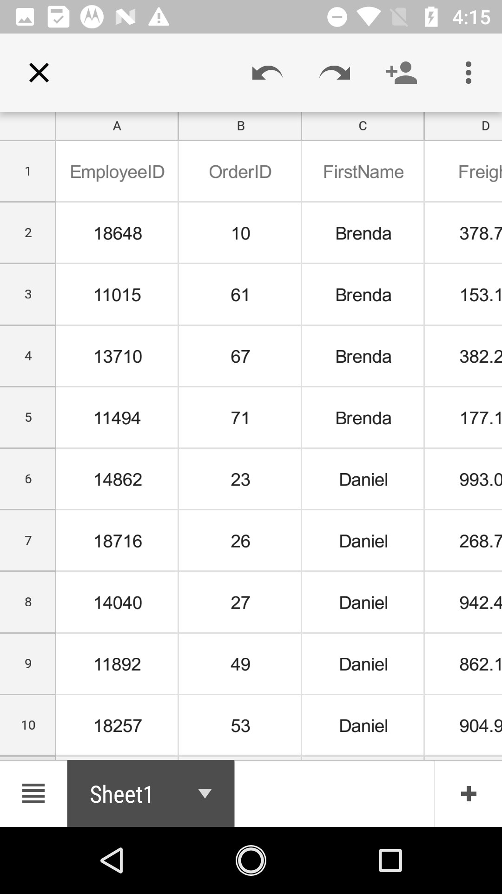

### Exporting Options

You can also export data to Excel with various customizing options while exporting the SfDataGrid by passing the grid and [DataGridExcelExportingOption](http://help.syncfusion.com/cr/xamarin-android/Syncfusion.SfDataGrid.Exporting.DataGridExcelExportingOption.html) as arguments to the `ExportToExcel` method. 



DataGridExcelExportingController excelExport = new DataGridExcelExportingController ();
DataGridExcelExportingOption exportOption = new DataGridExcelExportingOption ();
exportOption.ExportColumnWidth = false;
exportOption.DefaultColumnWidth = 150;
var excelEngine = excelExport.ExportToExcel (this.dataGrid, exportOption); 



The SfDataGrid provides several properties in `DataGridExcelExportingOption` class to customize the grid while exporting it to Excel. 

#### AllowOutlining

If you export the data grid with grouping applied, you can enable the group expand or collapse option in Excel sheet by setting the [DataGridExcelExportingOption.AllowOutlining](https://help.syncfusion.com/cr/xamarin-android/Syncfusion.SfDataGrid.Exporting.DataGridExcelExportingOption.html#Syncfusion_SfDataGrid_Exporting_DataGridExcelExportingOption_AllowOutlining) to `true`. The default value of this property is false so, you cannot expand or collapse the group in Excel sheet by default.



DataGridExcelExportingOption option = new DataGridExcelExportingOption();
option.AllowOutlining = true; 



#### AllowSortingAndFiltering

The SfDataGrid allows exporting the data grid to Excel with sorting and filtering options enabled on the column header in Excel sheet by setting the [DataGridExcelExportingOption.AllowSortingAndFiltering](https://help.syncfusion.com/cr/xamarin-android/Syncfusion.SfDataGrid.Exporting.DataGridExcelExportingOption.html#Syncfusion_SfDataGrid_Exporting_DataGridExcelExportingOption_AllowSortingAndFiltering) to `true`. The default value of this property is false.



DataGridExcelExportingOption option = new DataGridExcelExportingOption();
option.AllowSortingAndFiltering = true; 



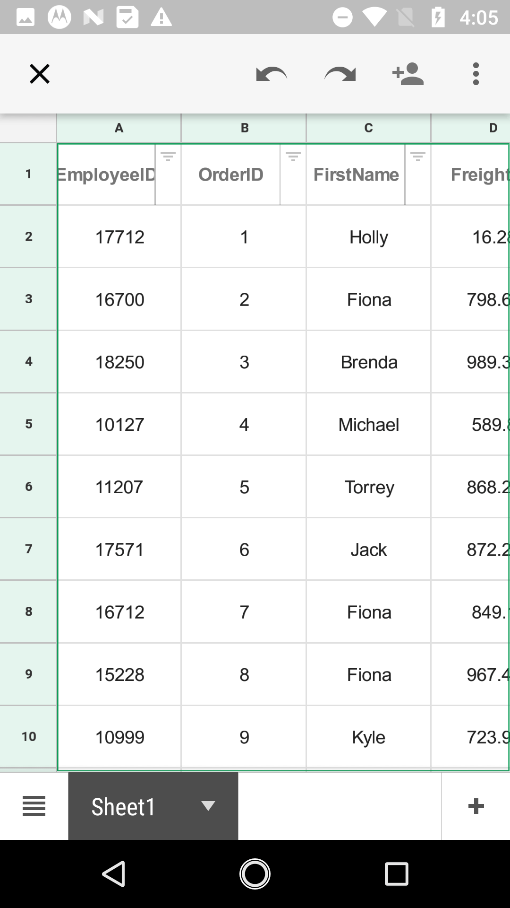

#### ApplyGridStyle

The SfDataGrid allows exporting the data with the applied GridStyle by setting the [DataGridExcelExportingOption.ApplyGridStyle](https://help.syncfusion.com/cr/xamarin-android/Syncfusion.SfDataGrid.Exporting.DataGridExcelExportingOption.html#Syncfusion_SfDataGrid_Exporting_DataGridExcelExportingOption_ApplyGridStyle) to `true`. By default, the data will be exported without the GridStyle.



DataGridExcelExportingOption option = new DataGridExcelExportingOption();
option.ApplyGridStyle = true; 



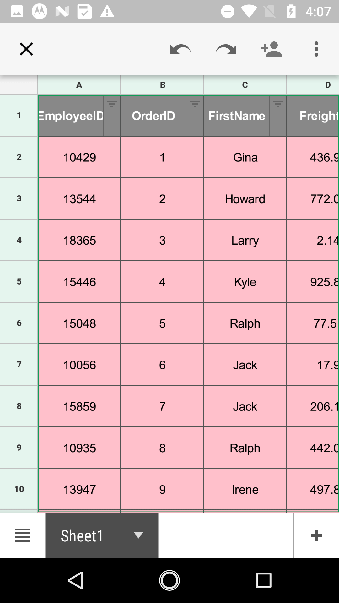

#### DefaultColumnWidth

The SfDataGrid allows customizing the column width in Excel file by using the [DataGridExcelExportingOption.DefaultColumnWidth](https://help.syncfusion.com/cr/xamarin-android/Syncfusion.SfDataGrid.Exporting.DataGridExcelExportingOption.html#Syncfusion_SfDataGrid_Exporting_DataGridExcelExportingOption_DefaultColumnWidth) property. The `DefaultColumnWidth` value will be applied to all the columns in the Excel sheet.



DataGridExcelExportingOption option = new DataGridExcelExportingOption();
option.DefaultColumnWidth = 100; 



#### DefaultRowHeight

The SfDataGrid allows customizing the row height in Excel file using the [DataGridExcelExportingOption.DefaultRowHeight](https://help.syncfusion.com/cr/xamarin-android/Syncfusion.SfDataGrid.Exporting.DataGridExcelExportingOption.html#Syncfusion_SfDataGrid_Exporting_DataGridExcelExportingOption_DefaultRowHeight) property. The `DefaultRowHeight` value will be applied to all the rows in the Excel sheet.



DataGridExcelExportingOption option = new DataGridExcelExportingOption();
option.DefaultRowHeight = 20; 



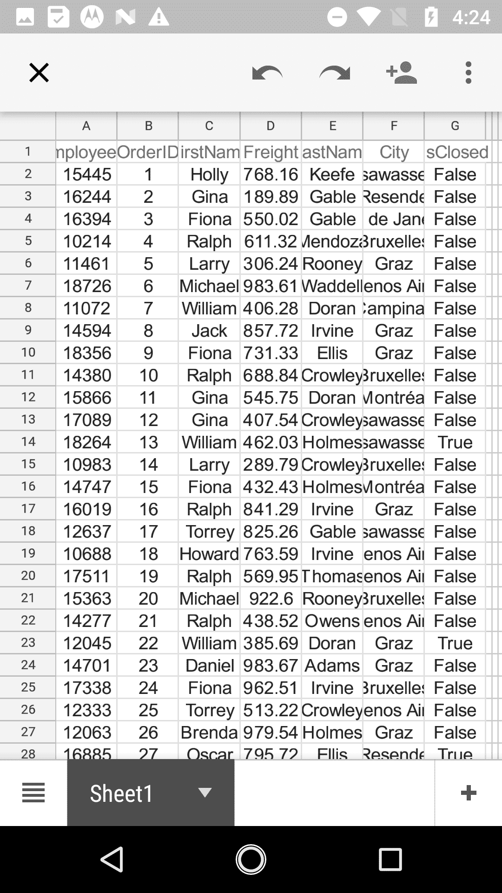

#### ExcludedColumns

By default, all the columns (including hidden columns) in the SfDataGrid will be exported to Excel. To exclude some particular columns while exporting to Excel, add those columns to the [DataGridExcelExportingOption.ExcludeColumns](https://help.syncfusion.com/cr/xamarin-android/Syncfusion.SfDataGrid.Exporting.DataGridExcelExportingOption.html#Syncfusion_SfDataGrid_Exporting_DataGridExcelExportingOption_ExcludedColumns) list.



DataGridExcelExportingOption option = new DataGridExcelExportingOption();
var list = new List<string>();
list.Add("OrderID");
list.Add("LastName");
option.ExcludedColumns = list;



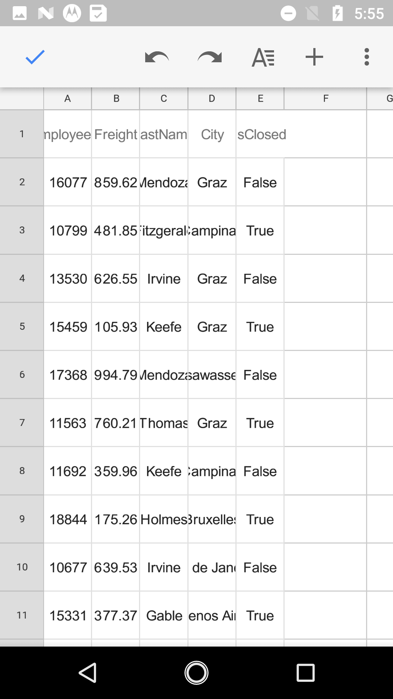

### ExportColumnWidth

By default, the data grid columns will be exported to Excel with the value of `DataGridExcelExportingOption.DefaultColumnWidth` but, you can also export the data grid to Excel with the exact column widths from the SfDataGrid by setting the [DataGridExcelExportingOption.ExportColumnWidth](https://help.syncfusion.com/cr/xamarin-android/Syncfusion.SfDataGrid.Exporting.DataGridExcelExportingOption.html#Syncfusion_SfDataGrid_Exporting_DataGridExcelExportingOption_ExportColumnWidth) to `true`. The default value of the `ExportColumnWidth` property is false.



DataGridExcelExportingOption option = new DataGridExcelExportingOption();
option.ExportColumnWidth = true;



### ExportRowHeight

By default, the data grid rows will be exported to Excel with the value of `DataGridExcelExportingOption.DefaultRowHeight` but, you can also export the data grid to Excel with the exact row heights from the SfDataGrid by setting the [DataGridExcelExportingOption.ExportRowHeight](https://help.syncfusion.com/cr/xamarin-android/Syncfusion.SfDataGrid.Exporting.DataGridExcelExportingOption.html#Syncfusion_SfDataGrid_Exporting_DataGridExcelExportingOption_ExportRowHeight) to `true`. The default value of the `ExportRowHeight` property is false.



DataGridExcelExportingOption option = new DataGridExcelExportingOption();
option.ExportRowHeight = true;



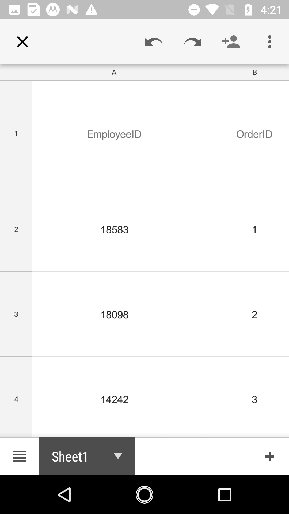

#### ExcelVersion

The SfDataGrid allows exporting the data to Excel in specific versions by using the [DataGridExcelExportingOption.ExcelVersion](https://help.syncfusion.com/cr/xamarin-android/Syncfusion.SfDataGrid.Exporting.DataGridExcelExportingOption.html#Syncfusion_SfDataGrid_Exporting_DataGridExcelExportingOption_ExcelVersion) property.



DataGridExcelExportingOption option = new DataGridExcelExportingOption();
option.ExcelVersion = Syncfusion.XlsIO.ExcelVersion.Excel2013;



#### ExportGroups

By default, all the groups in the data grid will be exported to Excel sheet. To export the data grid without Groups, set the [DataGridExcelExportingOption.ExportGroups](https://help.syncfusion.com/cr/xamarin-android/Syncfusion.SfDataGrid.Exporting.DataGridExcelExportingOption.html#Syncfusion_SfDataGrid_Exporting_DataGridExcelExportingOption_ExportGroups) property to `false`.



DataGridExcelExportingOption option = new DataGridExcelExportingOption();
option.ExportGroups = false;



* ExportGroups is true

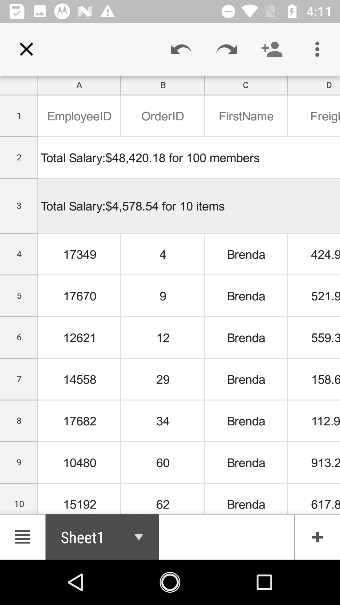

* ExportGroups = false

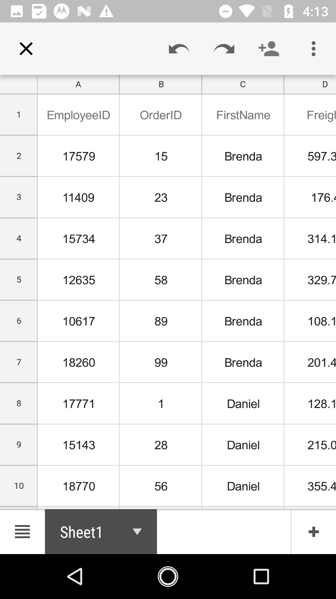

#### ExportHeader

By default, the column headers will be exported to Excel sheet. To export the SfDataGrid without the column headers, set the [DataGridExcelExportingOption.ExportHeader](https://help.syncfusion.com/cr/xamarin-android/Syncfusion.SfDataGrid.Exporting.DataGridExcelExportingOption.html#Syncfusion_SfDataGrid_Exporting_DataGridExcelExportingOption_ExportHeader) to `false`.



DataGridExcelExportingOption option = new DataGridExcelExportingOption();
option.ExportHeader = false;



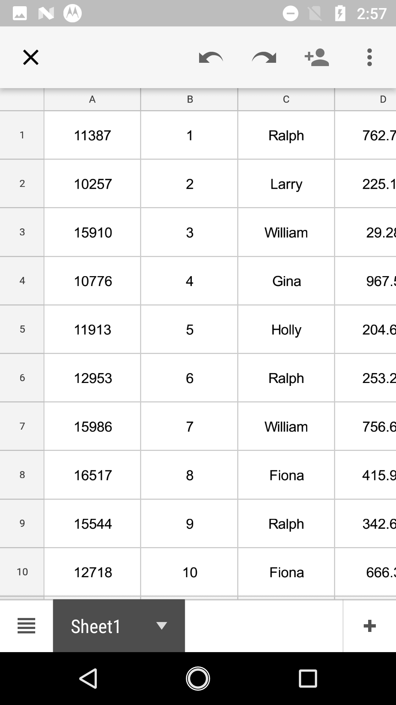

#### ExportTableSummary

By default, table summaries in the data grid will be exported to Excel. To export the SfDataGrid without table summaries, set the [DataGridExcelExportingOption.ExportTableSummary](https://help.syncfusion.com/cr/xamarin-android/Syncfusion.SfDataGrid.Exporting.DataGridExcelExportingOption.html#Syncfusion_SfDataGrid_Exporting_DataGridExcelExportingOption_ExportTableSummary) property to `false`.



DataGridExcelExportingOption option = new DataGridExcelExportingOption();
option.ExportTableSummary = true;



#### BottomTableSummaryStyle

The SfDataGrid supports exporting the bottom TableSummary with custom style by using the [DataGridExcelExportingOption.BottomTableSummaryStyle](https://help.syncfusion.com/cr/xamarin-android/Syncfusion.SfDataGrid.Exporting.DataGridExcelExportingOption.html#Syncfusion_SfDataGrid_Exporting_DataGridExcelExportingOption_BottomTableSummaryStyle) property.



DataGridExcelExportingOption option = new DataGridExcelExportingOption();
option.BottomTableSummaryStyle = new ExportCellStyle()
{
    BackgroundColor = Color.Yellow,
    BorderColor = Color.Red,
    ForegroundColor = Color.Red,
};



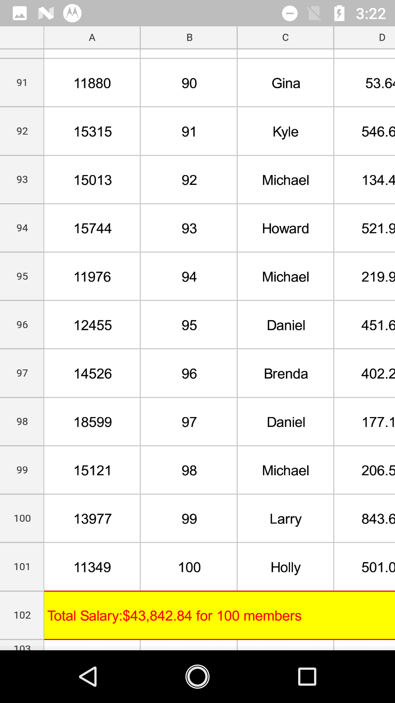

#### GroupCaptionStyle

The SfDataGrid supports exporting the GroupCaptionSummaries with custom style by using the [DataGridExcelExportingOption.GroupCaptionStyle](https://help.syncfusion.com/cr/xamarin-android/Syncfusion.SfDataGrid.Exporting.DataGridExcelExportingOption.html#Syncfusion_SfDataGrid_Exporting_DataGridExcelExportingOption_GroupCaptionStyle) property.



DataGridExcelExportingOption option = new DataGridExcelExportingOption();
option.GroupCaptionStyle = new ExportCellStyle()
{
    BackgroundColor = Color.LightGreen,
    BorderColor = Color.Gold,
    ForegroundColor = Color.Red,
};



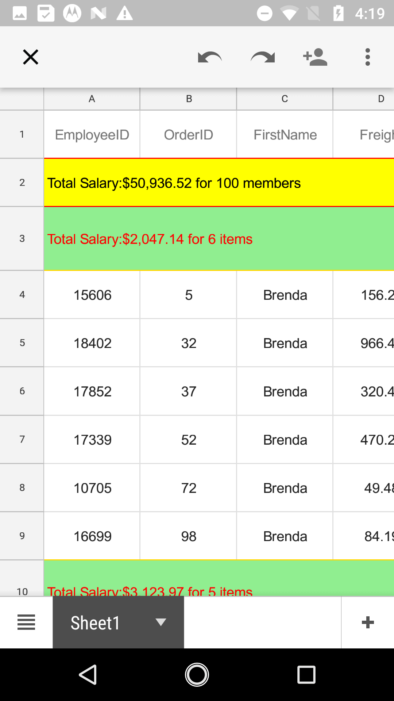

#### HeaderStyle

The SfDataGrid allows exporting the column headers with custom style by using the [DataGridExcelExportingOption.HeaderStyle](https://help.syncfusion.com/cr/xamarin-android/Syncfusion.SfDataGrid.Exporting.DataGridExcelExportingOption.html#Syncfusion_SfDataGrid_Exporting_DataGridExcelExportingOption_HeaderStyle) property.



DataGridExcelExportingOption option = new DataGridExcelExportingOption();
option.HeaderStyle = new ExportCellStyle()
{
    BackgroundColor = Color.Yellow,
    BorderColor = Color.Red,
    ForegroundColor = Color.Black,
};



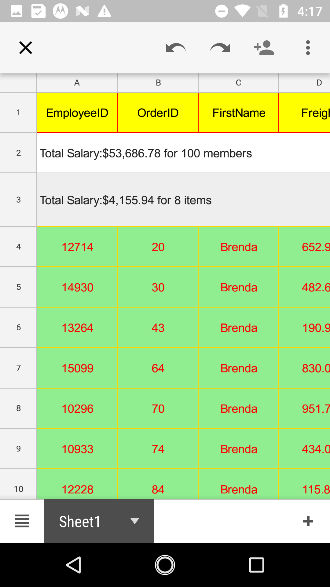

#### RecordStyle

The SfDataGrid allows exporting the records with custom style by using the [DataGridExcelExportingOption.RecordStyle](https://help.syncfusion.com/cr/xamarin-android/Syncfusion.SfDataGrid.Exporting.DataGridExcelExportingOption.html#Syncfusion_SfDataGrid_Exporting_DataGridExcelExportingOption_RecordStyle) property.



DataGridExcelExportingOption option = new DataGridExcelExportingOption();
option.RecordStyle = new ExportCellStyle()
{
    BackgroundColor = Color.LightGreen,
    BorderColor = Color.Gold,
    ForegroundColor = Color.Red,
};



#### TopTableSummaryStyle

The SfDataGrid supports exporting the top TableSummary with custom style by using the [DataGridExcelExportingOption.TopTableSummaryStyle](https://help.syncfusion.com/cr/xamarin-android/Syncfusion.SfDataGrid.Exporting.DataGridExcelExportingOption.html#Syncfusion_SfDataGrid_Exporting_DataGridExcelExportingOption_TopTableSummaryStyle) property.



DataGridExcelExportingOption option = new DataGridExcelExportingOption();
option.TopTableSummaryStyle = new ExportCellStyle()
{
    BackgroundColor = Color.Yellow,
    BorderColor = Color.Red,
    ForegroundColor = Color.Red,
};



### ExportGroupSummary

By default, the `GroupSummary` rows in the data grid will be exported to Excel. To export the `SfDataGrid` without group summaries, set the [DataGridExcelExportingOption.ExportGroupSummary](https://help.syncfusion.com/cr/xamarin-android/Syncfusion.SfDataGrid.Exporting.DataGridExcelExportingOption.html#Syncfusion_SfDataGrid_Exporting_DataGridExcelExportingOption_ExportGroupSummary) property to `false`.



DataGridExcelExportingOption option = new DataGridExcelExportingOption();
// Set false here to export the DataGrid without GroupSummary rows. The default value is true.
//option.ExportGroupSummary = false;



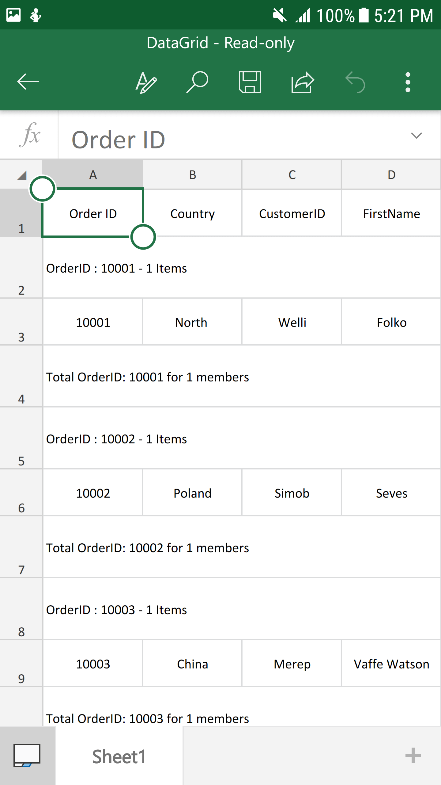

### GroupSummaryStyle 

`SfDataGrid` supports exporting the `GroupSummary` rows with custom style by using the [DataGridExcelExportingOption.GroupSummaryStyle](https://help.syncfusion.com/cr/xamarin-android/Syncfusion.SfDataGrid.Exporting.DataGridExcelExportingOption.html#Syncfusion_SfDataGrid_Exporting_DataGridExcelExportingOption_GroupSummaryStyle) property.



DataGridExcelExportingOption option = new DataGridExcelExportingOption();
option.GroupSummaryStyle = new ExportCellStyle()
{
    BackgroundColor = Color.Red,
    BorderColor = Color.Yellow,
    ForegroundColor = Color.White,
};



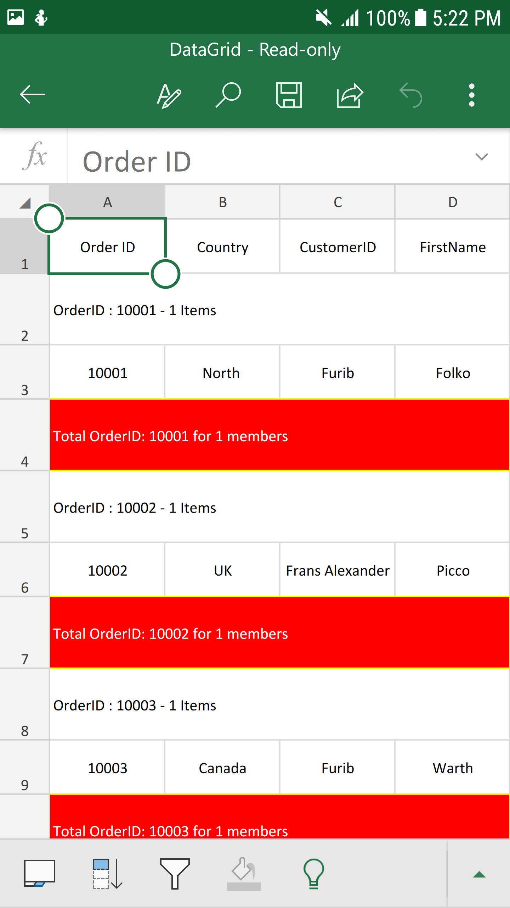

#### StartColumnIndex

By default, the exported SfDataGrid will start from the 0th column in the Excel sheet but, you can specify the start column in the Excel sheet by using the [DataGridExcelExportingOption.StartColumnIndex](https://help.syncfusion.com/cr/xamarin-android/Syncfusion.SfDataGrid.Exporting.DataGridExcelExportingOption.html#Syncfusion_SfDataGrid_Exporting_DataGridExcelExportingOption_StartColumnIndex) property.



DataGridExcelExportingOption option = new DataGridExcelExportingOption();
option.StartColumnIndex = 4;



#### StartRowIndex

By default, the exported SfDataGrid will start from the 0th row in the Excel sheet but, you can specify the start row in the Excel sheet using the [DataGridExcelExportingOption.StartRowIndex](https://help.syncfusion.com/cr/xamarin-android/Syncfusion.SfDataGrid.Exporting.DataGridExcelExportingOption.html#Syncfusion_SfDataGrid_Exporting_DataGridExcelExportingOption_StartRowIndex) property.



DataGridExcelExportingOption option = new DataGridExcelExportingOption();
option.StartRowIndex = 10;



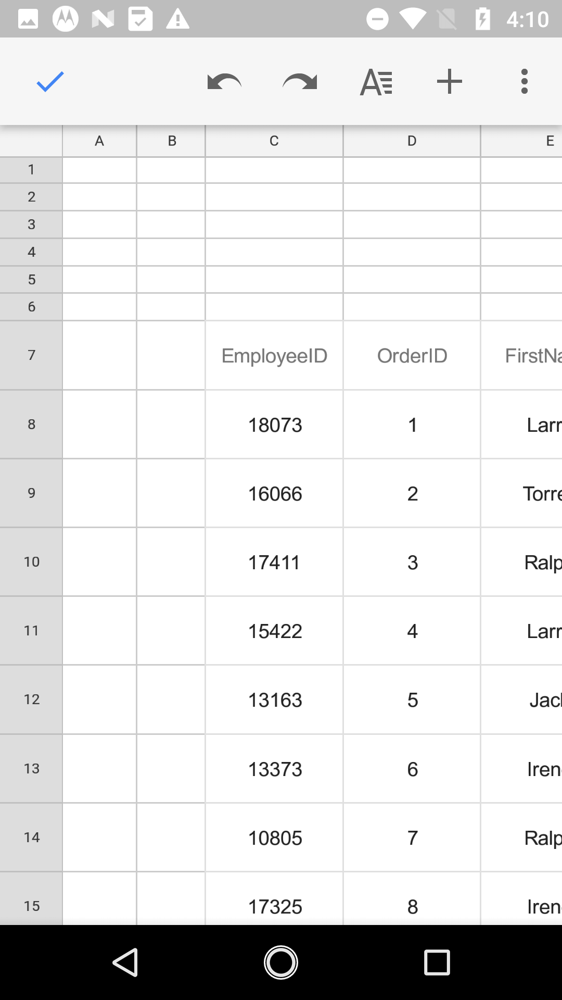  

#### ExportAllPages

While exporting to excel using the SfDataPager inside the SfDataGrid, by default it will export only the current page. However, you can export all the pages by setting the [DataGridExcelExportingOption.ExportAllPages](https://help.syncfusion.com/cr/xamarin-android/Syncfusion.SfDataGrid.Exporting.DataGridExcelExportingOption.html#Syncfusion_SfDataGrid_Exporting_DataGridExcelExportingOption_ExportAllPages) to `true`. The default value for this property is false.



DataGridExcelExportingOption option = new DataGridExcelExportingOption();
option.ExportAllPages = true;



* ExportAllPages is false

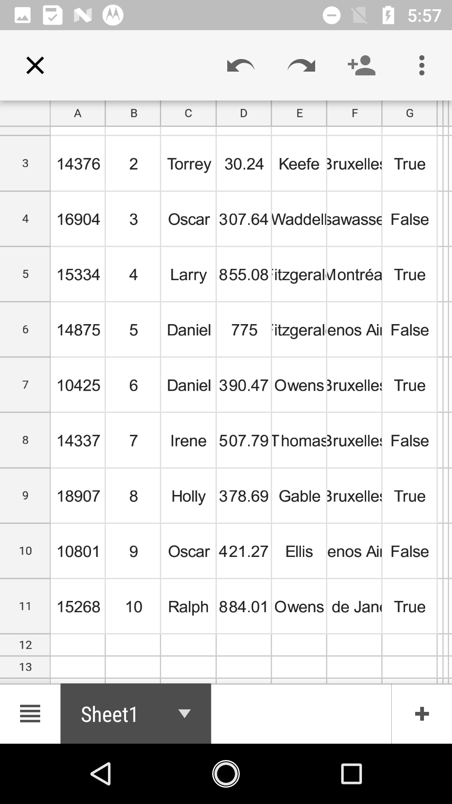  

* ExportAllPages is true

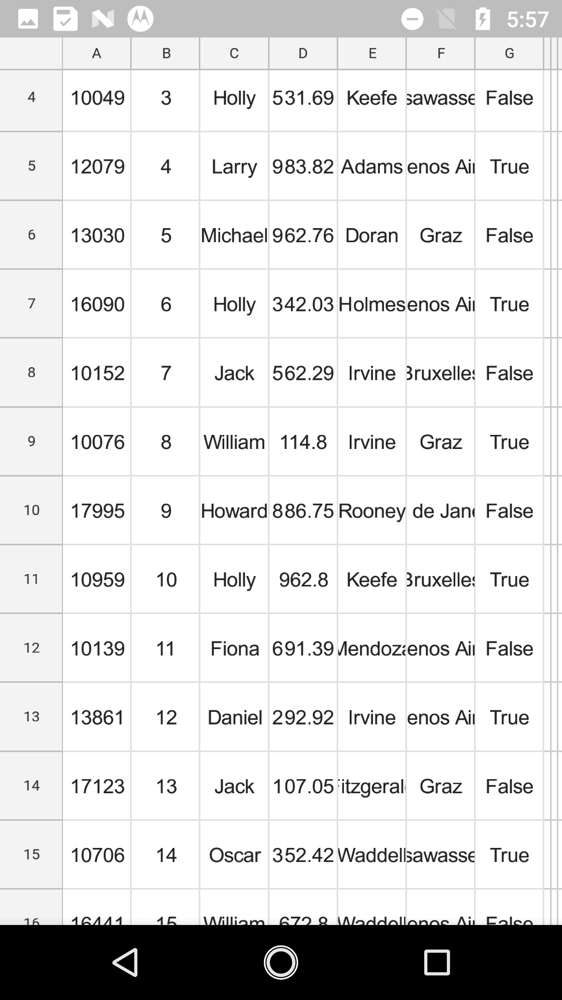  

### Events

The SfDataGrid provides you the following events for exporting to excel:

* [RowExporting](https://help.syncfusion.com/cr/xamarin-android/Syncfusion.SfDataGrid.Exporting.DataGridExcelExportingController.html): Raised while exporting a row at the execution time.
* [CellExporting](https://help.syncfusion.com/cr/xamarin-android/Syncfusion.SfDataGrid.Exporting.DataGridExcelExportingController.html): Raised while exporting a cell at the execution time.

#### RowExporting

The [DataGridRowExcelExportingEventHandler](http://help.syncfusion.com/cr/xamarin-android/Syncfusion.SfDataGrid.Exporting.DataGridRowExcelExportingEventHandler.html) delegate allows customizing the styles for the record rows, group caption rows, and group summary rows. The `RowExporting` event is triggered with [DataGridRowExcelExportingEventArgs](http://help.syncfusion.com/cr/xamarin-android/Syncfusion.SfDataGrid.Exporting.DataGridRowExcelExportingEventArgs.html) that contains the following properties:

* [Range](https://help.syncfusion.com/cr/xamarin-android/Syncfusion.SfDataGrid.Exporting.DataGridRowExcelExportingEventArgs.html#Syncfusion_SfDataGrid_Exporting_DataGridRowExcelExportingEventArgs_Range): Specifies the Excel range to be exported. It provides full access to the exporting cell in Excel.
* [Record](https://help.syncfusion.com/cr/xamarin-android/Syncfusion.SfDataGrid.Exporting.DataGridRowExcelExportingEventArgs.html#Syncfusion_SfDataGrid_Exporting_DataGridRowExcelExportingEventArgs_Record): Gets the collection of the exported underlying data objects.
* [RowType](https://help.syncfusion.com/cr/xamarin-android/Syncfusion.SfDataGrid.Exporting.DataGridRowExcelExportingEventArgs.html#Syncfusion_SfDataGrid_Exporting_DataGridRowExcelExportingEventArgs_RowType): Specifies the row type by using `ExportRowType` Enum. You can use this property to check the row type and apply different styles based on the row type.
* [Worksheet](https://help.syncfusion.com/cr/xamarin-android/Syncfusion.SfDataGrid.Exporting.DataGridRowExcelExportingEventArgs.html#Syncfusion_SfDataGrid_Exporting_DataGridRowExcelExportingEventArgs_Worksheet): Sets the `Worksheet` properties such as sheet protection, gridlines, and so on. 

You can use this event to customize the properties of the grid rows exported to Excel. The following code example illustrates how to change the background color of the record rows, caption summary rows, and group summary rows when exporting.



//HandlingRowExportingEvent for exporting to excel
DataGridExcelExportingController excelExport = new DataGridExcelExportingController ();
excelExport.RowExporting += excelExport_RowExporting; 

void excelExport_RowExporting (object sender, DataGridRowExcelExportingEventArgs e)
{
    if (e.RowType == ExportRowType.Record) {
        if ((e.Record.Data as OrderInfo).IsClosed)
            e.Range.CellStyle.ColorIndex= Syncfusion.XlsIO.ExcelKnownColors.Yellow;
        else
            e.Range.CellStyle.ColorIndex= Syncfusion.XlsIO.ExcelKnownColors.LightGreen;
    }

    // You can also set the desired background colors for the CaptionSummary row and GroupSummary row as shown below
    // if (e.RowType == ExportRowType.CaptionSummary) {
    //    e.Range.CellStyle.ColorIndex= Syncfusion.XlsIO.ExcelKnownColors.Grey_25_percent;
    // }

    // if (e.RowType == ExportRowType.GroupSummary) {
    //    e.Range.CellStyle.ColorIndex = Syncfusion.XlsIO.ExcelKnownColors.Red;
    // }
}



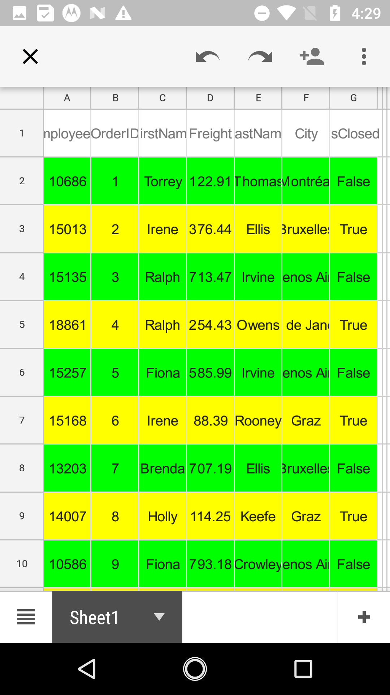  

#### CellExporting

The [DataGridCellExcelExportingEventHandler](http://help.syncfusion.com/cr/xamarin-android/Syncfusion.SfDataGrid.Exporting.DataGridCellExcelExportingEventHandler.html) delegate allows customizing the styles for the header cells, record cells, group caption cells, and group summary cells. The `CellExporting` event is triggered with [DataGridCellExcelExportingEventArgs](http://help.syncfusion.com/cr/xamarin-android/Syncfusion.SfDataGrid.Exporting.DataGridCellExcelExportingEventArgs.html) that contains the following properties:

* [CellType](https://help.syncfusion.com/cr/xamarin-android/Syncfusion.SfDataGrid.Exporting.DataGridCellExcelExportingEventArgs.html#Syncfusion_SfDataGrid_Exporting_DataGridCellExcelExportingEventArgs_CellType): Specifies the cell type by using `ExportCellType` `Enum`. You can use this property to check the cell type and apply different cell styles based on the cell type.
* [CellValue](https://help.syncfusion.com/cr/xamarin-android/Syncfusion.SfDataGrid.Exporting.DataGridCellExcelExportingEventArgs.html#Syncfusion_SfDataGrid_Exporting_DataGridCellExcelExportingEventArgs_CellValue): Contains the actual value that is exported to the Excel. You can use this value to apply formatting in Excel using the `Range` property.
* [ColumnName](https://help.syncfusion.com/cr/xamarin-android/Syncfusion.SfDataGrid.Exporting.DataGridCellExcelExportingEventArgs.html#Syncfusion_SfDataGrid_Exporting_DataGridCellExcelExportingEventArgs_ColumnName): Specifies the column name (MappingName) of the exporting cell. You can apply formatting for a particular column by checking the `ColumnName`.
* [Handled](https://help.syncfusion.com/cr/xamarin-android/Syncfusion.SfDataGrid.Exporting.DataGridCellExcelExportingEventArgs.html#Syncfusion_SfDataGrid_Exporting_DataGridCellExcelExportingEventArgs_Handled): Determines whether the cell is exported to Excel or not.
* [Range](https://help.syncfusion.com/cr/xamarin-android/Syncfusion.SfDataGrid.Exporting.DataGridCellExcelExportingEventArgs.html#Syncfusion_SfDataGrid_Exporting_DataGridCellExcelExportingEventArgs_Range): Specifies the Excel range to be exported. It provides full access to the exporting cell in Excel.
* [Record](https://help.syncfusion.com/cr/xamarin-android/Syncfusion.SfDataGrid.Exporting.DataGridCellExcelExportingEventArgs.html#Syncfusion_SfDataGrid_Exporting_DataGridCellExcelExportingEventArgs_Record): Gets the collection of the exported underlying data objects. 

You can use this event to customize the properties of the grid cells exported to Excel. The following code example illustrates how to customize the background color, foreground color, and cell value of the header cells, record cells, caption summary cells, and group summary cells when exporting.



//HandlingCellExportingEvent for exporting to excel
DataGridExcelExportingController excelExport = new DataGridExcelExportingController ();
excelExport.CellExporting += excelExport_CellExporting;  

private void ExcelExport_CellExporting(object sender, DataGridCellExcelExportingEventArgs e)
{
    if (e.CellType == ExportCellType.HeaderCell)
    {
        e.Range.CellStyle.ColorIndex = Syncfusion.XlsIO.ExcelKnownColors.White;
        e.Range.CellStyle.PatternColorIndex = Syncfusion.XlsIO.ExcelKnownColors.Red;
        e.Range.CellStyle.BeginUpdate();
        e.Range.CellStyle.Borders.LineStyle = Syncfusion.XlsIO.ExcelLineStyle.Dotted;
        e.Range.CellStyle.Borders[ExcelBordersIndex.DiagonalDown].LineStyle = ExcelLineStyle.Dash_dot_dot;
        e.Range.CellStyle.Borders[ExcelBordersIndex.DiagonalUp].LineStyle = ExcelLineStyle.Dash_dot_dot;
        e.Range.CellStyle.Borders.Color = ExcelKnownColors.Black;
        e.Range.CellStyle.EndUpdate();
    }

    if (e.CellType == ExportCellType.RecordCell)
    {
        e.Range.CellStyle.ColorIndex = Syncfusion.XlsIO.ExcelKnownColors.Yellow;
        e.Range.CellStyle.PatternColorIndex = Syncfusion.XlsIO.ExcelKnownColors.Black;
        e.Range.CellStyle.BeginUpdate();
        e.Range.CellStyle.Borders.LineStyle = Syncfusion.XlsIO.ExcelLineStyle.Dash_dot_dot;
        e.Range.CellStyle.Borders[ExcelBordersIndex.DiagonalDown].LineStyle = ExcelLineStyle.Dotted;
        e.Range.CellStyle.Borders[ExcelBordersIndex.DiagonalUp].LineStyle = ExcelLineStyle.Dotted;
        e.Range.CellStyle.Borders.Color = ExcelKnownColors.Black;
        e.Range.CellStyle.EndUpdate();
    }

    // You can also set the desired values for the CaptionSummary rows and GroupSummary rows as shown below
    // if (e.CellType == ExportCellType.GroupCaptionCell)
    // {
    //     e.Range.CellStyle.ColorIndex = Syncfusion.XlsIO.ExcelKnownColors.Grey_25_percent;
    //     e.Range.CellStyle.PatternColorIndex = Syncfusion.XlsIO.ExcelKnownColors.Blue;
    //     e.Range.CellStyle.BeginUpdate();
    //     e.Range.CellStyle.Borders.LineStyle = Syncfusion.XlsIO.ExcelLineStyle.Thin;
    //     e.Range.CellStyle.Borders[ExcelBordersIndex.DiagonalDown].LineStyle = ExcelLineStyle.None;
    //     e.Range.CellStyle.Borders[ExcelBordersIndex.DiagonalUp].LineStyle = ExcelLineStyle.None;
    //     e.Range.CellStyle.Borders.Color = ExcelKnownColors.Black;
    //     e.Range.CellStyle.EndUpdate();
    // }

    // if (e.CellType == ExportCellType.GroupSummaryCell){
    //     e.Range.CellStyle.ColorIndex = Syncfusion.XlsIO.ExcelKnownColors.Light_yellow;
    //     e.Range.CellStyle.PatternColorIndex = Syncfusion.XlsIO.ExcelKnownColors.Black;
    //     e.Range.CellStyle.BeginUpdate();
    //     e.Range.CellStyle.Borders.LineStyle = Syncfusion.XlsIO.ExcelLineStyle.Dashed;
    //     e.Range.CellStyle.Borders[ExcelBordersIndex.DiagonalDown].LineStyle = ExcelLineStyle.Dashed;
    //     e.Range.CellStyle.Borders[ExcelBordersIndex.DiagonalUp].LineStyle = ExcelLineStyle.Dashed;
    //     e.Range.CellStyle.Borders.Color = ExcelKnownColors.Red;
    //     e.Range.CellStyle.EndUpdate();
    // }
}



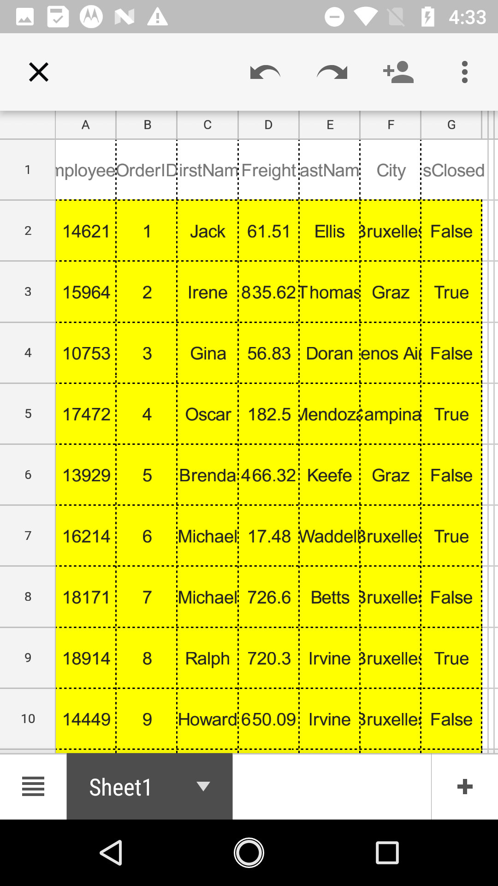  
  
#### Custom Borders

The SfDataGrid allows exporting the data to Excel with custom borders style in Excel sheet by handling the `CellExporting` event. 



private void ExcelExport_CellExporting(object sender, DataGridCellExcelExportingEventArgs e)
{
    if (e.CellType == ExportCellType.RecordCell)
    {
        e.Range.CellStyle.BeginUpdate();
        e.Range.CellStyle.Borders.LineStyle = Syncfusion.XlsIO.ExcelLineStyle.Dash_dot;
        e.Range.CellStyle.Borders[ExcelBordersIndex.DiagonalDown].LineStyle = ExcelLineStyle.Dash_dot;
        e.Range.CellStyle.Borders[ExcelBordersIndex.DiagonalUp].LineStyle = ExcelLineStyle.Dash_dot_dot;
        e.Range.CellStyle.Borders.Color = ExcelKnownColors.Black;
        e.Range.CellStyle.EndUpdate();
    }
}



  

## Save a File

The following code snippet explains how to save the converted Excel sheet in our local device.



public void Save(string fileName, String contentType, MemoryStream stream,Context context)
{
    string exception = string.Empty;
    string root = null;
    if (Android.OS.Environment.IsExternalStorageEmulated)
    {
        root = Android.OS.Environment.ExternalStorageDirectory.ToString();
    }
    else
        root = System.Environment.GetFolderPath(System.Environment.SpecialFolder.MyDocuments);

        Java.IO.File myDir = new Java.IO.File(root + "/Syncfusion");
        myDir.Mkdir();

        Java.IO.File file = new Java.IO.File(myDir, fileName);

        if (file.Exists())
        {
            file.Delete();
            file.CreateNewFile();
        }
        try
        {
            FileOutputStream outs = new FileOutputStream(file, false);
            outs.Write(stream.ToArray());

            outs.Flush();
            outs.Close();
        }
        catch (Exception e)
        {
            exception = e.ToString();
        }
        if (file.Exists() && contentType != "application/html")
        {
            Android.Net.Uri path = Android.Net.Uri.FromFile(file);
            string extension = Android.Webkit.MimeTypeMap.GetFileExtensionFromUrl(Android.Net.Uri.FromFile(file).ToString());
            string mimeType = Android.Webkit.MimeTypeMap.Singleton.GetMimeTypeFromExtension(extension);
            Intent intent = new Intent(Intent.ActionView);
            intent.SetDataAndType(path, mimeType);
            this.StartActivity(Intent.CreateChooser(intent, "Choose App"));
        }
}



## Exporting Unbound rows

By default, the Unbound rows will not be exported to the excel document. However, you can export the unbound rows to excel by setting the [DataGridExcelExportingOption.ExportUnboundRows](https://help.syncfusion.com/cr/xamarin-android/Syncfusion.SfDataGrid.Exporting.DataGridPdfExportOption.html#Syncfusion_SfDataGrid_Exporting_DataGridPdfExportOption_ExportUnboundRows) property as `true`.


DataGridExcelExportingOption option = new DataGridExcelExportingOption();
option.ExportUnboundRows = true;


## Exporting Unbound Columns

The `SfDataGrid.GridUnboundColumns` will be exported as `SfDataGrid.GridTextColumns` without any specific codes. You can customize the `SfDataGrid.GridUnboundColumns` as `SfDataGrid.GridTextColumns` using the `CellExporting` and `RowExporting` events.

The following code illustrates how to create and export unbound columns.



var unboundColumn = new GridUnboundColumn()
{
    MappingName = "Unbound",
    Expression = "OrderID",
};

sfGrid.Columns.Add(unboundColumn);



The below screenshot shows that the unbound column is exported to excel sheet along with text columns.

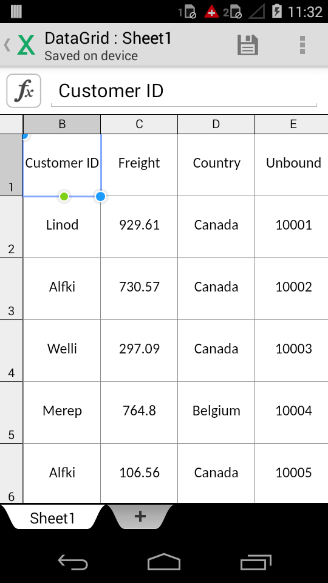

## Exporting the selected rows of SfDataGrid

SfDataGrid allows you to export only the currently selected rows in the grid to the worksheet using the [DataGridExcelExportingController.ExportToExcel](https://help.syncfusion.com/cr/xamarin-android/Syncfusion.SfDataGrid.Exporting.DataGridExcelExportingController.html#Syncfusion_SfDataGrid_Exporting_DataGridExcelExportingController_ExportToExcel_Syncfusion_SfDataGrid_SfDataGrid_) method by passing the instance of the SfDataGrid and [SfDataGrid.SelectedItems](https://help.syncfusion.com/cr/xamarin-android/Syncfusion.SfDataGrid.SfDataGrid.html#Syncfusion_SfDataGrid_SfDataGrid_SelectedItems) collection as an argument.

Refer the below code to export the selected rows alone to Excel.



    private void ExPortToExcel(object sender, EventArgs e)
        {
            DataGridExcelExportingController excelExport = new DataGridExcelExportingController();
            ObservableCollection<object> selectedItems = dataGrid.SelectedItems;
            var excelEngine = excelExport.ExportToExcel(this.dataGrid, selectedItems);
            var workbook = excelEngine.Excel.Workbooks[0];
            MemoryStream stream = new MemoryStream();
            workbook.SaveAs(stream);
            workbook.Close();
            excelEngine.Dispose();
            Save("DataGrid.xlsx", "application/msexcel", stream, dataGrid.Context);
        }



The below screenshot shows that the selected rows are exported to excel sheet.

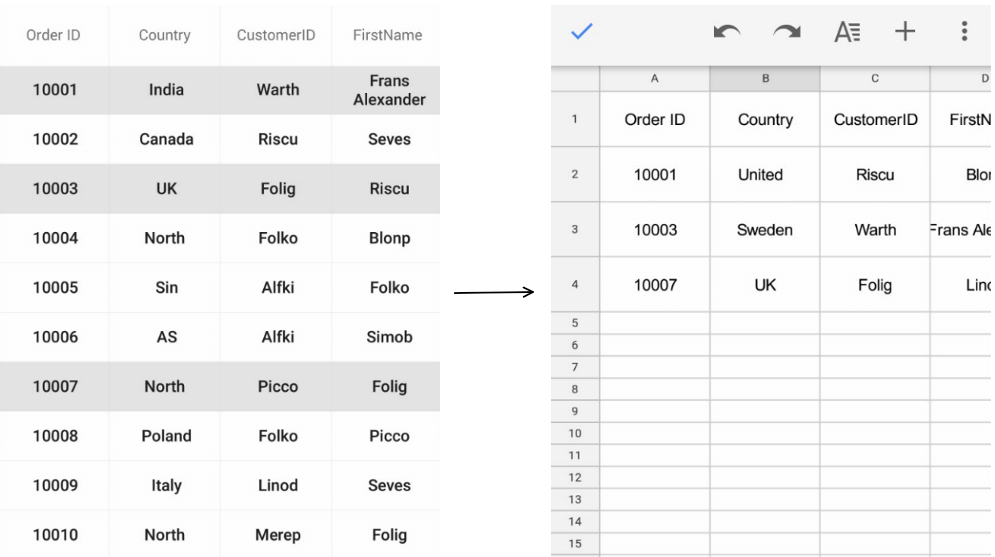
