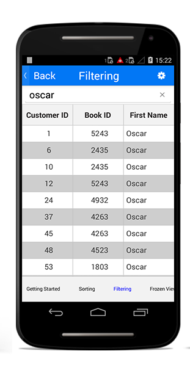
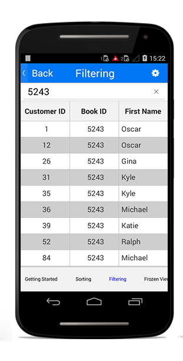

# Filtering

The data grid supports view filtering.

## View filtering

The data grid supports filtering the records in the view by setting the `SfDataGrid.View.Filter` property where `Filter` is a `predicate`.

To filter the records in the data grid, assign the filtered strings to the `ViewModel.FilterText` property which will be applied later in `Filter predicate` that is assigned to `SfDataGrid.View.Filter` in the OnFilterChanged() method.

N> To update the filtering for the newly added row or column, set the `SfDataGrid.View.LiveDataUpdateMode` to `LiveDataUpdateMode.AllowDataShaping`.

The following code example illustrates the delegate, properties, and methods used in the `ViewModel` class perform the filtering operation.


// ViewModel.cs

#region Filtering

#region Fields

private string filterText = "";
private string selectedColumn = "All Columns";
private string selectedCondition = "Equals";
internal delegate void FilterChanged();
internal FilterChanged filterTextChanged;

#endregion

#region Property

public string FilterText
{
    get { return filterText; }
    set
    {
        filterText = value;
        OnFilterTextChanged();
        RaisePropertyChanged("FilterText");
    }
}

public string SelectedCondition
{
    get { return selectedCondition; }
    set { selectedCondition = value; }
}

public string SelectedColumn
{
    get { return selectedColumn; }
    set { selectedColumn = value; }
}

#endregion

#region Private Methods

private void OnFilterTextChanged()
{
    filterTextChanged();
}

private bool MakeStringFilter(OrderInfo o, string option, string condition)
{
    var value = o.GetType().GetProperty(option);
    var exactValue = value.GetValue(o, null);
    exactValue = exactValue.ToString().ToLower();
    string text = FilterText.ToLower();
    var methods = typeof(string).GetMethods();
    if (methods.Count() != 0)
    {
        if (condition == "Contains")
        {
            var methodInfo = methods.FirstOrDefault(method => method.Name == condition);
            bool result1 = (bool)methodInfo.Invoke(exactValue, new object[] { text });
            return result1;
        }
        else if (exactValue.ToString() == text.ToString())
        {
            bool result1 = String.Equals(exactValue.ToString(), text.ToString());
            if (condition == "Equals")
                return result1;
            else if (condition == "NotEquals")
                return false;
        }
        else if (condition == "NotEquals")
        {
            return true;
        }
        return false;
    }
    else
        return false;
}

private bool MakeNumericFilter(OrderInfo o, string option, string condition)
{
    var value = o.GetType().GetProperty(option);
    var exactValue = value.GetValue(o, null);
    double res;
    bool checkNumeric = double.TryParse(exactValue.ToString(), out res);
    if (checkNumeric)
    {
        switch (condition)
        {
            case "Equals":
                try
                {
                    if (exactValue.ToString() == FilterText)
                    {
                        if (Convert.ToDouble(exactValue) == (Convert.ToDouble(FilterText)))
                            return true;
                    }
                }
                catch (Exception e)
                {
                    Console.WriteLine(e);
                }
                break;
            case "NotEquals":
                try
                {
                    if (Convert.ToDouble(FilterText) != Convert.ToDouble(exactValue))
                        return true;
                }
                catch (Exception e)
                {
                    Console.WriteLine(e);
                        return true;
                }
                break;
        }
    }
    return false;
}

#endregion

#region Public Methods

public bool FilerRecords(object o)
{
    double res;
    bool checkNumeric = double.TryParse(FilterText, out res);
    var item = o as OrderInfo;
    if (item != null && FilterText.Equals(""))
    {
        return true;
    }
    else
    {
        if (item != null)
        {
            if (checkNumeric && !SelectedColumn.Equals("All Columns"))
            {
                bool result = MakeNumericFilter(item, SelectedColumn, SelectedCondition);
                    return result;
            }
            else if (SelectedColumn.Equals("All Columns"))
            {
                if (item.CustomerID.ToLower().Contains(FilterText.ToLower()) ||
                    item.Country.ToLower().Contains(FilterText.ToLower()) || 
                    item.Freight.ToString().ToLower().Contains(FilterText.ToLower()) ||                            
                    item.OrderID.ToString().ToLower().Contains(FilterText.ToLower()))
                    return true;
                return false;
            }
            else
            {
                bool result = MakeStringFilter(item, SelectedColumn, SelectedCondition);
                return result;
            }
        }
    }
    return false;
}

#endregion

#endregion


The following code example illustrates how to create a `SearchView` and apply the filtered records to the `ViewModel.FilterText` property in `SearchView.QueryTextChange` event.


// Code-Behind

SearchView filterText = new SearchView(BaseContext);
filterText.SetQueryHint("Enter the Text to filter");
filterText.QueryTextChange += OnFilterTextChanged;

private void OnFilterTextChanged(object sender, SearchView.QueryTextChangeEventArgs e)
{
    viewModel.FilterText = (sender as SearchView).Query.ToString();
}


Once you create the `SearchView` and a view model, you can perform filtering by setting the `SfDataGrid.View.Filter` property. You have to call the `SfDataGrid.View.RefreshFilter()` method after setting the filtered records to the `SfDataGrid.View.Filter` property as in the following code example.


// Code-Behind

viewModel.filterTextChanged = OnFilterChanged; //where ‘filterTextChanged’ is a delegate declared in ViewModel class.

private void OnFilterChanged()
{
    if (dataGrid.View != null)
    {
        this.dataGrid.View.Filter = viewModel.FilerRecords;
        this.dataGrid.View.RefreshFilter();
    }
}


## Applying DataTable's RowFilter to DataGrid

To filter the rows in SfDataGrid using [DataView.RowFilter](https://docs.microsoft.com/en-us/dotnet/api/system.data.dataview.rowfilter?view=netframework-4.8) expression, set the value of [SfDataGrid.CanUseViewFilter](https://help.syncfusion.com/cr/xamarin-android/Syncfusion.SfDataGrid.SfDataGrid.html#Syncfusion_SfDataGrid_SfDataGrid_CanUseViewFilter) property to `true`. The default filter which created in DataView can be applied or canceled through this property. 

## Filter individual columns

You can filter the records in all the columns or in a particular column using the code in the OnColumnSelected() method.

For example, you can filter the records in `OrderID` or any other particular column alone.The following code example illustrates how to create a `Spinner` for columns. It also illustrates how the records will be filtered based on the selected column.


// Code-Behind

TextView columnTextView;
Spinner columnDropdown;

conditionTextView = new TextView(BaseContext);
conditionTextView.Text = "Select the condition to filter";

columnTextView = new TextView(BaseContext);
columnTextView.Text = "Select the column to filter";

columnDropdown = FindViewById<Spinner>(Resource.Id.column);

var columnAdapter = new ArrayAdapter(this, Android.Resource.Layout.SimpleSpinnerItem);
columnAdapter.SetDropDownViewResource(Android.Resource.Layout.SimpleSpinnerDropDownItem);
columnAdapter.Add("All Columns");
columnAdapter.Add("OrderID");
columnAdapter.Add("CustomerID");
columnAdapter.Add("Freight");
columnAdapter.Add("Country");

columnDropdown.Adapter = columnAdapter;
columnDropdown.ItemSelected += OnColumnSelected;

private void OnColumnSelected(object sender, AdapterView.ItemSelectedEventArgs e)
{
    Spinner newSpinner = (Spinner)sender;
    viewModel.SelectedColumn = newSpinner.GetItemAtPosition(e.Position).ToString();
    if (viewModel.SelectedColumn == "All Columns")
    {
       conditionDropdown.Visibility = ViewStates.Gone;
       conditionTextView.Visibility = ViewStates.Gone;
    }
    else
    {
        conditionDropdown.Visibility = ViewStates.Visible;
        conditionTextView.Visibility = ViewStates.Visible;
        foreach (var prop in typeof(OrderInfo).GetProperties())
        {
            // Records will be filtered based on selected column
            if (prop.Name == viewModel.SelectedColumn)
            {
                var type = prop.GetType();
                if (prop.PropertyType == typeof(Java.Lang.String))
                {
                    conditionAdapter.Clear();
                    conditionAdapter.Add("Equals");
                    conditionAdapter.Add("Contains");
                    if (this.viewModel.SelectedCondition == "Equals")
                        this.viewModel.SelectedCondition = "Equals";
                    else
                        this.viewModel.SelectedCondition = "Contains";
                }
                else
                {
                    conditionAdapter.Clear();
                    conditionAdapter.Add("Equals");
                    conditionAdapter.Add("NotEquals");
                    if (this.viewModel.SelectedCondition == "Equals")
                        this.viewModel.SelectedCondition = "Equals";
                    else
                        this.viewModel.SelectedCondition = "NotEquals";
                }
            }
        }
    }
    if (filterText.Query != "")
        this.OnFilterChanged();
}


## Filter based on conditions

In addition to the column-based filtering, you can filter the records based on conditions. For example, you can filter the records based on the given input or you can filter the records in contrast to your input. You can perform the condition-based filtering for all columns or any particular column.

You can filter the records in the view based on any of the following conditions:

* Equals
* NotEquals
* Contains

These conditions are the mostly used conditions. However, you can add any other conditions and alter the following code example.


// ViewModel.cs

public bool FilerRecords(object o)
{
    double res;
    bool checkNumeric = double.TryParse(FilterText, out res);
    var item = o as OrderInfo;
    if (item != null && FilterText.Equals(""))
    {
        return true;
    }
    else
    {
        if (item != null)
        {
            if (checkNumeric && !SelectedColumn.Equals("All Columns"))
            {
                bool result = MakeNumericFilter(item, SelectedColumn, SelectedCondition);
                    return result;
            }
            else if (SelectedColumn.Equals("All Columns"))
            {
                if (item.CustomerID.ToLower().Contains(FilterText.ToLower()) ||
                    item.Country.ToLower().Contains(FilterText.ToLower()) || 
                    item.Freight.ToString().ToLower().Contains(FilterText.ToLower()) ||                            
                    item.OrderID.ToString().ToLower().Contains(FilterText.ToLower()))
                    return true;
                return false;
            }
            else
            {
                bool result = MakeStringFilter(item, SelectedColumn, SelectedCondition);
                return result;
            }
        }
    }
    return false;
}

private bool MakeStringFilter(OrderInfo o, string option, string condition)
{
    var value = o.GetType().GetProperty(option);
    var exactValue = value.GetValue(o, null);
    exactValue = exactValue.ToString().ToLower();
    string text = FilterText.ToLower();
    var methods = typeof(string).GetMethods();
    if (methods.Count() != 0)
    {
        if (condition == "Contains")
        {
            var methodInfo = methods.FirstOrDefault(method => method.Name == condition);
            bool result1 = (bool)methodInfo.Invoke(exactValue, new object[] { text });
            return result1;
        }
        else if (exactValue.ToString() == text.ToString())
        {
            bool result1 = String.Equals(exactValue.ToString(), text.ToString());
            if (condition == "Equals")
                return result1;
            else if (condition == "NotEquals")
                return false;
        }
        else if (condition == "NotEquals")
        {
            return true;
        }
        return false;
    }
    else
        return false;
}

private bool MakeNumericFilter(OrderInfo o, string option, string condition)
{
    var value = o.GetType().GetProperty(option);
    var exactValue = value.GetValue(o, null);
    double res;
    bool checkNumeric = double.TryParse(exactValue.ToString(), out res);
    if (checkNumeric)
    {
        switch (condition)
        {
            case "Equals":
                try
                {
                    if (exactValue.ToString() == FilterText)
                    {
                        if (Convert.ToDouble(exactValue) == (Convert.ToDouble(FilterText)))
                            return true;
                    }
                }
                catch (Exception e)
                {
                    Console.WriteLine(e);
                }
                break;
            case "NotEquals":
                try
                {
                    if (Convert.ToDouble(FilterText) != Convert.ToDouble(exactValue))
                        return true;
                }
                catch (Exception e)
                {
                    Console.WriteLine(e);
                        return true;
                }
                break;
        }
    }
    return false;
}


The following code example illustrates how to create a `Spinner` for conditions and add appropriate strings to that `Spinner`. It also illustrates how the records will be filtered based on the selected condition.


// Code-Behind

TextView conditionTextView;
Spinner conditionDropdown;
ArrayAdapter conditionAdapter;

conditionDropdown = FindViewById<Spinner>(Resource.Id.condition);

conditionAdapter = new ArrayAdapter(BaseContext, Android.Resource.Layout.SimpleSpinnerItem);
conditionAdapter.SetDropDownViewResource(Android.Resource.Layout.SimpleSpinnerDropDownItem);
conditionAdapter.Add("Equals");
conditionAdapter.Add("NotEquals");
conditionAdapter.Add("Contains");

conditionDropdown.Adapter = conditionAdapter;
conditionDropdown.ItemSelected += OnConditionSelected;

private void OnConditionSelected(object sender, AdapterView.ItemSelectedEventArgs e)
{
    Spinner newSpinner = (Spinner)sender;
    viewModel.SelectedCondition = newSpinner.GetItemAtPosition(e.Position).ToString();
    if (filterText.Query != "")
        this.OnFilterChanged();
}


## Clear filtering

The data grid allows clearing the applied filtering by setting the `SfDataGrid.View.Filter` property to `null`.

The following code example illustrates how to clear the applied filtering in the data grid.


// Code-Behind

private void OnFilterChanged()
{
    if (dataGrid.View != null)
    {
        this.dataGrid.View.Filter = null;
        this.dataGrid.View.RefreshFilter();
    }
}


You can download the filtering demo [here](http://www.syncfusion.com/downloads/support/directtrac/general/ze/FilteringDemo-1304599206).
