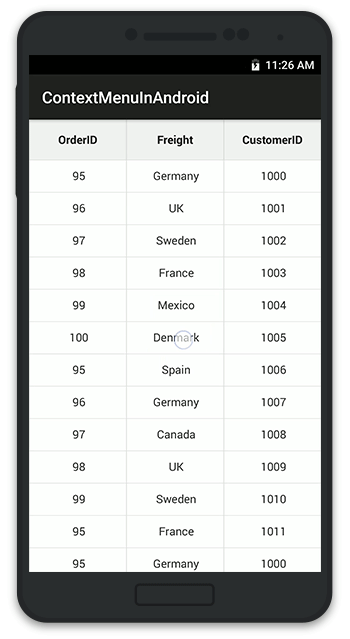

# Grid Events

## GridTapped event

This event will be triggered whenever the data grid with [GridTappedEventsArgs](https://help.syncfusion.com/cr/xamarin-android/Syncfusion.SfDataGrid.GridTappedEventsArgs.html) containing the following properties is tapped:

* [RowIndex](https://help.syncfusion.com/cr/xamarin-android/Syncfusion.SfDataGrid.GridTappedEventsArgs.html#Syncfusion_SfDataGrid_GridTappedEventsArgs__ctor_Syncfusion_GridCommon_ScrollAxis_RowColumnIndex_System_Object_): Gets the row index of the tapped row.
* [ColumnIndex](https://help.syncfusion.com/cr/xamarin-android/Syncfusion.SfDataGrid.GridTappedEventsArgs.html#Syncfusion_SfDataGrid_GridTappedEventsArgs__ctor_Syncfusion_GridCommon_ScrollAxis_RowColumnIndex_System_Object_): Gets the column index of the tapped column.
* [RowData](https://help.syncfusion.com/cr/xamarin-android/Syncfusion.SfDataGrid.GridTappedEventsArgs.html#Syncfusion_SfDataGrid_GridTappedEventsArgs_RowData): Gets the row data of the tapped row.

The following code illustrates how to hook the `GridTapped` event and get the tapped row and column details:


dataGrid.GridTapped += DataGrid_GridTapped;

private void DataGrid_GridTapped(object sender, GridTappedEventsArgs e)
{
    var rowIndex = e.RowColumnIndex.RowIndex;
    var rowData = e.RowData;
    var columnIndex = e.RowColumnIndex.ColumnIndex;
}


## GridDoubleTapped event

This event will be triggered whenever the data grid with [GridDoubleTappedEventsArgs](https://help.syncfusion.com/cr/xamarin-android/Syncfusion.SfDataGrid.GridDoubleTappedEventsArgs.html) containing the following properties is double tapped: 

* [RowIndex](https://help.syncfusion.com/cr/xamarin-android/Syncfusion.SfDataGrid.GridDoubleTappedEventsArgs.html#Syncfusion_SfDataGrid_GridDoubleTappedEventsArgs__ctor_Syncfusion_GridCommon_ScrollAxis_RowColumnIndex_System_Object_): Gets the row index of the double tapped row.
* [ColumnIndex](https://help.syncfusion.com/cr/xamarin-android/Syncfusion.SfDataGrid.GridDoubleTappedEventsArgs.html#Syncfusion_SfDataGrid_GridDoubleTappedEventsArgs__ctor_Syncfusion_GridCommon_ScrollAxis_RowColumnIndex_System_Object_): Gets the column index of the double tapped column.
* [RowData](https://help.syncfusion.com/cr/xamarin-android/Syncfusion.SfDataGrid.GridDoubleTappedEventsArgs.html#Syncfusion_SfDataGrid_GridDoubleTappedEventsArgs_RowData): Gets the row data of the double tapped row.

The following code illustrates how to hook the `GridDoubleTapped` event and get the double tapped row and column details:


dataGrid.GridDoubleTapped += DataGrid_GridDoubleTapped;

private void DataGrid_GridDoubleTapped(object sender, GridDoubleTappedEventsArgs e)
{
    var rowIndex = e.RowColumnIndex.RowIndex;
    var rowData = e.RowData;
    var columnIndex = e.RowColumnIndex.ColumnIndex;
}


## GridLongPressed event

This event will be triggered whenever the data grid with [GridLongPressedEventsArgs](https://help.syncfusion.com/cr/xamarin-android/Syncfusion.SfDataGrid.GridLongPressedEventsArgs.html) containing the following properties is long pressed:

* [RowIndex](https://help.syncfusion.com/cr/xamarin-android/Syncfusion.SfDataGrid.GridLongPressedEventsArgs.html#Syncfusion_SfDataGrid_GridLongPressedEventsArgs__ctor_Syncfusion_GridCommon_ScrollAxis_RowColumnIndex_System_Object_): Gets the row index of the long pressed row.
* [ColumnIndex](https://help.syncfusion.com/cr/xamarin-android/Syncfusion.SfDataGrid.GridLongPressedEventsArgs.html#Syncfusion_SfDataGrid_GridLongPressedEventsArgs__ctor_Syncfusion_GridCommon_ScrollAxis_RowColumnIndex_System_Object_): Gets the column index of the long pressed column.
* [RowData](https://help.syncfusion.com/cr/xamarin-android/Syncfusion.SfDataGrid.GridLongPressedEventsArgs.html#Syncfusion_SfDataGrid_GridLongPressedEventsArgs_RowData): Gets the row data of the long pressed row.

The following code illustrates how to hook the `GridLongPressed` event and get the long pressed row and column details: 


dataGrid.GridLongPressed += DataGrid_GridLongPressed;

private void DataGrid_GridLongPressed(object sender, GridLongPressedEventsArgs e)
{
    var rowIndex = e.RowColumnIndex.RowIndex;
    var rowData = e.RowData;
    var columnIndex = e.RowColumnIndex.ColumnIndex;
}


## GridViewCreated event

This event will be triggered once the [SfDataGrid.View](https://help.syncfusion.com/cr/xamarin-android/Syncfusion.SfDataGrid.SfDataGrid.html#Syncfusion_SfDataGrid_SfDataGrid_View) is created with [GridViewCreatedEventArgs](https://help.syncfusion.com/cr/xamarin-android/Syncfusion.SfDataGrid.GridViewCreatedEventArgs.html).

The following code illustrates how to hook the `GridViewCreated` event and how to set alternate row colors in the data grid:


dataGrid.GridViewCreated += DataGrid_GridViewCreated;

private void DataGrid_GridViewCreated(object sender, GridViewCreatedEventArgs e)
{
    (sender as SfDataGrid).GridStyle = new CustomGridStyle();    
}

internal class CustomGridStyle : DataGridStyle
{
    public override Color GetAlternatingRowBackgroundColor()
    {
        return Color.Aqua;
    }
}


## GridLoaded event

This event will be triggered once the components in the data grid are initialized and rendered with [GridLoadedEventArgs](https://help.syncfusion.com/cr/xamarin-android/Syncfusion.SfDataGrid.GridLoadedEventArgs.html).

The following code illustrates how to hook the `GridLoaded` event and how to show the `ProgressDialog` until the grid comes to view:


dataGrid.GridLoaded += DataGrid_GridLoaded;

private async void DataGrid_GridLoaded(object sender, GridLoadedEventArgs e)
{
    ProgressDialog progressDialog = ProgressDialog.Show(this, "Please wait...","Loading the source..");
    await Task.Delay(2000);
    progressDialog.Hide();
}


## Value changed event
The [SfDataGrid.ValueChanged](https://help.syncfusion.com/cr/xamarin-android/Syncfusion.SfDataGrid.SfDataGrid.html) event will be triggered whenever the value has been changed by toggling the switch of the GridSwitchColumn. This event handler contains the parameter of type [ValueChangedEventArgs](https://help.syncfusion.com/cr/xamarin-Android/Syncfusion.SfDataGrid.ValueChangedEventArgs.html) that contains the following properties.

* [Column](https://help.syncfusion.com/cr/xamarin-android/Syncfusion.SfDataGrid.ValueChangedEventArgs.html#Syncfusion_SfDataGrid_ValueChangedEventArgs_Column)        : Gets the current `GridColumn` that contains the grid cell for which value is edited or changed.
* [NewValue](https://help.syncfusion.com/cr/xamarin-android/Syncfusion.SfDataGrid.ValueChangedEventArgs.html#Syncfusion_SfDataGrid_ValueChangedEventArgs_NewValue)      : The new edited value to be committed.
* [RowColIndex](https://help.syncfusion.com/cr/xamarin-android/Syncfusion.SfDataGrid.ValueChangedEventArgs.html#Syncfusion_SfDataGrid_ValueChangedEventArgs_RowColIndex)   : The current `RowColumnIndex` of the grid cell undergoing the value change.
* [RowData](https://help.syncfusion.com/cr/xamarin-android/Syncfusion.SfDataGrid.ValueChangedEventArgs.html#Syncfusion_SfDataGrid_ValueChangedEventArgs_RowData)       : The `RowData` of the row that contains the grid cell undergoing the value change.



        dataGrid.ValueChanged += DataGrid_ValueChanged;

        private void DataGrid_ValueChanged(object sender, ValueChangedEventArgs e)
        {
            var column = e.Column;
            var newValue = e.NewValue;
            var rowColIndex = e.RowColIndex;
            var rowData = e.RowData;
        }



## ItemsSourceChanged event

The [SfDataGrid.ItemsSourceChanged](https://help.syncfusion.com/cr/xamarin-android/Syncfusion.SfDataGrid.SfDataGrid.html) event will be triggered whenever the [SfDataGrid.ItemsSource](https://help.syncfusion.com/cr/xamarin-android/Syncfusion.SfDataGrid.SfDataGrid.html#Syncfusion_SfDataGrid_SfDataGrid_ItemsSource) property is changed in the grid during both the runtime changes and initial loading of the DataGrid. This event handler contains the parameter of type [GridItemsSourceChangedEventArgs](https://help.syncfusion.com/cr/xamarin-Android/Syncfusion.SfDataGrid.GridItemsSourceChangedEventArgs.html) that contains the following properties:

* [OldItemSource](https://help.syncfusion.com/cr/xamarin-android/Syncfusion.SfDataGrid.GridItemsSourceChangedEventArgs.html#Syncfusion_SfDataGrid_GridItemsSourceChangedEventArgs_OldItemSource): Gets the previous ItemsSource collection as object. Always null when the grid is initially loaded.
* [NewItemSource](https://help.syncfusion.com/cr/xamarin-android/Syncfusion.SfDataGrid.GridItemsSourceChangedEventArgs.html#Syncfusion_SfDataGrid_GridItemsSourceChangedEventArgs_NewItemSource): Gets the current ItemsSource collection as object.
* [OldView](https://help.syncfusion.com/cr/xamarin-android/Syncfusion.SfDataGrid.GridItemsSourceChangedEventArgs.html#Syncfusion_SfDataGrid_GridItemsSourceChangedEventArgs_OldView): Gets the old [SfDataGrid.View](https://help.syncfusion.com/cr/xamarin-android/Syncfusion.SfDataGrid.SfDataGrid.html#Syncfusion_SfDataGrid_SfDataGrid_View) associated with the `OldItemSource`. Always null when the grid is initially loaded.
* [NewView](https://help.syncfusion.com/cr/xamarin-android/Syncfusion.SfDataGrid.GridItemsSourceChangedEventArgs.html#Syncfusion_SfDataGrid_GridItemsSourceChangedEventArgs_NewView): Gets the new [SfDataGrid.View](https://help.syncfusion.com/cr/xamarin-android/Syncfusion.SfDataGrid.SfDataGrid.html#Syncfusion_SfDataGrid_SfDataGrid_View) associated with the `NewItemSource`.

The following code example shows how to hook the `SfDataGrid.ItemsSourceChanged` event and get the `ItemsSource` collection details.




dataGrid.ItemsSourceChanged += DataGrid_ItemsSourceChanged;

 private void DataGrid_ItemsSourceChanged(object sender, GridItemsSourceChangedEventArgs e)
 {
    var newItemSource = e.NewItemSource;
    var oldItemSource = e.OldItemSource;
    var newView = e.NewView;
    var oldView = e.OldView;
 }
 



## Create custom context menu using grid events

SfDataGrid allows to display any custom view like a context menu that can act similar to a pop using the `GridLongPressed` event and the `GridTapped` event.

To create a custom context menu using grid events, follow the code example:


public class MainActivity : Activity
{
    LinearLayout contextMenu;
    Button sortButton;
    Button clearSortButton;
    SfDataGrid dataGrid;
    ViewModel viewModel;
    RelativeLayout relativeLayout;
    private bool isContextMenuDisplayed = false;
    private string currentColumnName;
       
    protected override void OnCreate(Bundle bundle)
    {
        base.OnCreate(bundle);
        dataGrid = new SfDataGrid(this);
        viewModel = new ViewModel();
        relativeLayout = new RelativeLayout(this);
        // Creates the view for the ContextMenu
        CreateContextMenu();
        dataGrid.ColumnSizer = ColumnSizer.Star;
        dataGrid.ItemsSource = viewModel.Collection;
        dataGrid.AutoGenerateColumns = true;
        dataGrid.GridLongPressed += DataGrid_GridLongPressed;
        dataGrid.GridTapped += DataGrid_GridTapped;
        relativeLayout.AddView(dataGrid);               
        SetContentView (relativeLayout);
    }

    public void CreateContextMenu()
    {
        contextMenu = new LinearLayout(this);
        contextMenu.Orientation = Orientation.Vertical;

        sortButton = new Button(this);
        sortButton.Text = "Sort";
        sortButton.SetBackgroundColor(Color.Black);
        sortButton.SetTextColor(Color.White);
        sortButton.Touch += SortButton_Touch;

        clearSortButton = new Button(this);
        clearSortButton.Text = "Clear sort";
        clearSortButton.SetBackgroundColor(Color.Black);
        clearSortButton.SetTextColor(Color.White);
        clearSortButton.Touch += ClearSortButton_Touch;

        // A custom view hosting two buttons are now created
        contextMenu.AddView(sortButton);
        contextMenu.AddView(clearSortButton);

        var sortButtonLayoutParams = (LinearLayout.LayoutParams)sortButton.LayoutParameters;
        sortButtonLayoutParams.BottomMargin = 20;
        var clearSortButtonLayoutParams = (LinearLayout.LayoutParams)clearSortButton.LayoutParameters;
        clearSortButtonLayoutParams.TopMargin = 20;
    }

    // Removes the sorting applied to the SfDataGrid
    private void ClearSortButton_Touch(object sender, Android.Views.View.TouchEventArgs e)
    {
        relativeLayout.RemoveView(contextMenu);
        isContextMenuDisplayed = false;
        dataGrid.SortColumnDescriptions.Clear();
    }
        
    // Sorts the SfDataGrid data based on the column selected in the context menu
    private void SortButton_Touch(object sender, Android.Views.View.TouchEventArgs e)
    {
        relativeLayout.RemoveView(contextMenu);
        isContextMenuDisplayed = false;
        dataGrid.SortColumnDescriptions.Clear();
        dataGrid.SortColumnDescriptions.Add(new SortColumnDescription()
        {
            ColumnName = currentColumnName
        });
        }

    private void DataGrid_GridLongPressed(object sender, GridLongPressedEventArgs e)
    {
        if (!isContextMenuDisplayed)
        {
            currentColumnName = dataGrid.Columns[e.RowColumnIndex.ColumnIndex].MappingName;
            var point = dataGrid.RowColumnIndexToPoint(e.RowColumnIndex);
            contextMenu.SetX(point.X);
            contextMenu.SetY(point.Y);
            // Display the ContextMenu when the SfDataGrid is long pressed
            relativeLayout.AddView(contextMenu,330,400);
            isContextMenuDisplayed = true;
        }
        else
        {
            // Hides the context menu when SfDataGrid is long pressed when the context menu is already visible in screen
            relativeLayout.RemoveView(contextMenu);
            isContextMenuDisplayed = false;
        }
    }

    private void DataGrid_GridTapped(object sender, GridTappedEventArgs e)
    {
        // Hides the context menu when SfDataGrid is tapped anywhere outside the context menu view
        relativeLayout.RemoveView(contextMenu); 
        isContextMenuDisplayed = false;
    }
}


Refer to the following GIF for the final rendering on execution of the above code example:

