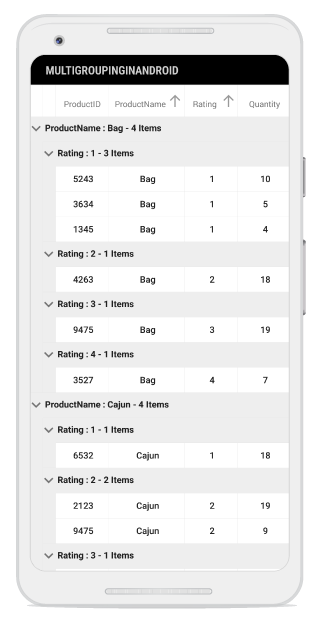
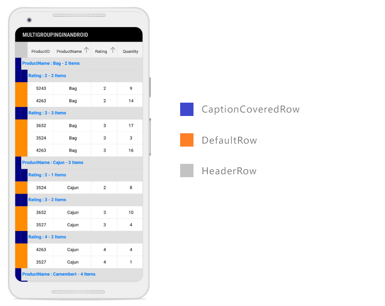
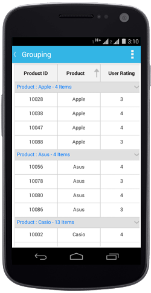
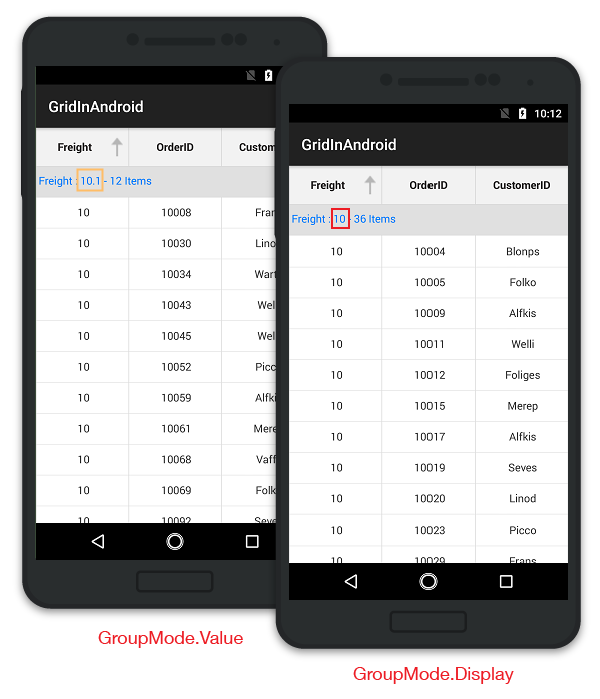
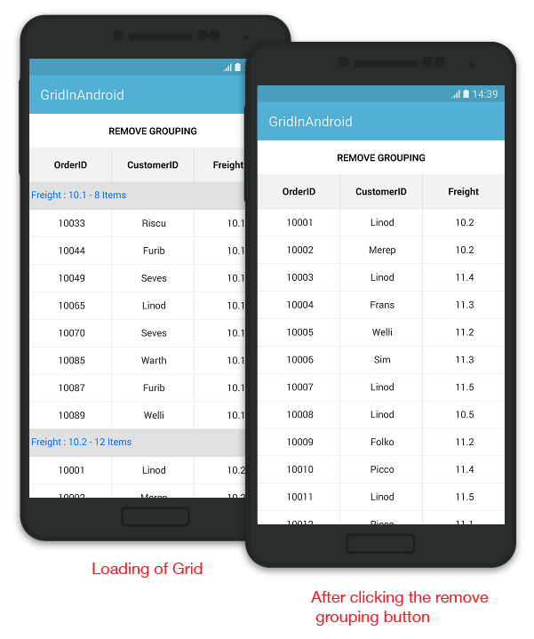

# Grouping in Xamarin.Android SfDataGrid

A group represents a collection of records of a category. When grouping is applied, the data is organized into a hierarchical structure based on matching field values. The records having identical values in the grouped column are combined to form a group. Each group is identified by its [CaptionSummaryRow](https://help.syncfusion.com/cr/xamarin-android/Syncfusion.SfDataGrid.SfDataGrid.html#Syncfusion_SfDataGrid_SfDataGrid_CaptionSummaryRow) to get the underlying records in view.

N> To update grouping for the newly added row or column, set the `SfDataGrid.View.LiveDataUpdateMode` to `LiveDataUpdateMode.AllowDataShaping`.

N> When `BeginInit` method is called, it suspends all the updates until `EndInit` method is called.

## Programmatic Grouping

The data grid also performs grouping from the code by defining the [GroupColumnDescription](http://help.syncfusion.com/cr/xamarin-android/Syncfusion.SfDataGrid.GroupColumnDescription.html) object and adding it in the [SfDataGrid.GroupColumnDescriptions](http://help.syncfusion.com/cr/xamarin-android/Syncfusion.SfDataGrid.GroupColumnDescriptions.html) collection. The data grid groups the data based on the `GroupColumnDescription` object added to this collection.

The `GroupColumnDescription` object holds following two properties:

* [ColumnName](https://help.syncfusion.com/cr/xamarin-android/Syncfusion.SfDataGrid.GroupColumnDescription.html#Syncfusion_SfDataGrid_GroupColumnDescription_ColumnName): Gets the name of the grouped column.
* [Converter](https://help.syncfusion.com/cr/xamarin-android/Syncfusion.SfDataGrid.GroupColumnDescription.html#Syncfusion_SfDataGrid_GroupColumnDescription_Converter): Get the `IValueConverter` as input that helps to apply the custom grouping.

The following code example illustrates how to apply grouping to a column in the data grid:


    dataGrid.GroupColumnDescriptions.Add (new GroupColumnDescription () {
    ColumnName = "CustomerID",
}); 


The following screenshot shows the output rendered when grouping is applied:

## MultiGrouping

The SfDataGrid also allows to group the data against one or more columns by using the `SfDataGrid.GroupingMode` property. When the `GroupingMode` is set as `GroupingMode.Multiple`, the data will be organized into hierarchical tree structure based on the identical values of that column. MultiGrouping feature works similarly as MultiSorting feature. Initially, the data is grouped according to the first column added in the `GroupColumnDescriptions` collection. When more columns are added to the `GroupColumnDescriptions`, the newly added column will be grouped in consideration to the previous group(s). This results in a tree like hierarchy. 



this.dataGrid.GroupingMode = GroupingMode.Multiple;



The following screenshot shows the output rendered when above code is executed:

## Indent column customizations

Indent columns are the columns present to the left of the `CaptionSummaryRows` when `GroupingMode` is set as multiple. The number of indent cells in each `CaptionSummaryRow` will be determined by the level of that `Group`. For example, the first group will have only one indent cell and the next immediate group will have an extra indent cell. It keeps on adding by one for each lower level groups to maintain the tree structure. Each data row will have indent cells count equal to the level of the last sub group in view. The following customizations can be done for the indent cells.

### Customize indent column width

By default, the width of the indent column is 20. To customize the width, use the `IndentColumnWidth` property. 



this.dataGrid.IndentColumnWidth = 60;



### Customize indent column background color 

Set background color to the indent cells based on the row where indent cells present. To set the desired background color, use the `GetIndentBackgroundColor()` override method in the custom `DataGridStyle` class. Refer to this [link](https://help.syncfusion.com/xamarin-android/sfdatagrid/styles) to know how to apply custom style to the SfDataGrid.



this.dataGrid.GridStyle = new CustomStyle();

public class CustomStyle : DataGridStyle
{
    public override Color GetIndentBackgroundColor(RowType rowType)
    {
        if (rowType == RowType.DefaultRow)
            return Color.DarkOrange;
        if (rowType == RowType.CaptionCoveredRow)
            return Color.Navy;
        else return Color.LightGray;
    }
}



The following screenshot shows the output rendered when above code is executed:

## Expand groups while grouping
 
You can expand all the groups while grouping by setting the [SfDataGrid.AutoExpandGroups](https://help.syncfusion.com/cr/xamarin-android/Syncfusion.SfDataGrid.SfDataGrid.html#Syncfusion_SfDataGrid_SfDataGrid_AutoExpandGroups) to `true`. So, when grouping any column, all groups will be in expanded states. 


this.dataGrid.AutoExpandGroups = true;
this.dataGrid.AllowGroupExpandCollapse = true;


## Expand or collapse the groups

By default, the groups will be in expanded state in the data grid. However, you can expand or collapse a group at runtime by setting the [SfDataGrid.AllowGroupExpandCollapse](https://help.syncfusion.com/cr/xamarin-android/Syncfusion.SfDataGrid.SfDataGrid.html#Syncfusion_SfDataGrid_SfDataGrid_AllowGroupExpandCollapse) to `true`.


this.dataGrid.AllowGroupExpandCollapse = true;


### Expand or collapse all the groups

You can expand or collapse all the groups programmatically at runtime by using the `SfDataGrid.ExpandAllGroup` and `SfDataGrid.CollapseAllGroup` methods.



this.dataGrid.ExpandAllGroup();
this.dataGrid.CollapseAllGroup();



### Expand or collapse a specific group

You can expand or collapse a specific group by using the `SfDataGrid.ExpandGroup` and `SfDataGrid.CollapseGroup` methods.


var group = (dataGrid.View.Groups[0] as Group);
this.dataGrid.ExpandGroup(group);
this.dataGrid.CollapseGroup(group);


## Custom grouping

The data grid groups a column based on custom logic. To use the custom grouping, write a converter that implements `IValueConverter` with your custom grouping logic and assign that converter to the [GroupColumnDescription.Converter](https://help.syncfusion.com/cr/xamarin-android/Syncfusion.SfDataGrid.GroupColumnDescription.html#Syncfusion_SfDataGrid_GroupColumnDescription_Converter) property.

The following code example illustrates how to set the custom grouping converter for the group description added to group the freight column.


dataGrid.GroupColumnDescriptions.Add (new GroupColumnDescription () {
    ColumnName = "Freight",
    Converter = new GroupConverter()
}); 


The following code example illustrates the converter used for applying custom grouping logic.


public class GroupConverter : IValueConverter
{
    public GroupConverter()
    {
        
    }

    public object Convert(object value, Type targetType, object parameter, CultureInfo culture)
    {
        var orderInfo = value as OrderInfo;
        if (orderInfo.Freight > 0 && orderInfo.Freight <= 250)
            return "<=250";
        else if (orderInfo.Freight > 250 && orderInfo.Freight <= 500)
            return ">250 & <=500";
        else if (orderInfo.Freight > 500 && orderInfo.Freight <= 750)
            return ">500 & <=750";
        else
            return ">1000";
    }

    public object ConvertBack(object value, Type targetType, object parameter, CultureInfo culture)
    {
        return null;
    }
}


## Display based grouping using group mode property

By default, column grouping occurs based on the value in the underlying collection, thereby creating a new group for each new value of that column. However, you can also group a column based on the display value by setting the [GridColumn.GroupMode](https://help.syncfusion.com/cr/xamarin-android/Syncfusion.SfDataGrid.GridColumn.html#Syncfusion_SfDataGrid_GridColumn_GroupMode) property as `Display`. In the following code example, set [GridColumn.Format](https://help.syncfusion.com/cr/xamarin-android/Syncfusion.SfDataGrid.GridColumn.html#Syncfusion_SfDataGrid_GridColumn_Format) property as "#" which displays only the rounded off value in the `GridCell`:  


GridNumericColumn cargoWeight = new GridTextColumn();
cargoWeight.MappingName = "ShipmentWeight";
cargoWeight.GroupMode = Syncfusion.Data.DataReflectionMode.Display;
cargoWeight.Format = "#";
 

The following screenshot shows the comparison between the two group modes. GroupMode.Value on the left and GroupMode.Display on the right.

## Clearing or removing a group

To clear the grouping applied to the data grid, remove the items from the `SfDataGrid.GroupColumnDescriptions` collection or clear the collection. 
 
Refer to the following code snippets to remove grouping:


public class MainActivity : Activity
{
    SfDataGrid dataGrid;
    ViewModel viewModel;
    LinearLayout linearLayout;
    Button clearGroupingButton;
    protected override void OnCreate(Bundle bundle)
    {
        base.OnCreate(bundle);
        dataGrid = new SfDataGrid(this);
        viewModel = new ViewModel();
        dataGrid.ItemsSource = viewModel.OrdersInfo;
        clearGroupingButton = new Button(this);
        clearGroupingButton.Text = "Remove Grouping";
        clearGroupingButton.SetTextColor(Color.Black);
        clearGroupingButton.SetBackgroundColor(Color.White);
        clearGroupingButton.Click += ClearGroupingButton_Click;
        linearLayout = new LinearLayout(this);
        linearLayout.Orientation = Orientation.Vertical;
        dataGrid.GroupColumnDescriptions.Add(new GroupColumnDescription()
        {
            ColumnName = "Freight",
        });
        SetContentView (dataGrid);
    }

    private void ClearGroupingButton_Click(object sender, System.EventArgs e)
    {
        //Clearing the Group
        dataGrid.GroupColumnDescriptions.Clear();

        //Removing the Group based on group item
        //var groupColumn = dataGrid.GroupColumnDescriptions[0];
        //dataGrid.GroupColumnDescriptions.Remove(groupColumn);
        
        //Removing the Group based on group index
        //dataGrid.GroupColumnDescriptions.RemoveAt(0);
    }
}


Run the application to render the following output:

N> You can also clear or remove grouping on [GridTapped event](https://help.syncfusion.com/cr/xamarin-android/Syncfusion.SfDataGrid.SfDataGrid.html), [GridDoubleTapped event](https://help.syncfusion.com/cr/xamarin-android/Syncfusion.SfDataGrid.SfDataGrid.html), or [GridLongPressed event](https://help.syncfusion.com/cr/xamarin-android/Syncfusion.SfDataGrid.SfDataGrid.html).

## Events

### GroupExpanding event

The `SfDataGrid.GroupExpanding` event occurs when the group is being expanded.
 
The `GroupChangingEventArgs` of the `GroupExpanding` event provides the information about the expanding group and it has the following members:

`Syncfusion.Data.Group`: Gets the being expanded group.

`Cancel`: Decides to cancel the group expansion.
 
You can cancel the group expansion by setting the [GroupChangingEventArgs.Cancel](https://docs.microsoft.com/en-us/dotnet/api/system.componentmodel.canceleventargs.cancel?f1url=%3FappId%3DDev10IDEF1%26l%3DEN-US%26k%3Dk(System.ComponentModel.CancelEventArgs.Cancel)%26rd%3Dtrue&view=net-5.0) to `true`.


this.dataGrid.GroupExpanding += dataGrid_GroupExpanding;

void dataGrid_GroupExpanding(object sender, Syncfusion.SfDataGrid.GroupChangingEventArgs e)
{
    if (e.Group.Key.Equals(1001))    
        e.Cancel = true;    
}       


### GroupExpanded event

The `SfDataGrid.GroupExpanded` event occurs after the group is expanded.

The `GroupChangedEventArgs` of the `GroupExpanded` event provides the information about the expanded group and it has the following member:

`Syncfusion.Data.Group`: Gets the expanded group.

### GroupCollapsing event 

The `SfDataGrid.GroupCollapsing` event occurs when the group is being collapsed.

The `GroupChangingEventArgs` of the `GroupCollapsing` event provides the information about the collapsing group and it contains the following members:

`Syncfusion.Data.Group`: Gets the being collapsed group.

`Cancel`: Decides to cancel the group collapsing.

You can cancel the group is being collapsed by using [GroupChangingEventArgs.Cancel](https://docs.microsoft.com/en-us/dotnet/api/system.componentmodel.canceleventargs.cancel?f1url=%3FappId%3DDev10IDEF1%26l%3DEN-US%26k%3Dk(System.ComponentModel.CancelEventArgs.Cancel)%26rd%3Dtrue&view=net-5.0) of the `GroupCollapsing` event.


this.dataGrid.GroupCollapsing += dataGrid_GroupCollapsing;

void dataGrid_GroupCollapsing(object sender, Syncfusion.SfDataGrid.GroupChangingEventArgs e)
{
    if (e.Group.Key.Equals(1001))    
        e.Cancel = true;    
}


### GroupCollapsed event
 
The `SfDataGrid.GroupCollapsed` event occurs after the group is collapsed.
 
The `GroupChangedEventArgs` of the `GroupCollapsed` event  provides the information about collapsed group and it contains the following member:

`Syncfusion.Data.Group`: Gets the collapsed group.

## Animate the group expand/collapse icon

The data grid loads two different icons denoting the group expanded and collapsed state. However, the control rotates the expander icon animatedly for denoting the collapsed status by overriding the `DataGridStyle.GetGroupCollapseIcon` method and returning `0`.

The following code example illustrates how to enable the group/expand collapse icons animation by writing a custom style: 




//Apply custom style to the data grid from code 

dataGrid.GridStyle = new CustomStyle ();

//Custom Style class

public class CustomStyle : DataGridStyle
{ 
   public CustomStyle ()
   {
       
   }
   public override ImageSource GetGroupCollapseIcon()
   {
       return 0;
   }
}




## Hiding the column when grouped

In the data grid, a column will be generated with the default column width. In order to group by a column that should not be visible in the view, add the column to the [SfDataGrid.Columns](https://help.syncfusion.com/cr/xamarin-android/Syncfusion.SfDataGrid.SfDataGrid.html#Syncfusion_SfDataGrid_SfDataGrid_Columns) collection and set its width as 0. Thus, the column will be grouped but will not be visually seen. Refer to the following code example:


dataGrid.Columns.Add (new GridTextColumn () { 
    MappingName = "ShippingDate",
    Width = 0
});

dataGrid.GroupColumnDescriptions.Add (new GroupColumnDescription () { 
    ColumnName = "ShippingDate"
});

