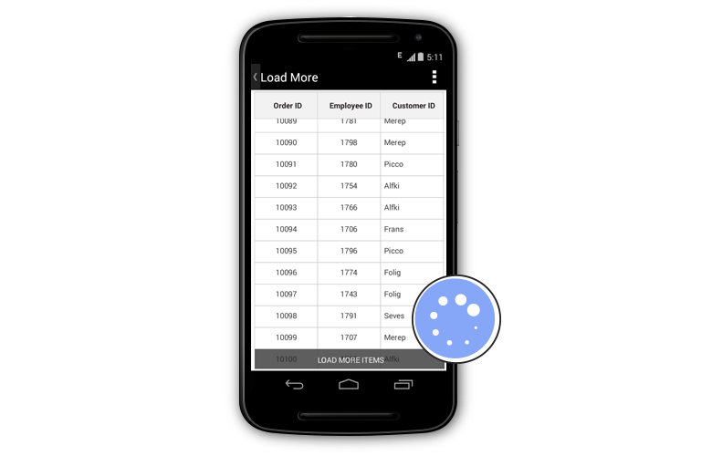

# Load More

The data grid enables the LoadMore option by setting the [SfDataGrid.AllowLoadMore](https://help.syncfusion.com/cr/xamarin-android/Syncfusion.SfDataGrid.SfDataGrid.html#Syncfusion_SfDataGrid_SfDataGrid_AllowLoadMore) property to `true` and by setting the [SfDataGrid.LoadMoreCommand](https://help.syncfusion.com/cr/xamarin-android/Syncfusion.SfDataGrid.SfDataGrid.html#Syncfusion_SfDataGrid_SfDataGrid_LoadMoreCommand) property. When the LoadMore is enabled, the control provides the option to load a subset of data to its data source at runtime using the [LoadMoreView](https://help.syncfusion.com/cr/xamarin-android/Syncfusion.SfDataGrid.SfDataGrid.html#Syncfusion_SfDataGrid_SfDataGrid_LoadMoreView). 

On scrolling down, when the grid reaches the maximum offset, an interactive load-more view is displayed in the view. Tapping the load-more view triggers a command to add more data to the data source of the grid at runtime.

## LoadMoreCommand

The data grid load records to its data source at runtime by triggering an `ICommand` bound to the `SfDataGrid.LoadMoreCommand` property. When tapping the load more view, if the `CanExecute` of the `ICommand` returns true, this command is triggered to load the records at runtime.
 
Set the [SfDataGrid.IsBusy](https://help.syncfusion.com/cr/xamarin-android/Syncfusion.SfDataGrid.SfDataGrid.html#Syncfusion_SfDataGrid_SfDataGrid_IsBusy) property to true before loading items. This notifies the grid that more items are being loaded to it. Set the property to false after loading items to the grid. When loading items, you can also alter the timing for the LoadMore animation from the sample by setting a delay.

The following code example illustrates how to enable and load items at runtime:


//Enable load more in the data grid
dataGrid.AllowLoadMore = true;
dataGrid.LoadMoreCommand = new Command(ExecuteLoadMoreCommand);
 
private async void ExecuteLoadMoreCommand()
{
    this.dataGrid.IsBusy = true;
    await Task.Delay(new TimeSpan(0, 0, 5));
    viewModel.LoadMoreItems ();
    this.dataGrid.IsBusy = false;
} 

//ViewModel.cs
internal void LoadMoreItems()
{
    for (int i = 0; i < 20; i++)
    this.OrdersInfo.Add(order.GenerateOrder(OrdersInfo.Count + 1));
} 

//Command.cs
public class Command : ICommand
{
    private Action execute;
    private bool canExecute = true;

    public event EventHandler CanExecuteChanged;

    public Command(Action action)
    {
        execute = action;
    }

    public bool CanExecute(object parameter)
    {
        return canExecute;
    }

    public void Execute(object parameter)
    {
        changeCanExecute(true);
        execute.Invoke();
    }

    private void changeCanExecute(bool canExecute)
    {
        this.canExecute = canExecute;
        if (CanExecuteChanged != null)
            CanExecuteChanged(this, new EventArgs());
    }
}


## Customize load-more display text

Customize the text displayed in the `LoadMoreView` by setting the [SfDataGrid.LoadMoreText](https://help.syncfusion.com/cr/xamarin-android/Syncfusion.SfDataGrid.SfDataGrid.html#Syncfusion_SfDataGrid_SfDataGrid_LoadMoreText) property as follows:


//setting load more text in the data grid
dataGrid.LoadMoreText = "Load More Items"; 


## Customize load-more view position

Customize the position in which the `LoadMoreView` is displayed to either `top` or `bottom`.
 

//Enable load more in SfDataGrid
dataGrid.LoadMorePosition = LoadMoreViewPosition.Bottom;  


## Customize load-more view

The data grid also customizes the `LoadMoreView` by writing your custom `LoadMoreView` class inheriting from the `LoadMoreView`, and performing the LoadMoreOperation.

The following code example illustrates how to customize the `LoadMoreView` in the data grid:
 

public class CustomLoadMoreView : LoadMoreView
{
    private Button loadMoreView;

    public CustomLoadMoreView()
    {
        this.BackgroundColor = Color.Red;
        loadMoreView = new Button ();
        loadMoreView.Text = "LoadItems";
        this.Children.Add(loadMoreView);
        loadMoreView.Clicked += loadMoreView_Tapped;
    }

    void loadMoreView_Tapped (object sender, EventArgs e)
    {
        if (this.LoadMoreCommand != null)
        {
            this.LoadMoreCommand.Execute(null);
        }
    }

    protected override void LayoutChildren(double x, double y, double width, double height)
    {
        loadMoreView.Layout(new Rectangle(x, y, width, height));
    }
}


Running the application renders the following output:

