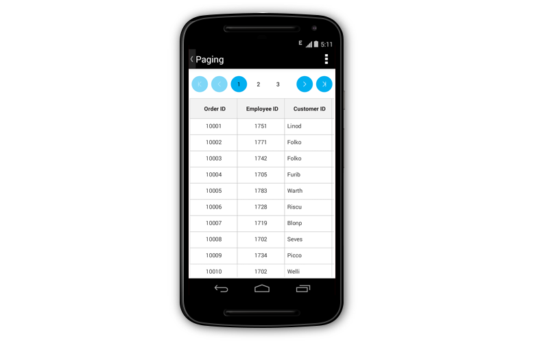
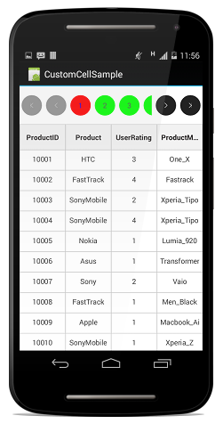

# Paging

The data grid interactively supports manipulating data using the [SfDataPager](http://help.syncfusion.com/cr/xamarin-android/Syncfusion.SfDataGrid.DataPager.html) control. It also provides built-in options to page data on demand when dealing with large volumes of data. The data grid places the `SfDataPager` above or below to easily manage the data paging.

To use the paging functionality in the data grid, add the `Syncfusion.SfDataGrid.DataPager` namespace to your project.

## Normal paging

The data grid performs data paging using the `SfDataPager`. Follow this procedure to enable paging in the data grid:

* Create a new SfDataPager instance and bind the data collection to the [SfDataPager.Source](https://help.syncfusion.com/cr/xamarin-android/Syncfusion.SfDataGrid.DataPager.SfDataPager.html#Syncfusion_SfDataGrid_DataPager_SfDataPager_Source) property, based on which [SfDataPager.PagedSource](https://help.syncfusion.com/cr/xamarin-android/Syncfusion.SfDataGrid.DataPager.SfDataPager.html#Syncfusion_SfDataGrid_DataPager_SfDataPager_PagedSource) is created internally. 
* Bind the `PagedSource` property to the [ItemsSource](https://help.syncfusion.com/cr/xamarin-android/Syncfusion.SfDataGrid.SfDataGrid.html#Syncfusion_SfDataGrid_SfDataGrid_ItemsSource) of the data grid. 
* Set the number of rows to be displayed in a page by setting the [SfDataPager.PageSize](https://help.syncfusion.com/cr/xamarin-android/Syncfusion.SfDataGrid.DataPager.SfDataPager.html#Syncfusion_SfDataGrid_DataPager_SfDataPager_PageSize) property.
* Set the number of buttons that need to be displayed in view by setting the [SfDataPager.NumericButtonCount](https://help.syncfusion.com/cr/xamarin-android/Syncfusion.SfDataGrid.DataPager.SfDataPager.html#Syncfusion_SfDataGrid_DataPager_SfDataPager_NumericButtonCount) property.

N> The `SfDataPager.PageSize` property should not be assigned with the value of 0.

The following code example shows how to implement paging in the data grid for Xamarin.Android:


public class MainActivity : Activity
{
   SfDataGrid sfGrid;
   PagingViewModel viewModel;
   SfDataPager sfDataPager;
  
   protected override void OnCreate(Bundle bundle)
   {
      base.OnCreate(bundle);
      LinearLayout linearLayout = new LinearLayout(this);
      linearLayout.Orientation = Orientation.Vertical;
      sfDataPager = new SfDataPager(this);
      sfGrid = new SfDataGrid(this);
      viewModel = new PagingViewModel();
      sfDataPager.PageSize = 15;
      sfDataPager.Source =  viewModel.OrdersInfo;
      sfDataPager.NumericButtonCount = 20;
      sfGrid.AutoGeneratingColumn += GridGenerateColumns;
      sfGrid.ItemsSource = sfDataPager.PagedSource;

      linearLayout.AddView(sfDataPager, new ViewGroup.LayoutParams(ViewGroup.LayoutParams.MatchParent,    
      (int)SfDataGridHelpers.ConvertDpToPixels(this.sfGrid, 75)));
      linearLayout.AddView(sfGrid);
      SetContentView(linearLayout);
}


The following screenshot shows the outcome upon execution of the above code:

N> The `SfDataPager` provides scrolling animation when the [FirstPageButton](http://help.syncfusion.com/cr/xamarin-android/Syncfusion.SfDataGrid.DataPager.NavigationButtons.html) or [LastPageButton](http://help.syncfusion.com/cr/xamarin-android/Syncfusion.SfDataGrid.DataPager.NavigationButtons.html) are tapped.

## On demand paging	

In normal Paging, data collection is entirely loaded to the `SfDataPager`. However, the data grid also loads the data for the current page dynamically by setting the [SfDataPager.UseOnDemandPaging](https://help.syncfusion.com/cr/xamarin-android/Syncfusion.SfDataGrid.DataPager.SfDataPager.html#Syncfusion_SfDataGrid_DataPager_SfDataPager_UseOnDemandPaging) to `true`.

To load the current page item dynamically, hook the [OnDemandLoading](https://help.syncfusion.com/cr/xamarin-android/Syncfusion.SfDataGrid.DataPager.SfDataPager.html) event. In the `OnDemandLoading` event, use the[LoadDynamicItems](https://help.syncfusion.com/cr/xamarin-android/Syncfusion.SfDataGrid.DataPager.SfDataPager.html#Syncfusion_SfDataGrid_DataPager_SfDataPager_LoadDynamicItems_System_Int32_System_Collections_IEnumerable_) method to load the data for the corresponding page in `SfDataPager`.

The `OnDemandLoading` event is triggered when the pager moves to the corresponding page. The `OnDemandLoading` event contains the following event arguments:

* [StartIndex](https://help.syncfusion.com/cr/xamarin-android/Syncfusion.SfDataGrid.DataPager.OnDemandLoadingEventArgs.html#Syncfusion_SfDataGrid_DataPager_OnDemandLoadingEventArgs_StartIndex): Defines the corresponding page start index.
* [PageSize](https://help.syncfusion.com/cr/xamarin-android/Syncfusion.SfDataGrid.DataPager.OnDemandLoadingEventArgs.html#Syncfusion_SfDataGrid_DataPager_OnDemandLoadingEventArgs_PageSize): Defines the number of items to be loaded in a page.

The following code example illustrates how to load data for the data pager control dynamically:


private void OnDemandPageLoading(object sender, OnDemandLoadingEventArgs args)
{
   sfDataPager.LoadDynamicItems(args.StartIndex, source.Skip(args.StartIndex).Take(args.PageSize));
}


N> In OnDemandPaging, you cannot assign a value for the Source property in the data pager.

When using `OnDemandPaging`, the `SfDataPager.PagedSource` loads only the current page data. Upon navigation to another page, the `OnDemandLoading` event is fired which loads another set of data but also maintains the previous page data. When navigating to previous page again, the OnDemandLoading event is not fired and the required data is loaded which was maintained in cache. However, for further performance enhancement, if you do not want to maintain the previous page data, you can call [Syncfusion.Data.PagedCollectionView.ResetCache()](https://help.syncfusion.com/cr/xamarin-android/Syncfusion.Data.PagedCollectionView.html#Syncfusion_Data_PagedCollectionView_ResetCache) in the `OnDemandLoading` event. ResetCache method call resets the cache except the current page.

The following code example illustrates how to use ResetCache method:


private void OnDemandPageLoading(object sender, OnDemandLoadingEventArgs args)
{
  sfDataPager.LoadDynamicItems(args.StartIndex, source.Skip(args.StartIndex).Take(args.PageSize));
  (sfDataPager.PagedSource as PagedCollectionView).ResetCache();
}


## Custom appearance

The following code example shows how to implement paging with custom appearance in the data grid:


sfDataPager.AppearanceManager = new CustomAppearance();



public class CustomAppearance : AppearanceManager
{
    public override Color GetNavigationButtonBackgroundColor()
    {
        return Color.Rgb(34, 34, 34);
    }
    public override Color GetNumericButtonBackgroundColor()
    {
        return Color.Rgb(0, 255, 0);
    }
    public override Color GetNumericButtonForegroundColor()
    {
        return Color.Rgb(82, 82, 82);
    }
    public override Color GetNumericButtonSelectionBackgroundColor()
    {
        return Color.Rgb(255, 0, 0);
    }
    public override Color GetNumericButtonSelectionForegroundColor()
    {
        return Color.Rgb(0, 0, 255);
    }
}


The following screenshot shows the outcome upon execution of the above code: 

