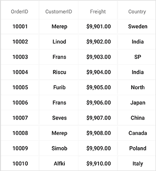
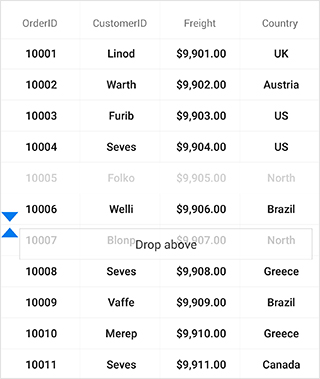
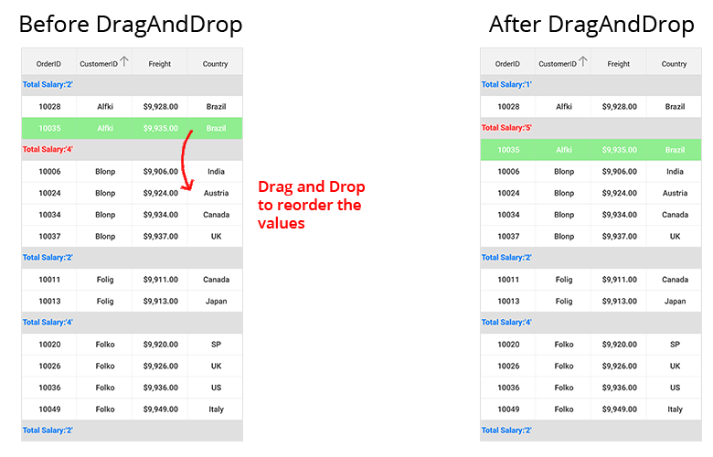

# Row Drag and Drop

SfDataGrid allows you to drag and drop a row by setting the [SfDataGrid.AllowDraggingRow](https://help.syncfusion.com/cr/xamarin-android/Syncfusion.SfDataGrid.SfDataGrid.html#Syncfusion_SfDataGrid_SfDataGrid_AllowDraggingRow) property to `true`. A Customizable row drag and drop template is displayed  while dragging a row. The drag and drop operation can be handled based on the requirement using [SfDataGrid.QueryRowDragging](https://help.syncfusion.com/cr/xamarin-android/Syncfusion.SfDataGrid.SfDataGrid.html) event.  

The following code example illustrates how to enable row drag and drop in SfDataGrid.



sfGrid.AllowDraggingRow = true;



## Dragging scenarios

SfDataGrid allows you to perform the drag and drop operation with both the data rows and groups.

* Records can be reordered to any position with auto scrolling.
* Groups position can be reordered using drag and drop. But no groups can be added inside other groups. 
* Data rows can be reordered within the same group or into the other groups as well. 

N> Reordering changes are made only in [SfDataGrid.View](https://help.syncfusion.com/cr/xamarin-android/Syncfusion.SfDataGrid.SfDataGrid.html#Syncfusion_SfDataGrid_SfDataGrid_View) and not in the underlying data. Thus the changes will be reverted when performing sorting, grouping or any other operation that refreshes the view. Reordering changes in the underlying data can be achieved by handling `QueryRowDragging` event in the sample side as explained below in [Reordering underlying data](# Reordering underlying data ).

## Row drag and drop template

SfDataGrid allows you to load a desired content when performing row drag and drop operation using the [SfDataGrid.RowDragDropTemplate](https://help.syncfusion.com/cr/xamarin-android/Syncfusion.SfDataGrid.SfDataGrid.html#Syncfusion_SfDataGrid_SfDataGrid_RowDragDropTemplate). 

## Default template

Default template will be loaded, if template is not explicitly assigned for row drag and drop operations. 

## Customizing row drag and drop template

You can load any type of custom view inside `SfDataGrid.RowDragDropTemplate` based on your application’s  requirement.

Refer the following code example that shows how to load row like view in template.




//Assigning custom view to row drag and drop template.
sfGrid.RowDragDropTemplate = new RowDragDropTemplate(BaseContext);

sfGrid.QueryRowDragging += SfGrid_QueryRowDragging;







private void SfGrid_QueryRowDragging(object sender, QueryRowDraggingEventArgs e)
{
     if (e.Reason == QueryRowDraggingReason.DragStarted)
     {
        (sfGrid.RowDragDropTemplate as RowDragDropTemplate).UpdateRow(e.RowData);
     }         
}






//Row template a custom view which represent row.

public class RowDragDropTemplate : LinearLayout
{
    #region Fields

    Paint paint;
    Label label1;
    Label label2;
    Label label3;
    Label label4;

    #endregion

    #region Constructor

    public RowDragDropTemplate(Context context) : base(context)
    {
        this.SetWillNotDraw(false);
        paint = new Paint(PaintFlags.AntiAlias);
        paint.SetStyle(Paint.Style.Stroke);
        this.Orientation = Orientation.Horizontal;
        paint.Color = Color.Black;
        label1 = new Label(context) { Gravity = GravityFlags.Center };
        label1.Text = "OrderID";
        label1.SetTextColor(Color.Black);
        label2 = new Label(context) { Gravity = GravityFlags.Center };
        label2.Text = "CustomerID";
        label2.SetTextColor(Color.Black);
        label3 = new Label(context) { Gravity = GravityFlags.Center };
        label3.Text = "Freight";
        label3.SetTextColor(Color.Black);
        label4 = new Label(context) { Gravity = GravityFlags.Center, IsLastLabel = true };
        label4.Text = "Country";
        label4.SetTextColor(Color.Black);
        this.AddView(label1);
        this.AddView(label2);
        this.AddView(label3);
        this.AddView(label4);
    }

    public RowDragDropTemplate(Context context, IAttributeSet attribute) : base(context, attribute)
    {
    }

    public RowDragDropTemplate(Context context, IAttributeSet attribute, int defStyleAttr) : base(context, attribute, defStyleAttr)
    {
    }

    public RowDragDropTemplate(Context context, IAttributeSet attribute, int defStyleAttr, int defStyleRes) : base(context, attribute, defStyleAttr, defStyleRes)
    {
    }

    protected RowDragDropTemplate(IntPtr javaReference, JniHandleOwnership transfer) : base(javaReference, transfer)
    {
    }

    #endregion

    #region Methods

    protected override void OnDraw(Canvas canvas)
    {
        canvas.DrawRect(0, 0, this.Width, this.Height, paint);
        base.OnDraw(canvas);
    }

    protected override void OnLayout(bool changed, int l, int t, int r, int b)
    {
        UpdateLabelWidthAndHeight();
        base.OnLayout(changed, l, t, r, b);
        this.label1.Layout(0, 0, this.Width / 4, this.Height);
        this.label2.Layout(label1.Right, 0, (this.Width / 4) * 2, this.Height);
        this.label3.Layout(label2.Right, 0, (this.Width / 4) * 3, this.Height);
        this.label4.Layout(label3.Right, 0, (this.Width / 4) * 4, this.Height);
    }

    internal void UpdateRow(object rowData)
    {
        try
        {
            var orderInfo = rowData as OrderInfo;
            label1.Text = orderInfo.OrderID;
            label2.Text = orderInfo.EmployeeID;
            label3.Text = orderInfo.CustomerID;
            label4.Text = orderInfo.FirstName;
        }
        catch { }
    }

    internal void UpdateLabelWidthAndHeight()
    {
        label1.SetWidth(this.Width / 4);
        label2.SetWidth(this.Width / 4);
        label3.SetWidth(this.Width / 4);
        label4.SetWidth(this.Width / 4);

        label1.SetHeight(this.Height);
        label2.SetHeight(this.Height);
        label3.SetHeight(this.Height);
        label4.SetHeight(this.Height);
    }

    #endregion
}

public class Label : TextView
{
    public bool IsLastLabel { get; set; }

    public Label(Context context) : base(context)
    {
        this.SetWillNotDraw(false);
    }

    public Label(Context context, IAttributeSet attribute) : base(context, attribute)
    {
    }

    public Label(Context context, IAttributeSet attribute, int defStyleAttr) : base(context, attribute, defStyleAttr)
    {
    }

    public Label(Context context, IAttributeSet attribute, int defStyleAttr, int defStyleRes) : base(context, attribute, defStyleAttr, defStyleRes)
    {
    }

    protected Label(IntPtr javaReference, JniHandleOwnership transfer) : base(javaReference, transfer)
    {
    }

    protected override void OnDraw(Canvas canvas)
    {
        if (!IsLastLabel)
            canvas.DrawLine(this.Width - this.Resources.DisplayMetrics.Density / 2, 0, this.Width - this.Resources.DisplayMetrics.Density / 2, this.Height, new Android.Graphics.Paint() { Color = Color.Black });
        base.OnDraw(canvas);
    }
}




You can download the customizing row drag-and-drop template sample [here](http://www.syncfusion.com/downloads/support/directtrac/general/ze/CustomTemplate-1341433818).

## Events in row drag-and-drop

[QueryRowDragging](https://help.syncfusion.com/cr/xamarin-android/Syncfusion.SfDataGrid.SfDataGrid.html) event is fired upon starting to drag a row and will be continuously fired till the dragging ends. By handing the `SfDataGrid.QueryRowDragging` event you can also cancel the dragging of a particular row.

The `QueryRowDragging` event provides following properties in [QueryRowDraggingEventArgs](http://help.syncfusion.com/cr/xamarin-android/Syncfusion.SfDataGrid.QueryRowDraggingEventArgs.html):

* [From](https://help.syncfusion.com/cr/xamarin-android/Syncfusion.SfDataGrid.QueryRowDraggingEventArgs.html#Syncfusion_SfDataGrid_QueryRowDraggingEventArgs_From) – Returns the index of the row currently being dragged.
* [To](https://help.syncfusion.com/cr/xamarin-android/Syncfusion.SfDataGrid.QueryRowDraggingEventArgs.html#Syncfusion_SfDataGrid_QueryRowDraggingEventArgs_To) – Returns the dragging index where you try to drop the row. 
* [Reason](https://help.syncfusion.com/cr/xamarin-android/Syncfusion.SfDataGrid.QueryRowDraggingEventArgs.html#Syncfusion_SfDataGrid_QueryRowDraggingEventArgs_Reason) – Returns row dragging details as `QueryRowDraggingReason`.
* [RowData](https://help.syncfusion.com/cr/xamarin-android/Syncfusion.SfDataGrid.QueryRowDraggingEventArgs.html#Syncfusion_SfDataGrid_QueryRowDraggingEventArgs_Reason) – Returns the underlying data associated with the dragged row.
* [CurrentRowData](https://help.syncfusion.com/cr/xamarin-android/Syncfusion.SfDataGrid.QueryRowDraggingEventArgs.html#Syncfusion_SfDataGrid_QueryRowDraggingEventArgs_CurrentRowData) – Returns the corresponding row data, over which the row drag view is currently placed.
* [CanAutoScroll](https://help.syncfusion.com/cr/xamarin-android/Syncfusion.SfDataGrid.QueryRowDraggingEventArgs.html#Syncfusion_SfDataGrid_QueryRowDraggingEventArgs_CanAutoScroll): Returns whether auto-scrolling should happen when row drag view reaches the top or bottom of the `SfDataGrid`.
* [Cancel](https://msdn.microsoft.com/en-us/library/system.componentmodel.canceleventargs_properties(v=vs.110).aspx) – A Boolean property to cancel the event.

## Cancel dragging of a particular row 

Dragging of a particular row can be canceled using `QueryRowDraggingReason` argument of the `QueryRowDragging` event handler.




sfGrid.QueryRowDragging += SfGrid_QueryRowDragging;

private void SfGrid_QueryRowDragging(object sender, QueryRowDraggingEventArgs e)
{
    //e.From returns the index of the dragged row.
    //e.Reason returns the dragging status of the row.
    if (e.From == 1 && e.Reason == QueryRowDraggingReason.DragStarted)
        e.Cancel = true;
}




## Cancel dropping when dragging over particular rows

Dropping when dragging over particular rows can be canceled using `QueryRowDraggingReason` argument of the `QueryRowDragging` event handler.




sfGrid.QueryRowDragging += SfGrid_QueryRowDragging;

private void SfGrid_QueryRowDragging(object sender, QueryRowDraggingEventArgs e)
{
    //e.To returns the index of the current row.
    //e.Reason returns the dragging status of the row.
    if ((e.To > 5 || e.To < 10) &&
    (e.Reason == QueryRowDraggingReason.DragEnded || e.Reason == QueryRowDraggingReason.Dragging))
        e.Cancel = true;
}




## Cancel dropping of a particular row

Dropping of a particular row can be canceled using `QueryRowDraggingReason` argument of the `QueryRowDragging` event handler.




sfGrid.QueryRowDragging += SfGrid_QueryRowDragging;

private void SfGrid_QueryRowDragging(object sender, QueryRowDraggingEventArgs e)
{
    //e.From returns the index of the dragged row.
    //e.Reason returns the dragging status of the row.
    if (e.From == 1 && e.Reason == QueryRowDraggingReason.DragEnded)
        e.Cancel = true;
}




## Cancel dropping at a particular position 

Dropping at a particular position can be canceled using `QueryRowDraggingReason` argument of the `QueryRowDragging` event handler.




sfGrid.QueryRowDragging += SfGrid_QueryRowDragging;

private void SfGrid_QueryRowDragging(object sender, QueryRowDraggingEventArgs e)
{
    //e.To returns the index of the current row.
    //e.Reason returns the dragging status of the row.
    if ((e.To == 5 || e.To == 7) && e.Reason == QueryRowDraggingReason.DragEnded)
        e.Cancel = true;
}




## Cancel dropping of a particular row in a position

Dropping of a particular row in a position can be canceled using `QueryRowDraggingReason` and `Position` arguments of the `QueryRowDragging` event handler. 




sfGrid.QueryRowDragging += SfGrid_QueryRowDragging;

private void SfGrid_QueryRowDragging(object sender, QueryRowDraggingEventArgs e)
{
     //e.To returns the index of the current row.
     //e.Position returns the x and y position of the current row
      if ((e.To == 3) && e.Position == new Point(966,871) && e.Reason == QueryRowDraggingReason.DragEnded)
        e.Cancel = true;
}




## Cancel drag and drop between frozen and non-frozen rows

### Cancel dragging between frozen and non-frozen rows

Dragging between frozen and non-frozen rows can be canceled using `QueryRowDraggingReason` and `From` arguments of the `QueryRowDragging` event handler by checking whether the value of `From` argument is a frozen row index. 




sfGrid.FrozenRowsCount = 4;

sfGrid.QueryRowDragging += SfGrid_QueryRowDragging;

private void SfGrid_QueryRowDragging(object sender, QueryRowDraggingEventArgs e)
{
     //e.From returns the index of the dragged frozen row.
     //e.To returns the index of the current row.
      if if (e.From > sfGrid.GetHeaderIndex() && e.From <= sfGrid.FrozenRowsCount && e.Reason == QueryRowDraggingReason.DragStarted)
        e.Cancel = true;
}




### Cancel dropping between frozen and non-frozen rows

Dropping between frozen and non-frozen rows can be canceled using `QueryRowDraggingReason` and `From` arguments of the `QueryRowDragging` event handler by checking whether the value of `From` argument is a frozen row index. 




sfGrid.FrozenRowsCount = 4;

sfGrid.QueryRowDragging += SfGrid_QueryRowDragging;

private void SfGrid_QueryRowDragging(object sender, QueryRowDraggingEventArgs e)
{
     //e.From returns the index of the dragged frozen row.
     //e.To returns the index of the current row.
      if (e.From >sfGrid.GetHeaderIndex() && e.From <= sfGrid.FrozenRowsCount && e.Reason == QueryRowDraggingReason.DragEnded)
        e.Cancel = true;
}




## Reorder the underlying data

Reordering changes directly on the underlying data can be done using `QueryRowDraggingReason` argument of the `QueryRowDragging` event handler. Refer following code sample to make permanent reordering changes.




sfGrid.QueryRowDragging += SfGrid_QueryRowDragging;

private void SfGrid_QueryRowDragging(object sender, QueryRowDraggingEventArgs e)
{
    //e.To returns the index of the current row.
    //e.From returns the index of the dragged row.
    if (e.Reason == QueryRowDraggingReason.DragEnded)
    {
        var collection = (sender as SfDataGrid).ItemsSource as IList;
        collection.RemoveAt(e.From - 1);
        collection.Insert(e.To - 1, e.RowData);
    }
}




## Drop a grid row in the last position

The `To` property of the `QueryRowDraggingEventArgs` denotes the current drop index of the dragged row when dragging over the grid rows. It returns the same index when you drag a row over the rows in last position or last but one. In order to programmatically track whether the dragged row is dropped at the last position or last but one, SfDataGrid provides the [Position](https://help.syncfusion.com/cr/xamarin-android/Syncfusion.SfDataGrid.QueryRowDraggingEventArgs.html#Syncfusion_SfDataGrid_QueryRowDraggingEventArgs_Position) property in `QueryRowDraggingEventArgs` which denotes the position of the RowDragView.

Refer the following code example in which the `Position` property is used to determine whether the row is dropped in the last position.




sfGrid.QueryRowDragging += SfGrid_QueryRowDragging;

private void SfGrid_QueryRowDragging(object sender, QueryRowDraggingEventArgs e)
{
    var totalHeight = dataGrid.RowColumnIndexToPoint(new RowColumnIndex(viewModel.OrdersInfo.Count, 0)).Y + this.dataGrid.RowHeight;
    if (e.Reason == QueryRowDraggingReason.DragEnded)
    {
        if (Math.Ceiling(e.Position.Y + (dataGrid.RowHeight / 2)) > totalHeight && e.To == viewModel.OrdersInfo.Count)
        {
            // Will hit if the row is dropped at the last position                 
            Toast.MakeText(this,"The row is dropped in the last position",ToastLength.Short).Show();  
        }
    }
}




## Customizing row drag-and-drop indicators

The SfDataGrid allows you to customize the row drag-and-drop indicators by writing a custom grid style, deriving from [DataGridStyle](http://help.syncfusion.com/cr/xamarin-android/Syncfusion.SfDataGrid.DataGridStyle.html) and assigning it to the [SfDataGrid.GridStyle](https://help.syncfusion.com/cr/xamarin-android/Syncfusion.SfDataGrid.SfDataGrid.html#Syncfusion_SfDataGrid_SfDataGrid_GridStyle) property.




dataGrid.GridStyle = new CustomGridStyle();







// Custom style class
public class CustomGridStyle : DataGridStyle
{
    public CustomGridStyle()
    {
    }
        public override int GetRowDragUpIndicator()
        {
            return Resource.Drawable.RedUp;
        }
        public override int GetRowDragDownIndicator()
        {
            return Resource.Drawable.RedDown;
        }
}




## Updating summaries when dragging and dropping a row between groups

Grouping and summaries of items in SfDataGrid are manipulated based on group key. When you drag and drop an item from one group to another group, the group key of the dragged item will differ from the group key of the items in the dropped group. Hence by default, the summaries will not be updated. This is the actual behavior of SfDataGrid. 

Hence, in order to update the summaries when a row is dragged and dropped between groups you need to call the `UpdateCaptionSummaries` and `Refresh` methods in the `QueryRowDragging` event.



public class MainActivity : Activity
{
    SfDataGrid dataGrid;
    ViewModel viewModel;
    protected override void OnCreate(Bundle bundle)
    {
        base.OnCreate(bundle);
        dataGrid = new SfDataGrid(BaseContext);
        viewModel = new ViewModel();
        dataGrid.ItemsSource = viewModel.OrdersInfo;
        dataGrid.ColumnSizer = ColumnSizer.Auto;
        dataGrid.AutoGenerateColumns = true;
        dataGrid.GroupColumnDescriptions.Add(new GroupColumnDescription() { ColumnName = "CustomerID" });
        dataGrid.AllowDraggingRow = true;
        dataGrid.QueryRowDragging += DataGrid_QueryRowDragging;

        GridSummaryRow summaryRow = new GridSummaryRow();
        summaryRow.Title = "Total Salary:{TotalSalary}";
        summaryRow.ShowSummaryInRow = true;
        summaryRow.SummaryColumns.Add(new GridSummaryColumn()
        {
            Name = "TotalSalary",
            MappingName = "Salary",
            Format = "'{Count}'",
            SummaryType = SummaryType.CountAggregate
        });
        dataGrid.CaptionSummaryRow = summaryRow;
        SetContentView (dataGrid);
    }

    private async void DataGrid_QueryRowDragging(object sender, QueryRowDraggingEventArgs e)
    {
        if (e.Reason == QueryRowDraggingReason.DragEnded)
        {
            await Task.Delay(100);
            this.dataGrid.View.TopLevelGroup.UpdateCaptionSummaries();
            this.dataGrid.View.Refresh();
        }
    }
}



The following screenshot shows the output rendered when executing the above code example.

## Cancel auto scrolling

Vertical auto-scrolling of the `SfDataGrid` during row drag and drop can be canceled using `CanAutoScroll` argument of the `QueryRowDragging` event handler.




this.SfGrid.QueryRowDragging += SfGrid_QueryRowDragging;

private void SfGrid_QueryRowDragging(object sender, QueryRowDraggingEventArgs e)
{  
    // Disable scroll while dragging and dropping the Rows.    
    e.CanAutoScroll = false;
}



