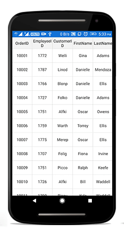

# Scrolling 

## Scrolling mode

The data grid provides three types of scrolling modes, which can be customized using the [SfDataGrid.ScrollingMode](https://help.syncfusion.com/cr/xamarin-android/Syncfusion.SfDataGrid.SfDataGrid.html#Syncfusion_SfDataGrid_SfDataGrid_SelectionMode) property. By default, the data grid scrolls its content based on the pixel values.

* PixelLine
* Line
* Pixel

### Pixel line

The `ScrollingMode.PixelLine` scrolls its contents like an Excel sheet. i.e., whenever a row or a column is clipped on top, the particular row or column will be auto scrolled to display fully in view.


dataGrid.ScrollingMode = ScrollingMode.PixelLine; 


### Line

The `ScrollingMode.Line` scrolls its contents based on lines. i.e., the view will be updated only when the offset values reaches the origin of a row or column in the bound collection.


dataGrid.ScrollingMode = ScrollingMode.Line; 


### Pixel

The `ScrollingMode.Pixel` scrolls its contents based on pixel values. i.e., the view will update each pixel change of the offsets, and rows or columns will appear clipped when offset exceeds the origin of the row or column.


dataGrid.ScrollingMode = ScrollingMode.Pixel; 


## Programmatic scrolling

The data grid scrolls to a particular row and column index programmatically.

### Scroll to the row and column Index

Scroll programmatically to a particular row and column using the [SfDataGrid.ScrollToRowColumnIndex](https://help.syncfusion.com/cr/xamarin-android/Syncfusion.SfDataGrid.SfDataGrid.html#Syncfusion_SfDataGrid_SfDataGrid_ScrollToRowColumnIndex_System_Int32_System_Int32_Syncfusion_SfDataGrid_ScrollToPosition_Syncfusion_SfDataGrid_ScrollToPosition_) method by passing row and column index.



dataGrid.ScrollToRowColumnIndex(int rowIndex, int columnIndex);

//For example 
dataGrid.ScrollToRowColumnIndex(20, 6);



### Scroll to the row Index

Scroll programmatically to a particular row using the [SfDataGrid.ScrollToRowIndex](https://help.syncfusion.com/cr/xamarin-android/Syncfusion.SfDataGrid.SfDataGrid.html#Syncfusion_SfDataGrid_SfDataGrid_ScrollToRowIndex_System_Int32_Syncfusion_SfDataGrid_ScrollToPosition_) method by passing the row index.



dataGrid.ScrollToRowIndex(int rowIndex);

//For example 
dataGrid.ScrollToRowIndex(20);



### Scroll to the column Index

Scroll programmatically to a particular column using the [SfDataGrid.ScrollToColumnIndex](https://help.syncfusion.com/cr/xamarin-android/Syncfusion.SfDataGrid.SfDataGrid.html#Syncfusion_SfDataGrid_SfDataGrid_ScrollToColumnIndex_System_Int32_Syncfusion_SfDataGrid_ScrollToPosition_) method by passing the column index.



dataGrid.ScrollToColumnIndex(int columnIndex);

//For example
dataGrid.ScrollToColumnIndex(7);



### Scroll a row/column to a specific position

The SfDataGrid allows to position the scrolled row/column in the datagrid by passing [ScrollToPosition](https://help.syncfusion.com/cr/xamarin-android/Syncfusion.SfDataGrid.ScrollToPosition.html) as parameter to the `ScrollToRowColumnIndex`, `ScrollToRowIndex`, `ScrollToColumnIndex` methods. The scrolled row/column can take either of the four positions as explained below. The default position is `Start`.

* MakeVisible: Scroll to make a specified row/column visible in datagrid. If the specified row/column is already in view, scrolling will not occur.
* Start: Scroll to make the row/column positioned at the start of the datagrid.
* Center: Scroll to make the row/column positioned at the center of the datagrid.
* End: Scroll to make the row/column positioned at the end of the datagrid. 

Refer the below code snippet to scroll a column/row to a specific position.



// To scroll a column to a particular position,
dataGrid.ScrollToColumnIndex(7,scrollToColumnPosition: ScrollToPosition.Center);

// To scroll a row to a particular position,
dataGrid.ScrollToRowIndex(7,scrollToColumnPosition: ScrollToPosition.Center);

// To scroll a cell to a particular position,
dataGrid.ScrollToRowColumnIndex(7, 7, scrollToColumnPosition: ScrollToPosition.Center, scrollToRowPosition: ScrollToPosition.Center);



N> Programmatic scrolling is not applicable for rows and columns that are frozen in view.

## Vertical over scroll mode

The [SfDataGrid.VerticalOverScrollMode](https://help.syncfusion.com/cr/xamarin-android/Syncfusion.SfDataGrid.SfDataGrid.html#Syncfusion_SfDataGrid_SfDataGrid_VerticalOverScrollMode) property allows customizing the bouncing behavior of the data grid.

The `SfDataGrid.VerticalOverScrollMode` is of type `VerticalScrollMode` which has the following two modes:

### Bounce 

Bounce allows the data grid to have bouncing effect. The default value of `SfDataGrid.VerticalOverScrollMode` is `Bounce`. 

The following code example illustrates how to customize the bouncing effect in the data grid:



dataGrid.VerticalOverScrollMode = VerticalOverScrollMode.Bounce;



### None

None disables the bouncing effect in the data grid.

The following code example illustrates how to customize the bouncing effect in the data grid: 


dataGrid.VerticalOverScrollMode = VerticalOverScrollMode.None;



## Identifying scroll state changes

The SfDataGrid will notify the scrolling state changes via the [ScrollStateChanged](https://help.syncfusion.com/cr/xamarin-android/Syncfusion.SfDataGrid.SfDataGrid.html) event.

Following states will be notified through the [ScrollState](https://help.syncfusion.com/cr/xamarin-android/Syncfusion.SfDataGrid.ScrollStateChangedEventArgs.html#Syncfusion_SfDataGrid_ScrollStateChangedEventArgs__ctor_Syncfusion_SfDataGrid_ScrollState_) property in the event argument.

* Dragging: Specifies that `SfDataGrid` is currently being dragged in the view.
* Fling: Specifies that fling action is performed on the `SfDataGrid`.
* Idle: Specifies that `SfDataGrid` is not scrolling currently.
* Programmatic: Specifies that scrolling is performed by using [ScrollToColumnIndex](https://help.syncfusion.com/cr/xamarin-android/Syncfusion.SfDataGrid.SfDataGrid.html#Syncfusion_SfDataGrid_SfDataGrid_ScrollToColumnIndex_System_Int32_Syncfusion_SfDataGrid_ScrollToPosition_) or [ScrollToRowIndex](https://help.syncfusion.com/cr/xamarin-android/Syncfusion.SfDataGrid.SfDataGrid.html#Syncfusion_SfDataGrid_SfDataGrid_ScrollToRowIndex_System_Int32_Syncfusion_SfDataGrid_ScrollToPosition_) method.




dataGrid.ScrollStateChanged += DataGrid_ScrollStateChanged;

   private void DataGrid_ScrollStateChanged(object sender, ScrollStateChangedEventArgs e)

        {                    
           // you can customize your code here.
           var scrollState = e.ScrollState;            
        }




