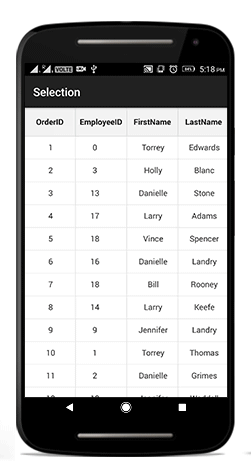

# Selection in Xamarin.Android.DataGrid (SfDataGrid)

This section explains how to enable selection in the data grid and the selection modes, properties, events involved in selection and customizations available for selection in the data grid.

The data grid selects a specific row or group of rows either programmatically or by touch interactions. To enable the selection in the data grid, set the [SfDataGrid.SelectionMode](https://help.syncfusion.com/cr/xamarin-android/Syncfusion.SfDataGrid.SfDataGrid.html#Syncfusion_SfDataGrid_SfDataGrid_SelectionMode) property to `None`. The data grid has different selection modes to perform selection operation as listed as follows:

## Selection modes 

<table>
<tr>
<th> Modes </th>
<th> Description </th>
</tr>
<tr>
<td> {{'[None](http://help.syncfusion.com/cr/xamarin-android/Syncfusion.SfDataGrid.SelectionMode.html)'| markdownify }} </td>
<td>Disables selection and no rows can be selected. This is the default value.</td>
</tr>
<tr>
<td> {{'[Single](http://help.syncfusion.com/cr/xamarin-android/Syncfusion.SfDataGrid.SelectionMode.html)'| markdownify }} </td>
<td> Selects a single row. Upon selecting the next row the selection in the previous row is cleared. </td>
</tr>
<tr>
<td> {{'[Multiple](http://help.syncfusion.com/cr/xamarin-android/Syncfusion.SfDataGrid.SelectionMode.html)'| markdownify }}  </td>
<td> Selects more than one row. The selection is not cleared when selecting more than one records. When you click on a selected row for the second time, the selection will be cleared. </td>
</tr>
<tr>
<td>  {{'[SingleDeselect](http://help.syncfusion.com/cr/xamarin-android/Syncfusion.SfDataGrid.SelectionMode.html)'| markdownify }}  </td>
<td> Selects only a single row. However, upon tapping the row again the selection is cleared. Similar to the single mode, upon selecting the next row the selection in the previous row is cleared. </td>
</tr>
</table>

The following code example illustrates how to set the selection mode in the data grid:



dataGrid.SelectionMode = SelectionMode.Multiple; 



## Getting selected rows

The SfDataGrid provides `SelectedIndex`,`SelectedItem` and `CurrentItem` properties to get details of the selected rows when the selection mode is `Single`, `Multiple` and `SingleDeselect`.

[SfDataGrid.SelectedItem](https://help.syncfusion.com/cr/xamarin-android/Syncfusion.SfDataGrid.SfDataGrid.html#Syncfusion_SfDataGrid_SfDataGrid_SelectedItem): Provides the underlying data object of the selected row. Denotes the first selected row in multiple selection.
[SfDataGrid.SelectedIndex](https://help.syncfusion.com/cr/xamarin-android/Syncfusion.SfDataGrid.SfDataGrid.html#Syncfusion_SfDataGrid_SfDataGrid_SelectedIndex): Provides the index of `SfDataGrid.SelectedItem`.
[SfDataGrid.CurrentItem](https://help.syncfusion.com/cr/xamarin-android/Syncfusion.SfDataGrid.SfDataGrid.html#Syncfusion_SfDataGrid_SfDataGrid_CurrentItem):  Provides the underlying data object of the currently selected row in the data grid. Denotes the first selected row in multiple selection.

### Row selection

When multiple rows are selected, the `SelectedItems` and `SelectionController.SelectedRows` properties provide information about all the selected rows.

[SfDataGrid.SelectedItems](https://help.syncfusion.com/cr/xamarin-android/Syncfusion.SfDataGrid.SfDataGrid.html#Syncfusion_SfDataGrid_SfDataGrid_SelectedItems):  Provides all the selected records of the selected items when multiple selection is enabled.
[SfDataGrid.SelectionController.SelectedRows](https://help.syncfusion.com/cr/xamarin-android/Syncfusion.SfDataGrid.SfDataGrid.html#Syncfusion_SfDataGrid_SfDataGrid_SelectionController): Provides collection of the underlying model object(row data) of all the selected items..

### CurrentItem vs SelectedItem

Both [SelectedItem](https://help.syncfusion.com/cr/xamarin-android/Syncfusion.SfDataGrid.SfDataGrid.html#Syncfusion_SfDataGrid_SfDataGrid_SelectedItem) and [CurrentItem](https://help.syncfusion.com/cr/xamarin-android/Syncfusion.SfDataGrid.SfDataGrid.html#Syncfusion_SfDataGrid_SfDataGrid_CurrentItem) returns the same data object when the selection mode is single. When multiple selection is enabled, the initially selected row will be maintained in the `SelectedItem` and the currently selected row will be maintained in the `CurrentItem`

## Programmatic selection

When the `SfDataGrid.SelectionMode` is other than `None`, select the row/rows in the data grid from the code by setting the [SfDataGrid.SelectedIndex](https://help.syncfusion.com/cr/xamarin-android/Syncfusion.SfDataGrid.SfDataGrid.html#Syncfusion_SfDataGrid_SfDataGrid_SelectedIndex), [SfDataGrid.SelectedItem](https://help.syncfusion.com/cr/xamarin-android/Syncfusion.SfDataGrid.SfDataGrid.html#Syncfusion_SfDataGrid_SfDataGrid_SelectedItem), or [SfDataGrid.SelectedItems](https://help.syncfusion.com/cr/xamarin-android/Syncfusion.SfDataGrid.SfDataGrid.html#Syncfusion_SfDataGrid_SfDataGrid_SelectedItems) property based on the selection mode. The following code example illustrates how to enable selection from code in the data grid:

When the selection mode is `single`, programmatically select a row in two ways, either by setting the row index to the `SfDataGrid.SelectedIndex` property or by setting the underlying object to be selected to the `SfDataGrid.SelectedItem` property. 

The following code example illustrates how to programmatically select a row from the code:



//Perform selection using selected index
dataGrid.SelectedIndex = 3;
 
//Perform selection using selected item
dataGrid.SelectedItem = viewModel.OrdersInfo [5];



When the selection mode is multiple, programmatically select more than one row by adding the underlying object to be selected to the `SfDataGrid.SelectedItems` property. 

The following code example illustrates how to programmatically select more than one rows from the code.


 
//Perform multiple selection using selected item
dataGrid.SelectedItems.Add (viewModel.OrdersInfo [5]);
dataGrid.SelectedItems.Add (viewModel.OrdersInfo [8]);
dataGrid.SelectedItems.Add (viewModel.OrdersInfo [10]);
dataGrid.SelectedItems.Add (viewModel.OrdersInfo [12]);



The following screenshot shows the selection functionality in SfDataGrid.

### Scroll to Selected Item

You can scroll programmatically to the selected item by passing the `SelectedIndex` to the [SfDataGrid.ScrollToRowIndex](https://help.syncfusion.com/cr/xamarin-android/Syncfusion.SfDataGrid.SfDataGrid.html#Syncfusion_SfDataGrid_SfDataGrid_ScrollToRowIndex_System_Int32_Syncfusion_SfDataGrid_ScrollToPosition_) method. Refer the below code snippet for the same.



dataGrid.ScrollToRowIndex((int)dataGrid.SelectedIndex);



## Clear selection

Data grid allows you to clear the selection applied in the grid rows either by setting the `SfDataGrid.SelectionMode` to `None` or by calling the [SfDataGrid.SelectionController.ClearSelection ()](https://help.syncfusion.com/cr/xamarin-android/Syncfusion.SfDataGrid.GridSelectionController.html#Syncfusion_SfDataGrid_GridSelectionController_ClearSelection) method.



//Clear selection using selection mode
dataGrid.SelectionMode = SelectionMode.None;

//Clear selection using selection controller
dataGrid.SelectionController.ClearSelection (); 



N> Selected items and the selections will be cleared whenever the ItemsSource changed at runtime.

## Row header selection

Data grid allows you to select the grid row(s) upon tapping them over the grid cells. It also allows you to select the grid rows when you tap the row header cells. To enable selection in the data grid, set the [SfDataGrid.SelectionMode](https://help.syncfusion.com/cr/xamarin-android/Syncfusion.SfDataGrid.SfDataGrid.html#Syncfusion_SfDataGrid_SfDataGrid_SelectionMode)  property to a value other than `None`.

### Select records in the data grid when tapping only on the row header cells

The data grid allows selecting a specific row or group of rows by touching the grid cells. However, to select the record only when tapping on the row header cells, use `SfDataGrid.SelectionChanging` event. 
 
The following code example illustrates how to select records in the data grid when tapping only on the row header cells:




dataGrid.SelectionMode = SelectionMode.Single;

private void DataGrid_SelectionChanging(object sender, GridSelectionChangingEventArgs e)
{
    e.Cancel = true;
}

private void DataGrid_GridTapped(object sender, GridTappedEventsArgs e)
{
    if(e.RowColumnIndex.ColumnIndex == 0)
    {
        dataGrid.SelectedIndex = e.RowColumnIndex.RowIndex;
    }
}
 



N> To enable the row header in the data grid, set the `SfDataGrid.ShowRowHeader` to `true`.

## Selection animation

The data grid supports selecting one or more rows programmatically or by touch interactions. In addition, the control also provides extensibility to animate the selected rows.  

It can be done by extending the [GridSelectionController](http://help.syncfusion.com/cr/xamarin-android/Syncfusion.SfDataGrid.GridSelectionController.html ).

Refer to the following example in which a CustomSelectionController is derived from `GridSelectionController` and an instance of it is assigned to the [SfDataGrid.SelectionController](https://help.syncfusion.com/cr/xamarin-android/Syncfusion.SfDataGrid.SfDataGrid.html#Syncfusion_SfDataGrid_SfDataGrid_SelectionController ) property to perform selection animation.



dataGrid.SelectionController = new CustomSelectionController(dataGrid);
dataGrid.SelectionMode = SelectionMode.Multiple;





public class CustomSelectionController : GridSelectionController
{
    public CustomSelectionController(SfDataGrid sfGrid)
    {
        this.DataGrid = sfGrid;
    }
    protected override void SetSelectionAnimation(VirtualizingCellsControl rowElement)
    {
        rowElement.Alpha = 0.5f;
        rowElement.Animate().Alpha(0.5f).SetDuration(1000).AlphaBy(1f).WithEndAction(new Runnable(() =>
        {
            rowElement.Alpha = 1f;
        }));
    }
}



## Events in selection

The data grid provides the following events for the selection:

* [SelectionChanging](https://help.syncfusion.com/cr/xamarin-android/Syncfusion.SfDataGrid.SfDataGrid.html): This event is raised while selecting a row at the execution time. Hence, it allows canceling the selection action by setting the Cancel property of [GridSelectionChangingEventArgs](http://help.syncfusion.com/cr/xamarin-android/Syncfusion.SfDataGrid.GridSelectionChangingEventArgs.html).
* [SelectionChanged](https://help.syncfusion.com/cr/xamarin-android/Syncfusion.SfDataGrid.SfDataGrid.html): This event is raised after the column is selected.

These two events are triggered with `GridSelectionChangingEventArgs` and [GridSelectionChangedEventArgs](http://help.syncfusion.com/cr/xamarin-android/Syncfusion.SfDataGrid.GridSelectionChangedEventArgs.html) that contains the following properties:

* AddedItems: Gets the collection of the underlying data objects added to selection.
* RemovedItems: Gets the collection of the underlying data objects removed from selection.

The following code example illustrates how to hook the `SfDataGrid.SelectionChanging` event and cancel the selection of a column:



dataGrid.SelectionChanging += DataGrid_SelectionChanging;  

void DataGrid_SelectionChanging (object sender, GridSelectionChangingEventArgs e)
{
    e.Cancel = true;
}



The following code explains how to get the selected item in code-behind by making use of the `SfDataGrid.SelectionChanged` event:


 
dataGrid.SelectionChanged += DataGrid_SelectionChanged; 

private void DataGrid_SelectionChanged (object sender, GridSelectionChangedEventArgs e) 
{ 
    // Gets the selected item.
    var selectedItems = e.AddedItems[0]; 
} 
 


### CurrentItem

The [SfDataGrid.CurrentItem](https://help.syncfusion.com/cr/xamarin-android/Syncfusion.SfDataGrid.SfDataGrid.html#Syncfusion_SfDataGrid_SfDataGrid_CurrentItem) property holds the underlying data of the last selected row in data grid. 

Get the current item in the `SfDataGrid.SelectionChanged` event by setting the `SfDataGrid.SelectionMode` as `Multiple` or `SingleDeselect`. If the `SelectionMode` is `Single`, the current item and selected item are same.

The following code example illustrates how to set the selection mode for the data grid in the SelectionChanged event.



dataGrid.SelectionMode = SelectionMode.Multiple; 
 
dataGrid.SelectionChanged += DataGrid_SelectionChanged; 
 
void DataGrid_SelectionChanged (object sender, GridSelectionChangedEventArgs e) 
{ 
 var currentItem = dataGrid.CurrentItem; 

 //your codes
} 



## Customizing Selection Appearance

### Adding multiple selection colors

The data grid supports selecting one or more rows either programmatically or by touch interactions. By default, the data grid applies a common background color for the selected rows based on the current theme. However, it also provides extensibility to have multiple selection colors when touching the rows by writing a custom [SelectionController](https://help.syncfusion.com/cr/xamarin-android/Syncfusion.SfDataGrid.SfDataGrid.html#Syncfusion_SfDataGrid_SfDataGrid_SelectionController) derived from [GridSelectionController](http://help.syncfusion.com/cr/xamarin-android/Syncfusion.SfDataGrid.GridSelectionController.html) and, assigning it to the `SfDataGrid.SelectionController` property. Override the GetSelectionColor() method to apply different colors for selection at runtime.

The following code example illustrates how to set different colors for the selected rows in the data grid:



sfGrid.SelectionController = new CustomSelectionController(sfGrid);
sfGrid.SelectionMode = SelectionMode.Multiple;





public class CustomSelectionController : GridSelectionController
{
    public Color[] SelectionColors { get; set; }

    public CustomSelectionController(SfDataGrid datagrid)
    {
        this.DataGrid = datagrid;
        SelectionColors = new Color[11] 
        { 
            Color.DarkSalmon,
            Color.DarkSlateGray,
            Color.Red, 
            Color.Blue,
            Color.DarkOliveGreen, 
            Color.Black, 
            Color.Gray, 
            Color.MediumPurple,
            Color.BurlyWood,
            Color.DarkCyan,
            Color.DarkGoldenrod 
        };   
    }
    //Code to set multiple selection colors
    public override Color GetSelectionColor(int rowIndex, object rowData)
    {
        if (SelectionColors != null)
            return SelectionColors[rowIndex % 11];
        else
            return Color.Blue;
    }
}



The following screenshot shows the outcome upon execution of the above code:

### Changing selection background and foreground color

The SfDataGrid allows you to change the selection background and foreground colors by returning the required color in the `GetSelectionBackgroundColor` and `GetSelectionForegroundColor` properties overrides in the custom style class overriding from [DataGridStyle](http://help.syncfusion.com/cr/xamarin-android/Syncfusion.SfDataGrid.DataGridStyle.html), and assign  it to the [SfDataGrid.GridStyle](https://help.syncfusion.com/cr/xamarin-android/Syncfusion.SfDataGrid.SfDataGrid.html#Syncfusion_SfDataGrid_SfDataGrid_GridStyle) property.



//Apply custom style to SfDataGrid from code
dataGrid.GridStyle = new SelectionStyle();





//Custom style class
public class SelectionStyle : DataGridStyle
{
    public SelectionStyle()
    {
    }

    public override Color GetSelectionBackgroundColor()
    {
        return Color.Blue;
    }

    public override Color GetSelectionForegroundColor()
    {
        return Color.White;
    }
}



## Changing current cell border color

The SfDataGrid allows you to change the current cell border color applied to the grid cells when entering the edit mode by returning the required color in the `GetCurrentCellBorderColor` override of your custom style class derived from [DataGridStyle](http://help.syncfusion.com/cr/xamarin-android/Syncfusion.SfDataGrid.DataGridStyle.html), and assign  it to the [SfDataGrid.GridStyle](https://help.syncfusion.com/cr/xamarin-android/Syncfusion.SfDataGrid.SfDataGrid.html#Syncfusion_SfDataGrid_SfDataGrid_GridStyle) property.



//Apply custom style to SfDataGrid from code
dataGrid.GridStyle = new SelectionStyle();





//Custom style class
public class SelectionStyle : DataGridStyle
{
    public SelectionStyle()
    {
    }

    public override Color GetCurrentCellBorderColor()
    {
        return Color.Pink;
    }
}



