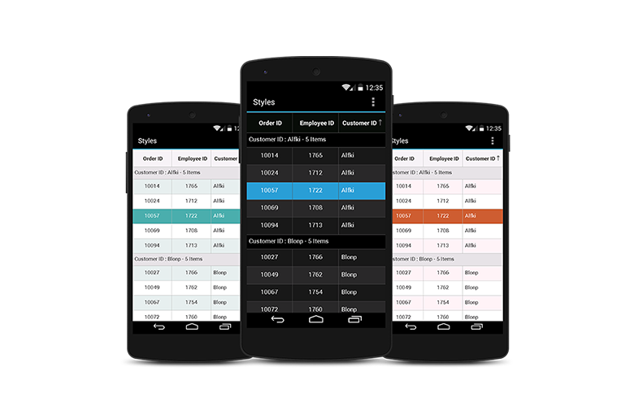
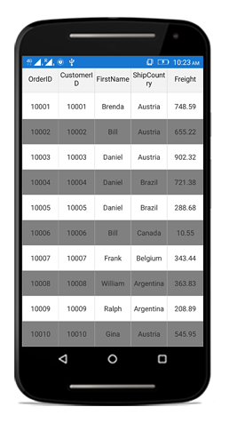
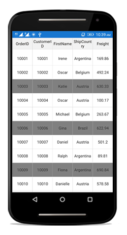
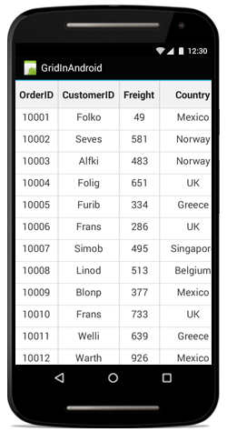
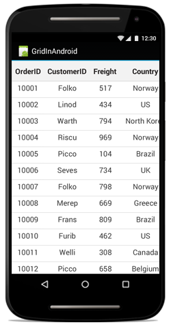
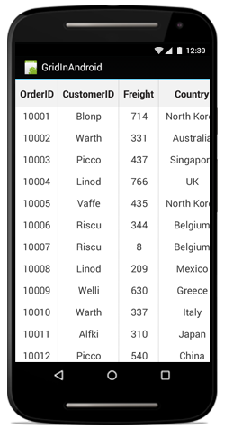
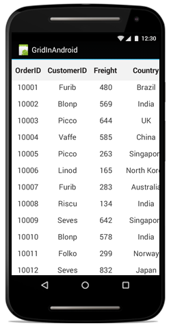
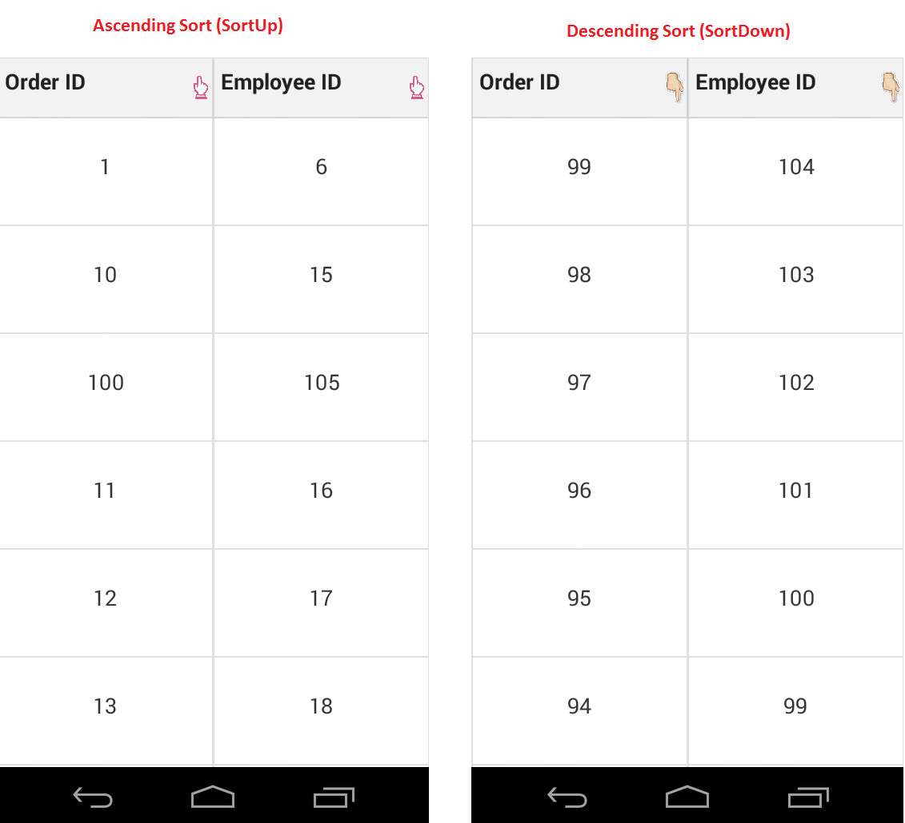

# Styles

The data grid applies styles to all of its elements by writing a Style class, overriding the [DataGridStyle](http://help.syncfusion.com/cr/xamarin-android/Syncfusion.SfDataGrid.DataGridStyle.html) and assigning it to the [SfDataGrid.GridStyle](https://help.syncfusion.com/cr/xamarin-android/Syncfusion.SfDataGrid.SfDataGrid.html#Syncfusion_SfDataGrid_SfDataGrid_GridStyle) property.

The following example explains how to apply custom style to the data grid:


//Apply custom style to SfDataGrid from code
dataGrid.GridStyle = new Dark ();



//Custom style class
public class Dark : DataGridStyle
{
    public Dark ()
    {
    }

    public override Color GetHeaderBackgroundColor()
    {
        return Color.FromRgb (15, 15, 15);
    }

    public override Color GetHeaderForegroundColor()
    {
        return Color.FromRgb (255, 255, 255);
    }

    public override Color GetRecordBackgroundColor ()
    {
        return Color.FromRgb (43, 43, 43);
    }

    public override Color GetRecordForegroundColor ()
    {
        return Color.FromRgb (255, 255, 255);
    }

    public override Color GetSelectionBackgroundColor ()
    {
        return Color.FromRgb (42, 159, 214);
    }

    public override Color GetSelectionForegroundColor ()
    {
        return Color.FromRgb (255, 255, 255);
    }

    public override Color GetCaptionSummaryRowBackgroundColor ()
    {
        return Color.FromRgb (02, 02, 02);
    }

    public override Color GetCaptionSummaryRowForeGroundColor ()
    {
        return Color.FromRgb (255, 255, 255);
    }

    public override Color GetBorderColor ()
    {
        return Color.FromRgb (81, 83, 82);
    }

    public override Color GetLoadMoreViewBackgroundColor ()
    {
        return Color.FromRgb(242, 242, 242);
    }

    public override Color GetLoadMoreViewForegroundColor ()
    {
        return Color.FromRgb(34, 31, 31);
    }
    
    public override Color GetAlternatingRowBackgroundColor()
    {
        return Color.Cyan;
    }
} 


The following picture shows the grid loaded in different styles:

## Applying alternate row style

The data grid applies the alternative row style by writing a custom grid style deriving from the [DataGridStyle](http://help.syncfusion.com/cr/xamarin-android/Syncfusion.SfDataGrid.DataGridStyle.html) and assigning it to the [SfDataGrid.GridStyle](https://help.syncfusion.com/cr/xamarin-android/Syncfusion.SfDataGrid.SfDataGrid.html#Syncfusion_SfDataGrid_SfDataGrid_GridStyle) property.


//Apply alternative row style
dataGrid.GridStyle = new CustomStyle ();

// Custom style class
public class CustomGridStyle : DataGridStyle
{
    public CustomGridStyle()
    {
    }

    public override Color GetAlternatingRowBackgroundColor()
    {
        return Color.Gray;
    }   
}


## Customizing the alternation count

The data grid customizes the alternate row count for applying the alternate row style using the [SfDataGrid.AlternationCount](https://help.syncfusion.com/cr/xamarin/Syncfusion.SfDataGrid.XForms.SfDataGrid.html#Syncfusion_SfDataGrid_XForms_SfDataGrid_AlternationCountProperty) property.

The following code illustrates how to set the alternate row count:



//Apply alternative row count
dataGrid.AlternationCount = 3;



## Border customization

The data grid allows customizing the grid borders to vertical, horizontal, both, or none. Override the [DataGridStyle.GetGridLinesVisibility](https://help.syncfusion.com/cr/xamarin-android/Syncfusion.SfDataGrid.DataGridStyle.html#Syncfusion_SfDataGrid_DataGridStyle_GetGridLinesVisibility) method to customize the borders.


//Apply custom style to the data grid from code
dataGrid.GridStyle = new CustomStyle ();

 

//Custom Style class
public class CustomStyle : DataGridStyle
{
    public CustomStyle ()
    {
    }
    public override GridLinesVisibility GetGridLinesVisibility()
    {
        return base.GetGridLinesVisibility();
    }
}

 
List of options available to customize the grid borders are as follows:

* Both
* Horizontal
* Vertical
* None

### Both

The [GridLinesVisibility.Both](http://help.syncfusion.com/cr/xamarin-android/Syncfusion.SfDataGrid.GridLinesVisibility.html) allows displaying the data grid with both horizontal and vertical borders.


public override GridLinesVisibility GetGridLinesVisibility()
{
    return GridLinesVisibility.Both;
}


The following screenshot shows the outcome upon execution of the above code:

### Horizontal

The [GridLinesVisibility.Horizontal](http://help.syncfusion.com/cr/xamarin-android/Syncfusion.SfDataGrid.GridLinesVisibility.html) allows displaying the data grid with horizontal border only.


public override GridLinesVisibility GetGridLinesVisibility()
{
    return GridLinesVisibility.Horizontal;
}


The following screenshot shows the outcome upon execution of the above code:

### Vertical

The [GridLinesVisibility.Vertical](http://help.syncfusion.com/cr/xamarin-android/Syncfusion.SfDataGrid.GridLinesVisibility.html) allows displaying the data grid with vertical border only.


public override GridLinesVisibility GetGridLinesVisibility()
{
    return GridLinesVisibility.Vertical;
}


The following screenshot shows the outcome upon execution of the above code:

### None

The [GridLinesVisibility.None](http://help.syncfusion.com/cr/xamarin-android/Syncfusion.SfDataGrid.GridLinesVisibility.html) allows displaying the data grid without borders.


public override GridLinesVisibility GetGridLinesVisibility()
{
    return GridLinesVisibility.None;
}


The following screenshot shows the outcome upon execution of the above code:

## Customizing sort icons in the header

Load any desired image as the sort icon in the [SfDataGrid](http://help.syncfusion.com/cr/xamarin-android/Syncfusion.SfDataGrid.SfDataGrid.html) using the GetHeaderSortIndicatorDown and GetHeaderSortIndicatorUp overrides of the [DataGridStyle](http://help.syncfusion.com/cr/xamarin-android/Syncfusion.SfDataGrid.DataGridStyle.html) class. The following code example illustrates how to change the SortIcon in the data grid:



//Apply custom style to the data grid from code
dataGrid.GridStyle = new Custom();

public class Custom : DataGridStyle
{

    public override int GetHeaderSortIndicatorUp()
    {
        return GettingStarted.Resource.Drawable.SortUp;
    }

    public override int GetHeaderSortIndicatorDown()
    {
        return GettingStarted.Resource.Drawable.SortDown;
    }

}


The following screenshots shows the outcome of the above code:

N> The image BuildAction must be set to AndroidResource to access the image via its generated ID value.

## Customizing resizing indicator

The color of the resizing indicator can be changed using the GetResizingIndicatorColor override of the `DataGridStyle` class. The following code example illustrates how to change the color of the ResizingIndicator in the data grid: 



//Apply custom style to SfDataGrid from code
dataGrid.GridStyle = new Custom();

public class Custom : DataGridStyle
{
    public override Color GetResizingIndicatorColor()
    {
        return Color.Blue;
    }
}


## Border width customization
SfDataGrid allows you to customize the border width of the grid cells and the header cells. 
The default border width of the grid cell and the header cell is 1f.

Refer the below code snippet to customize the width of the grid cells and header cells.



     //Apply custom style to SfDataGrid from code
      dataGrid.GridStyle = new CustomStyle();

    public class CustomStyle : DataGridStyle
    {
        public CustomStyle()
        {
            
        }

        // Customize border width for grid cells
        public override float GetBorderWidth()
        {
            return 5;
        }

        // Customize border width for header cells
        public override float GetHeaderBorderWidth()
        {
            return 5;
        }

    }

