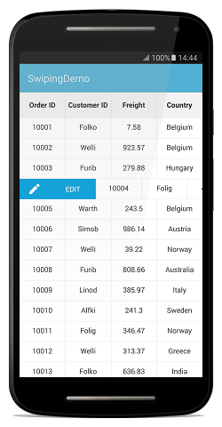
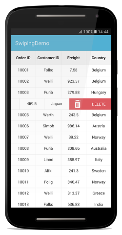
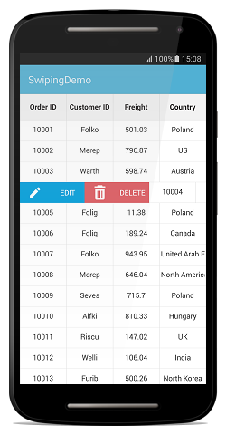
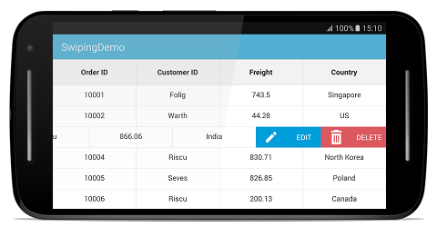

# Swiping

The data grid enables the swiping option by setting the [SfDataGrid.AllowSwiping](https://help.syncfusion.com/cr/xamarin-android/Syncfusion.SfDataGrid.SfDataGrid.html#Syncfusion_SfDataGrid_SfDataGrid_AllowSwiping) property to `true`.


this.sfGrid.AllowSwiping = true;


Swipe views are displayed when swiping from ‘left to right’ or ‘right to left’ on a data row. The data grid provides customizable swipe templates for swiping on the left and right side. The swipe gesture can be restricted up to a certain point on the row by setting the [SfDataGrid.MaxSwipeOffset](https://help.syncfusion.com/cr/xamarin-android/Syncfusion.SfDataGrid.SfDataGrid.html#Syncfusion_SfDataGrid_SfDataGrid_MaxSwipeOffset) property.

## Swipe views

The data grid loads the desired content using the [SfDataGrid.LeftSwipeView](https://help.syncfusion.com/cr/xamarin-android/Syncfusion.SfDataGrid.SfDataGrid.html#Syncfusion_SfDataGrid_SfDataGrid_LeftSwipeView) when swiping towards right and [SfDataGrid.RightSwipeView](https://help.syncfusion.com/cr/xamarin-android/Syncfusion.SfDataGrid.SfDataGrid.html#Syncfusion_SfDataGrid_SfDataGrid_RightSwipeView) when swiping towards the left. Contents inside the swipe view are arranged based on the offset values when swiping a data row. Refer to the following code example that shows how to load a view when swiping towards the right and towards the left:


SwipeView leftSwipeView = new SwipeView(BaseContext);
SwipeView rightSwipeView = new SwipeView(BaseContext);
LinearLayout editView = new LinearLayout(BaseContext);
LinearLayout deleteView = new LinearLayout(BaseContext);

ImageView editImage = new ImageView(BaseContext);
editImage.SetImageResource(Resource.Drawable.Edit);
editImage.SetBackgroundColor(Color.ParseColor("#009EDA"));

TextView edit = new TextView(BaseContext);
edit.Text = "EDIT";
edit.SetTextColor(Color.White);
edit.SetBackgroundColor(Color.ParseColor("#009EDA"));

ImageView deleteImage = new ImageView(BaseContext);
deleteImage.SetImageResource(Resource.Drawable.Delete);
deleteImage.SetBackgroundColor(Color.ParseColor("#DC595F"));

TextView delete = new TextView(BaseContext);
delete.Text = "DELETE";
delete.SetTextColor(Color.White);
delete.Gravity = GravityFlags.Center;
delete.SetBackgroundColor(Color.ParseColor("#DC595F"));

editView.AddView(editImage, ViewGroup.LayoutParams.WrapContent, (int)sfGrid.RowHeight);
editView.AddView(edit, ViewGroup.LayoutParams.MatchParent, (int)sfGrid.RowHeight);

deleteView.AddView(deleteImage, ViewGroup.LayoutParams.WrapContent, (int)sfGrid.RowHeight);
deleteView.AddView(delete, ViewGroup.LayoutParams.MatchParent, (int)sfGrid.RowHeight);

leftSwipeView.AddView(editView, sfGrid.MaxSwipeOffset, (int)sfGrid.RowHeight);
rightSwipeView.AddView(deleteView, sfGrid.MaxSwipeOffset, (int)sfGrid.RowHeight);

sfGrid.LeftSwipeView = leftSwipeView;
sfGrid.RightSwipeView = rightSwipeView;


The following screenshot shows the outcome upon execution of the above code where swiping towards right loads an image and a label in the `LeftSwipeView`:

The following screenshot shows the outcome upon execution of the above code where swiping towards left loads an image and a label in the `RightSwipeView`:

## Swipe events

[SwipeStarted](https://help.syncfusion.com/cr/xamarin-android/Syncfusion.SfDataGrid.SfDataGrid.html): This event is fired when the swipe offset changes from its initial value. You can cancel the swipe action by setting the `Cancel` property of the [SwipeStartedEventArgs](https://help.syncfusion.com/cr/xamarin-android/Syncfusion.SfDataGrid.SwipeStartedEventArgs.html) to `true`.
[SwipeEnded](https://help.syncfusion.com/cr/xamarin-android/Syncfusion.SfDataGrid.SfDataGrid.html): This event is fired when the swipe offset value reaches the `SfDataGrid.MaxSwipeOffset` indicating that the swipe action is completed. This event is triggered with [SwipeEndedEventArgs](https://help.syncfusion.com/cr/xamarin-android/Syncfusion.SfDataGrid.SwipeEndedEventArgs.html).
[Swiping](https://help.syncfusion.com/cr/xamarin-android/Syncfusion.SfDataGrid.SfDataGrid.html): This event is raised while swiping is in progress. This event is triggered with [SwipingEventArgs](https://help.syncfusion.com/cr/xamarin-android/Syncfusion.SfDataGrid.SwipingEventArgs.html) .

All the swipe events provides the following properties in their arguments:

• [RowIndex](https://help.syncfusion.com/cr/xamarin-android/Syncfusion.SfDataGrid.SwipingEventArgs.html#Syncfusion_SfDataGrid_SwipingEventArgs_RowIndex): Defines the swiping row index.
• [RowData](https://help.syncfusion.com/cr/xamarin-android/Syncfusion.SfDataGrid.SwipingEventArgs.html#Syncfusion_SfDataGrid_SwipingEventArgs_RowData): Defines the underlying data associated with the swiped row as its arguments.
• [SwipeDirection](https://help.syncfusion.com/cr/xamarin-android/Syncfusion.SfDataGrid.SwipingEventArgs.html#Syncfusion_SfDataGrid_SwipingEventArgs_SwipeDirection): Defines the swipe direction of the swiped row.
• [SwipeOffset](https://help.syncfusion.com/cr/xamarin-android/Syncfusion.SfDataGrid.SwipingEventArgs.html#Syncfusion_SfDataGrid_SwipingEventArgs_SwipeOffset): Defines the current swipe offset of swiping the row.

By handling the swipe events, you can make use of these property values from the arguments to perform any desired action such as deleting the row, editing the data, etc.

## Loading multiple views as swipe template

The application can be customized by loading any view in the `SfDataGrid.LeftSwipeView` or `SfDataGrid.RightSwipeView` and assigning custom actions such as deleting a row, adding a row, editing the underlying data associated, etc. You can also display multiple views in the `SfDataGrid.LeftSwipeView` or `SfDataGrid.RightSwipeView` as in the following example where two views are loaded for editing the cell values in the row and deleting the row respectively. Refer to the following code example that shows how to load multiple views in `SfDataGrid.LeftSwipeView` when swiping towards right:


public class Swiping : SamplePage
{
    SfDataGrid sfGrid;
    FrameLayout parentLayout;
    ViewModel viewModel;
    int swipedRowIndex;
    TextView optionHeading;
    TextView col1;
    TextView col2;
    TextView col3;
    TextView col4;
    EditText orderIDText;
    EditText customerIDText;
    EditText freightText;
    EditText countryText;
    Button save;
    Button cancel;
    LinearLayout editor;
    LinearLayout body;
    LinearLayout bodyRow1;
    LinearLayout bodyRow2;
    LinearLayout bodyRow3;
    LinearLayout bodyRow4;
    LinearLayout optionView;
    LinearLayout bottom;
    SwipeView leftSwipeView;
    SwipeView rightSwipeView;
    LinearLayout editView;
    LinearLayout deleteView;
    
    private int swipedRowIndex;
    
    public Swiping()
    {
        parentLayout = new FrameLayout(BaseContext);
        optionHeading = new TextView(BaseContext);
        optionHeading.Gravity = GravityFlags.CenterHorizontal;
        body = new LinearLayout(BaseContext);
        optionView = new LinearLayout(BaseContext);
        optionView.SetBackgroundColor(Color.Gray);
        editor = new LinearLayout(BaseContext);
        bottom = new LinearLayout(BaseContext);
        bodyRow1 = new LinearLayout(BaseContext);
        bodyRow1.Orientation = Orientation.Horizontal;
        bodyRow1.SetGravity(GravityFlags.CenterHorizontal);
        bodyRow2 = new LinearLayout(BaseContext);
        bodyRow2.Orientation = Orientation.Horizontal;
        bodyRow2.SetGravity(GravityFlags.CenterHorizontal);
        bodyRow3 = new LinearLayout(BaseContext);
        bodyRow3.Orientation = Orientation.Horizontal;
        bodyRow3.SetGravity(GravityFlags.CenterHorizontal);
        bodyRow4 = new LinearLayout(BaseContext);
        bodyRow4.Orientation = Orientation.Horizontal;
        bodyRow4.SetGravity(GravityFlags.CenterHorizontal);
        
        col1 = new TextView(BaseContext);
        col1.Text = "Order ID";
        col1.SetTextColor(Color.Black);
        col2 = new TextView(BaseContext);
        col2.Text = "Customer ID";
        col2.SetTextColor(Color.Black);
        col3 = new TextView(BaseContext);
        col3.Text = "Employee ID";
        col3.SetTextColor(Color.Black);
        col4 = new TextView(BaseContext);
        col4.Text = "Name";
        col4.SetTextColor(Color.Black);
        
        orderIDText = new EditText(BaseContext);
        orderIDText.Gravity = GravityFlags.Start;
        orderIDText.SetTextColor(Color.Black);
        
        customerIDText = new EditText(BaseContext);
        customerIDText.SetTextColor(Color.Black);
        
        freightText = new EditText(BaseContext);
        freightText.SetTextColor(Color.Black);
        
        countryText = new EditText(BaseContext);
        countryText.SetTextColor(Color.Black);
        
        save = new Button(BaseContext);
        save.Click += save_Click;
        cancel = new Button(BaseContext);
        cancel.Click += cancel_Click;
        editView = new LinearLayout(BaseContext);
        editView.Orientation = Orientation.Horizontal;
        editView.Click += editView_Click;
        deleteView = new LinearLayout(BaseContext);
        deleteView.Orientation = Orientation.Horizontal;
        deleteView.Click += swipeViewImage_Click;
        
        ImageView editImage = new ImageView(BaseContext);
        editImage.SetImageResource(Resource.Drawable.Edit);
        editImage.SetBackgroundColor(Color.ParseColor("#009EDA"));
        
        TextView edit = new TextView(BaseContext);
        edit.Text = "EDIT";
        edit.SetTextColor(Color.White);
        edit.Gravity = GravityFlags.Center;
        edit.SetBackgroundColor(Color.ParseColor("#009EDA"));
        
        ImageView deleteImage = new ImageView(BaseContext);
        deleteImage.SetImageResource(Resource.Drawable.Delete);
        deleteImage.SetBackgroundColor(Color.ParseColor("#DC595F"));
        
        TextView delete = new TextView(BaseContext);
        delete.Text = "DELETE";
        delete.SetTextColor(Color.White);
        delete.Gravity = GravityFlags.Center;
        delete.SetBackgroundColor(Color.ParseColor("#DC595F"));
        
        viewModel = new ViewModel();
        viewModel.SetRowsToGenerate(100);
        sfGrid = new SfDataGrid(BaseContext);
        sfGrid.AutoGenerateColumns = false;
        sfGrid.ItemsSource = (viewModel.OrdersInfo);
        sfGrid.AllowSwiping = true;
        sfGrid.ColumnSizer = ColumnSizer.Star;
        
        DisplayMetrics metrics = BaseContext.Resources.DisplayMetrics;
        int width = metrics.WidthPixels;
        
        sfGrid.MaxSwipeOffset = width/2;
        leftSwipeView = new SwipeView(BaseContext);
        rightSwipeView = new SwipeView(BaseContext);
        
        editView.AddView(editImage, sfGrid.MaxSwipeOffset / 4, (int)sfGrid.RowHeight);
        editView.AddView(edit, ViewGroup.LayoutParams.MatchParent, (int)sfGrid.RowHeight);
        
        deleteView.AddView(deleteImage, sfGrid.MaxSwipeOffset / 4, (int)sfGrid.RowHeight);
        deleteView.AddView(delete, ViewGroup.LayoutParams.MatchParent, (int)sfGrid.RowHeight);
        
        // Multiple views inside LeftSwipeView and RightSwipeView
        LinearLayout layout = new LinearLayout(BaseContext);
        layout.Orientation = Orientation.Horizontal;
        layout.AddView(editView, sfGrid.MaxSwipeOffset / 2, (int)sfGrid.RowHeight);
        layout.AddView(deleteView, sfGrid.MaxSwipeOffset / 2, (int)sfGrid.RowHeight);
        
        leftSwipeView.AddView(layout, sfGrid.MaxSwipeOffset, (int)sfGrid.RowHeight);
        rightSwipeView.AddView(new Button(BaseContext), sfGrid.MaxSwipeOffset, (int)sfGrid.RowHeight);
        sfGrid.LeftSwipeView = leftSwipeView;
        sfGrid.RightSwipeView = rightSwipeView;
        sfGrid.SwipeEnded += sfGrid_SwipeEnded;
        sfGrid.SwipeStarted += sfGrid_SwipeStarted;
        
        GridTextColumn column1 = new GridTextColumn();
        column1.MappingName = "OrderID";
        column1.HeaderText = "Order ID";
        GridTextColumn column2 = new GridTextColumn();
        column2.MappingName = "CustomerID";
        column2.HeaderText = "Customer ID";
        GridTextColumn column3 = new GridTextColumn();
        column3.MappingName = "Freight";
        column3.HeaderText = "Freight";
        GridTextColumn column4 = new GridTextColumn();
        column4.MappingName = "Country";
        column4.HeaderText = "Country";
        
        sfGrid.Columns.Add(column1);
        sfGrid.Columns.Add(column2);
        sfGrid.Columns.Add(column3);
        sfGrid.Columns.Add(column4);
        
        parentLayout.AddView(sfGrid);
        editor.SetBackgroundColor(Color.White);
        editor.Orientation = Orientation.Vertical;
        optionHeading.Text = "EDIT DETAILS";
        optionHeading.SetTypeface(null, TypefaceStyle.Bold);
        optionHeading.Gravity = GravityFlags.Center;
        
        bodyRow1.AddView(col1, (int)(100 * sfGrid.Resources.DisplayMetrics.Density), (int)(50 * sfGrid.Resources.DisplayMetrics.Density));
        bodyRow1.AddView(orderIDText, (int)(100 * sfGrid.Resources.DisplayMetrics.Density), ViewGroup.LayoutParams.WrapContent);
        bodyRow2.AddView(col2, (int)(100 * sfGrid.Resources.DisplayMetrics.Density), (int)(50 * sfGrid.Resources.DisplayMetrics.Density));
        bodyRow2.AddView(customerIDText, (int)(100 * sfGrid.Resources.DisplayMetrics.Density), ViewGroup.LayoutParams.WrapContent);
        bodyRow3.AddView(col3, (int)(100 * sfGrid.Resources.DisplayMetrics.Density), (int)(50 * sfGrid.Resources.DisplayMetrics.Density));
        bodyRow3.AddView(freightText, (int)(100 * sfGrid.Resources.DisplayMetrics.Density), ViewGroup.LayoutParams.WrapContent);
        bodyRow4.AddView(col4, (int)(100 * sfGrid.Resources.DisplayMetrics.Density), (int)(50 * sfGrid.Resources.DisplayMetrics.Density));
        bodyRow4.AddView(countryText, (int)(100 * sfGrid.Resources.DisplayMetrics.Density), ViewGroup.LayoutParams.WrapContent);
        body.Orientation = Orientation.Vertical;
        body.SetGravity(GravityFlags.CenterHorizontal);
        body.AddView(bodyRow1);
        body.AddView(bodyRow2);
        body.AddView(bodyRow3);
        body.AddView(bodyRow4);
        save.Text = "Save";
        cancel.Text = "Cancel";
        bottom.Orientation = Orientation.Horizontal;
        bottom.AddView(save);
        bottom.AddView(cancel);
        bottom.SetGravity(GravityFlags.Center);
        editor.AddView(optionHeading);
        editor.AddView(body);
        editor.AddView(bottom);
        
        optionView.AddView(editor, ViewGroup.LayoutParams.MatchParent, ViewGroup.LayoutParams.MatchParent);
        if (parentLayout.ChildCount == 1)
               parentLayout.AddView(optionView, 1);
        parentLayout.GetChildAt(0).Visibility = ViewStates.Visible;
        parentLayout.GetChildAt(1).Visibility = ViewStates.Invisible;
        
        SetContentView(parentLayout);
    }
    
    void cancel_Click(object sender, EventArgs e)
    {
        parentLayout.GetChildAt(1).Visibility = ViewStates.Invisible;
        parentLayout.GetChildAt(0).Visibility = ViewStates.Visible;
    }
    
    void save_Click(object sender, EventArgs e)
    {
        parentLayout.GetChildAt(1).Visibility = ViewStates.Invisible;
        parentLayout.GetChildAt(0).Visibility = ViewStates.Visible;
        commitValues();
    }
    
    void editView_Click(object sender, System.EventArgs e)
    {
         parentLayout.GetChildAt(1).Visibility = ViewStates.Visible;
         parentLayout.GetChildAt(0).Visibility = ViewStates.Invisible;
         initializeTextFields();
    }
    
    private void commitValues()
    {
        if (swipedRowIndex > 0)
        {
            var swipedRowData = this.viewModel.OrdersInfo[this.swipedRowindex - 1];
            swipedRowData.OrderID = Convert.ToInt32(this.orderIDText.Text);
            swipedRowData.CustomerID = this.customerIDText.Text;
            swipedRowData.Freight = this.freightText.Text;
            swipedRowData.Country = this.countryText.Text;
        }
    }
    
    private void initializeTextFields()
    {
        if (swipedRowIndex > 0)
        {
            var swipedRowData = this.viewModel.OrdersInfo[this.swipedRowindex - 1];
            orderIDText.Text = swipedRowData.OrderID.ToString();
            this.customerIDText.Text = swipedRowData.CustomerID;
            this.freightText.Text = swipedRowData.Freight;
            this.countryText.Text = swipedRowData.Country;
        }
    }
    
    void sfGrid_SwipeStarted(object sender, SwipeStartedEventArgs e)
    {
        swipedRowIndex = e.RowIndex;
        orderIDText.Text = (e.RowData as OrderInfo).OrderID.ToString();
        customerIDText.Text = (e.RowData as OrderInfo).CustomerID;
        freightText.Text = (e.RowData as OrderInfo).Freight;
        countryText.Text = (e.RowData as OrderInfo).Country;
    }
    
    private void sfGrid_SwipeEnded(object sender, SwipeEndedEventArgs e)
    {
        swipedRowIndex = e.RowIndex;
    }
    
    void swipeViewImage_Click(object sender, EventArgs e)
    {
        viewModel.OrdersInfo.RemoveAt(swipedRowIndex - 1);
    }
}


The following screenshot shows the outcome upon execution of the above code where swiping towards right loads two views in the `SfDataGrid.LeftSwipeView` to edit and delete a row respectively:

N> Similarly, you can load two views in the `SfDataGrid.RightSwipeView` when swiping towards left. The following screenshot shows the `SfDataGrid.RightSwipeView` with two views to edit and delete a row respectively:

## Customized swipe delete functionality

You can perform operations such as deleting a row when swiping a data row from one extent to other in the view. Refer to the following code example which illustrates how to delete a data row when swiping it from one extreme to other in the view:


SwipeView leftSwipeView = new SwipeView(BaseContext);
SwipeView rightSwipeView = new SwipeView(BaseContext);

TextView deleteLeft = new TextView(BaseContext);
delete.Text = "DELETED";
delete.SetTextColor(Color.White);
delete.Gravity = GravityFlags.Center;
delete.SetBackgroundColor(Color.ParseColor("#DC595F"));

TextView deleteRight = new TextView(BaseContext);
delete.Text = "DELETED";
delete.SetTextColor(Color.White);
delete.Gravity = GravityFlags.Center;
delete.SetBackgroundColor(Color.ParseColor("#DC595F"));

leftSwipeView.AddView(deleteLeft, ViewGroup.LayoutParams.MatchParent, (int)sfGrid.RowHeight);
rightSwipeView.AddView(deleteRight, ViewGroup.LayoutParams.MatchParent, (int)sfGrid.RowHeight);

//Code to delete() when swipe is ended
private void sfGrid_SwipeEnded(object sender, SwipeEndedEventArgs e)
{
    swipedRowIndex = e.RowIndex;
    if (Math.Abs(e.SwipeOffset) >= sfGrid.Width)
    {
        doDeleting();
    }
}

//Code to delete row
private async void doDeleting()
{
    await Task.Delay(2000);
    var removedData = viewModel.OrdersInfo[swipedRowindex - 1];
    var isSelected = sfGrid.SelectedItems.Contains(removedData);
    viewModel.OrdersInfo.Remove(removedData);
    if (isSelected)
        sfGrid.SelectedItems.Add(removedData);
}


The following screenshot shows the outcome upon execution of the above code:

