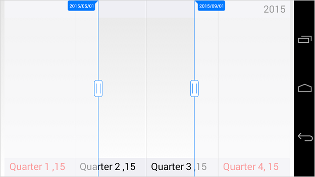

# Major and Minor Scales

SfDateTimeRangeNavigator displays major and minor scales at the top and bottom position of the control. You can also control its visibility using [`MajorScaleStyle.Visible`](https://help.syncfusion.com/cr/xamarin-android/Com.Syncfusion.Rangenavigator.ScaleStyle.html#Com_Syncfusion_Rangenavigator_ScaleStyle_Visible) and [`MinorScaleStyle.Visible`](https://help.syncfusion.com/cr/xamarin-android/Com.Syncfusion.Rangenavigator.ScaleStyle.html#Com_Syncfusion_Rangenavigator_ScaleStyle_Visible) properties.

## Intervals

By default, best possible interval component will be chosen for both major and minor scales based on the available size of the view. For example, if the available space is sufficient to show only year labels without overlapping, interval will be displayed in years. However, you can also set specific [`DateTimeIntervalType`](https://help.syncfusion.com/cr/xamarin-android/Com.Syncfusion.Rangenavigator.DateTimeIntervalType.html) components using [`Intervals`](https://help.syncfusion.com/cr/xamarin-android/Com.Syncfusion.Rangenavigator.SfDateTimeRangeNavigator.html#Com_Syncfusion_Rangenavigator_SfDateTimeRangeNavigator_Intervals) property as demonstrated in the below code snippet.


[C#]
SfDateTimeRangeNavigator dateTime = new SfDateTimeRangeNavigator(this);
dateTime.Intervals = EnumSet.Of(DateTimeIntervalType.Year, DateTimeIntervalType.Month);


## Appearance Customization

The [`MajorScaleStyle`](https://help.syncfusion.com/cr/xamarin-android/Com.Syncfusion.Rangenavigator.SfDateTimeRangeNavigator.html#Com_Syncfusion_Rangenavigator_SfDateTimeRangeNavigator_MajorScaleStyle) and [`MinorScaleStyle`](https://help.syncfusion.com/cr/xamarin-android/Com.Syncfusion.Rangenavigator.SfDateTimeRangeNavigator.html#Com_Syncfusion_Rangenavigator_SfDateTimeRangeNavigator_MinorScaleStyle) properties of `SfDateTimeRangeNavigator` are used to customize the appearance of ticks and labels.

* [`Position`](https://help.syncfusion.com/cr/xamarin-android/Com.Syncfusion.Rangenavigator.ScaleStyle.html#Com_Syncfusion_Rangenavigator_ScaleStyle_Position) - used to position the labels and ticks [`Inside`](https://help.syncfusion.com/cr/xamarin-android/Com.Syncfusion.Rangenavigator.ScalePosition.html) or [`Outside`](https://help.syncfusion.com/cr/xamarin-android/Com.Syncfusion.Rangenavigator.ScalePosition.html) of the range navigator.
* [`LabelAlignment`](https://help.syncfusion.com/cr/xamarin-android/Com.Syncfusion.Rangenavigator.ScaleStyle.html#Com_Syncfusion_Rangenavigator_ScaleStyle_LabelAlignment) - used to set the alignment of the labels([`Center`](https://help.syncfusion.com/cr/xamarin-android/Com.Syncfusion.Rangenavigator.LabelAlignment.html), Left, Right).  
* [`LabelTextColor`](https://help.syncfusion.com/cr/xamarin-android/Com.Syncfusion.Rangenavigator.ScaleStyle.html#Com_Syncfusion_Rangenavigator_ScaleStyle_LabelTextColor) - used to change the text color of the labels.
* [`LabelBackgroundColor`](https://help.syncfusion.com/cr/xamarin-android/Com.Syncfusion.Rangenavigator.ScaleStyle.html#Com_Syncfusion_Rangenavigator_ScaleStyle_LabelBackgroundColor) - used to change the background color of the labels.
* [`LabelStrokeColor`](https://help.syncfusion.com/cr/xamarin-android/Com.Syncfusion.Rangenavigator.ScaleStyle.html#Com_Syncfusion_Rangenavigator_ScaleStyle_LabelStrokeColor) - used to change the stroke color of the labels.
* [`LabelStrokeWidth`](https://help.syncfusion.com/cr/xamarin-android/Com.Syncfusion.Rangenavigator.ScaleStyle.html#Com_Syncfusion_Rangenavigator_ScaleStyle_LabelStrokeWidth) - used to change the stroke width of the labels.
* [`LabelTextSize`](https://help.syncfusion.com/cr/xamarin-android/Com.Syncfusion.Rangenavigator.ScaleStyle.html#Com_Syncfusion_Rangenavigator_ScaleStyle_LabelTextSize) -used to change the font size of the labels.
* [`LabelTypeface`](https://help.syncfusion.com/cr/xamarin-android/Com.Syncfusion.Rangenavigator.ScaleStyle.html#Com_Syncfusion_Rangenavigator_ScaleStyle_LabelTypeface) - used to change the font family and font weight
* [`LabelMarginLeft`](https://help.syncfusion.com/cr/xamarin-android/Com.Syncfusion.Rangenavigator.ScaleStyle.html#Com_Syncfusion_Rangenavigator_ScaleStyle_LabelMarginLeft) - used to change the left margin of the label.
* [`LabelMarginTop`](https://help.syncfusion.com/cr/xamarin-android/Com.Syncfusion.Rangenavigator.ScaleStyle.html#Com_Syncfusion_Rangenavigator_ScaleStyle_LabelMarginTop) - used to change the top margin of the label.
* [`LabelMarginRight`](https://help.syncfusion.com/cr/xamarin-android/Com.Syncfusion.Rangenavigator.ScaleStyle.html#Com_Syncfusion_Rangenavigator_ScaleStyle_LabelMarginRight) - used to change the right margin of the label.
* [`LabelMarginBottom`](https://help.syncfusion.com/cr/xamarin-android/Com.Syncfusion.Rangenavigator.ScaleStyle.html#Com_Syncfusion_Rangenavigator_ScaleStyle_LabelMarginBottom) - used to change the bottom margin of the label.
* [`SelectedLabelTextColor`](https://help.syncfusion.com/cr/xamarin-android/Com.Syncfusion.Rangenavigator.ScaleStyle.html#Com_Syncfusion_Rangenavigator_ScaleStyle_SelectedLabelTextColor) – used to change the text color of the selected label.
* [`SelectedLabelBackgroundColor`](https://help.syncfusion.com/cr/xamarin-android/Com.Syncfusion.Rangenavigator.ScaleStyle.html#Com_Syncfusion_Rangenavigator_ScaleStyle_SelectedLabelBackgroundColor) - used to change the background color of the selected label.
* [`SelectedLabelStrokeColor`](https://help.syncfusion.com/cr/xamarin-android/Com.Syncfusion.Rangenavigator.ScaleStyle.html#Com_Syncfusion_Rangenavigator_ScaleStyle_SelectedLabelStrokeColor) - used to change the stroke color of the selected label.
* [`SelectedLabelStrokeWidth`](https://help.syncfusion.com/cr/xamarin-android/Com.Syncfusion.Rangenavigator.ScaleStyle.html#Com_Syncfusion_Rangenavigator_ScaleStyle_SelectedLabelStrokeWidth) - used to change the stroke width of the selected label.
* [`SelectedLabelTextSize`](https://help.syncfusion.com/cr/xamarin-android/Com.Syncfusion.Rangenavigator.ScaleStyle.html#Com_Syncfusion_Rangenavigator_ScaleStyle_SelectedLabelTextSize) -used to change the font size of the labels.
* [`SelectedLabelTypeface`](https://help.syncfusion.com/cr/xamarin-android/Com.Syncfusion.Rangenavigator.ScaleStyle.html#Com_Syncfusion_Rangenavigator_ScaleStyle_SelectedLabelTypeface) - used to change the selected label’s font family and font weight
* [`SelectedLabelMarginLeft`](https://help.syncfusion.com/cr/xamarin-android/Com.Syncfusion.Rangenavigator.ScaleStyle.html#Com_Syncfusion_Rangenavigator_ScaleStyle_SelectedLabelMarginLeft) - used to change the left margin of the selected label.
* [`SelectedLabelMarginTop`](https://help.syncfusion.com/cr/xamarin-android/Com.Syncfusion.Rangenavigator.ScaleStyle.html#Com_Syncfusion_Rangenavigator_ScaleStyle_SelectedLabelMarginTop) - used to change the top margin of the selected label.
* [`SelectedLabelMarginRight`](https://help.syncfusion.com/cr/xamarin-android/Com.Syncfusion.Rangenavigator.ScaleStyle.html#Com_Syncfusion_Rangenavigator_ScaleStyle_SelectedLabelMarginRight) - used to change the right margin of the selected label.
* [`SelectedLabelMarginBottom`](https://help.syncfusion.com/cr/xamarin-android/Com.Syncfusion.Rangenavigator.ScaleStyle.html#Com_Syncfusion_Rangenavigator_ScaleStyle_SelectedLabelMarginBottom) - used to change the bottom margin of the selected label.
* [`TickLineWidth`](https://help.syncfusion.com/cr/xamarin-android/Com.Syncfusion.Rangenavigator.ScaleStyle.html#Com_Syncfusion_Rangenavigator_ScaleStyle_TickLineWidth) - used to change the thickness of the tick line.
* [`TickLineColor`](https://help.syncfusion.com/cr/xamarin-android/Com.Syncfusion.Rangenavigator.ScaleStyle.html#Com_Syncfusion_Rangenavigator_ScaleStyle_TickLineColor) - used to change the color of the tick line.


[C#]
SfDateTimeRangeNavigator dateTime = new SfDateTimeRangeNavigator();
dateTime.MajorScaleStyle.Position = ScalePosition.Inside;
dateTime.MajorScaleStyle.LabelTextColor = Color.Black;
dateTime.MajorScaleStyle.LabelMarginLeft = 15;
dateTime.MajorScaleStyle.LabelMarginTop = 15;
dateTime.MajorScaleStyle.LabelMarginRight = 15;
dateTime.MajorScaleStyle.LabelMarginBottom = 15;
dateTime.MajorScaleStyle.LabelTextSize = 20;
dateTime.MajorScaleStyle.LabelAlignment = LabelAlignment.Right;
dateTime.MajorScaleStyle.SelectedLabelTextColor = Color.Red;
dateTime.MajorScaleStyle.SelectedLabelMarginLeft = 15;
dateTime.MajorScaleStyle.SelectedLabelMarginTop = 15;
dateTime.MajorScaleStyle.SelectedLabelMarginRight = 15;
dateTime.MajorScaleStyle.SelectedLabelMarginBottom = 15;
dateTime.MajorScaleStyle.SelectedLabelTextSize = 20;
dateTime.MinorScaleStyle.Position = ScalePosition.Inside;
dateTime.MinorScaleStyle.LabelTextColor = Color.Black;
dateTime.MinorScaleStyle.LabelMarginLeft = 15;
dateTime.MinorScaleStyle.LabelMarginTop = 15;
dateTime.MinorScaleStyle.LabelMarginRight = 15;
dateTime.MinorScaleStyle.LabelMarginBottom = 15;
dateTime.MinorScaleStyle.LabelTextSize = 20;
dateTime.MinorScaleStyle.LabelAlignment = LabelAlignment.Left;
dateTime.MinorScaleStyle.SelectedLabelTextColor = Color.Blue;
dateTime.MinorScaleStyle.SelectedLabelMarginLeft = 15;
dateTime.MinorScaleStyle.SelectedLabelMarginTop = 15;
dateTime.MinorScaleStyle.SelectedLabelMarginRight = 15;
dateTime.MinorScaleStyle.SelectedLabelMarginBottom = 15;
dateTime.MinorScaleStyle.SelectedLabelFontSize = 20;


## Events

### MajorScaleLabelsCreate

The [`MajorScaleLabelsCreate`](https://help.syncfusion.com/cr/xamarin-android/Com.Syncfusion.Rangenavigator.SfDateTimeRangeNavigator.html) event is triggered when the major scale label is created. The argument contains [`MajorScaleLabels`](https://help.syncfusion.com/cr/xamarin-android/Com.Syncfusion.Rangenavigator.SfDateTimeRangeNavigator.MajorScaleLabelsCreateEventArgs.html#Com_Syncfusion_Rangenavigator_SfDateTimeRangeNavigator_MajorScaleLabelsCreateEventArgs_MajorScaleLabels) of [`RangeNavigatorLabel`](https://help.syncfusion.com/cr/xamarin-android/Com.Syncfusion.Rangenavigator.RangeNavigatorLabel.html) which contains following properties:

* [`GridLinePosition`](https://help.syncfusion.com/cr/xamarin-android/Com.Syncfusion.Rangenavigator.RangeNavigatorLabel.html#Com_Syncfusion_Rangenavigator_RangeNavigatorLabel_GridLinePosition) - Used to get the position of grid lines. 
* [`IsVisible`](https://help.syncfusion.com/cr/xamarin-android/Com.Syncfusion.Rangenavigator.RangeNavigatorLabel.html#Com_Syncfusion_Rangenavigator_RangeNavigatorLabel_IsVisible) - Used to define the visibility of labels.
* [`LabelContent`](https://help.syncfusion.com/cr/xamarin-android/Com.Syncfusion.Rangenavigator.RangeNavigatorLabel.html#Com_Syncfusion_Rangenavigator_RangeNavigatorLabel_LabelContent) - Used to determine the content of labels.
* [`LabelPosition`](https://help.syncfusion.com/cr/xamarin-android/Com.Syncfusion.Rangenavigator.RangeNavigatorLabel.html#Com_Syncfusion_Rangenavigator_RangeNavigatorLabel_LabelPosition) - Used to get the position of labels. 

### MinorScaleLabelsCreate

The [`MinorScaleLabelsCreate`](https://help.syncfusion.com/cr/xamarin-android/Com.Syncfusion.Rangenavigator.SfDateTimeRangeNavigator.html) event is triggered when the minor scale label is created. The argument contains [`MinorScaleLabels`](https://help.syncfusion.com/cr/xamarin-android/Com.Syncfusion.Rangenavigator.SfDateTimeRangeNavigator.MinorScaleLabelsCreateEventArgs.html#Com_Syncfusion_Rangenavigator_SfDateTimeRangeNavigator_MinorScaleLabelsCreateEventArgs_MinorScaleLabels) of [`RangeNavigatorLabel`](https://help.syncfusion.com/cr/xamarin-android/Com.Syncfusion.Rangenavigator.RangeNavigatorLabel.html) which contains following properties:

* [`GridLinePosition`](https://help.syncfusion.com/cr/xamarin-android/Com.Syncfusion.Rangenavigator.RangeNavigatorLabel.html#Com_Syncfusion_Rangenavigator_RangeNavigatorLabel_GridLinePosition) - Used to get the position of grid lines. 
* [`IsVisible`](https://help.syncfusion.com/cr/xamarin-android/Com.Syncfusion.Rangenavigator.RangeNavigatorLabel.html#Com_Syncfusion_Rangenavigator_RangeNavigatorLabel_IsVisible) - Used to define the visibility of labels.
* [`LabelContent`](https://help.syncfusion.com/cr/xamarin-android/Com.Syncfusion.Rangenavigator.RangeNavigatorLabel.html#Com_Syncfusion_Rangenavigator_RangeNavigatorLabel_LabelContent) - Used to determine the content of labels.
* [`LabelPosition`](https://help.syncfusion.com/cr/xamarin-android/Com.Syncfusion.Rangenavigator.RangeNavigatorLabel.html#Com_Syncfusion_Rangenavigator_RangeNavigatorLabel_LabelPosition) - Used to get the position of labels. 

