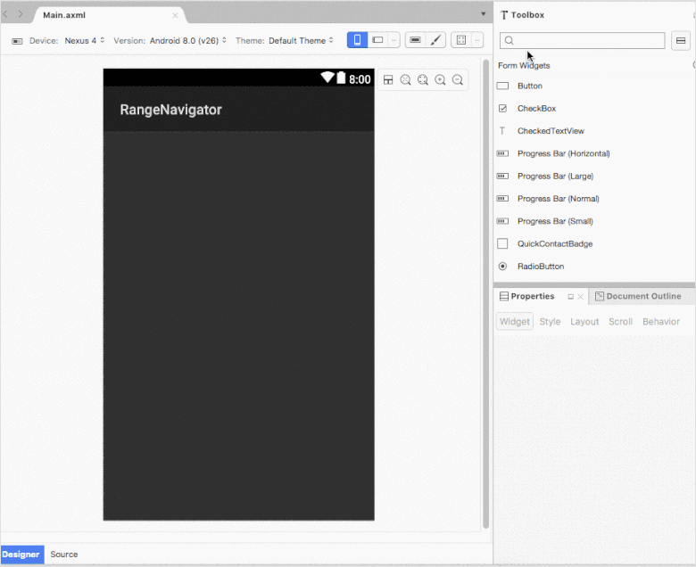
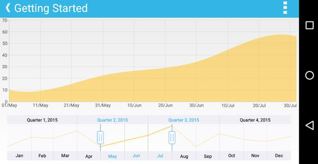

# Getting started

This section walks you through the steps required to add SfDateTimeRangeNavigator and populate it with data, and also explains how to respond to range selection performed in the control. 

## Reference Essential Studio components in your solution

After installing Essential Studio for Xamarin, you can find all the required assemblies in the installation folders, 

{Syncfusion Installed location}\Essential Studio\12.4.0.24\lib

N> Assemblies are available in unzipped package location in Mac.

Add the following assembly references to the Android project,

android\Syncfusion.SfChart.Android.dll

I> Starting with v16.2.0.x, if you reference Syncfusion assemblies from trial setup or from the NuGet feed, you also have to include a license key in your projects. Please refer to this [`link`](https://help.syncfusion.com/common/essential-studio/licensing/license-key) to know about registering Syncfusion license key in your Xamarin application to use our components.

## Initialize DateTimeRangeNavigator

[`SfDateTimeRangeNavigator`](https://help.syncfusion.com/cr/xamarin-android/Com.Syncfusion.Rangenavigator.SfDateTimeRangeNavigator.html) allows users to drag the designer screen from toolbox to designer window. The properties window will be displayed where you change the necessary functionalities to customize the datetime range navigator in designer.

You can get the date time range navigator instance from axml page in MainActivity using the following code.



SfDateTimeRangeNavigator dateTimeRangeNavigator = FindViewById<SfDateTimeRangeNavigator>(Resource.Id.sfDateTimeRangeNavigator1);



## Add and configure the SfDateTimeRangeNavigator 

First, let us initialize the control with major and minor date time scales by specifying the minimum and maximum date to be visualized in the control using [`Minimum`](https://help.syncfusion.com/cr/xamarin-android/Com.Syncfusion.Rangenavigator.SfDateTimeRangeNavigator.html#Com_Syncfusion_Rangenavigator_SfDateTimeRangeNavigator_Minimum) and [`Maximum`](https://help.syncfusion.com/cr/xamarin-android/Com.Syncfusion.Rangenavigator.SfDateTimeRangeNavigator.html#Com_Syncfusion_Rangenavigator_SfDateTimeRangeNavigator_Maximum) properties.

Following code example illustrates this,


[C#]

SfDateTimeRangeNavigator sfDateTimeRangeNavigator = new SfDateTimeRangeNavigator();

sfDateTimeRangeNavigator.Minimum = new GregorianCalendar(2015, 01, 01).Time;

sfDateTimeRangeNavigator.Maximum = new GregorianCalendar(2016, 01, 01).Time;



## Handle range selection

In real time, other controls like chart, grid etc., are updated in response to the range selection performed in `SfDateTimeRangeNavigator`. You can handle the selection using `RangeChanged` event and update other controls based on the selected date time or perform some other tasks using the selected data.

N> You can get the selected date time using `ViewRangeStart` and `ViewRangeEnd`.

Following code example illustrates how to handle range selection and update chart's date time axis range,


[C#]

sfDateTimeRangeNavigator.RangeChanged += sfDateTimeRangeNavigator_RangeChanged;

void sfDateTimeRangeNavigator_RangeChanged(object sender, SfDateTimeRangeNavigator.RangeChangedEventArgs e)
{
    //Updating chart's date time range
    dateTimeAxis.Minimum = e.ViewRangeStart;
    dateTimeAxis.Maximum = e.ViewRangeEnd;
}



N> Though the [`Content`](https://help.syncfusion.com/cr/xamarin-android/Com.Syncfusion.Rangenavigator.SfDateTimeRangeNavigator.html#Com_Syncfusion_Rangenavigator_SfDateTimeRangeNavigator__ctor_Android_Content_Context_) property’s data type is View and it can accept any View as its value, but currently [`SfDateTimeRangeNavigator`](https://help.syncfusion.com/cr/xamarin-android/Com.Syncfusion.Rangenavigator.SfDateTimeRangeNavigator.html) can accept only [`SfChart`](https://help.syncfusion.com/cr/xamarin-android/Com.Syncfusion.Charts.SfChart.html) as its content.

