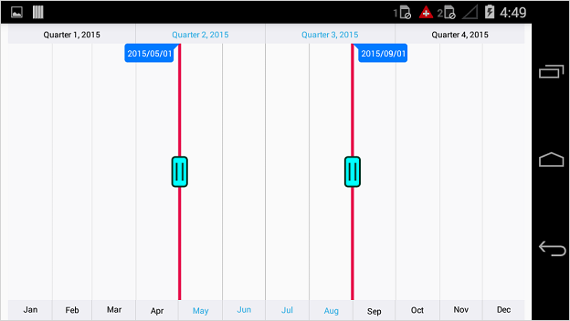

# Thumb

The [`LeftThumbStyle`](https://help.syncfusion.com/cr/xamarin-android/Com.Syncfusion.Rangenavigator.SfDateTimeRangeNavigator.html#Com_Syncfusion_Rangenavigator_SfDateTimeRangeNavigator_LeftThumbStyle) and [`RightThumbStyle`](https://help.syncfusion.com/cr/xamarin-android/Com.Syncfusion.Rangenavigator.SfDateTimeRangeNavigator.html#Com_Syncfusion_Rangenavigator_SfDateTimeRangeNavigator_RightThumbStyle) properties are used to configure the left and right thumb of the `SfDateTimeRangeNavigator`. Following properties are available in thumb style to configure left and right thumb individually. 

* [`StrokeColor`](https://help.syncfusion.com/cr/xamarin-android/Com.Syncfusion.Rangenavigator.ThumbStyle.html#Com_Syncfusion_Rangenavigator_ThumbStyle_StrokeColor) – used to change the stroke color of the thumb.
* [`BackgroundColor`](https://help.syncfusion.com/cr/xamarin-android/Com.Syncfusion.Rangenavigator.ThumbStyle.html#Com_Syncfusion_Rangenavigator_ThumbStyle_BackgroundColor) – used to change the background color of the thumb.
* [`StrokeWidth`](https://help.syncfusion.com/cr/xamarin-android/Com.Syncfusion.Rangenavigator.ThumbStyle.html#Com_Syncfusion_Rangenavigator_ThumbStyle_StrokeWidth) – used to change the stroke width of the thumb.
* [`Width`](https://help.syncfusion.com/cr/xamarin-android/Com.Syncfusion.Rangenavigator.ThumbStyle.html#Com_Syncfusion_Rangenavigator_ThumbStyle_Width) – used to change the width of the thumb.
* [`Height`](https://help.syncfusion.com/cr/xamarin-android/Com.Syncfusion.Rangenavigator.ThumbStyle.html#Com_Syncfusion_Rangenavigator_ThumbStyle_Height) – used to change the height of the thumb.
* [`LineColor`](https://help.syncfusion.com/cr/xamarin-android/Com.Syncfusion.Rangenavigator.ThumbStyle.html#Com_Syncfusion_Rangenavigator_ThumbStyle_LineColor) – used to change the line color of the thumb.
* [`LineWidth`](https://help.syncfusion.com/cr/xamarin-android/Com.Syncfusion.Rangenavigator.ThumbStyle.html#Com_Syncfusion_Rangenavigator_ThumbStyle_LineWidth) – used to change the line width of the thumb.
* [`LinePathEffect`](https://help.syncfusion.com/cr/xamarin-android/Com.Syncfusion.Rangenavigator.ThumbStyle.html#Com_Syncfusion_Rangenavigator_ThumbStyle_LinePathEffect) – used to change the dash array of the thumb line.


[C#]
SfDateTimeRangeNavigator rangeNavigator = new SfDateTimeRangeNavigator(this);
...
rangeNavigator.LeftThumbStyle.BackgroundColor = Color.Aqua;
rangeNavigator.LeftThumbStyle.StrokeColor = 0x083928;
rangeNavigator.LeftThumbStyle.StrokeWidth = 3;
rangeNavigator.LeftThumbStyle.LineColor = 0xE70E49;
rangeNavigator.LeftThumbStyle.LineWidth = 5;
rangeNavigator.RightThumbStyle.BackgroundColor = Color.Aqua;
rangeNavigator.RightThumbStyle.StrokeColor = 0x083928;
rangeNavigator.RightThumbStyle.StrokeWidth = 3;
rangeNavigator.RightThumbStyle.LineColor = 0xE70E49;
rangeNavigator.RightThumbStyle.LineWidth = 5;


