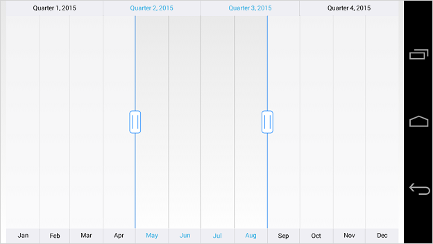
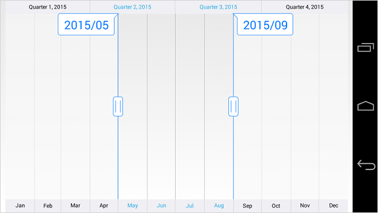

# Tooltip

The tooltip is used to show the selected range start and end value of the `SfDateTimeRangeNavigator``.`

## Tooltip Visibility

The [`TooltipEnabled`](https://help.syncfusion.com/cr/xamarin-android/Com.Syncfusion.Rangenavigator.SfDateTimeRangeNavigator.html#Com_Syncfusion_Rangenavigator_SfDateTimeRangeNavigator_TooltipEnabled) property of `SfDateTimeRangeNavigator` is used to control the visibility of the left and right tooltip. It is true by default.


[C#]
SfDateTimeRangeNavigator rangeNavigator = new SfDateTimeRangeNavigator(this);

rangeNavigator.TooltipEnabled = false;


N> The [`TooltipDisplayMode`](https://help.syncfusion.com/cr/xamarin-android/Com.Syncfusion.Rangenavigator.SfDateTimeRangeNavigator.html#Com_Syncfusion_Rangenavigator_SfDateTimeRangeNavigator_TooltipDisplayMode) property is used to determine whether the visibility of tooltip should be [`Always`](https://help.syncfusion.com/cr/xamarin-android/Com.Syncfusion.Rangenavigator.TooltipDisplayMode.html) or [`On_Demand`](https://help.syncfusion.com/cr/xamarin-android/Com.Syncfusion.Rangenavigator.TooltipDisplayMode.html) when selecting a range.	

## Tooltip Format

You can format the date value of the tooltip using [`TooltipFormat`](https://help.syncfusion.com/cr/xamarin-android/Com.Syncfusion.Rangenavigator.SfDateTimeRangeNavigator.html#Com_Syncfusion_Rangenavigator_SfDateTimeRangeNavigator_TooltipFormat) property of `SfDateTimeRangeNavigator`.


[C#]
dateTimeRangeNavigator.TooltipFormat = "yyyy/MM";


## Appearance Customization

The [`LeftTooltipStyle`](https://help.syncfusion.com/cr/xamarin-android/Com.Syncfusion.Rangenavigator.SfDateTimeRangeNavigator.html#Com_Syncfusion_Rangenavigator_SfDateTimeRangeNavigator_LeftTooltipStyle) and [`RightTooltipStyle`](https://help.syncfusion.com/cr/xamarin-android/Com.Syncfusion.Rangenavigator.SfDateTimeRangeNavigator.html#Com_Syncfusion_Rangenavigator_SfDateTimeRangeNavigator_RightTooltipStyle) properties of `SfDateTimeRangeNavigator` are used to customize the left and right tooltip. Following properties are available in each tooltip style to customize the appearance of the tooltip.

* [`TextColor`](https://help.syncfusion.com/cr/xamarin-android/Com.Syncfusion.Rangenavigator.TooltipStyle.html#Com_Syncfusion_Rangenavigator_TooltipStyle_TextColor) – used to change the color of the tooltip text.
* [`TextSize`](https://help.syncfusion.com/cr/xamarin-android/Com.Syncfusion.Rangenavigator.TooltipStyle.html#Com_Syncfusion_Rangenavigator_TooltipStyle_TextSize) - used to change the text size of the tooltip.
* [`BackgroundColor`](https://help.syncfusion.com/cr/xamarin-android/Com.Syncfusion.Rangenavigator.TooltipStyle.html#Com_Syncfusion_Rangenavigator_TooltipStyle_BackgroundColor) – used to change the background color of the tooltip.
* [`StrokeColor`](https://help.syncfusion.com/cr/xamarin-android/Com.Syncfusion.Rangenavigator.TooltipStyle.html#Com_Syncfusion_Rangenavigator_TooltipStyle_StrokeColor) – used to change the border color of the tooltip.
* [`StrokeWidth`](https://help.syncfusion.com/cr/xamarin-android/Com.Syncfusion.Rangenavigator.TooltipStyle.html#Com_Syncfusion_Rangenavigator_TooltipStyle_StrokeWidth) – used to change the thickness of the tooltip border.
* [`Typeface`](https://help.syncfusion.com/cr/xamarin-android/Com.Syncfusion.Rangenavigator.TooltipStyle.html#Com_Syncfusion_Rangenavigator_TooltipStyle_Typeface) – used to change the font family and font weight
* [`MarginLeft`](https://help.syncfusion.com/cr/xamarin-android/Com.Syncfusion.Rangenavigator.TooltipStyle.html#Com_Syncfusion_Rangenavigator_TooltipStyle_MarginLeft) - used to change the left margin of the tooltip text.
* [`MarginTop`](https://help.syncfusion.com/cr/xamarin-android/Com.Syncfusion.Rangenavigator.TooltipStyle.html#Com_Syncfusion_Rangenavigator_TooltipStyle_MarginTop) - used to change the top margin of the tooltip text.
* [`MarginRight`](https://help.syncfusion.com/cr/xamarin-android/Com.Syncfusion.Rangenavigator.TooltipStyle.html#Com_Syncfusion_Rangenavigator_TooltipStyle_MarginRight) - used to change the right margin of the tooltip text.
* [`MarginBottom`](https://help.syncfusion.com/cr/xamarin-android/Com.Syncfusion.Rangenavigator.TooltipStyle.html#Com_Syncfusion_Rangenavigator_TooltipStyle_MarginBottom) - used to change the bottom margin of the tooltip text.


[C#]
dateTimeRangeNavigator.LeftTooltipStyle.TextColor = Color.Blue;
dateTimeRangeNavigator.LeftTooltipStyle.BackgroundColor = Color.White;
dateTimeRangeNavigator.LeftTooltipStyle.StrokeColor = Color.Blue;
dateTimeRangeNavigator.LeftTooltipStyle.StrokeWidth = 2;
dateTimeRangeNavigator.LeftTooltipStyle.TextSize = 30;
dateTimeRangeNavigator.LeftTooltipStyle.MarginLeft = 15;
dateTimeRangeNavigator.LeftTooltipStyle.MarginTop = 15;
dateTimeRangeNavigator.LeftTooltipStyle.MarginRight = 15;
dateTimeRangeNavigator.LeftTooltipStyle.MarginBottom = 15;
dateTimeRangeNavigator.RightTooltipStyle.TextColor = Color.Blue;
dateTimeRangeNavigator.RightTooltipStyle.BackgroundColor = Color.White;
dateTimeRangeNavigator.RightTooltipStyle.StrokeColor = Color.Blue;
dateTimeRangeNavigator.RightTooltipStyle.StrokeWidth = 2;
dateTimeRangeNavigator.RightTooltipStyle.TextSize = 30;
dateTimeRangeNavigator.RightTooltipStyle.MarginLeft = 15;
dateTimeRangeNavigator.RightTooltipStyle.MarginTop = 15;
dateTimeRangeNavigator.RightTooltipStyle.MarginRight = 15;
dateTimeRangeNavigator.RightTooltipStyle.MarginBottom = 15;


