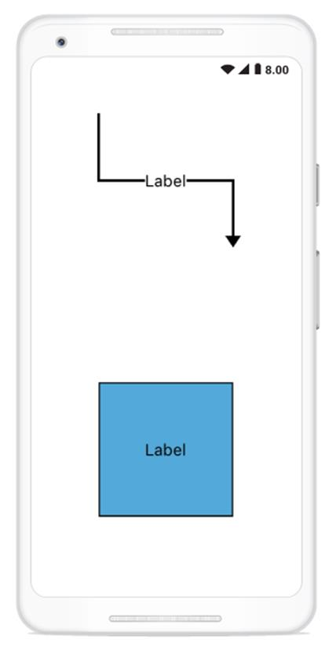
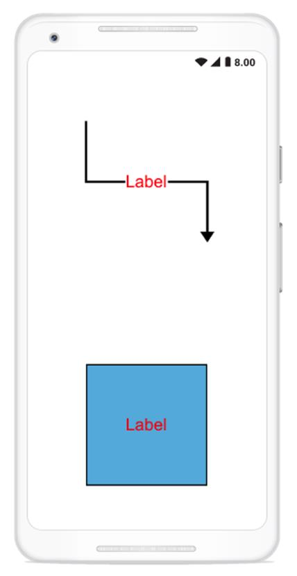
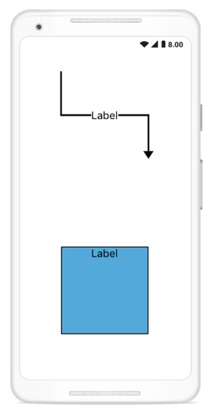

# Annotations
Annotations is a block of text that can be displayed over a node or connector. Annotation is used to represent an object textually with a string, that can be edited at run time.

## Create annotation
Define the annotation and add that in the annotations property of node or connector to add annotations. The content property of annotation defines the object to be displayed. The following code illustrates how to create annotation:


//To Add Annotation for Node
Node node = new Node(this);
node.OffsetX = 100;
node.OffsetY = 300;
node.Height = 100;
node.Width = 100;
node.ShapeType = ShapeType.Rectangle;
node.Annotations.Add(new Annotation() { Content = "Label" });
diagram.AddNode(node);
// To Add Annotation for Connector
Connector connector = new Connector(this);
connector.SourcePoint = new System.Drawing.PointF(100, 100);
connector.TargetPoint = new System.Drawing.PointF(200, 200);
connector.Annotations.Add(new Annotation() { Content = "Label" });
diagram.AddConnector(connector);



## Accessing an annotation form node and connector instance
You can access the node or connector annotation using annotation name. The following code illustrates how to access annotation:


// Accessing Annotation 

Connector connector = new Connector(this);
connector.SourcePoint = new System.Drawing.PointF(100, 100);
connector.TargetPoint = new System.Drawing.PointF(200, 200);
var label = new Annotation() { Content = "Label" };
connector.Annotations.Add(label);
diagram.AddConnector(connector);
connector.Annotations.Remove(label);



## Remove an annotation
You can remove the annotation using index value. The following code illustrates how to remove annotation:


//Remove Annotation using Index
Connector Connector1 = new Connector(this);
Connector1.SourcePoint = new System.Drawing.PointF(100, 100);
Connector1.TargetPoint = new System.Drawing.PointF(200, 200);
var label = new Annotation() { Content = "Label" };
Connector1.Annotations.Add(label);
diagram.AddConnector(Connector1);
Connector1.Annotations.RemoveAt(0);



## Annotation customization
You can customize the annotation using properties. The following code illustrates how to customize an annotation:


// Annotation customization for node 
Node node = new Node(this);
node.OffsetX = 100;
node.OffsetY = 300;
node.Height = 100;
node.Width = 100;
node.ShapeType = ShapeType.Rectangle;
var label = new Annotation()
{
  Content = "Label",
  FontFamily = "Arial",
  FontSize = 14, 
  TextBrush = new SolidBrush(Color.Red)
};
node.Annotations.Add(label);
diagram.AddNode(node);
// Annotation customization for connector 
Connector connector = new Connector(this);
connector.SourcePoint = new System.Drawing.PointF(100, 100);
connector.TargetPoint = new System.Drawing.PointF(200, 200);
var con_label = new Annotation()
{
  Content = "Label",
  FontFamily = "Arial",
  FontSize = 14,
  TextBrush = new SolidBrush(Color.Red)
};
connector.Annotations.Add(con_label);
diagram.AddConnector(connector);



## Alignment
Annotation can be aligned relatively with node boundaries. It has horizontal and vertical alignment settings. It will be complex when using four alignments together but gives you more control.


// Annotation alignment for Node
Node node = new Node(this);
node.OffsetX = 100;
node.OffsetY = 300;
node.Height = 100;
node.Width = 100;
node.ShapeType = ShapeType.Rectangle;
Annotation label = new Annotation()
{
  Content = "Label",
  HorizontalAlignment = HorizontalAlignment.Center,
  VerticalAlignment = VerticalAlignment.Top
};
node.Annotations.Add(label);
diagram.AddNode(node);
//Annotation alignment for Connector

Connector connector = new Connector(this);
connector.SourcePoint = new System.Drawing.PointF(100, 100);
connector.TargetPoint = new System.Drawing.PointF(200, 200);
connector.Annotations.Add(new Annotation()
{
  Content = "Label",
  HorizontalAlignment = HorizontalAlignment.Center,
  VerticalAlignment = VerticalAlignment.Center
});
diagram.AddConnector(connector);




