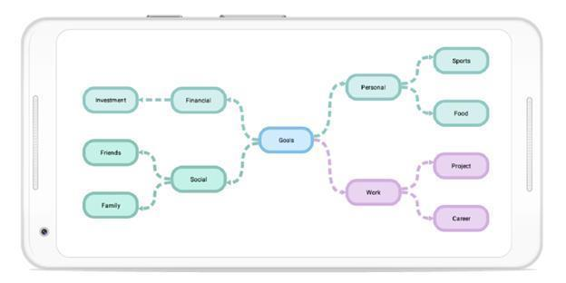

# Mind map layout
A mind map is a diagram used to visually organize the information. It is hierarchical and shows relationship of the whole idea. It consists of a central ideas, related ideas, and lines connecting them together.  It is used for brainstorming, planning, and information gathering etc. The following code example illustrates how to create and mind map layout:


SfDiagram diagram;
List<Color> FColor = new List<Color>();
List<Color> SColor = new List<Color>();
Random random = new Random();
int index;
int width = 150; int height = 75;

protected override void OnCreate(Bundle bundle)
{
    base.OnCreate(bundle);

    // Set our view from the "main" layout resource
    SetContentView(Resource.Layout.Main);
    LinearLayout linearLayout = FindViewById<LinearLayout>(Resource.Id.linearLayout);
    diagram = new SfDiagram(this);
    diagram.LayoutParameters = new LayoutParams(LayoutParams.MatchParent, LayoutParams.MatchParent);

    LinearLayout linearLayout2 = new LinearLayout(this);
    linearLayout2.Orientation = Android.Widget.Orientation.Horizontal;
    linearLayout2.LayoutParameters = new ViewGroup.LayoutParams(ViewGroup.LayoutParams.MatchParent, Resources.DisplayMetrics.HeightPixels - 400);
    linearLayout.AddView(linearLayout2);
    linearLayout2.AddView(diagram);

    linearLayout2 = new LinearLayout(this);
    linearLayout2.Orientation = Android.Widget.Orientation.Horizontal;
    linearLayout2.LayoutParameters = new ViewGroup.LayoutParams(ViewGroup.LayoutParams.MatchParent, Resources.DisplayMetrics.HeightPixels - 400);
    linearLayout.AddView(linearLayout2);

    //Alternate color selection for child nodes
    SColor.Add(Color.Blue);
    SColor.Add(Color.AliceBlue);
    SColor.Add(Color.Aquamarine);
    SColor.Add(Color.Bisque);
    SColor.Add(Color.BlanchedAlmond);
    SColor.Add(Color.BlueViolet);
    FColor.Add(Color.Brown);
    FColor.Add(Color.DarkGray);
    FColor.Add(Color.DarkViolet);
    FColor.Add(Color.Gold);
    FColor.Add(Color.Green);
    FColor.Add(Color.Indigo);

    //Add Root node
    var node = AddNode(300, 400, width, height, "Goals");
    AddNodeStyle(node, Color.Lavender, Color.Black);
    diagram.AddNode(node);

    //Add child nodes for root node
    var branch1 = AddNode(100, 100, width, height, "Financial");
    index = random.Next(5);
    AddNodeStyle(branch1, FColor[index], SColor[index]);
    diagram.AddNode(branch1);

    var branch1Child1 = AddNode(100, 100, width, height, "Investment");
    AddNodeStyle(branch1Child1, (branch1.Style.Brush as SolidBrush).FillColor, (branch1.Style.StrokeBrush as SolidBrush).FillColor);
    diagram.AddNode(branch1Child1);

    var branch2 = AddNode(100, 600, width, height, "Social");
    index = random.Next(5);
    AddNodeStyle(branch2, FColor[index], SColor[index]);
    diagram.AddNode(branch2);

    var branch2Child1 = AddNode(100, 100, width, height, "Friends");
    AddNodeStyle(branch2Child1, (branch2.Style.Brush as SolidBrush).FillColor, (branch2.Style.StrokeBrush as SolidBrush).FillColor);
    diagram.AddNode(branch2Child1);

    var branch2Child2 = AddNode(100, 100, width, height, "Family");
    AddNodeStyle(branch2Child2, (branch2.Style.Brush as SolidBrush).FillColor, (branch2.Style.StrokeBrush as SolidBrush).FillColor);
    diagram.AddNode(branch2Child2);

    var branch3 = AddNode(500, 100, width, height, "Personal");
    index = random.Next(5);
    AddNodeStyle(branch3, FColor[index], SColor[index]);
    diagram.AddNode(branch3);

    var branch3Child1 = AddNode(500, 100, width, height, "Sports");
    AddNodeStyle(branch3Child1, (branch3.Style.Brush as SolidBrush).FillColor, (branch3.Style.StrokeBrush as SolidBrush).FillColor);
    diagram.AddNode(branch3Child1);

    var branch3Child2 = AddNode(500, 100, width, height, "Food");
    AddNodeStyle(branch3Child2, (branch3.Style.Brush as SolidBrush).FillColor, (branch3.Style.StrokeBrush as SolidBrush).FillColor);
    diagram.AddNode(branch3Child2);

    var branch4 = AddNode(500, 600, width, height, "Work");
    index = random.Next(5);
    AddNodeStyle(branch4, FColor[index], SColor[index]);
    diagram.AddNode(branch4);

    var branch4Child1 = AddNode(500, 100, width, height, "Project");
    AddNodeStyle(branch4Child1, (branch4.Style.Brush as SolidBrush).FillColor, (branch4.Style.StrokeBrush as SolidBrush).FillColor);
    diagram.AddNode(branch4Child1);

    var branch4Child2 = AddNode(500, 100, width, height, "Career");
    AddNodeStyle(branch4Child2, (branch4.Style.Brush as SolidBrush).FillColor, (branch4.Style.StrokeBrush as SolidBrush).FillColor);
    diagram.AddNode(branch4Child2);

    //Add connector 
    diagram.AddConnector(AddConnector(node, branch1));
    diagram.AddConnector(AddConnector(node, branch2));
    diagram.AddConnector(AddConnector(node, branch3));
    diagram.AddConnector(AddConnector(node, branch4));
    diagram.AddConnector(AddConnector(branch1, branch1Child1));
    diagram.AddConnector(AddConnector(branch2, branch2Child1));
    diagram.AddConnector(AddConnector(branch2, branch2Child2));
    diagram.AddConnector(AddConnector(branch3, branch3Child1));
    diagram.AddConnector(AddConnector(branch3, branch3Child2));
    diagram.AddConnector(AddConnector(branch4, branch4Child1));
    diagram.AddConnector(AddConnector(branch4, branch4Child2));

}
//Add connector method 
private Connector AddConnector(Node node, Node branchNode)
{
    var connector = new Connector(this);
    connector.SourceNode = node;
    connector.TargetNode = branchNode;
    connector.Style.StrokeBrush = new SolidBrush((connector.TargetNode.Style.StrokeBrush as SolidBrush).FillColor);
    connector.Style.StrokeStyle = StrokeStyle.Dashed;
    connector.Style.StrokeWidth = 3;
    connector.TargetDecoratorStyle.StrokeWidth = connector.TargetDecoratorStyle.StrokeWidth;
    connector.TargetDecoratorStyle.Fill = (connector.TargetNode.Style.StrokeBrush as SolidBrush).FillColor;
    connector.TargetDecoratorStyle.StrokeColor = (connector.TargetNode.Style.StrokeBrush as SolidBrush).FillColor;
    connector.SegmentType = SegmentType.CurveSegment;
    return connector;
}

//Add node style method
private void AddNodeStyle(Node node, Color fill, Color Stroke)
{
    node.Style.Brush = new SolidBrush(fill);
    node.Style.StrokeBrush = new SolidBrush(Stroke);
}

//Add node method 
Node AddNode(int x, int y, int w, int h, string text)
{
    var node = new Node(this);
    node.OffsetX = x;node.OffsetY = y;
    node.Width = w;node.Height = h;
    node.ShapeType = ShapeType.RoundedRectangle;
    node.Style.StrokeWidth = 3;
    node.Annotations.Add(new Annotation() { Content = text, FontSize = 14 , TextBrush = new SolidBrush(Color.Black) });
    return node;
}



## Initializing the mind map layout
The following code illustrates how to initialize the mind map layout in diagram loaded event:


//Diagram loaded event
diagram.Loaded += Diagram_Loaded;

private void Diagram_Loaded(object sender)
{
      diagram.LayoutManager = new LayoutManager()
      {
         Layout = new MindMapLayout()
         {
            MindMapOrientation = Orientation.Horizontal,
            HorizontalSpacing = 70,
         }
      };
      //Updating the layout
      diagram.LayoutManager.Layout.UpdateLayout();
}




## Mind map layout style
Mind map styles are defined as a collection of node style with a single connector style. Collection of node style is applied from root node to leaf node either through branch wise or level wise.

## Branch wise node style
Defined node style collection is applied from branch wise by setting the “ApplyNodeStyleBy” property to branch. The following code example illustrates how to apply style for mind map branch wise.


private void UpdateTheme()
{
    bool repeat_mode = true;
    nodeStyleCollection.Clear();
    nodeStyleCollection.Add(new NodeStyle(new SolidBrush(Color.ParseColor("#d7ebf6")), Color.ParseColor("#d7ebf6"), objShape1, StrokeStyle.Default,
    new Syncfusion.SfDiagram.Android.TextStyle((int)(14), Color.Black, ".SF UI Text", HorizontalAlignment.Center, VerticalAlignment.Center)));
    nodeStyleCollection.Add(new NodeStyle(new SolidBrush(Color.ParseColor("#ffebc4")), Color.ParseColor("#ffebc4"), objShape2, StrokeStyle.Default,
    new Syncfusion.SfDiagram.Android.TextStyle((int)(14), Color.Black, ".SF UI Text", HorizontalAlignment.Center, VerticalAlignment.Center)));
    nodeStyleCollection.Add(new NodeStyle(new SolidBrush(Color.ParseColor("#ffcdcd")), Color.ParseColor("#ffcdcd"), objShape3, StrokeStyle.Default,
    new Syncfusion.SfDiagram.Android.TextStyle((int)(14), Color.Black, ".SF UI Text", HorizontalAlignment.Center, VerticalAlignment.Center)));
    lineStyle = new LineStyle(SegmentType.CurveSegment, StrokeStyle.Default, 3, ApplyColorFrom.TargetFill, DecoratorType.None, ApplyColorFrom.None, ApplyColorFrom.None);
    (diagram.LayoutManager.Layout as MindMapLayout).UpdateLayoutStyle(new LayoutStyle(nodeStyleCollection, lineStyle, ApplyNodeStyleBy.Branch, repeat_mode));
}
private void Diagram_Loaded(object sender)
{ 
    UpdateTheme();
}



## Level wise node style
Defined node style collection is applied from level wise by setting the “ApplyNodeStyleBy” property to level. The following code example illustrates how to apply style for mind map level wise.


private void UpdateTheme()
{
    bool repeat_mode = true;
    nodeStyleCollection.Clear();
    nodeStyleCollection.Add(new NodeStyle(new SolidBrush(Color.ParseColor("#d7ebf6")), Color.ParseColor("#d7ebf6"), objShape1, StrokeStyle.Default,
    new Syncfusion.SfDiagram.Android.TextStyle((int)(14), Color.Black, ".SF UI Text", HorizontalAlignment.Center, VerticalAlignment.Center)));
    nodeStyleCollection.Add(new NodeStyle(new SolidBrush(Color.ParseColor("#ffebc4")), Color.ParseColor("#ffebc4"), objShape2, StrokeStyle.Default,
    new Syncfusion.SfDiagram.Android.TextStyle((int)(14), Color.Black, ".SF UI Text", HorizontalAlignment.Center, VerticalAlignment.Center)));
    nodeStyleCollection.Add(new NodeStyle(new SolidBrush(Color.ParseColor("#ffcdcd")), Color.ParseColor("#ffcdcd"), objShape3, StrokeStyle.Default,
    new Syncfusion.SfDiagram.Android.TextStyle((int)(14), Color.Black, ".SF UI Text", HorizontalAlignment.Center, VerticalAlignment.Center)));
    lineStyle = new LineStyle(SegmentType.CurveSegment, StrokeStyle.Default, 3, ApplyColorFrom.TargetFill, DecoratorType.None, ApplyColorFrom.None, ApplyColorFrom.None);
    (diagram.LayoutManager.Layout as MindMapLayout).UpdateLayoutStyle(new LayoutStyle(nodeStyleCollection, lineStyle, ApplyNodeStyleBy.Level, repeat_mode));
}
private void Diagram_Loaded(object sender)
{ 
    UpdateTheme();
}



## Repeat mode
When style collection ends, the next level or branch can have styles. To be cyclic, enable repeat mode or disable it to continue with last style.

## Free form layout 
The mind map free form layout provides an option to rearrange nodes in a layout. Mind map layout allows you to enable or disable free form using the “EnableFreeForm” property.


(diagram.LayoutManager.Layout as MindMapLayout).EnableFreeForm = true;




