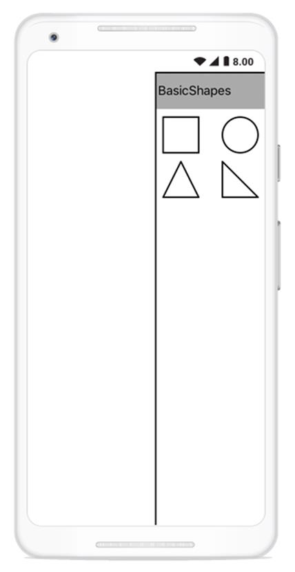
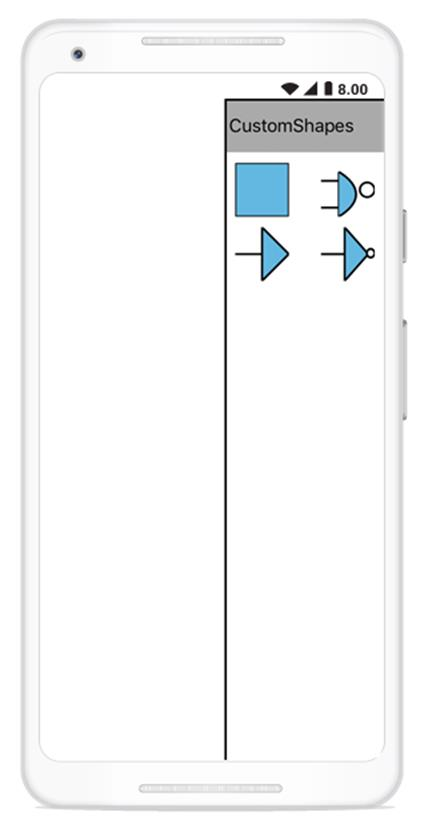
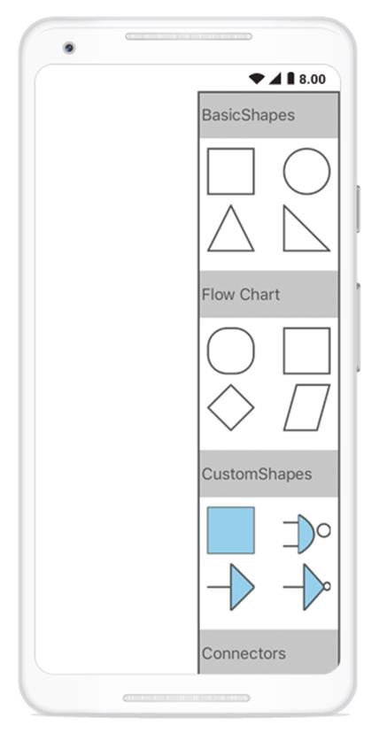
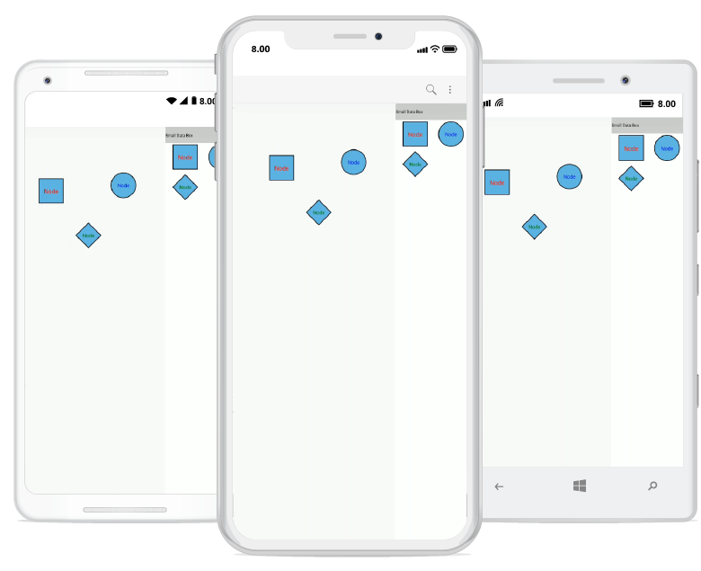

# Stencil in Xamarin.Android diagram
Stencil has a collection of symbols. It is used to clone the desired symbol by dragging it from the stencil and dropping it into the SfDiagram. Each symbol can be grouped together by using the SymbolGroup.

## Add default shapes into stencil
The below given collection will be the items of a stencil. Based on the items, the stencil will populate the symbols.
The following code example illustrates how to add the symbol into a collection:


//Add Symbols into SymbolCollection
SymbolCollection Collection1 = new SymbolCollection();
Collection1.Add(new Node(this) { Width = 50, Height = 50, ShapeType = ShapeType.Rectangle });
Collection1.Add(new Node(this) { Width = 50, Height = 50, ShapeType = ShapeType.Ellipse });
Collection1.Add(new Node(this) { Width = 50, Height = 50, ShapeType = ShapeType.Triangle });
Collection1.Add(new Node(this) { Width = 50, Height = 50, ShapeType = ShapeType.RightAngleTriangle });
//Add collection into SymbolGroup
stencil.SymbolGroups.Add(new SymbolGroup() { Items = Collection1, Header = "BasicShapes" });
diagram.Stencil = stencil;



## Add custom shapes into stencil
The following code example illustrates how to add the custom shapes into a collection:


//Custom shapes 
Pen pen = new Pen();
pen.StrokeBrush = new SolidBrush(Color.Red);
pen.StrokeWidth = 2;
SolidBrush brush = new SolidBrush(Color.Yellow);
pen.Brush = brush;
Pen pen1 = new Pen();
pen1.StrokeBrush = new SolidBrush(Color.Gray);
pen1.StrokeWidth = 2;
SolidBrush brush1 = new SolidBrush(Color.Blue);
brush1.FillColor = Color.Blue;
pen1.Brush = brush1;

Node custom = new Node(this);
SfGraphics graph = new SfGraphics();
Pen pen2 = new Pen();
pen2.StrokeBrush = new SolidBrush(Color.Blue);
pen2.StrokeWidth = 2;
SolidBrush brush2 = new SolidBrush(Color.Black);
brush2.FillColor = Color.Blue;
pen2.Brush = brush2;
graph.DrawRectangle(pen2, new System.Drawing.Rectangle(0, 0, 50, 50));
custom.UpdateSfGraphics(graph);

Node custom1 = new Node(this);
SfGraphics grap4 = new SfGraphics();
SfGraphicsPath sfpath4 = new SfGraphicsPath();
Pen pen14 = new Pen();
pen14.StrokeBrush = new SolidBrush(Color.Blue);
pen14.StrokeWidth = 2;
SolidBrush brush14 = new SolidBrush(Color.Transparent);
brush14.FillColor = Color.Transparent;
pen14.Brush = brush14;
System.Collections.Generic.List<System.Drawing.Point> coll4 = new System.Collections.Generic.List<System.Drawing.Point>();
coll4.Add(new System.Drawing.Point(0, 12));
coll4.Add(new System.Drawing.Point(12, 12));
coll4.Add(new System.Drawing.Point(12, 6));
coll4.Add(new System.Drawing.Point(12, 42));
coll4.Add(new System.Drawing.Point(12, 30));
coll4.Add(new System.Drawing.Point(0, 30));
grap4.DrawLines(pen14, coll4);
sfpath4.MoveTo(12, 6);
sfpath4.CubicTo(12, 6, 38, 20, 12, 36);
grap4.DrawPath(sfpath4);
custom1.UpdateSfGraphics(grap4);

Node custom2 = new Node(this);
SfGraphics grap5 = new SfGraphics();
SfGraphicsPath sfpath5 = new SfGraphicsPath();
System.Collections.Generic.List<System.Drawing.Point> pointscol5 = new System.Collections.Generic.List<System.Drawing.Point>();
pointscol5.Add(new System.Drawing.Point(0, 15));
pointscol5.Add(new System.Drawing.Point(15, 15));
pointscol5.Add(new System.Drawing.Point(15, 0));
pointscol5.Add(new System.Drawing.Point(30, 15));
pointscol5.Add(new System.Drawing.Point(15, 30));
pointscol5.Add(new System.Drawing.Point(15, 15));
sfpath5.AddLines(pointscol5.ToArray());
grap5.DrawPath(sfpath5);
custom2.UpdateSfGraphics(grap5);

Node custom3 = new Node(this);
Pen pen4 = new Pen();
pen4.StrokeBrush = new SolidBrush(Color.Blue);
pen4.StrokeWidth = 2;
SolidBrush brush4 = new SolidBrush(Color.White);
brush4.FillColor = Color.White;
pen4.Brush = brush4;

SfGraphics grap6 = new SfGraphics();
SfGraphicsPath sfpath6 = new SfGraphicsPath();
System.Collections.Generic.List<System.Drawing.Point> pointscol6 = new System.Collections.Generic.List<System.Drawing.Point>();
pointscol6.Add(new System.Drawing.Point(0, 15));
pointscol6.Add(new System.Drawing.Point(15, 15));
pointscol6.Add(new System.Drawing.Point(15, 0));
pointscol6.Add(new System.Drawing.Point(30, 15));
pointscol6.Add(new System.Drawing.Point(15, 30));
pointscol6.Add(new System.Drawing.Point(15, 15));
sfpath6.AddLines(pointscol5.ToArray());
grap6.DrawPath(sfpath6);
grap6.DrawEllipse(pen4, new System.Drawing.Rectangle(30, 12, 5, 5));
custom3.UpdateSfGraphics(grap6);

SymbolCollection CustomShapeCollection = new SymbolCollection();
CustomShapeCollection.Add(custom);
CustomShapeCollection.Add(custom1);
CustomShapeCollection.Add(custom2);
CustomShapeCollection.Add(custom3);
//Add custom shapes into group
stencil.SymbolGroups.Add(new SymbolGroup() { Items = CustomShapeCollection, Header = "Custom Shapes" });



## Add category heading text
You can add category of symbol group heading in stencil. The following code example illustrates how to add category heading text in stencil.


//SymbolCollection1 
SymbolCollection coll = new SymbolCollection();
coll.Add(new Node(this) { Width = 50, Height = 50, ShapeType = ShapeType.Rectangle, Style = new Style() { Brush = new SolidBrush(Color.White), StrokeBrush = new SolidBrush(Color.Gray) } });

coll.Add(new Node(this) { Width = 50, Height = 50, ShapeType = ShapeType.Ellipse, Style = new Style() { Brush = new SolidBrush(Color.White), StrokeBrush = new SolidBrush(Color.Gray) } });

coll.Add(new Node(this) { Width = 50, Height = 50, ShapeType = ShapeType.Triangle, Style = new Style() { Brush = new SolidBrush(Color.White), StrokeBrush = new SolidBrush(Color.Gray) } });

coll.Add(new Node(this) { Width = 50, Height = 50, ShapeType = ShapeType.RightAngleTriangle, Style = new Style() { Brush = new SolidBrush(Color.White), StrokeBrush = new SolidBrush(Color.Gray) } });

//SymbolCollection2 
SymbolCollection coll1 = new SymbolCollection();
coll1.Add(new Node(this) { Width = 50, Height = 50, ShapeType = ShapeType.RoundedRectangle, Style = new Style() { Brush = new SolidBrush(Color.White), StrokeBrush = new SolidBrush(Color.Gray) } });
coll1.Add(new Node(this) { Width = 50, Height = 50, ShapeType = ShapeType.Rectangle, Style = new Style() { Brush = new SolidBrush(Color.White), StrokeBrush = new SolidBrush(Color.Gray) } });
coll1.Add(new Node(this) { Width = 50, Height = 50, ShapeType = ShapeType.Diamond, Style = new Style() { Brush = new SolidBrush(Color.White), StrokeBrush = new SolidBrush(Color.Gray) } });
coll1.Add(new Node(this) { Width = 50, Height = 50, ShapeType = ShapeType.Parallelogram, Style = new Style() { Brush = new SolidBrush(Color.White), StrokeBrush = new SolidBrush(Color.Gray) } });

//SymbolCollection3
SymbolCollection con1 = new SymbolCollection();
con1.Add(new Connector(this) { SegmentType = SegmentType.OrthoSegment, SourcePoint = new System.Drawing.Point(0, 0), TargetPoint = new System.Drawing.Point(50, 50) });
con1.Add(new Connector(this) { SegmentType = SegmentType.StraightSegment, SourcePoint = new System.Drawing.Point(0, 0), TargetPoint = new System.Drawing.Point(50, 50) });

//Add category of symbol group with heading text
stencil.SymbolGroups.Add(new SymbolGroup() { Items = coll, Header = "BasicShapes" });
stencil.SymbolGroups.Add(new SymbolGroup() { Items = coll1, Header = "Flow Chart" });
stencil.SymbolGroups.Add(new SymbolGroup() { Items = CustomShapeCollection, Header = "CustomShapes" });
stencil.SymbolGroups.Add(new SymbolGroup() { Items = con1, Header = "Connectors" });
diagram.Stencil = stencil;



## Add Annotation into stencil
Stencil is able to load the symbols like connectors and nodes (all shapes), custom shapes with annotation into the SfDiagram. Each symbol can be grouped together by using the SymbolGroup.
The following example explains how to add the Annotation into a stencil:


Grid grid = new Grid();
var column = new ColumnDefinition() { Width = new GridLength(2, GridUnitType.Star) };
var column1 = new ColumnDefinition() { Width = new GridLength(150) };
grid.ColumnDefinitions.Add(column);
grid.ColumnDefinitions.Add(column1);

SfDiagram diagram = new SfDiagram();
diagram.HeightRequest = 1280;
diagram.WidthRequest = 720;
diagram.BackgroundColor = Color.Transparent;
diagram.PageSettings.GridColor = Color.LightGray;
diagram.PageSettings.PageBackGround = Color.Transparent;
diagram.PageSettings.ShowGrid = false;
diagram.PageSettings.SnapToGrid = false;

Stencil stencil = new Stencil();
SymbolCollection SmallDataBox = new SymbolCollection();
SmallDataBox.Add(new Node()
{
    Width = 150,
    Height = 150,
    EnableDrag = true,
    EnableResize = true,
    ShapeType = ShapeType.Rectangle,
    Annotations = { new Annotation() { Content = "Node", FontSize = 36, TextBrush = new SolidBrush(Color.Red), HorizontalAlignment = HorizontalAlignment.Center, VerticalAlignment = VerticalAlignment.Center } }
});
SmallDataBox.Add(new Node()
{
    Width = 150,
    Height = 150,
    EnableDrag = true,
    EnableResize = true,
    ShapeType = ShapeType.Circle,
    Annotations = { new Annotation() { Content = "Node", FontSize = 30, TextBrush = new SolidBrush(Color.Blue), HorizontalAlignment = HorizontalAlignment.Center, VerticalAlignment = VerticalAlignment.Center } }
});
SmallDataBox.Add(new Node()
{
    Width = 150,
    Height = 150,
    EnableDrag = true,
    EnableResize = true,
    ShapeType = ShapeType.Diamond,
    Annotations = { new Annotation() { Content = "Node", FontSize = 30, TextBrush = new SolidBrush(Color.Green), HorizontalAlignment = HorizontalAlignment.Center, VerticalAlignment = VerticalAlignment.Center } }
});

//Add a category of symbol group with a heading text
stencil.SymbolGroups.Add(new SymbolGroup() { SymbolSource = SmallDataBox, HeaderName = "Small Data Box" });
stencil.SymbolStyle.Width = 150;
stencil.SymbolStyle.Height = 150;
grid.Children.Add(diagram, 0, 0);
grid.Children.Add(stencil, 1, 0);
this.Content = grid;



