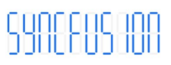
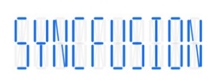
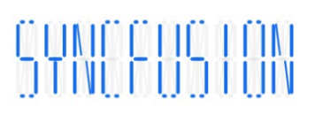
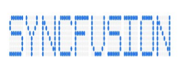

# Character types

The digital characters can be drawn in the following four different segments:

•	Seven

•	Fourteen

•	Sixteen

•	EightCrossEightDotMatrix

## Seven segment

The seven-segment type is capable of displaying numbers and a few uppercase letters efficiently.



           int totalHeight = this.Resources.DisplayMetrics.HeightPixels;

            SfDigitalGauge sfDigitalGauge = new SfDigitalGauge(this);

            sfDigitalGauge.SetBackgroundColor(Color.White);

            sfDigitalGauge.CharacterStroke = Color.Rgb(20, 108, 237);

            sfDigitalGauge.CharacterHeight = 60;

            sfDigitalGauge.CharactersSpacing = 2;

            sfDigitalGauge.CharacterWidth = 15;

            sfDigitalGauge.SegmentStrokeWidth = 3;

            sfDigitalGauge.CharacterType = CharacterTypes.SegmentSeven;

            sfDigitalGauge.Value = "SYNCFUSION";

            sfDigitalGauge.DimmedSegmentColor = Color.Gray;

            sfDigitalGauge.DimmedSegmentAlpha = 25;

            sfDigitalGauge.LayoutParameters = (new LinearLayout.LayoutParams((int)900, (int)350));

            LinearLayout linearLayout = new LinearLayout(this);

            linearLayout.LayoutParameters = new FrameLayout.LayoutParams(ViewGroup.LayoutParams.MatchParent, (int)(totalHeight * 0.1));

            linearLayout.SetGravity(GravityFlags.Center);

            linearLayout.AddView(sfDigitalGauge);

            linearLayout.SetBackgroundColor(Color.White);

            SetContentView(linearLayout);



## Fourteen segment

The fourteen-segment type is capable of displaying numbers and alphabet efficiently.

## Sixteen segment

The sixteen-segment type is capable of displaying numbers and alphabet clearly.

## EightCrossEightDotMatrix segment

The dot matrix segment type is capable of displaying numbers, alphabet, and special characters efficiently.

