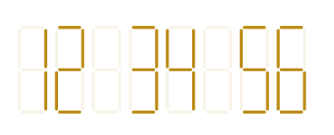
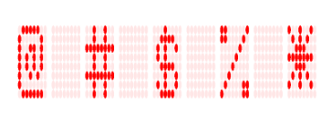

# Display value types

The digital gauge displays numbers, alphabet, and special characters, which are given in the value property.

## Setting value to number

Numbers can be displayed in digital gauge in different formats using the `CharacterType` property.



            int totalHeight = this.Resources.DisplayMetrics.HeightPixels;

            SfDigitalGauge sfDigitalGauge = new SfDigitalGauge(this);

            sfDigitalGauge.SetBackgroundColor(Color.White);

            sfDigitalGauge.CharacterStroke = Color.DarkGoldenrod;

            sfDigitalGauge.CharacterHeight = 60;

            sfDigitalGauge.CharactersSpacing = 5;

            sfDigitalGauge.CharacterWidth = 15;

            sfDigitalGauge.SegmentStrokeWidth = 3;

            sfDigitalGauge.CharacterType = CharacterTypes.SegmentSeven;

            sfDigitalGauge.Value = "12 34 56";

            sfDigitalGauge.DimmedSegmentColor = Color.DarkGoldenrod;

            sfDigitalGauge.DimmedSegmentAlpha = 25;

            sfDigitalGauge.LayoutParameters = (new LinearLayout.LayoutParams((int)1000, (int)350));

            LinearLayout linearLayout = new LinearLayout(this);

            linearLayout.LayoutParameters = new FrameLayout.LayoutParams(ViewGroup.LayoutParams.MatchParent, (int)(totalHeight * 0.1));

            linearLayout.SetGravity(GravityFlags.Center);

            linearLayout.AddView(sfDigitalGauge);

            linearLayout.SetBackgroundColor(Color.White);

            SetContentView(linearLayout);



## Setting value to alphabet

Alphabet can be displayed in digital gauge using any one of the character format types.



            int totalHeight = this.Resources.DisplayMetrics.HeightPixels;

            SfDigitalGauge sfDigitalGauge = new SfDigitalGauge(this);

            sfDigitalGauge.SetBackgroundColor(Color.White);

            sfDigitalGauge.CharacterStroke = Color.DarkGreen;

            sfDigitalGauge.CharacterHeight = 60;

            sfDigitalGauge.CharactersSpacing = 2;

            sfDigitalGauge.CharacterWidth = 15;

            sfDigitalGauge.SegmentStrokeWidth = 3;

            sfDigitalGauge.CharacterType = CharacterTypes.SegmentSixteen;

            sfDigitalGauge.Value = "SYNCFUSION";

            sfDigitalGauge.DimmedSegmentColor = Color.DarkGreen;

            sfDigitalGauge.DimmedSegmentAlpha = 25;

            sfDigitalGauge.LayoutParameters = (new LinearLayout.LayoutParams((int)900, (int)350));

            LinearLayout linearLayout = new LinearLayout(this);

            linearLayout.LayoutParameters = new FrameLayout.LayoutParams(ViewGroup.LayoutParams.MatchParent, (int)(totalHeight * 0.1));

            linearLayout.SetGravity(GravityFlags.Center);

            linearLayout.AddView(sfDigitalGauge);

            linearLayout.SetBackgroundColor(Color.White);

            SetContentView(linearLayout);



## Setting value to special characters

Special characters can also be displayed in digital gauge using the EightCrossEightDotMatrix character format type.



           int totalHeight = this.Resources.DisplayMetrics.HeightPixels;

            SfDigitalGauge sfDigitalGauge = new SfDigitalGauge(this);

            sfDigitalGauge.SetBackgroundColor(Color.White);

            sfDigitalGauge.CharacterStroke = Color.Red;

            sfDigitalGauge.CharacterHeight = 60;

            sfDigitalGauge.CharactersSpacing = 2;

            sfDigitalGauge.CharacterWidth = 15;

            sfDigitalGauge.SegmentStrokeWidth = 3;

            sfDigitalGauge.CharacterType = CharacterTypes.EightCrossEightDotMatrix;

            sfDigitalGauge.Value = "@ # $ % *";

            sfDigitalGauge.DimmedSegmentColor = Color.Red;

            sfDigitalGauge.DimmedSegmentAlpha = 25;

            sfDigitalGauge.LayoutParameters = (new LinearLayout.LayoutParams((int)830, (int)350));

            LinearLayout linearLayout = new LinearLayout(this);

            linearLayout.LayoutParameters = new FrameLayout.LayoutParams(ViewGroup.LayoutParams.MatchParent, (int)(totalHeight * 0.1));

            linearLayout.SetGravity(GravityFlags.Center);

            linearLayout.AddView(sfDigitalGauge);

            linearLayout.SetBackgroundColor(Color.White);

            SetContentView(linearLayout);



