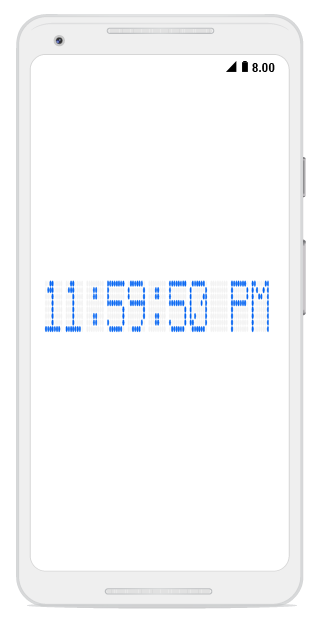

# Getting Started

This section explains the steps required to configure the [`SfDigitalGauge`](https://help.syncfusion.com/cr/xamarin-android/Com.Syncfusion.Gauges.SfDigitalGauge.SfDigitalGauge.html) and add basic elements to it using various APIs.

## Adding digital gauge reference

Syncfusion components for Xamarin.Android are available in nuget.org. To add [`SfDigitalGauge`](https://help.syncfusion.com/cr/xamarin-android/Com.Syncfusion.Gauges.SfDigitalGauge.SfDigitalGauge.html) to your project, open the NuGet package manager in Visual Studio, search for Syncfusion.Xamarin.SfGauge, and then install it.

To learn more about obtaining our components, refer to these links: Mac and Windows. Also, if you prefer to manually refer the assemblies instead of NuGet, refer to this link to learn about the dependent assemblies for digital gauge.

I> After adding the reference, an additional step is required for iOS and UWP projects. You should create an instance of the SfGaugeRenderer in iOS and UWP projects as shown in this KB article.

I> For UWP alone, one more additional step is required if the project is built-in release mode with .NET Native tool chain enabled. You can refer to this KB article for more details.

## Adding namespace for the assemblies



using Com.Syncfusion.Gauges.SfDigitalGauge;



## Initialize gauge

You can initialize the [`SfDigitalGauge`](https://help.syncfusion.com/cr/xamarin-android/Com.Syncfusion.Gauges.SfDigitalGauge.SfDigitalGauge.html) control with a required optimal name using the included namespace.



     protected override void OnCreate(Bundle savedInstanceState)
        {
            base.OnCreate(savedInstanceState);

            SfDigitalGauge sfDigitalGauge = new SfDigitalGauge(this);

            SetContentView(sfDigitalGauge);
        }



## Initialize gauge in axml:

[`SfDigitalGauge`](https://help.syncfusion.com/cr/xamarin-android/Com.Syncfusion.Gauges.SfDigitalGauge.SfDigitalGauge.html) allows users to drag the control from toolbox to designer window. The properties window will be displayed where you change the necessary functionalities to customize the digital gauge in designer.

In MainActivity, you can access the digital gauge instance defined in axml page using the following code.





protected override void OnCreate(Bundle savedInstanceState)
{
    base.OnCreate(savedInstanceState);
    SetContentView(Resource.Layout.Main);

    SfDigitalGauge digitalGauge = FindViewById<SfDigitalGauge>(Resource.Id.sfDigitalGauge1);
}





You can create digital gauge using code behind also. The following steps help to add digital gauge using code behind.

## Setting value for digital gauge

The [`SfDigitalGauge`](https://help.syncfusion.com/cr/xamarin-android/Com.Syncfusion.Gauges.SfDigitalGauge.SfDigitalGauge.html) control provides options to display special characters or values using the [`Value`](https://help.syncfusion.com/cr/xamarin-android/Com.Syncfusion.Gauges.SfDigitalGauge.SfDigitalGauge.html#Com_Syncfusion_Gauges_SfDigitalGauge_SfDigitalGauge_Value) property.



    SfDigitalGauge sfDigitalGauge = new SfDigitalGauge(this);

    sfDigitalGauge.Value = "11:59:50 PM";



## Setting character type for digital gauge

By using the [`CharacterType`](https://help.syncfusion.com/cr/xamarin-android/Com.Syncfusion.Gauges.SfDigitalGauge.SfDigitalGauge.html#Com_Syncfusion_Gauges_SfDigitalGauge_SfDigitalGauge_CharacterType) property, you can set the segments for digital gauge. The digital characters can be drawn in the following four different segments:

•	EightCrossEightDotMatrix

•	SegmentFourteen

•	SegmentSeven

•	SegmentSixteen



    SfDigitalGauge sfDigitalGauge = new SfDigitalGauge(this);

    sfDigitalGauge.CharacterType = CharacterTypes.EightCrossEightDotMatrix;



## Configuring properties

The [`CharacterHeight`](https://help.syncfusion.com/cr/xamarin-android/Com.Syncfusion.Gauges.SfDigitalGauge.SfDigitalGauge.html#Com_Syncfusion_Gauges_SfDigitalGauge_SfDigitalGauge_CharacterHeight), [`CharacterWidth`](https://help.syncfusion.com/cr/xamarin-android/Com.Syncfusion.Gauges.SfDigitalGauge.SfDigitalGauge.html#Com_Syncfusion_Gauges_SfDigitalGauge_SfDigitalGauge_CharacterWidth), and [`CharacterStroke`](https://help.syncfusion.com/cr/xamarin-android/Com.Syncfusion.Gauges.SfDigitalGauge.SfDigitalGauge.html#Com_Syncfusion_Gauges_SfDigitalGauge_SfDigitalGauge_CharacterStroke)properties are used to display characters, which can be customized as shown in the following code snippets:



            SfDigitalGauge sfDigitalGauge = new SfDigitalGauge(this);

            sfDigitalGauge.CharacterHeight = 60;

            sfDigitalGauge.CharacterWidth = 25;

            sfDigitalGauge.CharacterStroke = Color.ParseColor("#146CED");



The following code example is the complete code of the previous configurations.



using Android.App;

using Android.Widget;

using Android.OS;

using Com.Syncfusion.Gauges.SfDigitalGauge;

using Android.Graphics;

using Android.Views;

namespace Gauge_GettingStarted
{
    [Activity(Label = "Gauge_GettingStarted", MainLauncher = true)]
    public class MainActivity : Activity
    {
        LinearLayout linearLayout;

        protected override void OnCreate(Bundle savedInstanceState)
        {
            base.OnCreate(savedInstanceState);

           int totalHeight = this.Resources.DisplayMetrics.HeightPixels;

            SfDigitalGauge sfDigitalGauge = new SfDigitalGauge(this);

            sfDigitalGauge.SetBackgroundColor(Color.White);

            sfDigitalGauge.CharacterStroke = Color.Rgb(20, 108, 237);

            sfDigitalGauge.CharacterHeight = 60;

            sfDigitalGauge.CharactersSpacing = 2;

            sfDigitalGauge.CharacterWidth = 15;

            sfDigitalGauge.SegmentStrokeWidth = 2;

            sfDigitalGauge.CharacterType = CharacterTypes.EightCrossEightDotMatrix;

            sfDigitalGauge.Value = "11:59:50 PM";

            sfDigitalGauge.DimmedSegmentColor = Color.Gray;

            sfDigitalGauge.DimmedSegmentAlpha = 25;

            sfDigitalGauge.LayoutParameters = (new LinearLayout.LayoutParams((int)1000, (int)350));

            linearLayout = new LinearLayout(this);

            linearLayout.LayoutParameters = new FrameLayout.LayoutParams(ViewGroup.LayoutParams.MatchParent, (int)(totalHeight * 0.1));

            linearLayout.SetGravity(GravityFlags.Center);

            linearLayout.AddView(sfDigitalGauge);

            linearLayout.SetBackgroundColor(Color.White);

            SetContentView(linearLayout);
        }
    }
}



The following screenshot illustrates the result of the previous codes.

You can find the complete getting started sample from this [`link`](http://www.syncfusion.com/downloads/support/directtrac/general/ze/Gauge_GettingStarted325239782).

