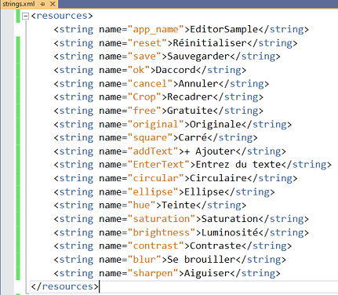
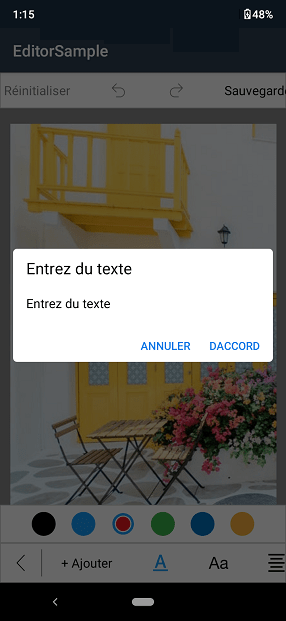

## Localization

The image editor control provides support for localization.You can localize ImageEditor contents by adding equivalent localized string.

## Change default control language

Based on the resource strings in the project the contents are localized. By default,ImageEditor control is available in English.

You can localize the text available in the control by adding equivalent localized string in the resource file.

Create String.xml in resource file in Android

Location- ProjectName.Android/Resources/values/Strings.Xml

In below screenshot we have localized the text to French language.

