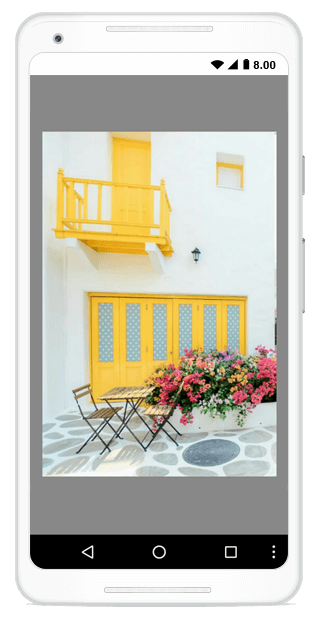
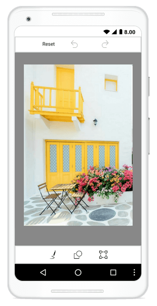
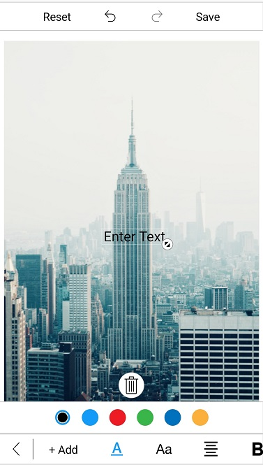
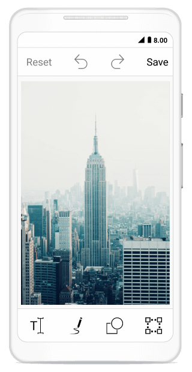

## ToolbarCustomization

You can customize the color palette, toolbar visibility and appearance of each toolbar item.

## Customize toolbar items

The SfImageEditor control supports to customize and configure the appearance of toolbar menu. You can customize image editor toolbar by adding respective FooterToolbarItem and HeaderToolbarItem 

#### ToolbarItem

You can customize each toolbar item with the help of `Text` and `Icon` properties.

##### Name
 
 You can get or set the name of individual built-in and dynamically added toolbar item with the help of `Name` property. 



        protected override void OnCreate(Bundle savedInstanceState)
        {
            base.OnCreate(savedInstanceState);
            SfImageEditor editor = new SfImageEditor(this);
            var itemName = editor.ToolbarSettings.ToolbarItems[2].Name;            
        }



N> The following built-in toolbar item names are available in image editor: `Back`, `Text`, `Add`, `TextColor`, `FontFamily`, `Arial`, `Noteworthy`, `Marker Felt`, `Bradley Hand`, `SignPainter`, `Opacity`, `Path`, `StrokeThickness`, `Colors`, `Opacity`, `Shape`, `Rectangle`, `StrokeThickness`, `Circle`, `Arrow`, `Transform`, `Crop`, `free`, `original`, `square`, `3:1`, `3:2`, `4:3`, `5:4`, `16:9`, `Rotate`, `Flip`, `Reset`, `Undo`, `Redo`, `Save`, `Effects`, `Hue`, `Saturation`, `Brightness`, `Contrast`, `Blur` and `Sharpen`.

N> You cannot modify the names of existing built-in toolbar items and cannot create toolbar item with these list.

ImageEditor Toolbar menu contains set of header and footer menu items which helps to perform image editor actions and this can be categorized into the following types,

1.HeaderToolbarItem
2.FooterToolbarItem
3.SubItems

## Adding HeaderToolbarItem

`HeaderToolbarItem` is placed on top of the image editor and you can customize the header toolbar item using the `Icon` and `Text` properties.



            editor.ToolbarSettings.ToolbarItems.Add(new HeaderToolbarItem() { Icon = BitmapFactory.DecodeResource(Resources, Resource.Drawable.share), Text = "Share" });



## Adding FooterToolbarItem   

The `FooterToolbarItem` is placed on the bottom of the image editor, and you can customize the footer toolbar item using the `Icon` and `Text` properties.

Refer to the below code snippet to customize the footer toolbar item,



            editor.ToolbarSettings.ToolbarItems.Add(new FooterToolbarItem() { Icon = BitmapFactory.DecodeResource(Resources, Resource.Drawable.delete), Text="Delete" });
            editor.ToolbarSettings.ToolbarItems.Add(new FooterToolbarItem() { Icon = BitmapFactory.DecodeResource(Resources, Resource.Drawable.more), Text="More" });



## Adding SubItems to the FooterToolbarItem

The `SubItems` only applicable for `FooterToolbarItem` and it represents grouped action of respective footer toolbar item. The subItems will be placed above the footer toolbar item layout and you can also customize appearance of sub items as main toolbar items. 

Refer to the following code snippet to customize sub items of footer toolbar item,



            editor.ToolbarSettings.ToolbarItems.Add(new FooterToolbarItem()
            {
                Text = "More",
                Icon = BitmapFactory.DecodeResource(Resources, Resource.Drawable.more),
                SubItems = new ObservableCollection<ToolbarItem>()
                {
                   new ToolbarItem() {
                Icon = BitmapFactory.DecodeResource(Resources, Resource.Drawable.download)
                },
                   new ToolbarItem() {
                Icon = BitmapFactory.DecodeResource(Resources, Resource.Drawable.share)
                } }
            });



N> You can remove existing toolbar items [name](/xamarin-android/sfimageeditor/toolbarcustomization#name) from image editor toolbarItems collection based on the index value and change the icon and text value dynamically for any of already added toolbar item based on the index as shown in the following code snippet.



editor.ToolbarSettings.ToolbarItems[5].Text = "new item";
editor.ToolbarSettings.ToolbarItems[3].Icon = BitmapFactory.DecodeResource(Resources, Resource.Drawable.Image)



## ToolbarItemSelected event 

Whenever you tap the toolbar menu item, the `ToolbarItemSelected` event will be triggered and you can get the respective tapped toolbar item as an argument as shown in the following code snippet, 



        protected override void OnCreate(Bundle savedInstanceState)
        {
			   . . .

            editor.ToolbarSettings.ToolbarItemSelected += ToolbarSettings_ToolbarItemSelected;

			   . . .
        }

        private void ToolbarSettings_ToolbarItemSelected(object sender, ToolbarItemSelectedEventArgs e)
        {
            Toast.MakeText(ApplicationContext, "Selected ToolbarItem is  " + e.ToolbarItem.Text, ToastLength.Long).Show();
        }



### MoveSubItemsToFooterToolbar 

The `MoveSubItemsToFooterToolbar` boolean property of ToolbarItemSelected event argument decides the placement of each sub items of respective footer toolbar item. 

If you set the value to `true`, the respective sub items of footer item will be placed on footer toolbar layout. If you set `false`, then the sub items will be placed above the footer toolbar layout.



        protected override void OnCreate(Bundle savedInstanceState)
            {
                        . . .

               
            SfImageEditor edit = new SfImageEditor(this);
            edit.ToolbarSettings.ToolbarItems.Add(new FooterToolbarItem()
				{
					Text = "NewFooterItem",
					SubItems = new System.Collections.Generic.List<ToolbarItem>()
							{
								new ToolbarItem(){ Text= "Subitem1"},
								new ToolbarItem(){ Text= "Subitem2"},
								new ToolbarItem(){ Text= "Subitem3"},
							}
				});
                edit.ToolbarSettings.ToolbarItemSelected += ToolbarSettings_ToolbarItemSelected;
                        
                        . . .
            }

          private void ToolbarSettings_ToolbarItemSelected(object sender, ToolbarItemSelectedEventArgs e)
            {
                if(e.ToolbarItem != null && e.ToolbarItem is FooterToolbarItem)
                {
                    if(e.ToolbarItem.Text == "NewFooterItem")
                    {
                        e.MoveSubItemsToFooterToolbar = false;
                    }
                }
            }



N> This is not applicable for built-in footer toolbar items .

## To Hide/Show toolbar
 
 To show or hide toolbar by setting toolbar `IsVisible` property to either true or false. By default toolbar `IsVisible` property is set to true.





     
     editor.ToolbarSettings.IsVisible = false;
     





## To Hide/Visible the toolbar Item

You can hide or show the toolbar items by specifying its icon name and set boolean value to false or true.

N> You can customize an icon by specifying its [names](/xamarin-android/sfimageeditor/toolbarcustomization#name)





    editor.SetToolbarItemVisibility("text,save", false);





## To customize the ColorPalette

You can change default colors of the ColorPalette in toolbar.





    	ObservableCollection<Color> CustomColorPalette = new ObservableCollection<Color>()
	{
				Color.Yellow,
				Color.Blue,
				Color.DarkGray
	};

			editor.ColorPalette = CustomColorPalette;




## Default Color Selected Index

You can change the default index of the color palette in toolbar. By default, color palette index value is 2.





    editor.DefaultSelectedColorIndex = 0;





## ToolbarHeight Customization

You can customize `height of the toolbar` and also toolbar items `icon` and `text`.

## Customize Toolbar Height 

SfImageEditor control supports to customize the default height of `Header`, `Footer` and `Sub item` Toolbar by using following properties,
1.	HeaderToolbarHeight
2.	FooterToolbarHeight 
3.	SubItemToolbarHeight

Toolbar items will be resize based on the toolbar height. To change Height of the Toolbar as like below,





    editor.ToolbarSettings.HeaderToolbarHeight = 70;
    editor.ToolbarSettings.FooterToolbarHeight = 70;
    editor.ToolbarSettings.SubItemToolbarHeight = 70;





## Individual Toolbar Item Height Customization

You can arrange the toolbar items based on the toolbar height using the following properties:

1.  TextHeight
2.  IconHeight

To change the toolbar item Text and Icon height as like below,





     FooterToolbarItem footerItem = new FooterToolbarItem()
            {
                IconHeight=40,
                TextHeight=20,
                Icon = BitmapFactory.DecodeResource(Resources, Resource.Drawable.share),
                Text = "Share"
            };

            editor.ToolbarSettings.ToolbarItems.Add(footerItem);
    



