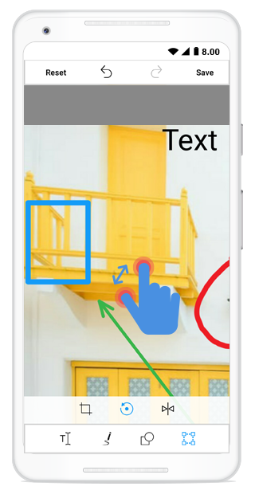

## Zooming

The image editor control provides support for zooming and panning.You can Zoom in and Zoom out image in image editor control.

The following properties are used for zooming feature of the image editor control:

* EnableZooming
* Maximum ZoomLevel
* PanningMode

## EnableZooming

You can enable or disable the zooming functionality by setting the `EnableZooming` value to true or false. By default, the `EnableZooming` value is set to true.





     editor.EnableZooming = false;





## Maximum ZoomLevel

You can set the maximum zoom level to image using the `MaximumZoomLevel` property.





     editor.EnableZooming = true;
     editor.MaximumZoomLevel = 8;





## PanningMode

Image editor control provides support for panning. Image editor allows you to pan the image with two fingers or single finger by setting the `PanningMode`.

The following properties are used in the panning.

* `SingleFinger`: Zooms or pans the image with single finger, but shapes and text selection cannot be performed with this mode.

* `TwoFinger`: Zooms or pans the image with two finger. The shapes and text selection can be performed with this mode.

By default, `PanningMode` value as `TwoFinger`.





editor.PanningMode = PanningMode.TwoFinger;





