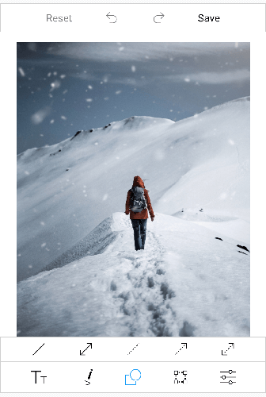
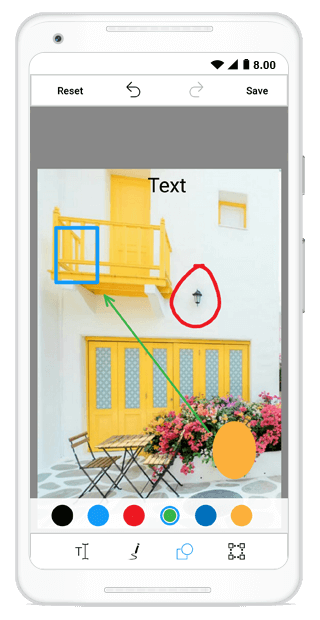
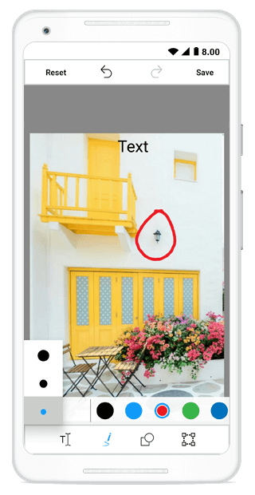

# Shapes and its customization

You can annotate any shapes over an image using the [`AddShape`](https://help.syncfusion.com/cr/xamarin-android/Syncfusion.SfImageEditor.Android.SfImageEditor.html#Syncfusion_SfImageEditor_Android_SfImageEditor_AddShape_Syncfusion_SfImageEditor_Android_ShapeType_Syncfusion_SfImageEditor_Android_PenSettings_) method. The following shapes are available in image editor:

* Circle
* Rectangle
* Arrow
* Path
* Line
* Dotted
* DoubleArrow
* DottedArrow
* DottedDoubleArrow

### Selecting a shape type

The [`ShapeType`](https://help.syncfusion.com/cr/xamarin-android/Syncfusion.SfImageEditor.Android.ShapeType.html) is an enum property with values of [`Rectangle`](https://help.syncfusion.com/cr/xamarin-android/Syncfusion.SfImageEditor.Android.ShapeType.html#Syncfusion_SfImageEditor_Android_ShapeType_Rectangle), [`Circle`](https://help.syncfusion.com/cr/xamarin-android/Syncfusion.SfImageEditor.Android.ShapeType.html#Syncfusion_SfImageEditor_Android_ShapeType_Circle), [`Arrow`](https://help.syncfusion.com/cr/xamarin-android/Syncfusion.SfImageEditor.Android.ShapeType.html#Syncfusion_SfImageEditor_Android_ShapeType_Arrow), [`Path`](https://help.syncfusion.com/cr/xamarin-android/Syncfusion.SfImageEditor.Android.ShapeType.html#Syncfusion_SfImageEditor_Android_ShapeType_Path), [`Line`](https://help.syncfusion.com/cr/xamarin-android/Syncfusion.SfImageEditor.Android.ShapeType.html#Syncfusion_SfImageEditor_Android_ShapeType_Line), [`Dotted`](https://help.syncfusion.com/cr/xamarin-android/Syncfusion.SfImageEditor.Android.ShapeType.html#Syncfusion_SfImageEditor_Android_ShapeType_Dotted), [`DoubleArrow`](https://help.syncfusion.com/cr/xamarin-android/Syncfusion.SfImageEditor.Android.ShapeType.html#Syncfusion_SfImageEditor_Android_ShapeType_DoubleArrow), [`DottedArrow`](https://help.syncfusion.com/cr/xamarin-android/Syncfusion.SfImageEditor.Android.ShapeType.html#Syncfusion_SfImageEditor_Android_ShapeType_DottedArrow),and [`DottedDoubleArrow`](https://help.syncfusion.com/cr/xamarin-android/Syncfusion.SfImageEditor.Android.ShapeType.html#Syncfusion_SfImageEditor_Android_ShapeType_DottedDoubleArrow). You can give the desired shape type as an argument to the [`AddShape`](https://help.syncfusion.com/cr/xamarin-android/Syncfusion.SfImageEditor.Android.SfImageEditor.html#Syncfusion_SfImageEditor_Android_SfImageEditor_AddShape_Syncfusion_SfImageEditor_Android_ShapeType_Syncfusion_SfImageEditor_Android_PenSettings_) method.



      editor.AddShape(ShapeType.Circle);



By default, the toolbar contains the [`Rectangle`](https://help.syncfusion.com/cr/xamarin-android/Syncfusion.SfImageEditor.Android.ImageEditorShapes.html#Syncfusion_SfImageEditor_Android_ImageEditorShapes_Rectangle), [`Circle`](https://help.syncfusion.com/cr/xamarin-android/Syncfusion.SfImageEditor.Android.ImageEditorShapes.html#Syncfusion_SfImageEditor_Android_ImageEditorShapes_Circle) and [`Arrow`](https://help.syncfusion.com/cr/xamarin-android/Syncfusion.SfImageEditor.Android.ImageEditorShapes.html#Syncfusion_SfImageEditor_Android_ImageEditorShapes_Arrow) shapes. You can add other shapes to the toolbar items by using the [`VisibleShapesItems`](https://help.syncfusion.com/cr/xamarin-android/Syncfusion.SfImageEditor.Android.ToolbarSettings.html#Syncfusion_SfImageEditor_Android_ToolbarSettings_VisibleShapesItems) in [`ToolbarSettings`](https://help.syncfusion.com/cr/xamarin-android/Syncfusion.SfImageEditor.Android.SfImageEditor.html#Syncfusion_SfImageEditor_Android_SfImageEditor_ToolbarSettings).

[`VisibleShapesItems`](https://help.syncfusion.com/cr/xamarin-android/Syncfusion.SfImageEditor.Android.ToolbarSettings.html#Syncfusion_SfImageEditor_Android_ToolbarSettings_VisibleShapesItems) is a flagged enum property with values of [`Rectangle`](https://help.syncfusion.com/cr/xamarin-android/Syncfusion.SfImageEditor.Android.ImageEditorShapes.html#Syncfusion_SfImageEditor_Android_ImageEditorShapes_Rectangle), [`Circle`](https://help.syncfusion.com/cr/xamarin-android/Syncfusion.SfImageEditor.Android.ImageEditorShapes.html#Syncfusion_SfImageEditor_Android_ImageEditorShapes_Circle), [`Arrow`](https://help.syncfusion.com/cr/xamarin-android/Syncfusion.SfImageEditor.Android.ImageEditorShapes.html#Syncfusion_SfImageEditor_Android_ImageEditorShapes_Arrow), [`Line`](https://help.syncfusion.com/cr/xamarin-android/Syncfusion.SfImageEditor.Android.ImageEditorShapes.html#Syncfusion_SfImageEditor_Android_ImageEditorShapes_Line), [`Dotted`](https://help.syncfusion.com/cr/xamarin-android/Syncfusion.SfImageEditor.Android.ImageEditorShapes.html#Syncfusion_SfImageEditor_Android_ImageEditorShapes_Dotted), [`DoubleArrow`](https://help.syncfusion.com/cr/xamarin-android/Syncfusion.SfImageEditor.Android.ImageEditorShapes.html#Syncfusion_SfImageEditor_Android_ImageEditorShapes_DoubleArrow), [`DottedArrow`](https://help.syncfusion.com/cr/xamarin-android/Syncfusion.SfImageEditor.Android.ImageEditorShapes.html#Syncfusion_SfImageEditor_Android_ImageEditorShapes_DottedArrow), and [`DottedDoubleArrow`](https://help.syncfusion.com/cr/xamarin-android/Syncfusion.SfImageEditor.Android.ImageEditorShapes.html#Syncfusion_SfImageEditor_Android_ImageEditorShapes_DottedDoubleArrow). You can specify one or more shapes in the property to add shapes into the toolbar.



      editor.ToolbarSettings.VisibleShapesItems = ImageEditorShapes.Line | ImageEditorShapes.Dotted | 
                                                  ImageEditorShapes.DottedArrow | 
                                                  ImageEditorShapes.DottedDoubleArrow |
                                                  ImageEditorShapes.DoubleArrow;



## Customizing a shape with pen settings

You can customize the appearance of each shape using the [`PenSettings`](https://help.syncfusion.com/cr/xamarin-android/Syncfusion.SfImageEditor.Android.PenSettings.html) property:

## PenSettings

The [`PenSettings`](https://help.syncfusion.com/cr/xamarin-android/Syncfusion.SfImageEditor.Android.PenSettings.html) property consists of the following properties:

* [`Color`](https://help.syncfusion.com/cr/xamarin-android/Syncfusion.SfImageEditor.Android.PenSettings.html#Syncfusion_SfImageEditor_Android_PenSettings_Color): Specifies the desired stroke color to a shape.
* `FillColor`: Specifies the desired fill color to a shape.
* [`StrokeWidth`](https://help.syncfusion.com/cr/xamarin-android/Syncfusion.SfImageEditor.Android.PenSettings.html#Syncfusion_SfImageEditor_Android_PenSettings_StrokeWidth): Allows to denote the stroke width for the desired shape.
* [`Mode`](https://help.syncfusion.com/cr/xamarin-android/Syncfusion.SfImageEditor.Android.PenSettings.html#Syncfusion_SfImageEditor_Android_PenSettings_Mode): Determines whether the shape color mode is `Fill` or `Stroke`. It is an enum value.
* [`Opacity`](https://help.syncfusion.com/cr/xamarin-android/Syncfusion.SfImageEditor.Android.PenSettings.html#Syncfusion_SfImageEditor_Android_PenSettings_Opacity): Denotes opacity for the desired shapes.
* [`Bounds`](https://help.syncfusion.com/cr/xamarin-android/Syncfusion.SfImageEditor.Android.PenSettings.html#Syncfusion_SfImageEditor_Android_PenSettings_Bounds): Allows to set frame for the newly added shapes (rectangle and circle). You can position the shapes wherever you want on the image.In percentage, the value of the shape frame should fall between 0 and 100.
* [`EnableDrag`](https://help.syncfusion.com/cr/xamarin-android/Syncfusion.SfImageEditor.Android.PenSettings.html#Syncfusion_SfImageEditor_Android_PenSettings_EnableDrag) - Controls the dragging of selected shape over the image.

N> The `FillColor` property is applicable only if the ShapeType is [`Rectangle`](https://help.syncfusion.com/cr/xamarin-android/Syncfusion.SfImageEditor.Android.ImageEditorShapes.html#Syncfusion_SfImageEditor_Android_ImageEditorShapes_Rectangle) or [`Circle`](https://help.syncfusion.com/cr/xamarin-android/Syncfusion.SfImageEditor.Android.ImageEditorShapes.html#Syncfusion_SfImageEditor_Android_ImageEditorShapes_Circle).

* To add a rectangle, circle, or arrow over an image, specify the [`ShapeType`](https://help.syncfusion.com/cr/xamarin-android/Syncfusion.SfImageEditor.Android.ShapeType.html) and the desired [`PenSettings`]([`PenSettings`](https://help.syncfusion.com/cr/xamarin-android/Syncfusion.SfImageEditor.Android.PenSettings.html)) as shown in the following code snippet.





      editor.AddShape(ShapeType.Circle, new PenSettings() {Color = Color.Red, Mode= Mode.Stroke, Opacity=1f, Bounds = new Rectangle(20,20,35,35)});





* You can annotate any path on an image using free hand drawing as shown in the following code snippet.





      editor.AddShape(ShapeType.Path, new PenSettings() { StrokeWidth = 10 });





## Deleting a shape or text from view

You can delete the selected shape by using the [`Delete`](https://help.syncfusion.com/cr/xamarin-android/Syncfusion.SfImageEditor.Android.SfImageEditor.html#Syncfusion_SfImageEditor_Android_SfImageEditor_Delete) method as shown in the following code snippet.





    editor.Delete();





N> You cannot delete the path.
