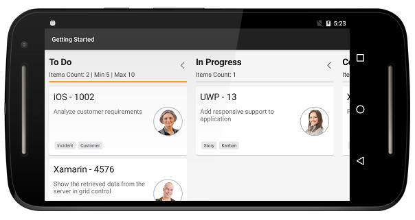

# SfKanban Getting Started          

This section provides a quick overview for working with the kanban control for Xamarin.Android. Using the kanban control is an efficient way to visualize the workflows along with their paths at each stage of completion.

## Referencing Essential Studio components in your solution

After installing Essential Studio for Xamarin, you can find all the required assemblies in the installation folders.

{Syncfusion Installed location}\Essential Studio{14.2.0.26}\lib

Note: Assemblies are available in an unzipped package location in Mac.

Add the following assembly reference to your Android project.

android\Syncfusion.SfKanban.Android.dll

## Creating a simple kanban

This section explains how to create a SfKanban and configure it.

The following screenshot illustrates the final output of SfKanban on Android devices. You can download the entire [source code](https://github.com/SyncfusionExamples/Kanban-GettingStarted-in-Xamarin-Android) of this demo for Xamarin.Android.

The following section describes how to create a new kanban application.

## Adding SfKanban in Xamarin.Android

1. Add the required assembly references to the project as discussed in the _Referencing Essential Studio Components in your solution_ section.
2. Import [`SfKanban`](http://help.syncfusion.com/cr/xamarin-android/Syncfusion.SfKanban.Android.SfKanban.html) control namespace in [`Syncfusion.SfKanban.Android`](https://help.syncfusion.com/cr/xamarin-android/Syncfusion.SfKanban.Android.html).
3. Create an instance of [`SfKanban`](http://help.syncfusion.com/cr/xamarin-android/Syncfusion.SfKanban.Android.SfKanban.html) control, and set is as content view of the activity.


using System.Collections.ObjectModel;
using Syncfusion.SfKanban.Android; 

namespace Getting_Started
{
[Activity(Label = “Getting Started”, MainLauncher = true, Icon = “@drawable/icon”)]
public  class MainActivity : Activity
{
	public override void OnCreate(Bundle bundle)
	{		
		base.OnCreate(bundle);
		SfKanban kanban = new SfKanban(this);	
		SetContentView(kanban);
	}
}
}


## Creating KanbanModel for the SfKanban

Create a collection of [`KanbanModel`](http://help.syncfusion.com/cr/xamarin-android/Syncfusion.SfKanban.Android.KanbanModel.html) objects for populating [`SfKanban`](http://help.syncfusion.com/cr/xamarin-android/Syncfusion.SfKanban.Android.SfKanban.html).


using System.Collections.ObjectModel;
using Syncfusion.SfKanban.Android; 

namespace Getting_Started
{
[Activity(Label = “Getting Started”, MainLauncher = true, Icon = “@drawable/icon”)]
public class MainActivity : Activity
{
	ObservableCollection<KanbanModel> ItemsSourceCards()
	{
		ObservableCollection<KanbanModel> cards = new ObservableCollection<KanbanModel>();
		cards.Add(new KanbanModel() { 
			ID = 1, 
			Title = "iOS - 1002", 
			ImageURL = "Image1.png", 
			Category = "Open", 
			Description = "Analyze customer requirements", 
			ColorKey = "Red",
			Tags = new string[] { "Incident", "Customer" }
		});
		
		cards.Add(new KanbanModel() { 
			ID = 6, 
			Title = "Xamarin - 4576", 
			ImageURL = "Image2.png", 
			Category = "Open",
			Description = "Show the retrieved data from the server in grid control" 
			ColorKey = "Green", 
			Tags = new string[] { "SfDataGrid", "Customer" }
		});
		
		cards.Add(new KanbanModel() { 
			ID = 13, 
			Title = "UWP - 13", 
			ImageURL = "Image4.png", 
			Category = "In Progress", 
			Description = "Add responsive support to application", 
			ColorKey = "Brown", 
			Tags = new string[] { "Story", "Kanban" } 
		});  
		
		cards.Add(new KanbanModel() { 
			ID = 2543, 
			Title = "Xamarin_iOS - 2543", 
			Category = "Code Review", 
			ImageURL = "Image12.png", 
			Description = "Provide swimlane support kanban", 
			ColorKey = "Brown", 
			Tags = new string[] { "Feature","SfKanban" } 
		});
		  
		cards.Add(new KanbanModel() { 
			ID = 1975, 
			Title = "iOS - 1975", 
			Category = "Done", 
			ImageURL = "Image11.png", 
			Description = "Fix the issues reported by the customer", 
			ColorKey = "Purple", 
			Tags = new string[] { "Bug" } 
		});   
		
		return cards; 
	} 
}     
}


## Binding data to SfKanban

To bind the data source of the [`SfKanban`](http://help.syncfusion.com/cr/xamarin-android/Syncfusion.SfKanban.Android.SfKanban.html), set the [`ItemsSource`](https://help.syncfusion.com/cr/xamarin-android/Syncfusion.SfKanban.Android.SfKanban.html#Syncfusion_SfKanban_Android_SfKanban_ItemsSource) property. The following code binds the collection created in previous step to the [`ItemsSource`](https://help.syncfusion.com/cr/xamarin-android/Syncfusion.SfKanban.Android.SfKanban.html#Syncfusion_SfKanban_Android_SfKanban_ItemsSource) property.


kanban.ItemsSource = ItemsSourceCards();


## Defining columns

Define the columns manually by adding the [`KanbanColumn`](https://help.syncfusion.com/cr/xamarin-android/Syncfusion.SfKanban.Android.KanbanColumn.html) objects to the [`Columns`](https://help.syncfusion.com/cr/xamarin-android/Syncfusion.SfKanban.Android.SfKanban.html#Syncfusion_SfKanban_Android_SfKanban_Columns) collection property in [`SfKanban`](http://help.syncfusion.com/cr/xamarin-android/Syncfusion.SfKanban.Android.SfKanban.html).

The [`ItemsSource`](https://help.syncfusion.com/cr/xamarin-android/Syncfusion.SfKanban.Android.SfKanban.html#Syncfusion_SfKanban_Android_SfKanban_ItemsSource) bound to the kanban will be added to the respective columns using the [`ColumnMappingPath`](https://help.syncfusion.com/cr/xamarin-android/Syncfusion.SfKanban.Android.SfKanban.html#Syncfusion_SfKanban_Android_SfKanban_ColumnMappingPath) property in the [`SfKanban`](http://help.syncfusion.com/cr/xamarin-android/Syncfusion.SfKanban.Android.SfKanban.html) and [`Categories`](https://help.syncfusion.com/cr/xamarin-android/Syncfusion.SfKanban.Android.KanbanColumn.html#Syncfusion_SfKanban_Android_KanbanColumn_Categories) collection properties in [`KanbanColumn`](https://help.syncfusion.com/cr/xamarin-android/Syncfusion.SfKanban.Android.KanbanColumn.html).

Set the required property name to [`ColumnMappingPath`](https://help.syncfusion.com/cr/xamarin-android/Syncfusion.SfKanban.Android.SfKanban.html#Syncfusion_SfKanban_Android_SfKanban_ColumnMappingPath). It is essential to add data to the respective columns.

In the following code sample, the data whose [`Category`](https://help.syncfusion.com/cr/xamarin-android/Syncfusion.SfKanban.Android.KanbanModel.html#Syncfusion_SfKanban_Android_KanbanModel_Category) property’s value is set to `Open` will be added to the openColumn, [`Title`](https://help.syncfusion.com/cr/xamarin-android/Syncfusion.SfKanban.Android.KanbanColumn.html#Syncfusion_SfKanban_Android_KanbanColumn_Title) and other data will be added to the respective columns.

The following code sample demonstrates how to define columns.


kanban.ColumnMappingPath = "Category"; 
 
KanbanColumn openColumn = new KanbanColumn();
openColumn.Title = "To Do"; 
openColumn.Categories = new List<object>() { "Open" };
kanban.Columns.Add(openColumn);  

KanbanColumn progressColumn = new KanbanColumn();
progressColumn.Title = "In Progress";  
progressColumn.Categories = new List<object>() { "In Progress" }; 
kanban.Columns.Add(progressColumn);  
 
KanbanColumn codeColumn = new KanbanColumn(); 
codeColumn.Title = "Code Review"; 
codeColumn.Categories = new List<object>() { "Code Review" };  
kanban.Columns.Add(codeColumn);  

KanbanColumn doneColumn = new KanbanColumn(); 
doneColumn.Title = "Done"; 
doneColumn.Categories = new List<object>() { "Done" };  
kanban.Columns.Add(doneColumn); 


Set the [`AutoGenerateColumns`](https://help.syncfusion.com/cr/xamarin-android/Syncfusion.SfKanban.Android.SfKanban.html#Syncfusion_SfKanban_Android_SfKanban_AutoGenerateColumns) property to true, in which you don't need to define the columns as mentioned in the previous code sample. This will create columns depending on the [`ColumnMappingPath`](https://help.syncfusion.com/cr/xamarin-android/Syncfusion.SfKanban.Android.SfKanban.html#Syncfusion_SfKanban_Android_SfKanban_ColumnMappingPath) property for all the distinct values in [`ItemsSource`](https://help.syncfusion.com/cr/xamarin-android/Syncfusion.SfKanban.Android.SfKanban.html#Syncfusion_SfKanban_Android_SfKanban_ItemsSource).

When the columns are auto-generated, you can handle the [`ColumnsGenerated`](https://help.syncfusion.com/cr/xamarin-android/Syncfusion.SfKanban.Android.SfKanban.html) event to customize the columns after they are added to the [`ActualColumns`](https://help.syncfusion.com/cr/xamarin-android/Syncfusion.SfKanban.Android.SfKanban.html#Syncfusion_SfKanban_Android_SfKanban_ActualColumns) collection in [`SfKanban`](http://help.syncfusion.com/cr/xamarin-android/Syncfusion.SfKanban.Android.SfKanban.html).

## Customizing Column Size

By default, columns are sized smartly to arrange the default elements of the cards with better readability. However, you can define the minimum and maximum width for the columns in SfKanban using [`SfKanban.MinColumnWidth`](https://help.syncfusion.com/cr/xamarin-android/Syncfusion.SfKanban.Android.SfKanban.html#Syncfusion_SfKanban_Android_SfKanban_MinColumnWidth) and [`SfKanban.MaxColumnWidth`](https://help.syncfusion.com/cr/xamarin-android/Syncfusion.SfKanban.Android.SfKanban.html#Syncfusion_SfKanban_Android_SfKanban_MaxColumnWidth) properties respectively.



kanban.MaxColumnWidth = 340;
kanban.MinColumnWidth = 300;



You can also define the exact column width using [`SfKanban.ColumnWidth`](https://help.syncfusion.com/cr/xamarin-android/Syncfusion.SfKanban.Android.SfKanban.html#Syncfusion_SfKanban_Android_SfKanban_ColumnWidth) property.



kanban.ColumnWidth = 250;
	


## Expand/Collapse Column

Columns can be expanded/collapsed by tapping the toggle button which is placed at top right corner of the Kanban header. [`IsExpanded`](https://help.syncfusion.com/cr/xamarin-android/Syncfusion.SfKanban.Android.KanbanColumn.html#Syncfusion_SfKanban_Android_KanbanColumn_IsExpanded) property is used to programmatically expand/collapse the Kanban column. The following code example describes the above behavior.



KanbanColumn openColumn = new KanbanColumn();
openColumn.IsExpanded = false; 
KanbanColumn progressColumn = new KanbanColumn();
progressColumn.IsExpanded = false;

kanban.Columns.Add(openColumn);
kanban.Columns.Add(progressColumn);



## Enable/Disable Drag & Drop

You can enable and disable the drag and drop operation of the cards for particular column using [`KanbanColumn.AllowDrag`](https://help.syncfusion.com/cr/xamarin-android/Syncfusion.SfKanban.Android.KanbanColumn.html#Syncfusion_SfKanban_Android_KanbanColumn_AllowDrag) and [`KanbanColumn.AllowDrop`](https://help.syncfusion.com/cr/xamarin-android/Syncfusion.SfKanban.Android.KanbanColumn.html#Syncfusion_SfKanban_Android_KanbanColumn_AllowDrop) properties.

The following code is used to disable the drag operation from progress column.



KanbanColumn progressColumn = new KanbanColumn();
progressColumn.AllowDrag = false;



The following code is used to disable the drop operation of the cards into the progress column.



KanbanColumn progressColumn = new KanbanColumn();
progressColumn.AllowDrop = false;



## Items Count

[`ItemsCount`](https://help.syncfusion.com/cr/xamarin-android/Syncfusion.SfKanban.Android.KanbanColumn.html#Syncfusion_SfKanban_Android_KanbanColumn_ItemsCount) property is used to get the total cards count in each column.



int count = openColumn.ItemsCount;         



## Working with workflows

A kanban workflow is a set of [`Category`](https://help.syncfusion.com/cr/xamarin-android/Syncfusion.SfKanban.Android.KanbanWorkflow.html#Syncfusion_SfKanban_Android_KanbanWorkflow_Category) and  [`AllowedTransitions`](https://help.syncfusion.com/cr/xamarin-android/Syncfusion.SfKanban.Android.KanbanWorkflow.html#Syncfusion_SfKanban_Android_KanbanWorkflow_AllowedTransitions) that an item moves through during its life cycle and typically represents processes within your organization.

[`Category`](https://help.syncfusion.com/cr/xamarin-android/Syncfusion.SfKanban.Android.KanbanWorkflow.html#Syncfusion_SfKanban_Android_KanbanWorkflow_Category) represents a state of an item at a particular point in a specific workflow. An item can be in only one category at a specific point of time.

[`AllowedTransitions`](https://help.syncfusion.com/cr/xamarin-android/Syncfusion.SfKanban.Android.KanbanWorkflow.html#Syncfusion_SfKanban_Android_KanbanWorkflow_AllowedTransitions) is a list of categories to where the card can be moved from the current category. 

## Creating workflows

Initialize the [`Workflows`](https://help.syncfusion.com/cr/xamarin-android/Syncfusion.SfKanban.Android.SfKanban.html#Syncfusion_SfKanban_Android_SfKanban_Workflows) property with a list of [`KanbanWorkflow`](https://help.syncfusion.com/cr/xamarin-android/Syncfusion.SfKanban.Android.KanbanWorkflow.html) instances. Each instance represents a workflow in Kanban. The following code sample demonstrates how to create a workflow.


var workflows = new List<KanbanWorkflow>();

var openWorkflow = new KanbanWorkflow();
openWorkflow.Category = "Open"; 
openWorkflow.AllowedTransitions = new List<object> { "In Progress" };  

var progressWorkflow = new KanbanWorkflow(); 
progressWorkflow.Category = "In Progress"; 
progressWorkflow.AllowedTransitions = new List<object> { "Open", "Code Review", "Closed-No Code Changes" };  

workflows.Add(openWorkflow); 
workflows.Add(progressWorkflow);    

kanban.Workflows = workflows;  


## Work in-progress limit

In a column, you can set the minimum and maximum items limit by using the [`MinimumLimit`](https://help.syncfusion.com/cr/xamarin-android/Syncfusion.SfKanban.Android.KanbanColumn.html#Syncfusion_SfKanban_Android_KanbanColumn_MinimumLimit) and [`MaximumLimit`](https://help.syncfusion.com/cr/xamarin-android/Syncfusion.SfKanban.Android.KanbanColumn.html#Syncfusion_SfKanban_Android_KanbanColumn_MaximumLimit) properties. However, this will not restrict moving the items from one column to another column. But, the violation of the limit can be indicated by changing the color of the error bar.


openColumn.MinimumLimit = 5; 
openColumn.MaximumLimit = 10;   


The following properties of [`ErrorBarSettings`](https://help.syncfusion.com/cr/xamarin-android/Syncfusion.SfKanban.Android.KanbanColumn.html#Syncfusion_SfKanban_Android_KanbanColumn_ErrorBarSettings) are used to customize the appearance of error bar:

* [`Color`](https://help.syncfusion.com/cr/xamarin-android/Syncfusion.SfKanban.Android.KanbanErrorBarSettings.html#Syncfusion_SfKanban_Android_KanbanErrorBarSettings_Color): Changes the default color of the error bar.
* [`MaxValidationColor`](https://help.syncfusion.com/cr/xamarin-android/Syncfusion.SfKanban.Android.KanbanErrorBarSettings.html#Syncfusion_SfKanban_Android_KanbanErrorBarSettings_MaxValidationColor): Changes the maximum validation color of the error bar.
* [`MinValidationColor`](https://help.syncfusion.com/cr/xamarin-android/Syncfusion.SfKanban.Android.KanbanErrorBarSettings.html#Syncfusion_SfKanban_Android_KanbanErrorBarSettings_MinValidationColor): Changes the minimum validation color of the error bar.
* [`Height`](https://help.syncfusion.com/cr/xamarin-android/Syncfusion.SfKanban.Android.KanbanErrorBarSettings.html#Syncfusion_SfKanban_Android_KanbanErrorBarSettings_Height): Changes the height of the error bar.


openColumn.ErrorBarSettings.Color = Color.Green; 
openColumn.ErrorBarSettings.MinValidationColor = Color.Orange; 
openColumn.ErrorBarSettings.MaxValidationColor = Color.Red; 
openColumn.ErrorBarSettings.Height = 4;    


