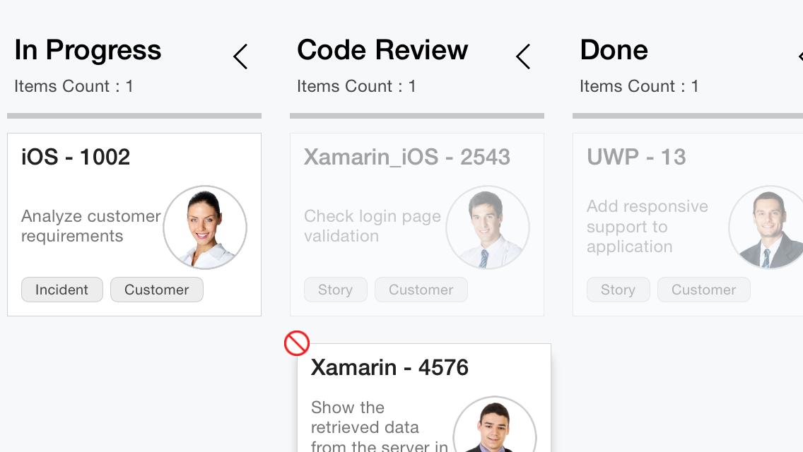

# Workflows

This feature is used to define the flow of card transition from one state to another. Create an instance of [`KanbanWorkflow`](https://help.syncfusion.com/cr/xamarin-android/Syncfusion.SfKanban.Android.KanbanWorkflow.html) class and add it to the [`SfKanban.Workflows`](https://help.syncfusion.com/cr/xamarin-android/Syncfusion.SfKanban.Android.SfKanban.html#Syncfusion_SfKanban_Android_SfKanban_Workflows) property to define the workflow for each column. The [`KanbanWorkflow`](https://help.syncfusion.com/cr/xamarin-android/Syncfusion.SfKanban.Android.KanbanWorkflow.html) contains the following properties to define the source category and target categories:

* [`Category`](https://help.syncfusion.com/cr/xamarin-android/Syncfusion.SfKanban.Android.KanbanWorkflow.html#Syncfusion_SfKanban_Android_KanbanWorkflow_Category): Defines the source category/state.
* [`AllowedTransitions`](https://help.syncfusion.com/cr/xamarin-android/Syncfusion.SfKanban.Android.KanbanWorkflow.html#Syncfusion_SfKanban_Android_KanbanWorkflow_AllowedTransitions): Defines a list of categories/states. The card with the state specified in KanbanWorkflow.Category is allowed to transit.

The following code sample demonstrates the workflow functionality.



var workflows = new List<KanbanWorkflow>();

var openWorkflow = new KanbanWorkflow();  
openWorkflow.Category = "Open"; 
//Define a list of categories that accepts the cards from open state.
openWorkflow.AllowedTransitions = new List<object> { "In Progress" }; 
workflows.Add(openWorkflow); 

var progressWorkflow = new KanbanWorkflow(); 
progressWorkflow.Category = "In Progress"; 
//Define a list of categories that accepts the cards from “In Progress” state.
progressWorkflow.AllowedTransitions = new List<object> { "Open", "Code Review", "Closed-No Code Changes" }; 
workflows.Add(progressWorkflow); 

kanban.Workflows = workflows;



In the following screenshot, you can see a card picked from open state is not allowed to drop on “Code Review” and "Done" states, because the cards have been defined to move from Open to “In Progress” state only.

