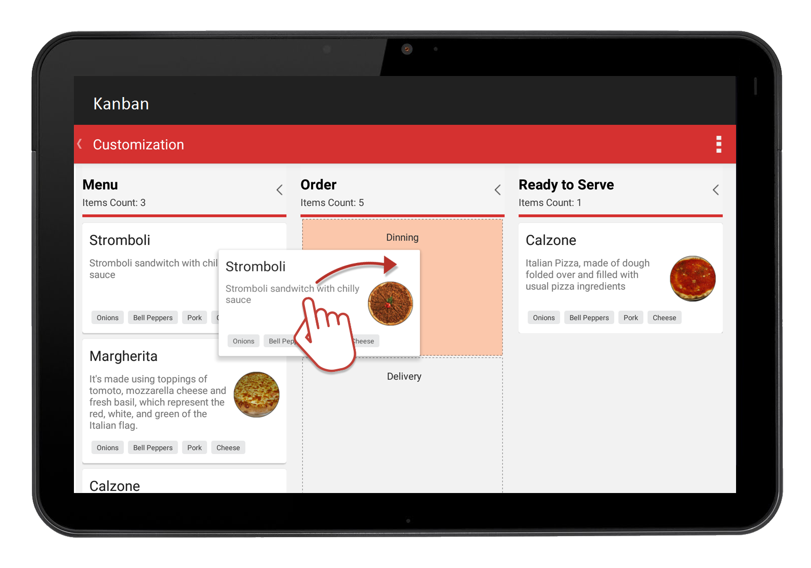

# Kanban

The kanban control is used to visualize a workflow at each stage of completion in an efficient way.

## Key features

* Visualizes the workflow of any process.
* Limits a work in progress (WIP).
* Manages workflow transitions.
* Customizes workflows at a high level.
* Allows smooth transitions within processes.
