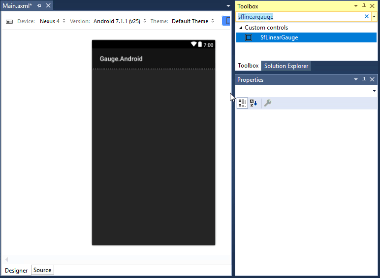
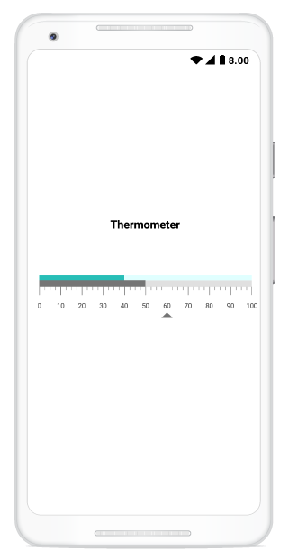

# Getting Started

This section explains the steps required to configure a [`SfLinearGauge`](https://help.syncfusion.com/cr/xamarin-android/Com.Syncfusion.Gauges.SfLinearGauge.SfLinearGauge.html) control in a real-time scenario and also provides a walk-through on some of the customization features available in [`SfLinearGauge`](https://help.syncfusion.com/cr/xamarin-android/Com.Syncfusion.Gauges.SfLinearGauge.SfLinearGauge.html) control.

**Adding namespace for the added assemblies**



	      using Com.Syncfusion.Gauges.SfLinearGauge;



## Initialize gauge

You can initialize the [`SfLinearGauge`](https://help.syncfusion.com/cr/xamarin-android/Com.Syncfusion.Gauges.SfLinearGauge.SfLinearGauge.html) control with a required optimal name by using the included namespace.



		 protected override void OnCreate(Bundle bundle)
        {
            base.OnCreate(bundle);
            SfLinearGauge linearGauge = new SfLinearGauge(this);        
            SetContentView(linearGauge);
        }



## Initialize gauge in axml:

[`SfLinearGauge`](https://help.syncfusion.com/cr/xamarin-android/Com.Syncfusion.Gauges.SfLinearGauge.SfLinearGauge.html) allows users to drag the control from toolbox to designer window. The properties window will be displayed where you change the necessary functionalities to customize the linear gauge in designer.

In MainActivity, you can access the linear gauge instance defined in axml page using the following code.





        protected override void OnCreate(Bundle savedInstanceState)
        {
            base.OnCreate(savedInstanceState);
            SetContentView(Resource.Layout.activity_main);

            SfLinearGauge linearGauge = FindViewById<SfLinearGauge>(Resource.Id.sfLinearGauge1);

        }





You can create linear gauge using code behind also. The following steps help to add linear gauge using code behind.

## Adding header

You can assign a unique header to [`SfLinearGauge`](https://help.syncfusion.com/cr/xamarin-android/Com.Syncfusion.Gauges.SfLinearGauge.SfLinearGauge.html) by using the [`LinearLabel`](https://help.syncfusion.com/cr/xamarin-android/Com.Syncfusion.Gauges.SfLinearGauge.LinearLabel.html) property and position it wherever as you desired by using the [`Offset`](https://help.syncfusion.com/cr/xamarin-android/Com.Syncfusion.Gauges.SfLinearGauge.LinearLabel.html#Com_Syncfusion_Gauges_SfLinearGauge_LinearLabel_Offset) property.



		    SfLinearGauge linearGauge = new SfLinearGauge(this);
            linearGauge.SetBackgroundColor(Color.White);
            LinearLabel linearHeader = new LinearLabel();
            linearHeader.Text = "Thermometer";
            linearHeader.TextSize = 20;
            linearHeader.FontStyle = Typeface.Create("Helvetica", TypefaceStyle.Bold);
            linearHeader.TextColor = Color.Black;
            linearHeader.Offset = new PointF((float)0.35,(float) 0.35);
            linearGauge.Header = linearHeader;



## Configuring scales

Scales is a collection of [`LinearScale`](https://help.syncfusion.com/cr/xamarin-android/Com.Syncfusion.Gauges.SfLinearGauge.LinearScale.html), which is used to indicate the numeric values. Scale bar, ticks, labels, ranges, and pointers are the sub elements of a scale. 

The [`Minimum`](https://help.syncfusion.com/cr/xamarin-android/Com.Syncfusion.Gauges.SfLinearGauge.LinearScale.html#Com_Syncfusion_Gauges_SfLinearGauge_LinearScale_Minimum) and [`Maximum`](https://help.syncfusion.com/cr/xamarin-android/Com.Syncfusion.Gauges.SfLinearGauge.LinearScale.html#Com_Syncfusion_Gauges_SfLinearGauge_LinearScale_Maximum) properties allow you to set the scale range.



	        LinearScale linearScale = new LinearScale();
            linearScale.ScaleBarColor = Color.ParseColor("#e0e0e0");
            linearScale.LabelColor = Color.ParseColor("#424242");
            linearScale.MajorTickSettings.StrokeWidth = 1;
            linearScale.MinorTickSettings.StrokeWidth = 1;
            linearScale.MajorTickSettings.Length = 20;
            linearScale.MajorTickSettings.Color = Color.Gray;
            linearScale.MinorTickSettings.Color = Color.Gray;
            linearScale.MinorTickSettings.Length = 10;
            linearGauge.Scales.Add(linearScale);
	


## Adding a symbol pointer

[`SymbolPointer`](https://help.syncfusion.com/cr/xamarin-android/Com.Syncfusion.Gauges.SfLinearGauge.SymbolPointer.html) is a shape that can be placed to mark the pointer value in gauge.



	        SymbolPointer symbolPointer = new SymbolPointer();
            symbolPointer.Value = 60;
            symbolPointer.Offset = 50;
            symbolPointer.Color = Color.ParseColor("#757575");
            linearScale.Pointers.Add(symbolPointer);



## Adding a bar pointer

[`BarPointer`](https://help.syncfusion.com/cr/xamarin-android/Com.Syncfusion.Gauges.SfLinearGauge.BarPointer.html) is used to mark the scale values. It starts at the beginning of gauge and ends at the pointer value.



		    BarPointer barPointer = new BarPointer();
            barPointer.Value = 50;
            barPointer.Color = Color.ParseColor("#757575");
            linearScale.Pointers.Add(barPointer);
	


## Adding ranges

You can categorize the scale values using the start and end values properties in [`LinearRange`](https://help.syncfusion.com/cr/xamarin-android/Com.Syncfusion.Gauges.SfLinearGauge.LinearRange.html). You can add multiple ranges for a scale using the `ranges` property.

    
	
		   LinearRange linearRange = new LinearRange();
            linearRange.StartValue = 0;
            linearRange.EndValue = 40;
            linearRange.Color = Color.ParseColor("#27beb7");
            linearRange.Offset = -20;
            linearRange.StartWidth = 10;
            linearRange.EndWidth = 10;
            linearScale.Ranges.Add(linearRange);

            LinearRange linearRange1 = new LinearRange();
            linearRange1.StartValue = 40;
            linearRange1.EndValue = 100;
            linearRange1.Color = Color.LightCyan;
            linearRange1.Offset = -20;
            linearRange1.StartWidth = 10;
            linearRange1.EndWidth = 10;
            linearScale.Ranges.Add(linearRange1);
           linearGauge.Scales.Add(linearScale);



