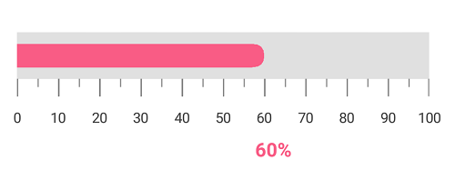
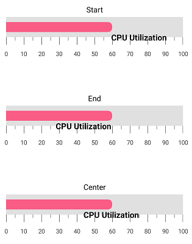
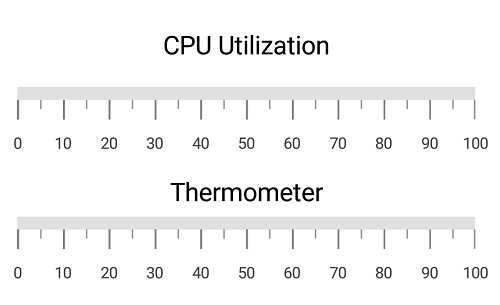

---

layout: post
title: Annotations in LinearGauge
description: Learn how to set annotations in LinearGauge
platform: Xamarin.Android
control: LinearGauge
documentation: ug

---

# Annotations

[`SfLinearGauge`](https://help.syncfusion.com/cr/xamarin-android/Com.Syncfusion.Gauges.SfLinearGauge.SfLinearGauge.html) supports [`Annotations`](https://help.syncfusion.com/cr/xamarin-android/Com.Syncfusion.Gauges.SfLinearGauge.SfLinearGauge.html#Com_Syncfusion_Gauges_SfLinearGauge_SfLinearGauge_Annotations), which is used to mark the specific area of interest in the gauge area with texts, shapes, or images. You can add any number of annotations to the gauge.

##  Annotation

By using the [`View`](https://help.syncfusion.com/cr/xamarin-android/Com.Syncfusion.Gauges.SfLinearGauge.LinearGaugeAnnotation.html#Com_Syncfusion_Gauges_SfLinearGauge_LinearGaugeAnnotation_View) property of annotation object, you can specify the new element that needs to be displayed in the gauge area.


    
            SfLinearGauge linearGauge = new SfLinearGauge(this);
            linearGauge.SetBackgroundColor(Color.White);
            linearGauge.SetOrientation(SfLinearGauge.Orientation.Horizontal);
            LinearGaugeAnnotation linearGaugeAnnotation = new LinearGaugeAnnotation();
            linearGaugeAnnotation.OffsetX =(float) 0.35;
            linearGaugeAnnotation.OffsetY =(float) 0.4;
            TextView textView = new TextView(this);
            textView.Text = "CPU Utilization";
            textView.TextSize = 20;
            textView.SetTextColor(Color.Black);
            linearGaugeAnnotation.View = textView;
            linearGauge.Annotations.Add(linearGaugeAnnotation);
            LinearScale linearScale = new LinearScale();
            linearScale.ScaleBarColor = Color.ParseColor("#e0e0e0");
            linearScale.LabelColor = Color.ParseColor("#424242");
            linearScale.MajorTickSettings.StrokeWidth = 1;
            linearScale.MinorTickSettings.StrokeWidth = 1;
            linearScale.MajorTickSettings.Length = 20;
            linearScale.MajorTickSettings.Color = Color.Gray;
            linearScale.MinorTickSettings.Color = Color.Gray;
            linearScale.MinorTickSettings.Length = 10;
            linearScale.MinorTicksPerInterval = 1;
            linearGauge.Scales.Add(linearScale);
    


##  Positioning the annotation

You can place the annotation anywhere in gauge area by using the `Offset` or `ScaleValue` property.

### Change annotation position by using offset

You can position the annotation anywhere in the linear gauge by using the [`OffsetX`](https://help.syncfusion.com/cr/xamarin-android/Com.Syncfusion.Gauges.SfLinearGauge.LinearGaugeAnnotation.html#Com_Syncfusion_Gauges_SfLinearGauge_LinearGaugeAnnotation_OffsetX) and [`OffsetY`](https://help.syncfusion.com/cr/xamarin-android/Com.Syncfusion.Gauges.SfLinearGauge.LinearGaugeAnnotation.html#Com_Syncfusion_Gauges_SfLinearGauge_LinearGaugeAnnotation_OffsetY) properties. It ranges from 0 to 1.


    
            SfLinearGauge linearGauge = new SfLinearGauge(this);
            linearGauge.SetBackgroundColor(Color.White);
            linearGauge.SetOrientation(SfLinearGauge.Orientation.Horizontal);
            LinearGaugeAnnotation linearGaugeAnnotation = new LinearGaugeAnnotation();
            linearGaugeAnnotation.OffsetX =(float) 0.35;
            linearGaugeAnnotation.OffsetY =(float) 0.6;
            TextView textView = new TextView(this);
            textView.Text = "CPU Utilization";
            textView.TextSize = 20;
            textView.SetTextColor(Color.Black);
            linearGaugeAnnotation.View = textView;
            linearGauge.Annotations.Add(linearGaugeAnnotation);
            LinearScale linearScale = new LinearScale();
            linearScale.ScaleBarColor = Color.ParseColor("#e0e0e0");
            linearScale.LabelColor = Color.ParseColor("#424242");
            linearScale.MajorTickSettings.StrokeWidth = 1;
            linearScale.MinorTickSettings.StrokeWidth = 1;
            linearScale.MajorTickSettings.Length = 20;
            linearScale.MajorTickSettings.Color = Color.Gray;
            linearScale.MinorTickSettings.Color = Color.Gray;
            linearScale.MinorTickSettings.Length = 10;
            linearScale.MinorTicksPerInterval = 1;
            linearGauge.Scales.Add(linearScale);
    


### Change annotation position by using scale value

You can also place the annotation by specifying the [`ScaleValue`](https://help.syncfusion.com/cr/xamarin-android/Com.Syncfusion.Gauges.SfLinearGauge.LinearGaugeAnnotation.html#Com_Syncfusion_Gauges_SfLinearGauge_LinearGaugeAnnotation_ScaleValue) property.


              
             SfLinearGauge linearGauge = new SfLinearGauge(this);
            linearGauge.SetBackgroundColor(Color.White);
            linearGauge.SetOrientation(SfLinearGauge.Orientation.Horizontal);
            LinearGaugeAnnotation linearGaugeAnnotation = new LinearGaugeAnnotation();
            linearGaugeAnnotation.ScaleValue = 60;
            TextView textView = new TextView(this);
            textView.Text = "60%";
            textView.SetBackgroundColor(Color.Red);
            textView.Typeface = Typeface.Create("Helvetica", TypefaceStyle.Bold);
            textView.TextSize = 20;        
            textView.SetTextColor(Color.Black);
            linearGaugeAnnotation.View = textView;
            linearGauge.Annotations.Add(linearGaugeAnnotation);
            LinearScale linearScale = new LinearScale();
            linearScale.ScaleBarColor = Color.ParseColor("#e0e0e0");
            linearScale.LabelColor = Color.ParseColor("#424242");
            linearScale.ScaleBarSize = 40;
            linearScale.MinorTicksPerInterval = 1;
            linearGauge.Scales.Add(linearScale);

            BarPointer barPointer = new BarPointer();
            barPointer.Value = 60;
            barPointer.StrokeWidth = 20;
            barPointer.CornerRadius = 10;
            barPointer.CornerRadiusType = CornerRadiusType.End;
            barPointer.Color = Color.Rgb(249, 92, 133);
            linearScale.Pointers.Add(barPointer);

            linearScale.MajorTickSettings.StrokeWidth = 1;
            linearScale.MinorTickSettings.StrokeWidth = 1;
            linearScale.MajorTickSettings.Length = 20;
            linearScale.MajorTickSettings.Color = Color.Gray;
            linearScale.MinorTickSettings.Color = Color.Gray;
            linearScale.MinorTickSettings.Length = 10;
            linearScale.MinorTicksPerInterval = 1;
            linearGauge.Scales.Add(linearScale);
    


## Set margin to the annotation

You can adjust the annotation by specifying the [`ViewMargin`](https://help.syncfusion.com/cr/xamarin-android/Com.Syncfusion.Gauges.SfLinearGauge.LinearGaugeAnnotation.html#Com_Syncfusion_Gauges_SfLinearGauge_LinearGaugeAnnotation_ViewMargin) property in pixel, which adjusts the annotation element from its current position. 


    
            SfLinearGauge linearGauge = new SfLinearGauge(this);
            linearGauge.SetBackgroundColor(Color.White);
            linearGauge.SetOrientation(SfLinearGauge.Orientation.Horizontal);
            LinearGaugeAnnotation linearGaugeAnnotation = new LinearGaugeAnnotation();
            linearGaugeAnnotation.ScaleValue = 60;
            linearGaugeAnnotation.ViewMargin = new PointF((float)10, (float)60);
            TextView textView = new TextView(this);
            textView.Text = "60%";
            textView.Typeface = Typeface.Create("Helvetica", TypefaceStyle.Bold);
            textView.TextSize = 20;        
            textView.SetTextColor(Color.Rgb(249, 92, 133));
            linearGaugeAnnotation.View = textView;
            linearGauge.Annotations.Add(linearGaugeAnnotation);
            LinearScale linearScale = new LinearScale();
            linearScale.ScaleBarColor = Color.ParseColor("#e0e0e0");
            linearScale.LabelColor = Color.ParseColor("#424242");
            linearScale.ScaleBarSize = 40;
            linearScale.MinorTicksPerInterval = 1;
            linearGauge.Scales.Add(linearScale);

            BarPointer barPointer = new BarPointer();
            barPointer.Value = 60;
            barPointer.StrokeWidth = 20;
            barPointer.CornerRadius = 10;
            barPointer.CornerRadiusType = CornerRadiusType.End;
            barPointer.Color = Color.Rgb(249, 92, 133);
            linearScale.Pointers.Add(barPointer);

            linearScale.MajorTickSettings.StrokeWidth = 1;
            linearScale.MinorTickSettings.StrokeWidth = 1;
           linearScale.MajorTickSettings.Length = 20;
            linearScale.MajorTickSettings.Color = Color.Gray;
            linearScale.MinorTickSettings.Color = Color.Gray;
            linearScale.MinorTickSettings.Length = 10;
            linearScale.MinorTicksPerInterval = 1;
            linearGauge.Scales.Add(linearScale);
    


## Alignment of annotation

You can align the annotation using the [`HorizontalViewAlignment`](https://help.syncfusion.com/cr/xamarin-android/Com.Syncfusion.Gauges.SfLinearGauge.LinearGaugeAnnotation.html#Com_Syncfusion_Gauges_SfLinearGauge_LinearGaugeAnnotation_HorizontalViewAlignment) and [`VerticalViewAlignment`](https://help.syncfusion.com/cr/xamarin-android/Com.Syncfusion.Gauges.SfLinearGauge.LinearGaugeAnnotation.html#Com_Syncfusion_Gauges_SfLinearGauge_LinearGaugeAnnotation_VerticalViewAlignment) properties.

### Setting horizontal view alignment


    
             SfLinearGauge linearGauge = new SfLinearGauge(this);
            linearGauge.SetBackgroundColor(Color.White);
            linearGauge.SetOrientation(SfLinearGauge.Orientation.Horizontal);
            LinearGaugeAnnotation linearGaugeAnnotation = new LinearGaugeAnnotation();
            linearGaugeAnnotation.ScaleValue = 60;
            linearGaugeAnnotation.HorizontalViewAlignment = ViewAlignment.Start;
            TextView textView = new TextView(this);
            textView.Text = "CPU Utilization";
            textView.Typeface = Typeface.Create("Helvetica", TypefaceStyle.Bold);
            textView.TextSize = 15;        
            textView.SetTextColor(Color.Rgb(249, 92, 133));
            linearGaugeAnnotation.View = textView;
            linearGauge.Annotations.Add(linearGaugeAnnotation);
            LinearScale linearScale = new LinearScale();
            linearScale.ScaleBarColor = Color.ParseColor("#e0e0e0");
            linearScale.LabelColor = Color.ParseColor("#424242");
            linearScale.ScaleBarSize = 40;
            linearScale.MinorTicksPerInterval = 1;
            linearGauge.Scales.Add(linearScale);

            BarPointer barPointer = new BarPointer();
            barPointer.Value = 60;
            barPointer.StrokeWidth = 20;
            barPointer.CornerRadius = 10;
            barPointer.CornerRadiusType = CornerRadiusType.End;
            barPointer.Color = Color.Rgb(249, 92, 133);
            linearScale.Pointers.Add(barPointer);

            linearScale.MajorTickSettings.StrokeWidth = 1;
            linearScale.MinorTickSettings.StrokeWidth = 1;
           linearScale.MajorTickSettings.Length = 20;
            linearScale.MajorTickSettings.Color = Color.Gray;
            linearScale.MinorTickSettings.Color = Color.Gray;
            linearScale.MinorTickSettings.Length = 10;
            linearScale.MinorTicksPerInterval = 1;
            linearGauge.Scales.Add(linearScale);
    


### Setting vertical view alignment


    
           SfLinearGauge linearGauge = new SfLinearGauge(this);
            linearGauge.SetBackgroundColor(Color.White);
            linearGauge.SetOrientation(SfLinearGauge.Orientation.Horizontal);
            LinearGaugeAnnotation linearGaugeAnnotation = new LinearGaugeAnnotation();
            linearGaugeAnnotation.ScaleValue = 60;
            linearGaugeAnnotation.VerticalViewAlignment = ViewAlignment.Start;
            TextView textView = new TextView(this);
            textView.Text = "CPU Utilization";
            textView.Typeface = Typeface.Create("Helvetica", TypefaceStyle.Bold);
            textView.TextSize = 15;        
            textView.SetTextColor(Color.Rgb(249, 92, 133));
            linearGaugeAnnotation.View = textView;
            linearGauge.Annotations.Add(linearGaugeAnnotation);
            LinearScale linearScale = new LinearScale();
            linearScale.ScaleBarColor = Color.ParseColor("#e0e0e0");
            linearScale.LabelColor = Color.ParseColor("#424242");
            linearScale.ScaleBarSize = 40;
            linearScale.MinorTicksPerInterval = 1;
            linearGauge.Scales.Add(linearScale);

            BarPointer barPointer = new BarPointer();
            barPointer.Value = 60;
            barPointer.StrokeWidth = 20;
            barPointer.CornerRadius = 10;
            barPointer.CornerRadiusType = CornerRadiusType.End;
            barPointer.Color = Color.Rgb(249, 92, 133);
            linearScale.Pointers.Add(barPointer);

            linearScale.MajorTickSettings.StrokeWidth = 1;
            linearScale.MinorTickSettings.StrokeWidth = 1;
           linearScale.MajorTickSettings.Length = 20;
            linearScale.MajorTickSettings.Color = Color.Gray;
            linearScale.MinorTickSettings.Color = Color.Gray;
            linearScale.MinorTickSettings.Length = 10;
            linearScale.MinorTicksPerInterval = 1;
            linearGauge.Scales.Add(linearScale);
    


## Setting scale index for annotation

You can set the index for the scale by using [`ScaleIndex`](https://help.syncfusion.com/cr/xamarin-android/Com.Syncfusion.Gauges.SfLinearGauge.LinearGaugeAnnotation.html#Com_Syncfusion_Gauges_SfLinearGauge_LinearGaugeAnnotation_ScaleIndex)



             SfLinearGauge linearGauge = new SfLinearGauge(this);
            linearGauge.SetBackgroundColor(Color.White);
            linearGauge.SetOrientation(SfLinearGauge.Orientation.Horizontal);

            LinearGaugeAnnotation linearGaugeAnnotation = new LinearGaugeAnnotation();
            linearGaugeAnnotation.OffsetX = (float)0.5;
            linearGaugeAnnotation.OffsetY = (float)0.45;
            linearGaugeAnnotation.ScaleIndex = 0;
            TextView textView = new TextView(this);
            textView.Text = "CPU Utilization";
            textView.TextSize = 18;        
            textView.SetTextColor(Color.Black);
            linearGaugeAnnotation.View = textView;
            linearGauge.Annotations.Add(linearGaugeAnnotation);

            LinearGaugeAnnotation linearGaugeAnnotation1 = new LinearGaugeAnnotation();
            linearGaugeAnnotation1.OffsetX = (float)0.5;
            linearGaugeAnnotation1.OffsetY = (float)6;
            linearGaugeAnnotation1.ScaleIndex = 1;
            TextView textView1 = new TextView(this);
            textView1.Text = "Thermometer";
            textView1.TextSize = 18;
            textView1.SetTextColor(Color.Black);
            linearGaugeAnnotation1.View = textView1;
            linearGauge.Annotations.Add(linearGaugeAnnotation1);

            LinearScale linearScale = new LinearScale();
            linearScale.Minimum = 0;
            linearScale.Maximum = 100;
            linearScale.ScaleBarColor = Color.ParseColor("#e0e0e0");
            linearScale.LabelColor = Color.ParseColor("#424242");
            linearScale.MajorTickSettings.StrokeWidth = 1;
            linearScale.MinorTickSettings.StrokeWidth = 1;
            linearScale.MajorTickSettings.Length = 20;
            linearScale.MajorTickSettings.Color = Color.Gray;
            linearScale.MinorTickSettings.Color = Color.Gray;
            linearScale.MinorTickSettings.Length = 10;
            linearScale.MinorTicksPerInterval = 1;
            linearScale.MinorTicksPerInterval = 1;
            linearGauge.Scales.Add(linearScale);

            LinearScale linearScale1 = new LinearScale();
            linearScale1.Minimum = 0;
            linearScale1.Maximum = 100;
            linearScale1.ScaleBarColor = Color.ParseColor("#e0e0e0");
            linearScale1.LabelColor = Color.ParseColor("#424242");
            linearScale1.MajorTickSettings.StrokeWidth = 1;
            linearScale1.MinorTickSettings.StrokeWidth = 1;
            linearScale1.MajorTickSettings.Length = 20;
            linearScale1.MajorTickSettings.Color = Color.Gray;
            linearScale1.MinorTickSettings.Color = Color.Gray;
            linearScale1.MinorTickSettings.Length = 10;
            linearScale1.MinorTicksPerInterval = 1;
            linearScale1.Offset = 100;
            linearScale1.MinorTicksPerInterval = 1;
            linearGauge.Scales.Add(linearScale1);
    


## Multiple annotations

You can add multiple annotations to the gauge as demonstrated below.



            SfLinearGauge linearGauge = new SfLinearGauge(this);
            var density = this.Resources.DisplayMetrics.Density;
            linearGauge.SetBackgroundColor(Color.White);
            linearGauge.SetOrientation(SfLinearGauge.Orientation.Horizontal);

            LinearGaugeAnnotation linearGaugeAnnotation = new LinearGaugeAnnotation();
            linearGaugeAnnotation.ScaleValue = 75;
            linearGaugeAnnotation.ViewMargin = new PointF(0, 30);

            ImageView imageView = new ImageView(this);
             imageView.SetImageResource(Resource.Drawable.Low);
            LinearLayout layout = new LinearLayout(this);
            layout.LayoutParameters = new LinearLayout.LayoutParams((int)(80 * density), 60);
            layout.SetGravity(GravityFlags.Center);
            layout.AddView(imageView);
            linearGaugeAnnotation.View = layout;
            linearGauge.Annotations.Add(linearGaugeAnnotation);

            LinearGaugeAnnotation linearGaugeAnnotation1 = new LinearGaugeAnnotation();
            linearGaugeAnnotation1.ScaleValue = 45;
            linearGaugeAnnotation1.ViewMargin = new PointF(0, 30);
            ImageView imageView1 = new ImageView(this);
            imageView1.SetImageResource(Resource.Drawable.Moderate);
            LinearLayout layout1 = new LinearLayout(this);
            layout1.LayoutParameters = new LinearLayout.LayoutParams((int)(80 * density), 60);
            layout1.SetGravity(GravityFlags.Center);
            layout1.AddView(imageView1);
            linearGaugeAnnotation1.View = layout1;
            linearGauge.Annotations.Add(linearGaugeAnnotation1);

            LinearGaugeAnnotation linearGaugeAnnotation2 = new LinearGaugeAnnotation();
            linearGaugeAnnotation2.ScaleValue = 15;
            linearGaugeAnnotation2.ViewMargin = new PointF(0, 30);
            ImageView imageView2 = new ImageView(this);
            imageView2.SetImageResource(Resource.Drawable.Moderate);
            LinearLayout layout2 = new LinearLayout(this);
            layout2.LayoutParameters = new LinearLayout.LayoutParams((int)(80 * density), 60);
            layout2.SetGravity(GravityFlags.Center);
            layout2.AddView(imageView2);
            linearGaugeAnnotation2.View = layout2;
            linearGauge.Annotations.Add(linearGaugeAnnotation2);

            LinearGaugeAnnotation linearGaugeAnnotation3 = new LinearGaugeAnnotation();
            linearGaugeAnnotation3.ScaleValue = 75;
            linearGaugeAnnotation3.ViewMargin = new PointF(0, 80);
            TextView textView = new TextView(this);
            textView.Text = "High";
            textView.SetTextColor(Color.Red);
            textView.TextSize = 18;
            linearGaugeAnnotation3.View = textView;
            linearGauge.Annotations.Add(linearGaugeAnnotation3);

            LinearGaugeAnnotation linearGaugeAnnotation4 = new LinearGaugeAnnotation();
            linearGaugeAnnotation4.ScaleValue = 45;
            linearGaugeAnnotation4.ViewMargin = new PointF(0, 80);
            TextView textView1 = new TextView(this);
            textView1.Text = "Moderate";
            textView1.SetTextColor(Color.Yellow);
            textView1.TextSize = 18;
            linearGaugeAnnotation4.View = textView1;
            linearGauge.Annotations.Add(linearGaugeAnnotation4);

            LinearGaugeAnnotation linearGaugeAnnotation5 = new LinearGaugeAnnotation();
            linearGaugeAnnotation5.ScaleValue = 15;
            linearGaugeAnnotation5.ViewMargin = new PointF(0, 80);
            TextView textView2 = new TextView(this);
            textView2.Text = "Low";
            textView2.SetTextColor(Color.Green);
            textView2.TextSize = 18;
            linearGaugeAnnotation5.View = textView2;
            linearGauge.Annotations.Add(linearGaugeAnnotation5);

            LinearScale linearScale = new LinearScale();
            linearScale.Minimum = 0;
            linearScale.Maximum = 90;
            linearScale.ShowLabels = false;
            linearScale.ScaleBarColor = Color.Transparent;
            linearScale.MinorTicksPerInterval = 1;
            linearScale.ShowTicks = false;
            linearScale.ScaleDirection = LinearScaleDirection.Backward;
            linearGauge.Scales.Add(linearScale);

            LinearRange linearRange = new LinearRange();
            linearRange.StartValue = 0;
            linearRange.Color = Color.ParseColor("#30b32d");
            linearRange.EndValue = 30;
            linearRange.StartWidth = 60;
            linearRange.EndWidth = 60;
            linearScale.Ranges.Add(linearRange);

            LinearRange linearRange1 = new LinearRange();
            linearRange1.StartValue = 30;
            linearRange1.Color = Color.ParseColor("#ffdd00");
            linearRange1.EndValue = 60;
            linearRange1.StartWidth = 60;
            linearRange1.EndWidth = 60;
            linearScale.Ranges.Add(linearRange1);

            LinearRange linearRange2 = new LinearRange();
            linearRange2.StartValue = 60;
            linearRange2.Color = Color.ParseColor("#f03e3e");
            linearRange2.EndValue = 90;
            linearRange2.StartWidth = 60;
            linearRange2.EndWidth = 60;
            linearScale.Ranges.Add(linearRange2);
    


