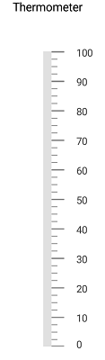
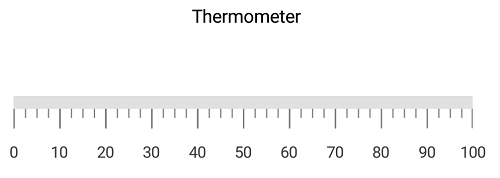
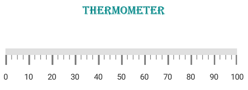

---

layout: post
title: Accessing Header in LinearGauge
description:  Learn how to set header in LinearGauge
platform: Xamarin.Android
control: LinearGauge
documentation: ug

---

# Header

You can add a title to gauge using the [`LinearLabel`](https://help.syncfusion.com/cr/xamarin-android/Com.Syncfusion.Gauges.SfLinearGauge.LinearLabel.html) option to provide information to users about the data that is being plotted in the linear gauge.

## Adding header to linear gauge



           SfLinearGauge linearGauge = new SfLinearGauge(this);
            linearGauge.SetBackgroundColor(Color.White);
            linearGauge.SetOrientation(SfLinearGauge.Orientation.Vertical);
            LinearLabel linearHeader = new LinearLabel();
            linearHeader.Text = "Thermometer";
            linearHeader.TextSize = 15;
            linearHeader.TextColor = Color.Black;
            linearGauge.Header = linearHeader;

            LinearScale linearScale = new LinearScale();
            linearScale.Interval = 10;
            linearScale.ScaleBarColor = Color.ParseColor("#e0e0e0");
            linearScale.MajorTickSettings.StrokeWidth = 1;
            linearScale.MinorTickSettings.StrokeWidth = 1;
            linearScale.MajorTickSettings.Length = 20;
            linearScale.MajorTickSettings.Color = Color.Gray;
            linearScale.MinorTickSettings.Color = Color.Gray;
            linearScale.MinorTickSettings.Length = 10;
            linearScale.ScaleBarLength = 350;
            linearScale.LabelColor = Color.ParseColor("#424242");
            linearGauge.Scales.Add(linearScale);



##  Positioning the header

To change the position of header, use the [`Offset`](https://help.syncfusion.com/cr/xamarin-android/Com.Syncfusion.Gauges.SfLinearGauge.LinearLabel.html#Com_Syncfusion_Gauges_SfLinearGauge_LinearLabel_Offset)  property in the linear header. It ranges from 0 to 1. By default, the header will be positioned on the top of linear gauge.



            SfLinearGauge linearGauge = new SfLinearGauge(this);
            linearGauge.SetBackgroundColor(Color.White);
            linearGauge.SetOrientation(SfLinearGauge.Orientation.Horizontal);
            LinearLabel linearHeader = new LinearLabel();
            linearHeader.Text = "Thermometer";
            linearHeader.TextSize = 15;
            linearHeader.TextColor = Color.Black;
            linearHeader.Offset = new PointF((float)0.4, (float)0.4);
            linearGauge.Header = linearHeader;

            LinearScale linearScale = new LinearScale();
            linearScale.ScaleBarColor = Color.ParseColor("#e0e0e0");
            linearScale.MajorTickSettings.StrokeWidth = 1;
            linearScale.MinorTickSettings.StrokeWidth = 1;
            linearScale.MajorTickSettings.Length = 20;
            linearScale.MajorTickSettings.Color = Color.Gray;
            linearScale.MinorTickSettings.Color = Color.Gray;
            linearScale.MinorTickSettings.Length = 10;
            linearScale.LabelColor = Color.ParseColor("#424242");
            linearGauge.Scales.Add(linearScale);
    


##  Customizing header text

You can customize the text of [`LinearLabel`](https://help.syncfusion.com/cr/xamarin-android/Com.Syncfusion.Gauges.SfLinearGauge.LinearLabel.html) by using the [`TextColor`](https://help.syncfusion.com/cr/xamarin-android/Com.Syncfusion.Gauges.SfLinearGauge.LinearLabel.html#Com_Syncfusion_Gauges_SfLinearGauge_LinearLabel_TextColor), [`TextSize`](https://help.syncfusion.com/cr/xamarin-android/Com.Syncfusion.Gauges.SfLinearGauge.LinearLabel.html#Com_Syncfusion_Gauges_SfLinearGauge_LinearLabel_TextSize) and [`FontStyle`](https://help.syncfusion.com/cr/xamarin-android/Com.Syncfusion.Gauges.SfLinearGauge.LinearLabel.html#Com_Syncfusion_Gauges_SfLinearGauge_LinearLabel_FontStyle) properties as shown in the following code snippet.



           SfLinearGauge linearGauge = new SfLinearGauge(this);
            linearGauge.SetBackgroundColor(Color.White);
            linearGauge.SetOrientation(SfLinearGauge.Orientation.Horizontal);
            LinearLabel linearHeader = new LinearLabel();
            linearHeader.Text = "Thermometer";
            linearHeader.TextColor = Color.DarkCyan;
            linearHeader.FontStyle = Typeface.Create("Helvetica", TypefaceStyle.BoldItalic);
            linearHeader.TextSize = 18;
            linearHeader.Offset = new PointF((float)0.35,(float) 0.4);
            linearGauge.Header = linearHeader;

            LinearScale linearScale = new LinearScale();
            linearScale.ScaleBarColor = Color.ParseColor("#e0e0e0");
            linearScale.MajorTickSettings.StrokeWidth = 1;
            linearScale.MinorTickSettings.StrokeWidth = 1;
            linearScale.MajorTickSettings.Length = 20;
            linearScale.MajorTickSettings.Color = Color.Gray;
            linearScale.MinorTickSettings.Color = Color.Gray;
            linearScale.MinorTickSettings.Length = 10;
            linearScale.LabelColor = Color.ParseColor("#424242");
            linearGauge.Scales.Add(linearScale);
 


