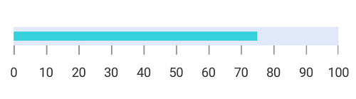
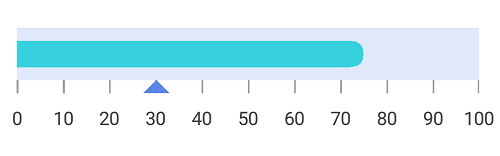
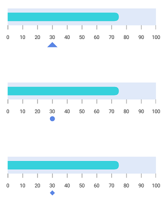
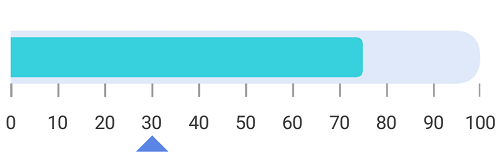

# Pointers

[`SfLinearGauge`](https://help.syncfusion.com/cr/xamarin-android/Com.Syncfusion.Gauges.SfLinearGauge.SfLinearGauge.html) provides support to mark the values using [`BarPointer`](https://help.syncfusion.com/cr/xamarin-android/Com.Syncfusion.Gauges.SfLinearGauge.BarPointer.html) and [`SymbolPointer`](https://help.syncfusion.com/cr/xamarin-android/Com.Syncfusion.Gauges.SfLinearGauge.SymbolPointer.html).

## Adding bar pointer to scale

[`BarPointer`](https://help.syncfusion.com/cr/xamarin-android/Com.Syncfusion.Gauges.SfLinearGauge.BarPointer.html) is used to mark the scale values. It starts at the beginning of gauge and ends at the pointer value.


	
		    SfLinearGauge linearGauge = new SfLinearGauge(this);
            linearGauge.SetBackgroundColor(Color.White);
            linearGauge.SetOrientation(SfLinearGauge.Orientation.Horizontal);
            LinearScale linearScale = new LinearScale();
            linearScale.ScaleBarColor = Color.ParseColor("#e0e9f9");
            linearScale.LabelColor = Color.ParseColor("#424242");
            linearScale.ScaleBarSize = 20;
            linearScale.LabelFontSize = 14;
            linearScale.MinorTicksPerInterval = 0;
            linearScale.MajorTickSettings.Color = Color.ParseColor("#9E9E9E");
            linearScale.MajorTickSettings.StrokeWidth = 1;
            linearScale.MajorTickSettings.Length = 10;

            BarPointer barPointer = new BarPointer();
            barPointer.Value = 75;
            barPointer.EnableAnimation = false;
            barPointer.Color = Color.ParseColor("#36d1dc");
            linearScale.Pointers.Add(barPointer);
            linearGauge.Scales.Add(linearScale);



## Bar pointer customization

The bar pointer’s UI is customized by using the [`Color`](https://help.syncfusion.com/cr/xamarin-android/Com.Syncfusion.Gauges.SfLinearGauge.LinearPointer.html#Com_Syncfusion_Gauges_SfLinearGauge_LinearPointer_Color) and [`StrokeWidth`](https://help.syncfusion.com/cr/xamarin-android/Com.Syncfusion.Gauges.SfLinearGauge.LinearPointer.html#Com_Syncfusion_Gauges_SfLinearGauge_LinearPointer_StrokeWidth) properties.


	
		      SfLinearGauge linearGauge = new SfLinearGauge(this);
            linearGauge.SetBackgroundColor(Color.White);
            linearGauge.SetOrientation(SfLinearGauge.Orientation.Horizontal);
            LinearScale linearScale = new LinearScale();
            linearScale.ScaleBarColor = Color.ParseColor("#e0e9f9");
            linearScale.LabelColor = Color.ParseColor("#424242");
            linearScale.ScaleBarSize = 40;
            linearScale.LabelFontSize = 14;
            linearScale.MinorTicksPerInterval = 0;
            linearScale.MajorTickSettings.Color = Color.ParseColor("#9E9E9E");
            linearScale.MajorTickSettings.StrokeWidth = 1;
            linearScale.MajorTickSettings.Length = 10;

            BarPointer barPointer = new BarPointer();
            barPointer.Value = 75;
            barPointer.StrokeWidth = 20;
            barPointer.EnableAnimation = false;
            barPointer.Color = Color.ParseColor("#36d1dc");
            linearScale.Pointers.Add(barPointer);
            linearGauge.Scales.Add(linearScale);



## Setting corner radius type for bar pointer

Corners of the [`BarPointer`](https://help.syncfusion.com/cr/xamarin-android/Com.Syncfusion.Gauges.SfLinearGauge.BarPointer.html) can be customized by setting the value to the [`CornerRadiusType`](https://help.syncfusion.com/cr/xamarin-android/Com.Syncfusion.Gauges.SfLinearGauge.BarPointer.html#Com_Syncfusion_Gauges_SfLinearGauge_BarPointer_CornerRadiusType) property. All corners of bar pointer can be customized using the `Start`, `End`, `Both`, and `None` options.
 [`CornerRadius`](https://help.syncfusion.com/cr/xamarin-android/Com.Syncfusion.Gauges.SfLinearGauge.BarPointer.html#Com_Syncfusion_Gauges_SfLinearGauge_BarPointer_CornerRadius) property used to reduce the radius of the corners.



            SfLinearGauge linearGauge = new SfLinearGauge(this);
            linearGauge.SetBackgroundColor(Color.White);
            linearGauge.SetOrientation(SfLinearGauge.Orientation.Horizontal);

            LinearScale linearScale = new LinearScale();
            linearScale.ScaleBarColor = Color.ParseColor("#e0e9f9");
            linearScale.LabelColor = Color.ParseColor("#424242");
            linearScale.ScaleBarSize = 40;
            linearScale.LabelFontSize = 14;
            linearScale.MinorTicksPerInterval = 0;
            linearScale.MajorTickSettings.Color = Color.ParseColor("#9E9E9E");
            linearScale.MajorTickSettings.StrokeWidth = 1;
            linearScale.MajorTickSettings.Length = 10;

            BarPointer barPointer = new BarPointer();
            barPointer.Value = 75;
            barPointer.StrokeWidth = 20;
            barPointer.CornerRadiusType = CornerRadiusType.Start;
            barPointer.CornerRadius = 10;
            barPointer.EnableAnimation = false;
            barPointer.Color = Color.ParseColor("#36d1dc");
            linearScale.Pointers.Add(barPointer);

            linearGauge.Scales.Add(linearScale);



## Setting gradient color for bar pointer

You can give smooth color transition to bar pointer to specifying the different colors based on bar pointer’s value by using [`GradientStops`](https://help.syncfusion.com/cr/xamarin-android/Com.Syncfusion.Gauges.SfLinearGauge.BarPointer.html#Com_Syncfusion_Gauges_SfLinearGauge_BarPointer_GradientStops) property.



            SfLinearGauge linearGauge = new SfLinearGauge(this);
            linearGauge.SetBackgroundColor(Color.White);
            linearGauge.SetOrientation(SfLinearGauge.Orientation.Horizontal);
            LinearScale linearScale = new LinearScale();
            linearScale.ScaleBarColor = Color.Rgb(247, 237, 237);
            linearScale.LabelColor = Color.Black;
            linearScale.ScaleBarSize = 40;
            linearScale.CornerRadius = 20;
            linearScale.CornerRadiusType = CornerRadiusType.Both;
            linearScale.LabelFontSize = 14;
            linearScale.Minimum = 0;
            linearScale.Maximum = 100;
            linearScale.Interval = 25;
            linearScale.LabelOffset = -10;
            linearScale.ShowTicks = false;

            BarPointer barPointer = new BarPointer();
            barPointer.Value = 75;
            barPointer.CornerRadiusType = CornerRadiusType.Both;
            barPointer.CornerRadius = 15;
            barPointer.StrokeWidth = 30;
            barPointer.EnableAnimation = false;

            GaugeGradientStop gaugeGradientStop = new GaugeGradientStop();
            gaugeGradientStop.Value = 10;
            gaugeGradientStop.Color = Color.Rgb(248, 186, 191);
            barPointer.GradientStops.Add(gaugeGradientStop);

            GaugeGradientStop gaugeGradientStop1 = new GaugeGradientStop();
            gaugeGradientStop1.Value = 40;
            gaugeGradientStop1.Color = Color.Rgb(238, 137, 167);
            barPointer.GradientStops.Add(gaugeGradientStop1);

            GaugeGradientStop gaugeGradientStop2 = new GaugeGradientStop();
            gaugeGradientStop2.Value = 50;
            gaugeGradientStop2.Color = Color.Rgb(228, 84, 140);
            barPointer.GradientStops.Add(gaugeGradientStop2);

            GaugeGradientStop gaugeGradientStop3 = new GaugeGradientStop();
            gaugeGradientStop3.Value = 60;
            gaugeGradientStop3.Color = Color.Rgb(219, 37, 117);
            barPointer.GradientStops.Add(gaugeGradientStop3);

            linearScale.Pointers.Add(barPointer);
            linearGauge.Scales.Add(linearScale);



## Adding symbol pointer to scale

In [`SymbolPointer`](https://help.syncfusion.com/cr/xamarin-android/Com.Syncfusion.Gauges.SfLinearGauge.SymbolPointer.html), the value is pointed by a symbol on the scale.



            SfLinearGauge linearGauge = new SfLinearGauge(this);
            linearGauge.SetBackgroundColor(Color.White);
            linearGauge.SetOrientation(SfLinearGauge.Orientation.Horizontal);
            LinearScale linearScale = new LinearScale();
            linearScale.ScaleBarColor = Color.ParseColor("#e0e9f9");
            linearScale.LabelColor = Color.ParseColor("#424242");
            linearScale.ScaleBarSize = 40;
            linearScale.LabelFontSize = 14;
            linearScale.Minimum = 0;
            linearScale.Maximum = 100;
            linearScale.Interval = 10;
            linearScale.MinorTicksPerInterval = 0;
            linearScale.MajorTickSettings.Color = Color.ParseColor("#9E9E9E");
            linearScale.MajorTickSettings.StrokeWidth = 1;
            linearScale.MajorTickSettings.Length = 10;

            BarPointer barPointer = new BarPointer();
            barPointer.Value = 75;
            barPointer.StrokeWidth = 20;
            barPointer.CornerRadiusType = CornerRadiusType.End;
            barPointer.CornerRadius = 10;
            barPointer.EnableAnimation = false;
            barPointer.Color = Color.ParseColor("#36d1dc");
            linearScale.Pointers.Add(barPointer);

            SymbolPointer symbolPointer = new SymbolPointer();
            symbolPointer.Value = 30;
            symbolPointer.EnableAnimation = false;
            symbolPointer.Color = Color.ParseColor("#5b86e5");
            linearScale.Pointers.Add(symbolPointer);

            linearGauge.Scales.Add(linearScale);



## Symbol pointer customization

You can modify the symbol pointer’s size using the [`StrokeWidth`](https://help.syncfusion.com/cr/xamarin-android/Com.Syncfusion.Gauges.SfLinearGauge.LinearPointer.html#Com_Syncfusion_Gauges_SfLinearGauge_LinearPointer_StrokeWidth) property. The color of the symbol pointer is changed using the [`Color`](https://help.syncfusion.com/cr/xamarin-android/Com.Syncfusion.Gauges.SfLinearGauge.LinearPointer.html#Com_Syncfusion_Gauges_SfLinearGauge_LinearPointer_Color) property.



            SfLinearGauge linearGauge = new SfLinearGauge(this);
            linearGauge.SetBackgroundColor(Color.White);
            linearGauge.SetOrientation(SfLinearGauge.Orientation.Horizontal);
            LinearScale linearScale = new LinearScale();
            linearScale.ScaleBarColor = Color.ParseColor("#e0e0e0");
            linearScale.LabelColor = Color.ParseColor("#424242");
            linearScale.MajorTickSettings.StrokeWidth = 1;
            linearScale.MinorTickSettings.StrokeWidth = 1;
            linearScale.MajorTickSettings.Length = 20;
            linearScale.MajorTickSettings.Color = Color.Gray;
            linearScale.MinorTickSettings.Color = Color.Gray;
            linearScale.MinorTickSettings.Length = 10;
            SymbolPointer symbolPointer = new SymbolPointer();
            symbolPointer.Value = 70;
            symbolPointer.Color = Color.DeepSkyBlue;
            symbolPointer.StrokeWidth = 15;
            linearScale.Pointers.Add(symbolPointer);
            linearGauge.Scales.Add(linearScale);



## Positioning symbol pointer

You can position the [`SymbolPointer`](https://help.syncfusion.com/cr/xamarin-android/Com.Syncfusion.Gauges.SfLinearGauge.SymbolPointer.html) by using the following two ways:

## Setting symbol pointer position

You can customize the position of the [`SymbolPointer`](https://help.syncfusion.com/cr/xamarin-android/Com.Syncfusion.Gauges.SfLinearGauge.SymbolPointer.html) by using the [`SymbolPosition`](https://help.syncfusion.com/cr/xamarin-android/Com.Syncfusion.Gauges.SfLinearGauge.SymbolPointer.html#Com_Syncfusion_Gauges_SfLinearGauge_SymbolPointer_SymbolPosition). The default symbol pointer position is `Far`.



            SfLinearGauge linearGauge = new SfLinearGauge(this);
            linearGauge.SetBackgroundColor(Color.White);
            linearGauge.SetOrientation(SfLinearGauge.Orientation.Horizontal);
            LinearScale linearScale = new LinearScale();
            linearScale.ScaleBarColor = Color.ParseColor("#e0e9f9");
            linearScale.LabelColor = Color.ParseColor("#424242");
            linearScale.ScaleBarSize = 40;
            linearScale.LabelFontSize = 14;
            linearScale.MinorTicksPerInterval = 0;
            linearScale.MajorTickSettings.Color = Color.ParseColor("#9E9E9E");
            linearScale.MajorTickSettings.StrokeWidth = 1;
            linearScale.MajorTickSettings.Length = 10;

            BarPointer barPointer = new BarPointer();
            barPointer.Value = 75;
            barPointer.StrokeWidth = 20;
            barPointer.CornerRadiusType = CornerRadiusType.End;
            barPointer.CornerRadius = 10;
            barPointer.EnableAnimation = false;
            barPointer.Color = Color.ParseColor("#36d1dc");
            linearScale.Pointers.Add(barPointer);

            SymbolPointer symbolPointer = new SymbolPointer();
            symbolPointer.Value = 30;
            symbolPointer.EnableAnimation = false;
            symbolPointer.SymbolPosition = SymbolPointerPosition.Away;
            symbolPointer.Color = Color.ParseColor("#5b86e5");
            linearScale.Pointers.Add(symbolPointer);

            linearGauge.Scales.Add(linearScale);



## Setting offset for symbol pointer

You can move  the [`SymbolPointer`](https://help.syncfusion.com/cr/xamarin-android/Com.Syncfusion.Gauges.SfLinearGauge.SymbolPointer.html) by using the [`Offset`](https://help.syncfusion.com/cr/xamarin-android/Com.Syncfusion.Gauges.SfLinearGauge.SymbolPointer.html#Com_Syncfusion_Gauges_SfLinearGauge_SymbolPointer_Offset) property. 



             SfLinearGauge linearGauge = new SfLinearGauge(this);
            linearGauge.SetBackgroundColor(Color.White);
            linearGauge.SetOrientation(SfLinearGauge.Orientation.Horizontal);

            LinearScale linearScale = new LinearScale();
            linearScale.ScaleBarColor = Color.ParseColor("#e0e9f9");
            linearScale.LabelColor = Color.ParseColor("#424242");
            linearScale.ScaleBarSize = 40;
            linearScale.LabelFontSize = 14;
            linearScale.MinorTicksPerInterval = 0;
            linearScale.MajorTickSettings.Color = Color.ParseColor("#9E9E9E");
            linearScale.MajorTickSettings.StrokeWidth = 1;
            linearScale.MajorTickSettings.Length = 10;

            BarPointer barPointer = new BarPointer();
            barPointer.Value = 75;
            barPointer.StrokeWidth = 20;
            barPointer.CornerRadiusType = CornerRadiusType.End;
            barPointer.CornerRadius = 10;
            barPointer.EnableAnimation = false;
            barPointer.Color = Color.ParseColor("#36d1dc");
            linearScale.Pointers.Add(barPointer);

            SymbolPointer symbolPointer = new SymbolPointer();
            symbolPointer.Value = 30;
            symbolPointer.EnableAnimation = false;
            symbolPointer.Offset = 40;
            symbolPointer.Color = Color.ParseColor("#5b86e5");
            linearScale.Pointers.Add(symbolPointer);

            linearGauge.Scales.Add(linearScale);



## Change symbol pointer shapes

Different types of shapes are used in [`SymbolPointer`](https://help.syncfusion.com/cr/xamarin-android/Com.Syncfusion.Gauges.SfLinearGauge.SymbolPointer.html) to mark the pointer value in scale. You can change the shape of [`SymbolPointer`](https://help.syncfusion.com/cr/xamarin-android/Com.Syncfusion.Gauges.SfLinearGauge.SymbolPointer.html) by using the [`MarkerShape`](https://help.syncfusion.com/cr/xamarin-android/Com.Syncfusion.Gauges.SfLinearGauge.SymbolPointer.html#Com_Syncfusion_Gauges_SfLinearGauge_SymbolPointer_MarkerShape) property in pointer. 



          SfLinearGauge linearGauge = new SfLinearGauge(this);
            linearGauge.SetBackgroundColor(Color.White);
            linearGauge.SetOrientation(SfLinearGauge.Orientation.Horizontal);
            LinearScale linearScale = new LinearScale();
            linearScale.ScaleBarColor = Color.ParseColor("#e0e9f9");
            linearScale.LabelColor = Color.ParseColor("#424242");
            linearScale.ScaleBarSize = 40;
            linearScale.LabelFontSize = 14;
            linearScale.MinorTicksPerInterval = 0;
            linearScale.MajorTickSettings.Color = Color.ParseColor("#9E9E9E");
            linearScale.MajorTickSettings.StrokeWidth = 1;
            linearScale.MajorTickSettings.Length = 10;
            BarPointer barPointer = new BarPointer();
            barPointer.Value = 75;
            barPointer.StrokeWidth = 20;
            barPointer.CornerRadiusType = CornerRadiusType.End;
            barPointer.CornerRadius = 10;
            barPointer.EnableAnimation = false;
            barPointer.Color = Color.ParseColor("#36d1dc");
            linearScale.Pointers.Add(barPointer);
            SymbolPointer symbolPointer = new SymbolPointer();
            symbolPointer.Value = 30;
            symbolPointer.EnableAnimation = false;
            symbolPointer.StrokeWidth = 12;
            symbolPointer.MarkerShape = MarkerShape.Circle;
            symbolPointer.SymbolPosition = SymbolPointerPosition.Away;
            symbolPointer.Color = Color.ParseColor("#5b86e5");
            linearScale.Pointers.Add(symbolPointer);
            linearGauge.Scales.Add(linearScale);



## Setting image shape for symbol pointer

You can achieve the image shape  by setting the [`MarkerShape`](https://help.syncfusion.com/cr/xamarin-android/Com.Syncfusion.Gauges.SfLinearGauge.SymbolPointer.html#Com_Syncfusion_Gauges_SfLinearGauge_SymbolPointer_MarkerShape) property to `Image` and setting image path to [`ImageSource`](https://help.syncfusion.com/cr/xamarin-android/Com.Syncfusion.Gauges.SfLinearGauge.SymbolPointer.html#Com_Syncfusion_Gauges_SfLinearGauge_SymbolPointer_ImageSource) property in [`SymbolPointer`](https://help.syncfusion.com/cr/xamarin-android/Com.Syncfusion.Gauges.SfLinearGauge.SymbolPointer.html).



            SfLinearGauge linearGauge = new SfLinearGauge(this);
            linearGauge.SetBackgroundColor(Color.White);
            linearGauge.SetOrientation(SfLinearGauge.Orientation.Horizontal);
            LinearScale linearScale = new LinearScale();
            linearScale.ScaleBarColor = Color.ParseColor("#e0e9f9");
            linearScale.LabelColor = Color.ParseColor("#424242");
            linearScale.ScaleBarSize = 40;
            linearScale.LabelFontSize = 14;
            linearScale.MinorTicksPerInterval = 0;
            linearScale.MajorTickSettings.Color = Color.ParseColor("#9E9E9E");
            linearScale.MajorTickSettings.StrokeWidth = 1;
            linearScale.MajorTickSettings.Length = 10;

            BarPointer barPointer = new BarPointer();
            barPointer.Value = 75;
            barPointer.StrokeWidth = 20;
            barPointer.CornerRadiusType = CornerRadiusType.End;
            barPointer.CornerRadius = 10;
            barPointer.EnableAnimation = false;
            barPointer.Color = Color.ParseColor("#36d1dc");
            linearScale.Pointers.Add(barPointer);

            SymbolPointer symbolPointer = new SymbolPointer();
            symbolPointer.Value = 30;
            symbolPointer.EnableAnimation = false;
            symbolPointer.StrokeWidth = 12;
            symbolPointer.MarkerShape = MarkerShape.Image;
            symbolPointer.ImageSource = "location.png";
            symbolPointer.Offset = 40;
            symbolPointer.Color = Color.ParseColor("#5b86e5");
            linearScale.Pointers.Add(symbolPointer);

            linearGauge.Scales.Add(linearScale);



## Adding multiple pointers

In addition to the default pointer, you can add n number of pointers to a linear scale by using the [`Pointers`](https://help.syncfusion.com/cr/xamarin-android/Com.Syncfusion.Gauges.SfLinearGauge.LinearScale.html#Com_Syncfusion_Gauges_SfLinearGauge_LinearScale_Pointers) property.



              SfLinearGauge linearGauge = new SfLinearGauge(this);
            linearGauge.SetBackgroundColor(Color.White);
            linearGauge.SetOrientation(SfLinearGauge.Orientation.Horizontal);
            LinearScale linearScale = new LinearScale();
            linearScale.ScaleBarColor = Color.ParseColor("#e0e9f9");
            linearScale.LabelColor = Color.ParseColor("#424242");
            linearScale.ScaleBarSize = 40;
            linearScale.CornerRadius = 20;
            linearScale.CornerRadiusType = CornerRadiusType.End;
            linearScale.LabelFontSize = 14;
            linearScale.MinorTicksPerInterval = 0;
            linearScale.MajorTickSettings.Color = Color.ParseColor("#9E9E9E");
            linearScale.MajorTickSettings.StrokeWidth = 1;
            linearScale.MajorTickSettings.Length = 10;

            BarPointer barPointer = new BarPointer();
            barPointer.Value = 75;
            barPointer.CornerRadiusType = CornerRadiusType.End;
            barPointer.StrokeWidth = 30;
            barPointer.EnableAnimation = false;
            barPointer.Color = Color.ParseColor("#36d1dc");
            linearScale.Pointers.Add(barPointer);

            SymbolPointer symbolPointer = new SymbolPointer();
            symbolPointer.Value = 30;
            symbolPointer.StrokeWidth = 12;
            symbolPointer.EnableAnimation = false;
            symbolPointer.Color = Color.ParseColor("#5b86e5");
            symbolPointer.MarkerShape = MarkerShape.Triangle;
            symbolPointer.SymbolPosition = SymbolPointerPosition.Away;
            linearScale.Pointers.Add(symbolPointer);
            linearGauge.Scales.Add(linearScale);



