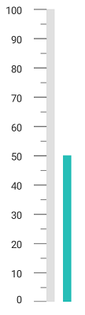
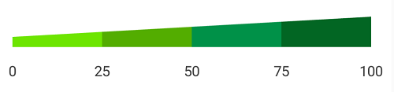

---

layout: post
title: Ranges in LinearGauge for Xamarin.Android
description: Learn how to set ranges in LinearGauge
platform: Xamarin.Android
control: LinearGauge
documentation: ug

---

# Ranges

Range is a visual element, which begins and ends at specified values within a scale. You can add any number of range for a scale by using the array of range objects.

## Setting start and end values for range

Start and end values of ranges are set by using the [`StartValue`](https://help.syncfusion.com/cr/xamarin-android/Com.Syncfusion.Gauges.SfLinearGauge.LinearRange.html#Com_Syncfusion_Gauges_SfLinearGauge_LinearRange_StartValue) and [`EndValue`](https://help.syncfusion.com/cr/xamarin-android/Com.Syncfusion.Gauges.SfLinearGauge.LinearRange.html#Com_Syncfusion_Gauges_SfLinearGauge_LinearRange_EndValue) properties.



            SfLinearGauge linearGauge = new SfLinearGauge(this);
            linearGauge.SetBackgroundColor(Color.White);
            linearGauge.SetOrientation(SfLinearGauge.Orientation.Horizontal);
            LinearScale linearScale = new LinearScale();
            linearScale.ScaleBarColor = Color.ParseColor("#e0e0e0");
            linearScale.LabelColor = Color.ParseColor("#424242");
            linearScale.MajorTickSettings.StrokeWidth = 1;
            linearScale.MinorTickSettings.StrokeWidth = 1;
            linearScale.MajorTickSettings.Length = 20;
            linearScale.MajorTickSettings.Color = Color.Gray;
            linearScale.MinorTickSettings.Color = Color.Gray;
            linearScale.MinorTickSettings.Length = 10;
            LinearRange linearRange = new LinearRange();
            linearRange.StartValue = 0;
            linearRange.EndValue = 60;
            linearRange.Color = Color.ParseColor("#27beb7");
            linearRange.Offset = -20;
            linearRange.StartWidth = 10;
            linearRange.EndWidth = 10;
            linearScale.Ranges.Add(linearRange);
            linearGauge.Scales.Add(linearScale);



## Range customization

To change the range’s background color, use the [`Color`](https://help.syncfusion.com/cr/xamarin-android/Com.Syncfusion.Gauges.SfLinearGauge.LinearRange.html#Com_Syncfusion_Gauges_SfLinearGauge_LinearRange_Color) property of linear range. The thickness of the range can be changed using the [`StartWidth`](https://help.syncfusion.com/cr/xamarin-android/Com.Syncfusion.Gauges.SfLinearGauge.LinearRange.html#Com_Syncfusion_Gauges_SfLinearGauge_LinearRange_StartWidth) and [`EndWidth`](https://help.syncfusion.com/cr/xamarin-android/Com.Syncfusion.Gauges.SfLinearGauge.LinearRange.html#Com_Syncfusion_Gauges_SfLinearGauge_LinearRange_EndWidth) properties. 



            SfLinearGauge linearGauge = new SfLinearGauge(this);
            linearGauge.SetBackgroundColor(Color.White);
            linearGauge.SetOrientation(SfLinearGauge.Orientation.Horizontal);
            LinearScale linearScale = new LinearScale();
            linearScale.ScaleBarColor = Color.ParseColor("#e0e0e0");
            linearScale.LabelColor = Color.ParseColor("#424242");
            linearScale.MajorTickSettings.StrokeWidth = 1;
            linearScale.MinorTickSettings.StrokeWidth = 1;
            linearScale.MajorTickSettings.Length = 20;
            linearScale.MajorTickSettings.Color = Color.Gray;
            linearScale.MinorTickSettings.Color = Color.Gray;
            linearScale.MinorTickSettings.Length = 10;
            LinearRange linearRange = new LinearRange();
            linearRange.StartValue = 0;
            linearRange.Color = Color.Rgb(249, 92, 133);
            linearRange.EndValue = 50;
            linearRange.StartWidth = -5;
            linearRange.EndWidth = -20;
            linearRange.Offset = -30;
            linearScale.Ranges.Add(linearRange);
            linearGauge.Scales.Add(linearScale);



## Setting position for range

The range can be adjusted above or below the scale by using the [`Offset`](https://help.syncfusion.com/cr/xamarin-android/Com.Syncfusion.Gauges.SfLinearGauge.LinearRange.html#Com_Syncfusion_Gauges_SfLinearGauge_LinearRange_Offset) value in pixels.



            SfLinearGauge linearGauge = new SfLinearGauge(this);
            linearGauge.SetBackgroundColor(Color.White);
            linearGauge.SetOrientation(SfLinearGauge.Orientation.Vertical);
            LinearScale linearScale = new LinearScale();
            linearScale.ScaleBarColor = Color.ParseColor("#e0e0e0");
            linearScale.LabelColor = Color.ParseColor("#424242");
            linearScale.MinorTicksPerInterval = 1;
            linearScale.OpposedPosition = true;
            linearScale.Interval = 10;
            linearScale.ScaleBarLength = 350;
            linearScale.MajorTickSettings.StrokeWidth = 1;
            linearScale.MinorTickSettings.StrokeWidth = 1;
            linearScale.MajorTickSettings.Length = 20;
            linearScale.MajorTickSettings.Color = Color.Gray;
            linearScale.MinorTickSettings.Color = Color.Gray;
            linearScale.MinorTickSettings.Length = 10;
            linearScale.OpposedPosition = true;
            LinearRange linearRange = new LinearRange();
            linearRange.StartValue = 0;
            linearRange.EndValue = 50;
            linearRange.StartWidth = 10;
            linearRange.EndWidth = 10;
            linearRange.Color = Color.ParseColor("#27beb7");
            linearRange.Offset = 30;
            linearScale.Ranges.Add(linearRange);
            linearGauge.Scales.Add(linearScale);



## Setting multiple ranges

You can add n number of ranges to a scale by using the [`LinearRange`](https://help.syncfusion.com/cr/xamarin-android/Com.Syncfusion.Gauges.SfLinearGauge.LinearRange.html) property of range as demonstrated below.



            SfLinearGauge linearGauge = new SfLinearGauge(this);
            linearGauge.SetBackgroundColor(Color.White);
            linearGauge.SetOrientation(SfLinearGauge.Orientation.Horizontal);
            LinearScale linearScale = new LinearScale();
            linearScale.ScaleBarColor = Color.Transparent;
            linearScale.LabelColor = Color.ParseColor("#424242");
            linearScale.LabelFontSize = 14;
            linearScale.LabelOffset = -10;
            linearScale.Interval = 25;
            linearScale.MinorTicksPerInterval = 0;
            linearScale.ShowTicks = false;

            LinearRange linearRange = new LinearRange();
            linearRange.StartValue = 0;
            linearRange.EndValue = 25;
            linearRange.Color = Color.ParseColor("#6de500");
            linearRange.StartWidth = -10;
            linearRange.EndWidth = -15;
            linearScale.Ranges.Add(linearRange);

            LinearRange linearRange1 = new LinearRange();
            linearRange1.StartValue = 25;
            linearRange1.EndValue = 50;
            linearRange1.Color = Color.ParseColor("#53ad00");
            linearRange1.StartWidth = -15;
            linearRange1.EndWidth = -20;
            linearScale.Ranges.Add(linearRange1);

            LinearRange linearRange2 = new LinearRange();
            linearRange2.StartValue = 50;
            linearRange2.EndValue = 75;
            linearRange2.Color = Color.ParseColor("#009148");
            linearRange2.StartWidth = -20;
            linearRange2.EndWidth = -25;
            linearScale.Ranges.Add(linearRange2);

            LinearRange linearRange3 = new LinearRange();
            linearRange3.StartValue = 75;
            linearRange3.EndValue = 100;
            linearRange3.Color = Color.ParseColor("#026623");
            linearRange3.StartWidth = -25;
            linearRange3.EndWidth = -30;
            linearScale.Ranges.Add(linearRange3);
            linearGauge.Scales.Add(linearScale);



## Setting gradient color for range

You can give smooth color transition to range to specifying the different colors based on range value by using [`GradientStops`](https://help.syncfusion.com/cr/xamarin-android/Com.Syncfusion.Gauges.SfLinearGauge.LinearRange.html#Com_Syncfusion_Gauges_SfLinearGauge_LinearRange_GradientStops) property. 



              SfLinearGauge linearGauge = new SfLinearGauge(this);
            linearGauge.SetBackgroundColor(Color.White);
            linearGauge.SetOrientation(SfLinearGauge.Orientation.Horizontal);
            LinearScale linearScale = new LinearScale();
            linearScale.ScaleBarColor = Color.Transparent;
            linearScale.LabelColor = Color.ParseColor("#424242");
            linearScale.LabelFontSize = 14;
            linearScale.LabelOffset = 10;
            linearScale.Interval = 25;
            linearScale.MinorTicksPerInterval = 0;
            linearScale.ShowTicks = false;
            linearScale.ScaleBarSize = 20;

            LinearRange linearRange = new LinearRange();
            linearRange.StartValue = 0;
            linearRange.EndValue = 100;
            linearRange.StartWidth = 20;
            linearRange.EndWidth = 20;
            ObservableCollection<GaugeGradientStop> gradientColor = new ObservableCollection<GaugeGradientStop>()
            {
                new GaugeGradientStop() {Value = 0, Color = Color.ParseColor("#FFF9C2C3") },
                new GaugeGradientStop() {Value = 100 ,Color = Color.ParseColor("#FFD91D71") }
            };
            linearRange.GradientStops = gradientColor;
            linearScale.Ranges.Add(linearRange);
            linearGauge.Scales.Add(linearScale);



