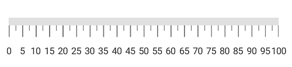

---

layout: post
title: Scales in LinearGauge for Xamarin.Android
description:  Learn how to define settings of linear scale in LinearGauge
platform:  Xamarin.Android
control: LinearGauge
documentation: ug

---

# Scales

Scales is a collection of [`LinearScale`](https://help.syncfusion.com/cr/xamarin-android/Com.Syncfusion.Gauges.SfLinearGauge.LinearScale.html), which integrates labels, tick marks, ranges, and pointers to customize the basic look and feel of the [`SfLinearGauge`](https://help.syncfusion.com/cr/xamarin-android/Com.Syncfusion.Gauges.SfLinearGauge.SfLinearGauge.html).

## Linear scale

[`LinearScale`](https://help.syncfusion.com/cr/xamarin-android/Com.Syncfusion.Gauges.SfLinearGauge.LinearScale.html) contains sub elements such as ticks, labels, [`Ranges`](https://help.syncfusion.com/cr/xamarin-android/Com.Syncfusion.Gauges.SfLinearGauge.LinearScale.html#Com_Syncfusion_Gauges_SfLinearGauge_LinearScale_Ranges), and [`Pointers`](https://help.syncfusion.com/cr/xamarin-android/Com.Syncfusion.Gauges.SfLinearGauge.LinearScale.html#Com_Syncfusion_Gauges_SfLinearGauge_LinearScale_Pointers). 



             SfLinearGauge linearGauge = new SfLinearGauge(this);
             linearGauge.SetBackgroundColor(Color.White);
            linearGauge.SetOrientation(SfLinearGauge.Orientation.Horizontal);
            LinearScale linearScale = new LinearScale();
            linearScale.ScaleBarColor = Color.ParseColor("#e0e0e0");
            linearScale.LabelColor = Color.ParseColor("#424242");
            linearScale.MajorTickSettings.Length = 20;
            linearScale.MajorTickSettings.Color = Color.Gray;
             linearScale.MinorTickSettings.Color = Color.Gray;
            linearScale.MinorTickSettings.Length = 10;
            linearScale.MajorTickSettings.StrokeWidth = 2;
            linearScale.MinorTickSettings.StrokeWidth = 2;
            linearGauge.Scales.Add(linearScale);
  


## Setting minimum and maximum values for scale

To change minimum and maximum values of linear scale, use the [`Minimum`](https://help.syncfusion.com/cr/xamarin-android/Com.Syncfusion.Gauges.SfLinearGauge.LinearScale.html#Com_Syncfusion_Gauges_SfLinearGauge_LinearScale_Minimum) and [`Maximum`](https://help.syncfusion.com/cr/xamarin-android/Com.Syncfusion.Gauges.SfLinearGauge.LinearScale.html#Com_Syncfusion_Gauges_SfLinearGauge_LinearScale_Maximum) properties as shown in the following code snippet.



            SfLinearGauge linearGauge = new SfLinearGauge(this);
            linearGauge.SetBackgroundColor(Color.White);
            linearGauge.SetOrientation(SfLinearGauge.Orientation.Horizontal);
            LinearScale linearScale = new LinearScale();
            linearScale.ScaleBarColor = Color.ParseColor("#e0e0e0");
            linearScale.LabelColor = Color.ParseColor("#424242");
            linearScale.Minimum = 20;
            linearScale.Maximum = 200;
            linearScale.MajorTickSettings.Length = 20;
            linearScale.MajorTickSettings.Color = Color.Gray;
            linearScale.MinorTickSettings.Color = Color.Gray;
            linearScale.MinorTickSettings.Length = 10;
            linearScale.MajorTickSettings.StrokeWidth = 2;
            linearScale.MinorTickSettings.StrokeWidth = 2;
            linearGauge.Scales.Add(linearScale);
  


## Setting interval for scale

The [`Interval`](https://help.syncfusion.com/cr/xamarin-android/Com.Syncfusion.Gauges.SfLinearGauge.LinearScale.html#Com_Syncfusion_Gauges_SfLinearGauge_LinearScale_Interval) property allows  you to set the intervals for scale. The default [`Interval`](https://help.syncfusion.com/cr/xamarin-android/Com.Syncfusion.Gauges.SfLinearGauge.LinearScale.html#Com_Syncfusion_Gauges_SfLinearGauge_LinearScale_Interval) property of scale is auto interval. Auto interval defines the count of the scale labels as 3 for 100 pixels.



            SfLinearGauge linearGauge = new SfLinearGauge(this);
            linearGauge.SetBackgroundColor(Color.White);
            linearGauge.SetOrientation(SfLinearGauge.Orientation.Horizontal);
            LinearScale linearScale = new LinearScale();
            linearScale.ScaleBarColor = Color.ParseColor("#e0e0e0");
            linearScale.LabelColor = Color.ParseColor("#424242");
            linearScale.Minimum = 0;
            linearScale.Maximum = 500;
            linearScale.Interval = 100;
            linearScale.MajorTickSettings.Length = 20;
            linearScale.MajorTickSettings.Color = Color.Gray;
             linearScale.MinorTickSettings.Color = Color.Gray;
            linearScale.MinorTickSettings.Length = 10;
            linearScale.MajorTickSettings.StrokeWidth = 2;
            linearScale.MinorTickSettings.StrokeWidth = 2;
            linearGauge.Scales.Add(linearScale);
  


## Setting maximum labels

The [`MaximumLabels`](https://help.syncfusion.com/cr/xamarin-android/Com.Syncfusion.Gauges.SfLinearGauge.LinearScale.html#Com_Syncfusion_Gauges_SfLinearGauge_LinearScale_MaximumLabels) property defines the count of the scale labels in the 100 pixels. By default, the maximum labels for 100 pixels is 3.



            SfLinearGauge linearGauge = new SfLinearGauge(this);
            linearGauge.SetBackgroundColor(Color.White);
            linearGauge.SetOrientation(SfLinearGauge.Orientation.Horizontal);
            LinearScale linearScale = new LinearScale();
            linearScale.ScaleBarColor = Color.ParseColor("#e0e0e0");
            linearScale.LabelColor = Color.ParseColor("#424242");
            linearScale.MinorTicksPerInterval = 1;
            linearScale.MaximumLabels = 4;
            linearScale.MajorTickSettings.Length = 20;
            linearScale.MajorTickSettings.Color = Color.Gray;
             linearScale.MinorTickSettings.Color = Color.Gray;
            linearScale.MinorTickSettings.Length = 10;
            linearScale.MajorTickSettings.StrokeWidth = 1;
            linearScale.MinorTickSettings.StrokeWidth = 1;
            linearGauge.Scales.Add(linearScale);



## Scale customization

You can customize the color, length, size, and position of the [`LinearScale`](https://help.syncfusion.com/cr/xamarin-android/Com.Syncfusion.Gauges.SfLinearGauge.LinearScale.html) by using the [`ScaleBarColor`](https://help.syncfusion.com/cr/xamarin-android/Com.Syncfusion.Gauges.SfLinearGauge.LinearScale.html#Com_Syncfusion_Gauges_SfLinearGauge_LinearScale_ScaleBarColor), [`ScaleBarLength`](https://help.syncfusion.com/cr/xamarin-android/Com.Syncfusion.Gauges.SfLinearGauge.LinearScale.html#Com_Syncfusion_Gauges_SfLinearGauge_LinearScale_ScaleBarLength), [`ScaleBarSize`](https://help.syncfusion.com/cr/xamarin-android/Com.Syncfusion.Gauges.SfLinearGauge.LinearScale.html#Com_Syncfusion_Gauges_SfLinearGauge_LinearScale_ScaleBarSize), and [`Offset`](https://help.syncfusion.com/cr/xamarin-android/Com.Syncfusion.Gauges.SfLinearGauge.LinearScale.html#Com_Syncfusion_Gauges_SfLinearGauge_LinearScale_Offset) properties, respectively.



            SfLinearGauge linearGauge = new SfLinearGauge(this);
            linearGauge.SetBackgroundColor(Color.White);
            linearGauge.SetOrientation(SfLinearGauge.Orientation.Vertical);
            LinearScale linearScale = new LinearScale();
            linearScale.ScaleBarColor = Color.Rgb(76, 136, 220);
            linearScale.LabelColor = Color.ParseColor("#424242");
            linearScale.MinorTicksPerInterval = 1;
            linearScale.MajorTickSettings.Length = 25;
            linearScale.MinorTickSettings.Length = 10;
            linearScale.MajorTickSettings.Color = Color.Gray;
            linearScale.MinorTickSettings.Color = Color.Gray;
            linearScale.LabelOffset = -5;
            linearScale.Offset = 10;
            linearScale.ScaleBarLength = 300;
            linearScale.ScaleBarSize = 5;
            linearScale.MajorTickSettings.StrokeWidth = 1;
            linearScale.MinorTickSettings.StrokeWidth = 1;
            linearGauge.Scales.Add(linearScale);



## Setting opposite position

To place the scale at opposite to its original position, set the [`OpposedPosition`](https://help.syncfusion.com/cr/xamarin-android/Com.Syncfusion.Gauges.SfLinearGauge.LinearScale.html#Com_Syncfusion_Gauges_SfLinearGauge_LinearScale_OpposedPosition) property to true in the scale.



            SfLinearGauge linearGauge = new SfLinearGauge(this);
            linearGauge.SetBackgroundColor(Color.White);
            linearGauge.SetOrientation(SfLinearGauge.Orientation.Horizontal);
            LinearScale linearScale = new LinearScale();
            linearScale.ScaleBarColor = Color.ParseColor("#e0e0e0");
            linearScale.LabelColor = Color.ParseColor("#424242");
            linearScale.MinorTicksPerInterval = 1;
            linearScale.MajorTickSettings.StrokeWidth = 1;
            linearScale.MinorTickSettings.StrokeWidth = 1;
            linearScale.MajorTickSettings.Length = 20;
            linearScale.MajorTickSettings.Color = Color.Gray;
             linearScale.MinorTickSettings.Color = Color.Gray;
            linearScale.MinorTickSettings.Length = 10;
            linearScale.OpposedPosition = true;
            linearGauge.Scales.Add(linearScale);



## Setting scale direction

You can set the scale position to its forward and backward using the [`ScaleDirection`](https://help.syncfusion.com/cr/xamarin-android/Com.Syncfusion.Gauges.SfLinearGauge.LinearScale.html#Com_Syncfusion_Gauges_SfLinearGauge_LinearScale_ScaleDirection) property.



            SfLinearGauge linearGauge = new SfLinearGauge(this);
            linearGauge.SetBackgroundColor(Color.White);
            linearGauge.SetOrientation(SfLinearGauge.Orientation.Horizontal);
            LinearScale linearScale = new LinearScale();
            linearScale.ScaleBarColor = Color.ParseColor("#e0e0e0");
            linearScale.LabelColor = Color.ParseColor("#424242");
            linearScale.MinorTicksPerInterval = 1;
            linearScale.MajorTickSettings.StrokeWidth = 1;
            linearScale.MinorTickSettings.StrokeWidth = 1;
            linearScale.MajorTickSettings.Length = 20;
            linearScale.MajorTickSettings.Color = Color.Gray;
             linearScale.MinorTickSettings.Color = Color.Gray;
            linearScale.MinorTickSettings.Length = 10;
            linearScale.ScaleDirection = LinearScaleDirection.Backward;
            linearGauge.Scales.Add(linearScale);
	


## Setting corner radius type for scale

Corners of the [`LinearScale`](https://help.syncfusion.com/cr/xamarin-android/Com.Syncfusion.Gauges.SfLinearGauge.LinearScale.html) can be customized by setting the value to the [`CornerRadiusType`](https://help.syncfusion.com/cr/xamarin-android/Com.Syncfusion.Gauges.SfLinearGauge.LinearScale.html#Com_Syncfusion_Gauges_SfLinearGauge_LinearScale_CornerRadiusType) property. All corners of linear scale can be customized using the `Start`, `End`, `Both`, and `None` options.
 [`CornerRadius`](https://help.syncfusion.com/cr/xamarin-android/Com.Syncfusion.Gauges.SfLinearGauge.LinearScale.html#Com_Syncfusion_Gauges_SfLinearGauge_LinearScale_CornerRadius) property used to reduce the radius of the corners.



           SfLinearGauge linearGauge = new SfLinearGauge(this);
            linearGauge.SetBackgroundColor(Color.White);
            linearGauge.SetOrientation(SfLinearGauge.Orientation.Horizontal);
            LinearScale linearScale = new LinearScale();
            linearScale.ScaleBarSize = 20;
            linearScale.ScaleBarColor = Color.ParseColor("#e0e0e0");
            linearScale.CornerRadiusType = CornerRadiusType.Start;
            linearScale.CornerRadius = 10;
            linearScale.LabelColor = Color.ParseColor("#424242");
            linearScale.MajorTickSettings.StrokeWidth = 1;
            linearScale.MinorTickSettings.StrokeWidth = 1;
            linearScale.MajorTickSettings.Length = 20;
            linearScale.MajorTickSettings.Color = Color.Gray;
            linearScale.MinorTickSettings.Color = Color.Gray;
            linearScale.MinorTickSettings.Length = 10;
            linearGauge.Scales.Add(linearScale);
	


## Multiple scales 

It helps you to add multiple scales to the same linear gauge and customize all the scales in a [`Scales`](https://help.syncfusion.com/cr/xamarin-android/Com.Syncfusion.Gauges.SfLinearGauge.SfLinearGauge.html#Com_Syncfusion_Gauges_SfLinearGauge_SfLinearGauge_Scales) collection.



            SfLinearGauge linearGauge = new SfLinearGauge(this);
            linearGauge.SetBackgroundColor(Color.White);
            linearGauge.SetOrientation(SfLinearGauge.Orientation.Vertical);
            LinearScale linearScale = new LinearScale();
            linearScale.ScaleBarLength = 500;
            linearScale.Minimum = 0;
            linearScale.Interval = 10;
            linearScale.Maximum = 100;
            linearScale.Offset = 9;
            linearScale.ScaleBarColor = Color.Gray;
            linearScale.ScaleBarSize = 5;
            linearScale.MajorTickSettings.Color = Color.Gray;
            linearScale.MinorTickSettings.Color = Color.Gray;
            linearScale.MajorTickSettings.StrokeWidth = 1;
            linearScale.LabelColor = Color.Gray;
            linearScale.MinorTicksPerInterval = 1;
            linearScale.LabelPostfix = "°F";
            linearScale.LabelOffset = -6;
            linearGauge.Scales.Add(linearScale);

            LinearScale scale = new LinearScale();
            scale.Minimum = 0;
            scale.ScaleBarLength = 500;
            scale.Interval = 10;
            scale.Maximum = 100;
            scale.ShowTicks = false;
            scale.ShowLabels = false;
            scale.ScaleBarSize = 5;
            scale.ScaleBarColor = Color.Transparent;
            scale.CornerRadiusType = CornerRadiusType.Both;
            scale.MajorTickSettings.Color = Color.Black;
            scale.MinorTickSettings.Color = Color.Black;
            scale.LabelColor = Color.Black;
            BarPointer barPointer = new BarPointer();
            barPointer.Value = 45;
            barPointer.StrokeWidth = 7;
            barPointer.CornerRadiusType = CornerRadiusType.End;
            barPointer.CornerRadius = 3;
            barPointer.Color = Color.Rgb(249, 92, 133);
            scale.Pointers.Add(barPointer);
            linearGauge.Scales.Add(scale);

            LinearScale linearScale1 = new LinearScale();
            linearScale1.Minimum = 0;
            linearScale1.ScaleBarLength = 500;
            linearScale1.MinorTicksPerInterval = 1;
            linearScale1.Maximum = 38;
            linearScale1.Interval = 2;
            linearScale1.ScaleBarColor = Color.Gray;
            linearScale1.ScaleBarSize = 5;
            linearScale1.MajorTickSettings.Color = Color.Gray;
            linearScale1.MinorTickSettings.Color = Color.Gray;
            linearScale1.LabelColor = Color.Gray;
            linearScale1.OpposedPosition = true;
            linearScale1.Offset = -9;
            linearScale1.MajorTickSettings.StrokeWidth = 1;
            linearScale1.LabelOffset = -5;
            linearScale1.LabelPostfix = "°C";

            linearGauge.Scales.Add(linearScale1);
	


## Setting gradient color for scale

You can give smooth color transition to scale to specifying the different colors based on scale value by using [`GradientStops`](https://help.syncfusion.com/cr/xamarin-android/Com.Syncfusion.Gauges.SfLinearGauge.LinearScale.html#Com_Syncfusion_Gauges_SfLinearGauge_LinearScale_GradientStops) property.



           SfLinearGauge linearGauge = new SfLinearGauge(this);
            linearGauge.SetOrientation(SfLinearGauge.Orientation.Horizontal);
            linearGauge.SetBackgroundColor(Color.White);
            LinearScale linearScale = new LinearScale();

            GaugeGradientStop gaugeGradientStop = new GaugeGradientStop();
            gaugeGradientStop.Value = 10;
            gaugeGradientStop.Color = Color.Rgb(81, 201, 225);
            linearScale.GradientStops.Add(gaugeGradientStop);

            GaugeGradientStop gaugeGradientStop1 = new GaugeGradientStop();
            gaugeGradientStop1.Value = 40;
            gaugeGradientStop1.Color = Color.Rgb(147, 233, 225);
            linearScale.GradientStops.Add(gaugeGradientStop1);

            GaugeGradientStop gaugeGradientStop2 = new GaugeGradientStop();
            gaugeGradientStop2.Value = 50;
            gaugeGradientStop2.Color = Color.Rgb(197, 230, 146);
            linearScale.GradientStops.Add(gaugeGradientStop2);

            GaugeGradientStop gaugeGradientStop3 = new GaugeGradientStop();
            gaugeGradientStop3.Value = 60;
            gaugeGradientStop3.Color = Color.Rgb(254, 221, 43);
            linearScale.GradientStops.Add(gaugeGradientStop3);

            GaugeGradientStop gaugeGradientStop4 = new GaugeGradientStop();
            gaugeGradientStop4.Value = 100;
            gaugeGradientStop4.Color = Color.Rgb(232, 120, 19);
            linearScale.GradientStops.Add(gaugeGradientStop4);

            linearScale.ScaleBarSize = 15;
            linearScale.MajorTickSettings.Color = Color.Black;
            linearScale.MinorTickSettings.Color = Color.Black;
            linearScale.MajorTickSettings.StrokeWidth = 1;
            linearScale.MinorTickSettings.StrokeWidth = 1;
            linearScale.MajorTickSettings.Length = 20;
            linearScale.MinorTickSettings.Length = 10;
            linearScale.MinorTicksPerInterval = 1;
            linearScale.LabelColor = Color.Black;
            linearGauge.Scales.Add(linearScale);

            linearGauge.Scales.Add(linearScale);
	


