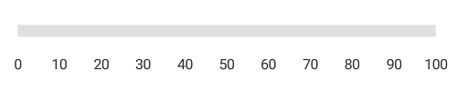
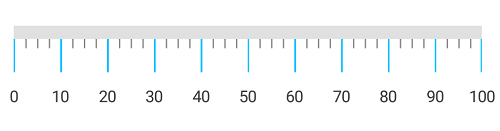
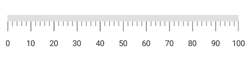

# Tick Setting 

The [`TickSetting`](https://help.syncfusion.com/cr/xamarin-android/Com.Syncfusion.Gauges.SfCircularGauge.TickSetting.html) property is used to identify the gauge’s data value by marking the gauge scale in regular increments.

## Ticks visibility

Ticks visibility can be customized using the [`ShowTicks`](https://help.syncfusion.com/cr/xamarin-android/Com.Syncfusion.Gauges.SfLinearGauge.LinearScale.html#Com_Syncfusion_Gauges_SfLinearGauge_LinearScale_ShowTicks) property of linear scale.



		    SfLinearGauge linearGauge = new SfLinearGauge(this);
            linearGauge.SetBackgroundColor(Color.White);
            linearGauge.SetOrientation(SfLinearGauge.Orientation.Horizontal);
            LinearScale linearScale = new LinearScale();
            linearScale.ScaleBarColor = Color.ParseColor("#e0e0e0");
            linearScale.LabelColor = Color.ParseColor("#424242");
            linearScale.LabelOffset = -10;
            linearScale.ShowTicks = false;
            linearGauge.Scales.Add(linearScale);
			


## Tick customization

You can customize the color and thickness of ticks by using the [`Color`](https://help.syncfusion.com/cr/xamarin-android/Com.Syncfusion.Gauges.SfLinearGauge.LinearTickSettings.html#Com_Syncfusion_Gauges_SfLinearGauge_LinearTickSettings_Color) and [`StrokeWidth`](https://help.syncfusion.com/cr/xamarin-android/Com.Syncfusion.Gauges.SfLinearGauge.LinearTickSettings.html#Com_Syncfusion_Gauges_SfLinearGauge_LinearTickSettings_StrokeWidth) properties. The ticks length also can be customized using the [`Length`](https://help.syncfusion.com/cr/xamarin-android/Com.Syncfusion.Gauges.SfLinearGauge.LinearTickSettings.html#Com_Syncfusion_Gauges_SfLinearGauge_LinearTickSettings_Length) property as demonstrated below.

### Major tick customization



		    SfLinearGauge linearGauge = new SfLinearGauge(this);
            linearGauge.SetBackgroundColor(Color.White);
            linearGauge.SetOrientation(SfLinearGauge.Orientation.Horizontal);
            LinearScale linearScale = new LinearScale();
            linearScale.ScaleBarColor = Color.ParseColor("#e0e0e0");
            linearScale.LabelColor = Color.ParseColor("#424242");
            LinearTickSettings majorTickSettings = new LinearTickSettings();
            majorTickSettings.StrokeWidth = 1;
            majorTickSettings.Length = 25;
            majorTickSettings.Color = Color.DeepSkyBlue;
            linearScale.MajorTickSettings = majorTickSettings;
            linearGauge.Scales.Add(linearScale);
			


### Minor tick customization



            SfLinearGauge linearGauge = new SfLinearGauge(this);
            linearGauge.SetBackgroundColor(Color.White);
            linearGauge.SetOrientation(SfLinearGauge.Orientation.Horizontal);
            LinearScale linearScale = new LinearScale();
            linearScale.ScaleBarColor = Color.ParseColor("#e0e0e0");
            linearScale.LabelColor = Color.ParseColor("#424242");
            linearScale.MajorTickSettings.StrokeWidth = 1;
            linearScale.MajorTickSettings.Length = 12;
            linearScale.MinorTicksPerInterval = 3;
            LinearTickSettings minorTickSettings = new LinearTickSettings();
            minorTickSettings.StrokeWidth = 2;
            minorTickSettings.Length = 7;
            minorTickSettings.Color = Color.RosyBrown;
            linearScale.MinorTickSettings = minorTickSettings;
            linearGauge.Scales.Add(linearScale);
			


## Setting minor ticks per interval

The [`Interval`](https://help.syncfusion.com/cr/xamarin-android/Com.Syncfusion.Gauges.SfLinearGauge.LinearScale.html#Com_Syncfusion_Gauges_SfLinearGauge_LinearScale_Interval) property is used to calculate the tick counts for a scale. Similar to ticks, minor ticks are also calculated by using the [`MinorTicksPerInterval`](https://help.syncfusion.com/cr/xamarin-android/Com.Syncfusion.Gauges.SfLinearGauge.LinearScale.html#Com_Syncfusion_Gauges_SfLinearGauge_LinearScale_MinorTicksPerInterval) property.



            SfLinearGauge linearGauge = new SfLinearGauge(this);
            linearGauge.SetBackgroundColor(Color.White);
            linearGauge.SetOrientation(SfLinearGauge.Orientation.Horizontal);
            LinearScale linearScale = new LinearScale();
            linearScale.MajorTickSettings.StrokeWidth = 2;
            linearScale.MajorTickSettings.Length = 10;
            linearScale.MinorTickSettings.StrokeWidth = 1;
            linearScale.ScaleBarColor = Color.ParseColor("#e0e0e0");
            linearScale.LabelColor = Color.ParseColor("#424242");
            linearScale.MinorTicksPerInterval = 4;
            linearGauge.Scales.Add(linearScale);
			


## Setting position for ticks

The major and minor ticks can be positioned far away from the scale by using the [`Offset`](https://help.syncfusion.com/cr/xamarin-android/Com.Syncfusion.Gauges.SfLinearGauge.LinearTickSettings.html#Com_Syncfusion_Gauges_SfLinearGauge_LinearTickSettings_Offset) property.



            SfLinearGauge linearGauge = new SfLinearGauge(this);
            linearGauge.SetBackgroundColor(Color.White);
            linearGauge.SetOrientation(SfLinearGauge.Orientation.Horizontal);
            LinearScale linearScale = new LinearScale();
            linearScale.ScaleBarSize = 40;
            linearScale.ScaleBarColor = Color.ParseColor("#e0e0e0");
            linearScale.MajorTickSettings.Color = Color.Black;
            linearScale.MinorTickSettings.Color = Color.Black;
            linearScale.MajorTickSettings.Length = 40;
            linearScale.MinorTickSettings.Offset = -20;
            linearScale.MajorTickSettings.Offset = -40;
            linearScale.MajorTickSettings.StrokeWidth = 1;
            linearScale.MinorTickSettings.StrokeWidth = 1;
            linearScale.MinorTickSettings.Length = 20;
            linearScale.LabelOffset = -9;
            linearScale.MinorTicksPerInterval = 4;
            linearScale.LabelColor = Color.Black;
            linearGauge.Scales.Add(linearScale);
			


