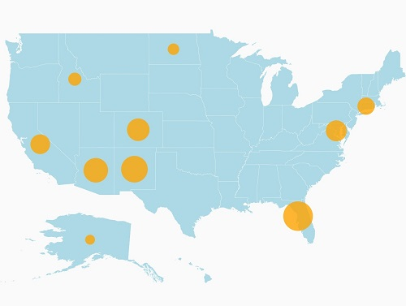
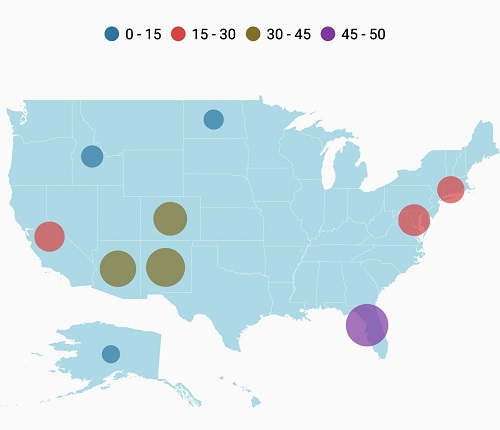
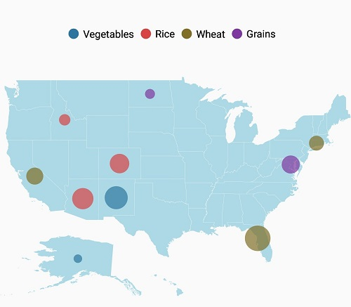
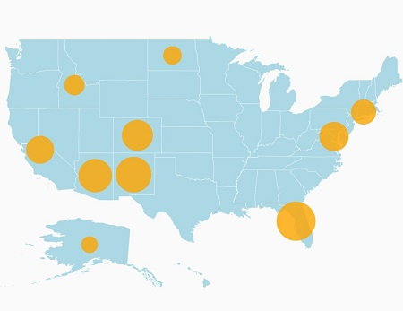

# Bubble marker

Bubbles in the maps control represents the underlying data values of the map. Bubbles are scattered throughout the map shapes that contain bound values.

## Bubble data

Bubbles are included when the data binding and [`BubbleMarkerSetting`](https://help.syncfusion.com/cr/xamarin-android/Com.Syncfusion.Maps.ShapeFileLayer.html#Com_Syncfusion_Maps_ShapeFileLayer_BubbleMarkerSetting) are set to the shape layers.

Below code snippet explains the data binding that is provided for bubble.





      ShapeFileLayer layer = new ShapeFileLayer();
      layer.Uri = "usa_state.shp";         
      layer.DataSource = viewModel.DataSource;
      layer.ShapeIdTableField = "STATE_NAME";
      layer.ShapeIdPath = "State";
      maps.Layers.Add(layer);

    public class ViewModel
      {
          public ViewModel()
          {
              DataSource = new ObservableCollection<AgricultureData>();

              DataSource.Add(new AgricultureData("Alaska", "Vegetables", 0));
              DataSource.Add(new AgricultureData("Arizona", "Rice", 36));
              DataSource.Add(new AgricultureData("California", "Wheat", 24));
              DataSource.Add(new AgricultureData("Colorado", "Rice", 31));
              DataSource.Add(new AgricultureData("North Dakota", "Grains", 4));
              DataSource.Add(new AgricultureData("Connecticut", "Wheat", 18));
              DataSource.Add(new AgricultureData("District of Columbia", "Grains", 27));
              DataSource.Add(new AgricultureData("Florida", "Wheat", 48));
              DataSource.Add(new AgricultureData("New Mexico", "Vegetables", 41));
              DataSource.Add(new AgricultureData("Idaho", "Rice", 8));

          }
          public ObservableCollection<AgricultureData> DataSource { get; set; }

      }





## Adding bubbles

To add bubbles to a map, the bubble marker setting should be added to the shape file layer.[`ShowBubbles`](https://help.syncfusion.com/cr/xamarin-android/Com.Syncfusion.Maps.BubbleMarkerSetting.html#Com_Syncfusion_Maps_BubbleMarkerSetting_ShowBubbles) property should be enabled for the bubble to be visible.

[`ValuePath`](https://help.syncfusion.com/cr/xamarin-android/Com.Syncfusion.Maps.BubbleMarkerSetting.html#Com_Syncfusion_Maps_BubbleMarkerSetting_ValuePath) represents the field value that is to be fetched from the data for each bubble.





      BubbleMarkerSetting bubbleSetting = new BubbleMarkerSetting();
      bubbleSetting.ShowBubbles = true;
      bubbleSetting.ValuePath = "index";
      layer.BubbleMarkerSetting = bubbleSetting;





## Bubble marker customization

### Fill color 

The fill color and opacity of the bubbles can be customized using the [`FillColor`](https://help.syncfusion.com/cr/xamarin-android/Com.Syncfusion.Maps.BubbleMarkerSetting.html#Com_Syncfusion_Maps_BubbleMarkerSetting_FillColor) and [`Alpha`](https://help.syncfusion.com/cr/xamarin-android/Com.Syncfusion.Maps.BubbleMarkerSetting.html#Com_Syncfusion_Maps_BubbleMarkerSetting_Alpha)  properties.





      BubbleMarkerSetting bubbleSetting = new BubbleMarkerSetting();
      bubbleSetting.ShowBubbles = true;
      bubbleSetting.ValuePath = "index";
      bubbleSetting.FillColor = Color.Orange;
      bubbleSetting.Alpha = 0.8f;
      layer.BubbleMarkerSetting = bubbleSetting;





Bubble color can be customized using the [`ColorMapping`](https://help.syncfusion.com/cr/xamarin-android/Com.Syncfusion.Maps.ColorMapping.html) property.

Maps provide the following two types of color mapping to bubble marker:

 * Equal color mapping
 * Range Color mapping

### Range color mapping

It is used to differentiate the bubble fill based on its under-bound value and color ranges.The [`From`](https://help.syncfusion.com/cr/xamarin-android/Com.Syncfusion.Maps.RangeColorMapping.html#Com_Syncfusion_Maps_RangeColorMapping_From) and [`To`](https://help.syncfusion.com/cr/xamarin-android/Com.Syncfusion.Maps.RangeColorMapping.html#Com_Syncfusion_Maps_RangeColorMapping_To) properties are used to define the color range and color for the range that can be specified using the Color property.




           
            BubbleMarkerSetting bubbleSetting = new BubbleMarkerSetting();

            bubbleSetting.ValuePath = "index";

            bubbleSetting.ColorValuePath = "index";

            RangeColorMapping colorMapping1 = new RangeColorMapping() { Color = Color.ParseColor("#2E769F"), From = 0, To = 15 };
            RangeColorMapping colorMapping2 = new RangeColorMapping() { Color = Color.ParseColor("#D84444"), From = 15, To = 30 };
            RangeColorMapping colorMapping3 = new RangeColorMapping() { Color = Color.ParseColor("#816F28"), From = 30, To = 45 };
            RangeColorMapping colorMapping4 = new RangeColorMapping() { Color = Color.ParseColor("#7F38A0"), From = 45, To = 50 };

            bubbleSetting.ColorMapping.Add(colorMapping1);
            bubbleSetting.ColorMapping.Add(colorMapping2);
            bubbleSetting.ColorMapping.Add(colorMapping3);
            bubbleSetting.ColorMapping.Add(colorMapping4);
           
            layer.BubbleMarkerSetting = bubbleSetting;





### Equal color mapping

It is used to differentiate the bubble fill based on its underlying value and color using the [`Value`](https://help.syncfusion.com/cr/xamarin-android/Com.Syncfusion.Maps.EqualColorMapping.html#Com_Syncfusion_Maps_EqualColorMapping_Value) and [`Color`](https://help.syncfusion.com/cr/xamarin-android/Com.Syncfusion.Maps.ColorMapping.html#Com_Syncfusion_Maps_ColorMapping_Color) properties.





            BubbleMarkerSetting bubbleSetting = new BubbleMarkerSetting();

            bubbleSetting.ValuePath = "index";

            bubbleSetting.ColorValuePath = "Type";

            EqualColorMapping colorMapping1 = new EqualColorMapping() { Color = Color.ParseColor("#2E769F"), Value = "Vegetables" };
            EqualColorMapping colorMapping2 = new EqualColorMapping() { Color = Color.ParseColor("#D84444"), Value = "Rice" };
            EqualColorMapping colorMapping3 = new EqualColorMapping() { Color = Color.ParseColor("#816F28"), Value = "Wheat" };
            EqualColorMapping colorMapping4 = new EqualColorMapping() { Color = Color.ParseColor("#7F38A0"), Value = "Grains" };

            bubbleSetting.ColorMapping.Add(colorMapping1);
            bubbleSetting.ColorMapping.Add(colorMapping2);
            bubbleSetting.ColorMapping.Add(colorMapping3);
            bubbleSetting.ColorMapping.Add(colorMapping4);
           
            layer.BubbleMarkerSetting = bubbleSetting;
            




### Bubble size customization

Size of the bubbles depends on the data that is bound to the [`ValuePath`](https://help.syncfusion.com/cr/xamarin-android/Com.Syncfusion.Maps.BubbleMarkerSetting.html#Com_Syncfusion_Maps_BubbleMarkerSetting_ValuePath) but the maximum and minimum size of the bubble can be customized using [`MaxSize`](https://help.syncfusion.com/cr/xamarin-android/Com.Syncfusion.Maps.BubbleMarkerSetting.html#Com_Syncfusion_Maps_BubbleMarkerSetting_MaxSize) and [`MinSize`](https://help.syncfusion.com/cr/xamarin-android/Com.Syncfusion.Maps.BubbleMarkerSetting.html#Com_Syncfusion_Maps_BubbleMarkerSetting_MinSize) properties.

I> [`ShowItems`](https://help.syncfusion.com/cr/xamarin-android/Com.Syncfusion.Maps.ShapeFileLayer.html#Com_Syncfusion_Maps_ShapeFileLayer_ShowItems) should be enabled to display label on bubble marker.





  BubbleMarkerSetting bubbleSetting = new BubbleMarkerSetting();
  bubbleSetting.ShowBubbles = true;
  bubbleSetting.ValuePath = "index";
  bubbleSetting.FillColor = Color.Orange;
  bubbleSetting.Alpha = 0.8f;
  bubbleSetting.MinSize = 20;
  bubbleSetting.MaxSize = 25;
  layer.BubbleMarkerSetting = bubbleSetting;





The following code sample demonstrates how to add bubbles to maps and customize them.





            SfMaps maps = new SfMaps(this);
            maps.SetBackgroundColor(Color.White);
            ViewModel viewModel = new ViewModel();
            ShapeFileLayer layer = new ShapeFileLayer();
            layer.Uri = "usa_state.shp";
            layer.DataSource = viewModel.DataSource;
            layer.ShapeIdTableField = "STATE_NAME";
            layer.ShapeIdPath = "Name";
            
            BubbleMarkerSetting bubbleSetting = new BubbleMarkerSetting();

            bubbleSetting.ValuePath = "index";

            bubbleSetting.ColorValuePath = "index";

            RangeColorMapping colorMapping1 = new RangeColorMapping() { Color = Color.ParseColor("#2E769F"), From = 0, To = 15 };
            RangeColorMapping colorMapping2 = new RangeColorMapping() { Color = Color.ParseColor("#D84444"), From = 15, To = 30 };
            RangeColorMapping colorMapping3 = new RangeColorMapping() { Color = Color.ParseColor("#816F28"), From = 30, To = 45 };
            RangeColorMapping colorMapping4 = new RangeColorMapping() { Color = Color.ParseColor("#7F38A0"), From = 45, To = 50 };

            bubbleSetting.ColorMapping.Add(colorMapping1);
            bubbleSetting.ColorMapping.Add(colorMapping2);
            bubbleSetting.ColorMapping.Add(colorMapping3);
            bubbleSetting.ColorMapping.Add(colorMapping4);
           
            layer.BubbleMarkerSetting = bubbleSetting;

            LegendSetting legendSetting = new LegendSetting();

            legendSetting.ShowLegend = true;

            legendSetting.LegendPosition = new Point(50, 20);

            legendSetting.LegendType = LegendType.Bubbles;

            layer.LegendSetting = legendSetting;

            ShapeSetting shapeSetting = new ShapeSetting();

            shapeSetting.ShapeFill = Color.LightBlue;

            layer.ShapeSettings = shapeSetting;

            maps.Layers.Add(layer);

            SetContentView(maps);

   
    public class ViewModel
    {
        public ViewModel()
        {
            DataSource = new ObservableCollection<AgricultureData>();

            DataSource.Add(new AgricultureData("Alaska", "Vegetables", 0));
            DataSource.Add(new AgricultureData("Arizona", "Rice", 36));
            DataSource.Add(new AgricultureData("California", "Wheat", 24));
            DataSource.Add(new AgricultureData("Colorado", "Rice", 31));
            DataSource.Add(new AgricultureData("North Dakota", "Grains", 4));
            DataSource.Add(new AgricultureData("Connecticut", "Wheat", 18));
            DataSource.Add(new AgricultureData("District of Columbia", "Grains", 27));
            DataSource.Add(new AgricultureData("Florida", "Wheat", 48));
            DataSource.Add(new AgricultureData("New Mexico", "Vegetables", 41));
            DataSource.Add(new AgricultureData("Idaho", "Rice", 8));

        }
        public ObservableCollection<AgricultureData> DataSource { get; set; }

    }
    public class AgricultureData
    {
        public AgricultureData(string name, string type, int count)
        {
            Name = name;
            Type = type;
            index = count;
        }

        public string Name
        {
            get;
            set;
        }

        public string Type
        {
            get;
            set;
        }

        public int index
        {
            get;
            set;
        }
    }





