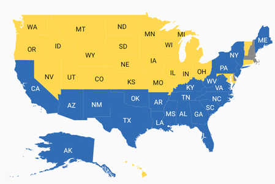
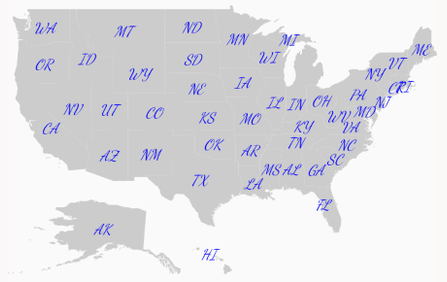
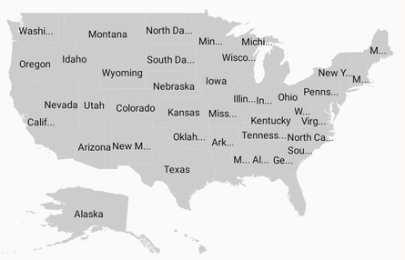
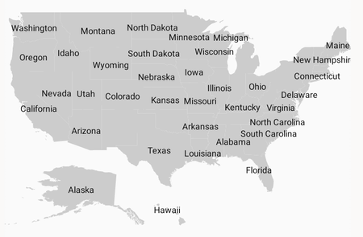

# Data Labels in Xamarin.Android Maps (SfMaps)

Data labels are used to display the values of shapes.

## Adding data labels

 The [`ShowItems`](https://help.syncfusion.com/cr/xamarin-android/Com.Syncfusion.Maps.ShapeFileLayer.html#Com_Syncfusion_Maps_ShapeFileLayer_ShowItems) property, which is a boolean property, displays or hides the data labels in shapes. Set the [`ShapeValuePath`](https://help.syncfusion.com/cr/xamarin-android/Com.Syncfusion.Maps.ShapeSetting.html#Com_Syncfusion_Maps_ShapeSetting_ShapeValuePath) property to get the data labels bound to each shape.





            SfMaps maps = new SfMaps(this);
         
            ShapeFileLayer layer = new ShapeFileLayer();

            layer.Uri = "usa_state.shp";

            layer.ShowItems = true;

            layer.ShapeSettings.ShapeFill = Color.LightGray;

            layer.DataSource = GetDataSource();

            layer.ShapeIdPath = "Name";

            layer.ShapeIdTableField = "STATE_NAME";

            layer.ShapeSettings.ShapeValuePath = "ShortName";

            maps.Layers.Add(layer);

            SetContentView(maps);





You can use below collection as a datasource of SfMaps.





                JSONArray GetDataSource()
        {
            JSONArray array = new JSONArray();

            array.Put(getJsonObject("Alabama", "AL",49));
            array.Put(getJsonObject("Alaska", "AK",43));
            array.Put(getJsonObject("Arizona", "AZ",31));
            array.Put(getJsonObject("Arkansas", "AR",36));
            array.Put(getJsonObject("California", "CA",50));
            array.Put(getJsonObject("Colorado", "CO",9));
            array.Put(getJsonObject("Connecticut", "CT",3));
            array.Put(getJsonObject("Florida", "FL",29));
            array.Put(getJsonObject("Georgia", "GA",36));
            array.Put(getJsonObject("Hawaii", "HI",4));
            array.Put(getJsonObject("Idaho", "ID",4));
            array.Put(getJsonObject("Illinois", "IL",20));
            array.Put(getJsonObject("Indiana", "IN",11));
            array.Put(getJsonObject("Iowa", "IA",6));
            array.Put(getJsonObject("Kansas", "KS",6));
            array.Put(getJsonObject("Kentucky", "KY",38));
            array.Put(getJsonObject("Louisiana", "LA",48));
            array.Put(getJsonObject("Maine", "ME",34));
            array.Put(getJsonObject("Maryland", "MD",10));
            array.Put(getJsonObject("Michigan", "MI",16));
            array.Put(getJsonObject("Minnesota", "MN",10));
            array.Put(getJsonObject("Mississippi", "MS",36));
            array.Put(getJsonObject("Missouri", "MO",3));
            array.Put(getJsonObject("Montana", "MT",3));
            array.Put(getJsonObject("Nebraska", "NE",5));
            array.Put(getJsonObject("Nevada", "NV",6));
            array.Put(getJsonObject("New Jersey", "NJ",34));
            array.Put(getJsonObject("New Mexico", "NM",35));
            array.Put(getJsonObject("New York", "NY",29));
            array.Put(getJsonObject("North Carolina", "NC",35));
            array.Put(getJsonObject("North Dakota", "ND",3));
            array.Put(getJsonObject("Ohio", "OH",18));
            array.Put(getJsonObject("Oklahoma", "OK",47));
            array.Put(getJsonObject("Oregon", "OR",7));
            array.Put(getJsonObject("Pennsylvania", "PA",40));
            array.Put(getJsonObject("Rhode Island", "RI",4));
            array.Put(getJsonObject("South Carolina", "SC",39));
            array.Put(getJsonObject("South Dakota", "SD",3));
            array.Put(getJsonObject("Tennessee", "TN",41));
            array.Put(getJsonObject("Texas", "TX",38));
            array.Put(getJsonObject("Utah", "UT",6));
            array.Put(getJsonObject("Vermont", "VT",3));
            array.Put(getJsonObject("Virginia", "VA",43));
            array.Put(getJsonObject("Washington", "WA",12));
            array.Put(getJsonObject("West Virginia", "WV",35));
            array.Put(getJsonObject("Wisconsin", "WI",10));
            array.Put(getJsonObject("Wyoming", "WY",3));
            return array;
        }
        JSONObject getJsonObject(String name, String shortname, double count)
        {
            JSONObject obj = new JSONObject();
            obj.Put("Name", name);
            obj.Put("ShortName", shortname);
            obj.Put("Count", count);
            return obj;
        }




## Setting contrast color

Based on the background color of the shapes, contrast color will be applied to data labels.





            SfMaps maps = new SfMaps(this);

            ShapeFileLayer layer = new ShapeFileLayer();

            layer.Uri = "usa_state.shp";

            layer.ShowItems = true;

            layer.DataSource = GetDataSource();

            layer.ShapeIdPath = "Name";

            layer.ShapeIdTableField = "STATE_NAME";

            layer.ShapeSettings.ShapeValuePath = "ShortName";

            layer.ShapeSettings.ShapeColorValuePath = "Count";

            RangeColorMapping rangeColorMapping = new RangeColorMapping();

            rangeColorMapping.From = 0;

            rangeColorMapping.To = 25;

            rangeColorMapping.Color = Color.ParseColor("#FFD84F");

            RangeColorMapping rangeColorMapping1 = new RangeColorMapping();

            rangeColorMapping1.From = 25;

            rangeColorMapping1.To = 50;

            rangeColorMapping1.Color = Color.ParseColor("#316DB5");

            layer.ShapeSettings.ColorMapping.Add(rangeColorMapping);

            layer.ShapeSettings.ColorMapping.Add(rangeColorMapping1);

            DataLabelSetting dataLabelSetting = new DataLabelSetting();

            dataLabelSetting.SmartLabelMode = IntersectAction.Trim;

            layer.DataLabelSettings = dataLabelSetting;

            maps.Layers.Add(layer);

            SetContentView(maps);
			




## Customizing data labels

Data labels can be customized using the [`DataLabelSetting`](https://help.syncfusion.com/cr/xamarin-android/Com.Syncfusion.Maps.ShapeFileLayer.html#Com_Syncfusion_Maps_ShapeFileLayer_DataLabelSettings) property in shape file layer. The typeface, color, and text size can be customized using the [`Typeface`](https://help.syncfusion.com/cr/xamarin-android/Com.Syncfusion.Maps.DataLabelSetting.html#Com_Syncfusion_Maps_DataLabelSetting_Typeface), [`TextColor`](https://help.syncfusion.com/cr/xamarin-android/Com.Syncfusion.Maps.DataLabelSetting.html#Com_Syncfusion_Maps_DataLabelSetting_TextColor), and [`TextSize`](https://help.syncfusion.com/cr/xamarin-android/Com.Syncfusion.Maps.DataLabelSetting.html#Com_Syncfusion_Maps_DataLabelSetting_TextSize) properties.





            SfMaps maps = new SfMaps(this);
         
            ShapeFileLayer layer = new ShapeFileLayer();

            layer.Uri = "usa_state.shp";

            layer.ShowItems = true;

            layer.ShapeSettings.ShapeFill = Color.LightGray;

            layer.DataSource = GetDataSource();

            layer.ShapeIdPath = "Name";

            layer.ShapeIdTableField = "STATE_NAME";

            layer.ShapeSettings.ShapeValuePath = "ShortName";

            DataLabelSetting dataLabelSetting = new DataLabelSetting();

            dataLabelSetting.TextColor = Color.Blue;

            dataLabelSetting.Typeface = Typeface.Create("cursive", TypefaceStyle.Italic);

            dataLabelSetting.TextSize = 12;

            layer.DataLabelSettings = dataLabelSetting;

            maps.Layers.Add(layer);

            SetContentView(maps);





## To smartly align data labels

The [`SmartLabelMode`](https://help.syncfusion.com/cr/xamarin-android/Com.Syncfusion.Maps.DataLabelSetting.html#Com_Syncfusion_Maps_DataLabelSetting_SmartLabelMode) property aligns the labels smartly within shape boundaries and avoids labels overlapping. Labels can be customized using the `Hide`, `Trim`, and `None` options.





            SfMaps maps = new SfMaps(this);
         
            ShapeFileLayer layer = new ShapeFileLayer();

            layer.Uri = "usa_state.shp";

            layer.ShowItems = true;

            layer.DataSource = GetDataSource();

            layer.ShapeIdPath = "Name";

            layer.ShapeIdTableField = "STATE_NAME";

            layer.ShapeSettings.ShapeValuePath = "Name";

            layer.ShapeSettings.ShapeColorValuePath = "Count";

            layer.ShapeSettings.ShapeFill = Color.LightGray;

            DataLabelSetting dataLabelSetting = new DataLabelSetting();

            dataLabelSetting.SmartLabelMode = IntersectAction.Trim;

            layer.DataLabelSettings = dataLabelSetting;

            maps.Layers.Add(layer);

            SetContentView(maps);





## To avoid overlap in data labels

The [`IntersectionAction`](https://help.syncfusion.com/cr/xamarin-android/Com.Syncfusion.Maps.DataLabelSetting.html#Com_Syncfusion_Maps_DataLabelSetting_IntersectionAction) property aligns labels that overlap. Labels can be customized using the `Hide`, `Trim`, and `None` options. First, set the [`SmartLabelMode`](https://help.syncfusion.com/cr/xamarin-android/Com.Syncfusion.Maps.DataLabelSetting.html#Com_Syncfusion_Maps_DataLabelSetting_SmartLabelMode) property to `None`.





            SfMaps maps = new SfMaps(this);
         
            ShapeFileLayer layer = new ShapeFileLayer();

            layer.Uri = "usa_state.shp";

            layer.ShowItems = true;

            layer.DataSource = GetDataSource();

            layer.ShapeIdPath = "Name";

            layer.ShapeIdTableField = "STATE_NAME";

            layer.ShapeSettings.ShapeValuePath = "Name";

            layer.ShapeSettings.ShapeColorValuePath = "Count";

            layer.ShapeSettings.ShapeFill = Color.LightGray;

            DataLabelSetting dataLabelSetting = new DataLabelSetting();

            dataLabelSetting.IntersectionAction = IntersectAction.Hide;

            dataLabelSetting.SmartLabelMode = IntersectAction.None;

            layer.DataLabelSettings = dataLabelSetting;

            maps.Layers.Add(layer);

            SetContentView(maps);





   
