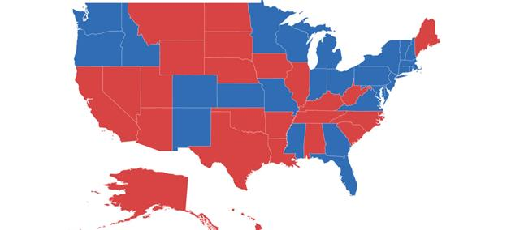
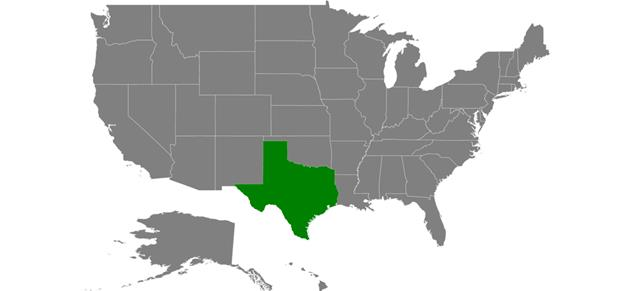

# Layers

The maps control is maintained through [`Layers`](https://help.syncfusion.com/cr/xamarin-android/Com.Syncfusion.Maps.SfMaps.html#Com_Syncfusion_Maps_SfMaps_Layers) ;a map can accommodate one or more layers.

The maps control consists the following two layers:

* Imagery layer

* Shape file layer

## Imagery layer

The [`MapsProvider`](https://help.syncfusion.com/xamarin-android/sfmaps/mapsprovider) section explains about the imagery layer.

## Shape file layer

Using shape file layer, custom shape files can be rendered and the shapes can be customized.

### Shape settings

This section defines how to customize the shapes in a map.

You can customize a shape's fill, stroke, and stroke thickness using the [`ShapeFill`](https://help.syncfusion.com/cr/xamarin-android/Com.Syncfusion.Maps.ShapeSetting.html#Com_Syncfusion_Maps_ShapeSetting_ShapeFill),
[`ShapeStroke`](https://help.syncfusion.com/cr/xamarin-android/Com.Syncfusion.Maps.ShapeSetting.html#Com_Syncfusion_Maps_ShapeSetting_ShapeStroke),
[`ShapeStrokeThickess`](https://help.syncfusion.com/cr/xamarin-android/Com.Syncfusion.Maps.ShapeSetting.html#Com_Syncfusion_Maps_ShapeSetting_ShapeStrokeThickess)

Refer to the following code sample for customizing shapes.





    ShapeSetting shapeSetting = new ShapeSetting();
    shapeSetting.ShapeFill = Color.LightBlue;
    shapeSetting.ShapeStroke = Color.Black;
    shapeSetting.ShapeStrokeThickess = 2;
    layer.ShapeSettings = shapeSetting;





To customize the shapes based on the bound values, use the following properties:

[`ShapeValuePath`](https://help.syncfusion.com/cr/xamarin-android/Com.Syncfusion.Maps.ShapeSetting.html#Com_Syncfusion_Maps_ShapeSetting_ShapeValuePath): Field value that has to be bound for each shape.

[`ShapeColorValuePath`](https://help.syncfusion.com/cr/xamarin-android/Com.Syncfusion.Maps.ShapeSetting.html#Com_Syncfusion_Maps_ShapeSetting_ShapeColorValuePath): Field value that has to be bound to determine the color.





        SfMaps maps = new SfMaps(this);
        maps.SetBackgroundColor(Color.White);

        ShapeFileLayer layer = new ShapeFileLayer();
        layer.Uri = "usa_state.shp";
        layer.DataSource = viewModel.Data;
        layer.ShapeIdTableField = "STATE_NAME";
        layer.ShapeIdPath = "State";
        maps.Layers.Add(layer);

        EqualColorMapping colorMapping = new EqualColorMapping();
        colorMapping.Color = Color.ParseColor("#D84444");
        colorMapping.LegendLabel = "Romney";
        colorMapping.Value = "Romney";

        EqualColorMapping colorMapping1 = new EqualColorMapping();
        colorMapping1.Color = Color.ParseColor("#316DB5");
        colorMapping1.LegendLabel = "Obama";
        colorMapping1.Value = "Obama";

        ShapeSetting shapeSetting = new ShapeSetting();
        shapeSetting.ShapeValuePath = "Candidate";
        shapeSetting.ShapeColorValuePath = "Candidate";
        shapeSetting.ColorMapping.Add(colorMapping);
        shapeSetting.ColorMapping.Add(colorMapping1);
        layer.ShapeSettings = shapeSetting;

        SetContentView(maps);





### Customize selected shapes

Selection can be enabled with the help of [`EnableSelection`](https://help.syncfusion.com/cr/xamarin-android/Com.Syncfusion.Maps.ShapeFileLayer.html#Com_Syncfusion_Maps_ShapeFileLayer_EnableSelection) property in shape file layer.

To customize the selected shapes alone, use the following properties:

[`SelectedShapeColor`](https://help.syncfusion.com/cr/xamarin-android/Com.Syncfusion.Maps.ShapeSetting.html#Com_Syncfusion_Maps_ShapeSetting_SelectedShapeColor): Sets the color for selected shapes in a map.

[`SelectedShapeStroke`](https://help.syncfusion.com/cr/xamarin-android/Com.Syncfusion.Maps.ShapeSetting.html#Com_Syncfusion_Maps_ShapeSetting_SelectedShapeStroke): Sets the border color for selected shapes in a map.

[`SelectedShapeStrokeThickness`](https://help.syncfusion.com/cr/xamarin-android/Com.Syncfusion.Maps.ShapeSetting.html#Com_Syncfusion_Maps_ShapeSetting_SelectedShapeStrokeThickness): Sets the border thickness for selected shapes in a map.





        ShapeFileLayer layer = new ShapeFileLayer();
        layer.Uri = "usa_state.shp";
        layer.DataSource = viewModel.Data;
        layer.ShapeIdTableField = "STATE_NAME";
        layer.ShapeIdPath = "State";
        layer.EnableSelection = true;
        maps.Layers.Add(layer);                     

        ShapeSetting shapeSetting = new ShapeSetting();
        shapeSetting.SelectedShapeColor = Color.DarkGreen;  
        layer.ShapeSettings = shapeSetting;    





## Events

The [`ShapeSelected`](https://help.syncfusion.com/cr/xamarin-android/Com.Syncfusion.Maps.ShapeFileLayer.html) event will be triggered when changing the the map shapes selection with corresponding argument as model [`P0`](https://help.syncfusion.com/cr/xamarin-android/Com.Syncfusion.Maps.ShapeFileLayer.ShapeSelectedEventArgs.html#Com_Syncfusion_Maps_ShapeFileLayer_ShapeSelectedEventArgs_P0) of the shape will be changed using the [`IsSelected`](https://help.syncfusion.com/cr/xamarin-android/Com.Syncfusion.Maps.ShapeFileLayer.ShapeSelectedEventArgs.html#Com_Syncfusion_Maps_ShapeFileLayer_ShapeSelectedEventArgs_IsSelected) property





        layer.EnableSelection = true;
        layer.ShapeSelected += Layer_ShapeSelected;

        private void Layer_ShapeSelected(object sender, ShapeFileLayer.ShapeSelectedEventArgs e)
        {
                    var data = e.P0;
                    if(data !=null)
                    {
                        bool IsSelected = e.IsSelected;
                    }
        }
 




## Sublayer

The shape layers are the core layers of the maps. Multiple layers can be added to the shape layers as sublayers within the shape layers.

### Adding multiple layers in the map

The multiple layer can be added in the maps using [`Sublayer`](https://help.syncfusion.com/xamarin-android/sfmaps/sublayer).

### Displaying layer in the view

The [`BaseMapIndex`](https://help.syncfusion.com/cr/xamarin-android/Com.Syncfusion.Maps.SfMaps.html#Com_Syncfusion_Maps_SfMaps_BaseMapIndex) property allows drill-down from main layer to another layer.

In the ShapeSelected event, *BaseMapIndex* property has been used to change the layer when Asia shape selected.





            LinearLayout layout = new LinearLayout(this);
            linearLayout = new LinearLayout(this);
            TextView text3 = new TextView(this);
            text3.SetTextColor(Color.Black);
            layout.Orientation = Orientation.Vertical;
            text3.TextSize = 16;
            text3.SetPadding(10, 20, 0, 0);
            text3.Text = "Tap on a shape to drilldown";
            text3.TextAlignment = Android.Views.TextAlignment.Center;
            linearLayout.SetBackgroundColor(Color.White);
            linearLayout.AddView(text3);
            maps = new SfMaps(this);
            maps.SetBackgroundColor(Color.White);
            DrilldownViewModel viewModel = new DrilldownViewModel();
            ShapeFileLayer layer = new ShapeFileLayer();
            layer.Uri = "world-map.shp";
            layer.DataSource = viewModel.DataSource;
            layer.ShapeIdTableField = "admin";
            layer.ShapeIdPath = "Country";
            layer.EnableSelection = true;
            EqualColorMapping colorMapping = new EqualColorMapping();
            colorMapping.Color = Color.ParseColor("#C13664");           
            colorMapping.Value = "North America";

            EqualColorMapping colorMapping1 = new EqualColorMapping();
            colorMapping1.Color = Color.ParseColor("#9C3367");           
            colorMapping1.Value = "South America";

            EqualColorMapping colorMapping2 = new EqualColorMapping();
            colorMapping2.Color = Color.ParseColor("#80306A");
            colorMapping2.Value = "Africa";

            EqualColorMapping colorMapping3 = new EqualColorMapping();
            colorMapping3.Color = Color.ParseColor("#622D6C");
            colorMapping3.Value = "Europe";

            EqualColorMapping colorMapping4 = new EqualColorMapping();
            colorMapping4.Color = Color.ParseColor("#462A6D");
            colorMapping4.Value = "Asia";

            EqualColorMapping colorMapping5 = new EqualColorMapping();
            colorMapping5.Color = Color.ParseColor("#2A2870");
            colorMapping5.Value = "Australia";

            ShapeSetting shapeSetting = new ShapeSetting();
            shapeSetting.ShapeColorValuePath = "Continent";
            shapeSetting.ColorMapping.Add(colorMapping);
            shapeSetting.ColorMapping.Add(colorMapping1);
            shapeSetting.ColorMapping.Add(colorMapping2);
            shapeSetting.ColorMapping.Add(colorMapping3);
            shapeSetting.ColorMapping.Add(colorMapping4);
            shapeSetting.ColorMapping.Add(colorMapping5);
            layer.ShapeSettings = shapeSetting;

            ShapeFileLayer layer1 = new ShapeFileLayer();
            layer1.Uri = "asia.shp";
            layer1.ShapeSettings.ShapeFill = Color.ParseColor("#462A6D");

            layer.ShapeSelected += Layer_ShapeSelected;

            maps.Layers.Add(layer);
            maps.Layers.Add(layer1);
            layout.AddView(linearLayout);
            layout.AddView(maps);
            SetContentView(layout);

        private void Layer_ShapeSelected(object sender, ShapeFileLayer.ShapeSelectedEventArgs e)
        {
            maps.BaseMapIndex = 1;
            linearLayout.Visibility = Android.Views.ViewStates.Invisible;
        }

        public class DrilldownViewModel
        {
          public DrilldownViewModel()
          {
              DataSource = new ObservableCollection<DrilldownModel>();
              DataSource.Add(new DrilldownModel("Afghanistan", "Asia"));
              DataSource.Add(new DrilldownModel("Angola", "Africa"));
              DataSource.Add(new DrilldownModel("Albania", "Europe"));
              DataSource.Add(new DrilldownModel("United Arab Emirates", "Asia"));
              DataSource.Add(new DrilldownModel("Argentina", "South America"));
              DataSource.Add(new DrilldownModel("Armenia", "Asia"));
              DataSource.Add(new DrilldownModel("French Southern and Antarctic Lands", "Seven seas (open ocean)"));
              DataSource.Add(new DrilldownModel("Australia", "Australia"));            
              
              //...
              //...
              
              DataSource.Add(new DrilldownModel("Zambia", "Africa"));
              DataSource.Add(new DrilldownModel("Zimbabwe", "Africa"));
          }
          public ObservableCollection<DrilldownModel> DataSource { get; set; }
        }

    public class DrilldownModel
    {
        public DrilldownModel(string country, string con)
        {
            this.Country = country;
            this.Continent = con;
        }
        public string Continent
        {
            get;
            set;
        }
        public string Country
        {
            get;
            set;
        }

    }
    




       
