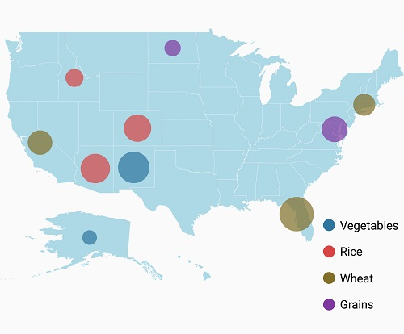
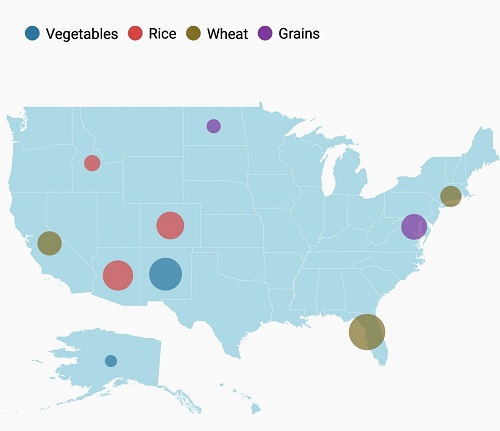
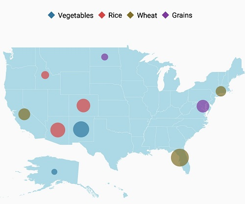
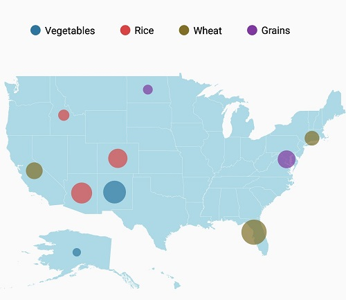
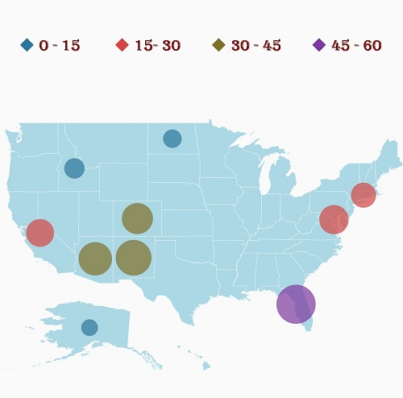
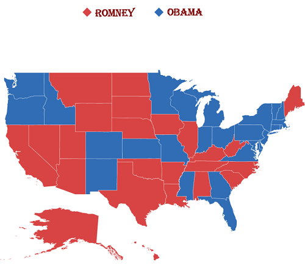

# Legend

A legend is a key used on a map that contains swatches of symbols with descriptions. A legend interprets what the map displays; it can be represented in various colors, shapes, or other identifiers based on the data. It gives a breakdown of what each symbol represents throughout the map.
Legends can be added with the help of [`LegendSetting`](https://help.syncfusion.com/cr/xamarin-android/Com.Syncfusion.Maps.ShapeFileLayer.html#Com_Syncfusion_Maps_ShapeFileLayer_LegendSetting) in the shape file layer.

## Visibility

The legends can be made visible by setting the [`ShowLegend`](https://help.syncfusion.com/cr/xamarin-android/Com.Syncfusion.Maps.LegendSetting.html#Com_Syncfusion_Maps_LegendSetting_ShowLegend) property in [`LegendSetting`](https://help.syncfusion.com/cr/xamarin-android/Com.Syncfusion.Maps.LegendSetting.html) class to true.





  LegendSetting legendSetting = new LegendSetting();
  legendSetting.ShowLegend = true;
  layer.LegendSetting = legendSetting;





## Legend type

The [`LegendType`](https://help.syncfusion.com/cr/xamarin-android/Com.Syncfusion.Maps.LegendSetting.html#Com_Syncfusion_Maps_LegendSetting_LegendType) property is used to display the shapes and bubble legends in maps.

* Layers
* Bubbles

## Legend position

Based on the values of x and y, the legends can be positioned using the  [`LegendPosition`](https://help.syncfusion.com/cr/xamarin-android/Com.Syncfusion.Maps.LegendSetting.html#Com_Syncfusion_Maps_LegendSetting_LegendPosition) property of the [`LegendSetting`](https://help.syncfusion.com/cr/xamarin-android/Com.Syncfusion.Maps.LegendSetting.html) lass. Legends will be positioned in the range of 0 to 100 (screen size ratio). By default, the *LegendPosition* is (50,10).

The legend items will be placed in multiple rows if size of the total legend exceeds the available size.  





            LegendSetting legendSetting = new LegendSetting();

            legendSetting.ShowLegend = true;

            legendSetting.LegendType = LegendType.Bubbles;

            legendSetting.LegendPosition = new Point(80, 60);

            legendSetting.HorizontalAlignment = HorizontalAlignment.Start;

            layer.LegendSetting = legendSetting;





## Legend alignment

Legends can be aligned using the [`HorizontalAlignment`](https://help.syncfusion.com/cr/xamarin-android/Com.Syncfusion.Maps.LegendSetting.html#Com_Syncfusion_Maps_LegendSetting_HorizontalAlignment) and [`VerticalAlignment`](https://help.syncfusion.com/cr/xamarin-android/Com.Syncfusion.Maps.LegendSetting.html#Com_Syncfusion_Maps_LegendSetting_VerticalAlignment) Properties. By default, the legends will be aligned in center.





            LegendSetting legendSetting = new LegendSetting();

            legendSetting.ShowLegend = true;

            legendSetting.LegendType = LegendType.Bubbles;

            legendSetting.LegendPosition = new Point(5, 20);

            legendSetting.HorizontalAlignment = HorizontalAlignment.Start;

            legendSetting.VerticalAlignment = VerticalAlignment.Center;

            layer.LegendSetting = legendSetting;





## Icon customization

The icon size of a legend can be customized using the [`IconHeight`](https://help.syncfusion.com/cr/xamarin-android/Com.Syncfusion.Maps.LegendSetting.html#Com_Syncfusion_Maps_LegendSetting_IconHeight) and [`IconWidth`](https://help.syncfusion.com/cr/xamarin-android/Com.Syncfusion.Maps.LegendSetting.html#Com_Syncfusion_Maps_LegendSetting_IconWidth) properties.





  LegendSetting legendSetting = new LegendSetting();
  legendSetting.ShowLegend = true;
  legendSetting.LegendPosition = new Point(75, 90);
  legendSetting.IconHeight = 20;
  legendSetting.IconWidth = 20;
  layer.LegendSetting = legendSetting;





The icon shape can be customized using the [`LegendIcon`](https://help.syncfusion.com/cr/xamarin-android/Com.Syncfusion.Maps.LegendSetting.html#Com_Syncfusion_Maps_LegendSetting_LegendIcon) property. By default, this property is set to circle for bubbles and rectangle for shapes.





LegendSetting legendSetting = new LegendSetting();

legendSetting.ShowLegend = true;

legendSetting.LegendType = LegendType.Bubbles;

legendSetting.LegendIcon = LegendIcon.Diamond;

layer.LegendSetting = legendSetting;





## Item margin

The [`ItemMargin`](https://help.syncfusion.com/cr/xamarin-android/Com.Syncfusion.Maps.LegendSetting.html#Com_Syncfusion_Maps_LegendSetting_ItemMargin) property is used to set spacing between the legend items.





            LegendSetting legendSetting = new LegendSetting();

            legendSetting.ShowLegend = true;

            legendSetting.LegendType = LegendType.Bubbles;

            legendSetting.ItemMargin = 30;
            
            layer.LegendSetting = legendSetting;





## Legend label

The[`LegendLabel`](https://help.syncfusion.com/cr/xamarin-android/Com.Syncfusion.Maps.ColorMapping.html#Com_Syncfusion_Maps_ColorMapping_LegendLabel)  provides an information about the maps. It is specified under color mapping. If *LegendLabel* is not specified, ColorMapping values will be applied as legend label.

The following properties are used to customize the label of the legends:

 * [`TextColor`](https://help.syncfusion.com/cr/xamarin-android/Com.Syncfusion.Maps.LegendSetting.html#Com_Syncfusion_Maps_LegendSetting_TextColor) : used to change the color of the legend text.

 * [`Typeface`](https://help.syncfusion.com/cr/xamarin-android/Com.Syncfusion.Maps.LegendSetting.html#Com_Syncfusion_Maps_LegendSetting_Typeface) : used to change the font family,font weight of the legend label.

 * [`TextSize`](https://help.syncfusion.com/cr/xamarin-android/Com.Syncfusion.Maps.LegendSetting.html#Com_Syncfusion_Maps_LegendSetting_TextSize) : used to change the text size of the legend label.





            LegendSetting legendSetting = new LegendSetting();

            legendSetting.ShowLegend = true;

            legendSetting.LegendType = LegendType.Bubbles;

            legendSetting.Typeface = Typeface.CreateFromAsset(Assets, "Algerian.ttf");

            legendSetting.TextColor = Color.Maroon;
            
            layer.LegendSettings = legendSetting;





The following code snippet explains the complete code for adding legend along with its customization.

### Legend for bubbles





            ViewModel viewModel = new ViewModel();

            SfMaps maps = new SfMaps(this);
            maps.SetBackgroundColor(Color.White);

            ShapeFileLayer layer = new ShapeFileLayer();
            layer.Uri = "usa_state.shp";
            layer.DataSource = viewModel.DataSource;
            layer.ShapeIdTableField = "STATE_NAME";
            layer.ShapeIdPath = "Name";
            maps.Layers.Add(layer);

            BubbleMarkerSetting bubbleSetting = new BubbleMarkerSetting();
            bubbleSetting.ValuePath = "index";
            bubbleSetting.ColorValuePath = "index";
            RangeColorMapping colorMapping1 = new RangeColorMapping() { Color = Color.ParseColor("#2E769F"), From = 0, To = 15 };
            RangeColorMapping colorMapping2 = new RangeColorMapping() { Color = Color.ParseColor("#D84444"), From = 15, To = 30 };
            RangeColorMapping colorMapping3 = new RangeColorMapping() { Color = Color.ParseColor("#816F28"), From = 30, To = 45 };
            RangeColorMapping colorMapping4 = new RangeColorMapping() { Color = Color.ParseColor("#7F38A0"), From = 45, To = 50 };
            bubbleSetting.ColorMapping.Add(colorMapping1);
            bubbleSetting.ColorMapping.Add(colorMapping2);
            bubbleSetting.ColorMapping.Add(colorMapping3);
            bubbleSetting.ColorMapping.Add(colorMapping4);
            layer.BubbleMarkerSetting = bubbleSetting;

            LegendSetting legendSetting = new LegendSetting();
            legendSetting.ShowLegend = true;
            legendSetting.LegendPosition = new Point(5, 20);
            legendSetting.LegendType = LegendType.Bubbles;
            legendSetting.Typeface = Typeface.CreateFromAsset(Assets, "Algerian.ttf");
            legendSetting.TextColor = Color.Maroon;
            legendSetting.ItemMargin = 30;
            legendSetting.LegendIcon = LegendIcon.Diamond;
            legendSetting.HorizontalAlignment = HorizontalAlignment.Start;
            layer.LegendSetting = legendSetting;

            ShapeSetting shapeSetting = new ShapeSetting();
            shapeSetting.ShapeFill = Color.LightBlue;
            layer.ShapeSettings = shapeSetting;

            map.Layers.Add(layer);

            SetContentView(maps);

    public class AgricultureData
    {
        public AgricultureData(string name, string type, int count)
        {
            Name = name;
            Type = type;
            index = count;
        }

        public string Name
        {
            get;
            set;
        }

        public string Type
        {
            get;
            set;
        }

        public int index
        {
            get;
            set;
        }
    }

    public class ViewModel
    {
        public ViewModel()
        {
            DataSource = new ObservableCollection<AgricultureData>();
          
            DataSource.Add(new AgricultureData("Alaska", "Vegetables", 0));
            DataSource.Add(new AgricultureData("Arizona", "Rice", 36));          
            DataSource.Add(new AgricultureData("California", "Wheat", 24));
            DataSource.Add(new AgricultureData("Colorado", "Rice", 31));
            DataSource.Add(new AgricultureData("North Dakota", "Grains", 4));
            DataSource.Add(new AgricultureData("Connecticut", "Wheat", 18));          
            DataSource.Add(new AgricultureData("District of Columbia", "Grains", 27));
            DataSource.Add(new AgricultureData("Florida", "Wheat", 48));
            DataSource.Add(new AgricultureData("New Mexico", "Vegetables", 41));        
            DataSource.Add(new AgricultureData("Idaho", "Rice", 8));
          
        }
        public ObservableCollection<AgricultureData> DataSource { get; set; }

    }




### Legend for shapes

ViewModel can be retrieved from [`Populate data`](https://help.syncfusion.com/xamarin-android/sfmaps/populate-data)





            SfMaps maps = new SfMaps(this);
            maps.SetBackgroundColor(Color.White);
            ViewModel viewModel = new ViewModel();
            ShapeFileLayer layer = new ShapeFileLayer();
            layer.Uri = "usa_state.shp";
            layer.DataSource = viewModel.Data;
            layer.ShapeIdTableField = "STATE_NAME";
            layer.ShapeIdPath = "State";

            LegendSetting legendSetting = new LegendSetting();
            legendSetting.ShowLegend = true;
            legendSetting.LegendPosition = new Point(50, 20);
            legendSetting.LegendType = LegendType.Layers;
            legendSetting.Typeface = Typeface.CreateFromAsset(Assets, "Algerian.ttf");
            legendSetting.TextColor = Color.Maroon;
            legendSetting.ItemMargin = 30;
            legendSetting.LegendIcon = LegendIcon.Diamond;
            layer.LegendSetting = legendSetting;

            EqualColorMapping colorMapping = new EqualColorMapping();
            colorMapping.Color = Color.ParseColor("#D84444");
            colorMapping.LegendLabel = "Romney";
            colorMapping.Value = "Romney";

            EqualColorMapping colorMapping1 = new EqualColorMapping();
            colorMapping1.Color = Color.ParseColor("#316DB5");
            colorMapping1.LegendLabel = "Obama";
            colorMapping1.Value = "Obama";

            ShapeSetting shapeSetting = new ShapeSetting();
            shapeSetting.ShapeValuePath = "Candidate";
            shapeSetting.ShapeColorValuePath = "Candidate";
            shapeSetting.ColorMapping.Add(colorMapping);
            shapeSetting.ColorMapping.Add(colorMapping1);

            layer.ShapeSettings = shapeSetting;        
            maps.Layers.Add(layer);
            SetContentView(maps);
            




