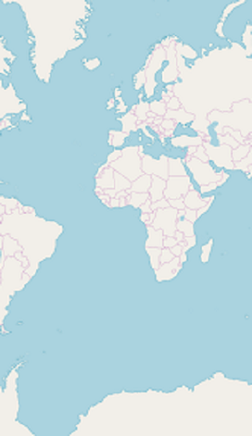

# Map providers support in SfMaps

The maps control supports map providers such as [`OpenStreetMap`](https://help.syncfusion.com/cr/xamarin-android/Com.Syncfusion.Maps.LayerType.html#Com_Syncfusion_Maps_LayerType_OSM) and [`Bing Maps`](https://help.syncfusion.com/cr/xamarin-android/Com.Syncfusion.Maps.LayerType.html#Com_Syncfusion_Maps_LayerType_Bing) that can be added to an imagery layer in maps.

## OpenStreetMap

The OpenStreetMap (OSM) is a world map; it was built by a community of mappers. It is free to use under an open license. This allows you view geographical data in a collaborative way from anywhere on the earth. The [`OSM`](https://help.syncfusion.com/cr/xamarin-android/Com.Syncfusion.Maps.LayerType.html#Com_Syncfusion_Maps_LayerType_OSM) provides small tile images based on your requests and combines them into a single image to display the map area in the maps control. 

### Adding OSM in maps

The maps control uses [`ImageryLayer`](https://help.syncfusion.com/cr/xamarin-android/Com.Syncfusion.Maps.ImageryLayer.html) to display the tile images from the OSM service. To use [`OSM`](https://help.syncfusion.com/cr/xamarin-android/Com.Syncfusion.Maps.LayerType.html#Com_Syncfusion_Maps_LayerType_OSM), add an imagery layer in maps’ layers collection.





        SfMaps maps = new SfMaps(this);
        ImageryLayer layer = new ImageryLayer();
        maps.Layers.Add(layer);





N> Both the [`ShapeFileLayer`](https://help.syncfusion.com/cr/xamarin-android/Com.Syncfusion.Maps.ShapeFileLayer.html) and [`ImageryLayer`](https://help.syncfusion.com/cr/xamarin-android/Com.Syncfusion.Maps.ImageryLayer.html) have been derived commonly from MapsLayer.

## Bing Maps

The [`Bing Maps`](https://help.syncfusion.com/cr/xamarin-android/Com.Syncfusion.Maps.LayerType.html#Com_Syncfusion_Maps_LayerType_Bing) is a world map owned by Microsoft. As OSM, Bing Maps also provides map tile images based on your requests and combines them into a single image to display the map area. To use [`Bing maps`](https://help.syncfusion.com/cr/xamarin-android/Com.Syncfusion.Maps.LayerType.html#Com_Syncfusion_Maps_LayerType_Bing), set the [`LayerType`](https://help.syncfusion.com/cr/xamarin-android/Com.Syncfusion.Maps.LayerType.html) property of ImageryLayer to “Bing”. Then, set the Bing Maps key, which is obtained from [Bing Maps Key](https://www.microsoft.com/en-us/maps/create-a-bing-maps-key).





        SfMaps maps = new SfMaps(this);
        ImageryLayer layer = new ImageryLayer();
        layer.LayerType = LayerType.Bing;
        layer.BingMapKey = "Your bing map key";
        maps.Layers.Add(layer);





N> The [`LayerType`](https://help.syncfusion.com/cr/xamarin-android/Com.Syncfusion.Maps.LayerType.html) property of [`ImageryLayer`](https://help.syncfusion.com/cr/xamarin-android/Com.Syncfusion.Maps.ImageryLayer.html) provides support to [`OSM`](https://help.syncfusion.com/cr/xamarin-android/Com.Syncfusion.Maps.LayerType.html#Com_Syncfusion_Maps_LayerType_OSM) and [`Bing Maps`](https://help.syncfusion.com/cr/xamarin-android/Com.Syncfusion.Maps.LayerType.html#Com_Syncfusion_Maps_LayerType_Bing). The default value of the [`LayerType`](https://help.syncfusion.com/cr/xamarin-android/Com.Syncfusion.Maps.LayerType.html) property is [`OSM`](https://help.syncfusion.com/cr/xamarin-android/Com.Syncfusion.Maps.LayerType.html#Com_Syncfusion_Maps_LayerType_OSM).

## BingMapStyle

The [`ImageryLayer`](https://help.syncfusion.com/cr/xamarin-android/Com.Syncfusion.Maps.ImageryLayer.html) provides support to the following types of [`Bing Maps`](https://help.syncfusion.com/cr/xamarin-android/Com.Syncfusion.Maps.LayerType.html#Com_Syncfusion_Maps_LayerType_Bing):

* `Road`
* `Aerial`
* `AerialWithLabels`

The desired style for the [`Bing Maps`](https://help.syncfusion.com/cr/xamarin-android/Com.Syncfusion.Maps.LayerType.html#Com_Syncfusion_Maps_LayerType_Bing) can be set using the [`BingMapStyle`](https://help.syncfusion.com/cr/xamarin-android/Com.Syncfusion.Maps.BingMapStyle.html) property of [`ImageryLayer`](https://help.syncfusion.com/cr/xamarin-android/Com.Syncfusion.Maps.ImageryLayer.html). The default value of [`BingMapStyle`](https://help.syncfusion.com/cr/xamarin-android/Com.Syncfusion.Maps.BingMapStyle.html) is [`Road`](https://help.syncfusion.com/cr/xamarin-android/Com.Syncfusion.Maps.BingMapStyle.html#Com_Syncfusion_Maps_BingMapStyle_Road).

### Road

The Road view displays the default map view of roads, buildings, and geography. The default value of the [`BingMapStyle`](https://help.syncfusion.com/cr/xamarin-android/Com.Syncfusion.Maps.BingMapStyle.html) property of [`ImageryLayer`](https://help.syncfusion.com/cr/xamarin-android/Com.Syncfusion.Maps.ImageryLayer.html) is [`Road`](https://help.syncfusion.com/cr/xamarin-android/Com.Syncfusion.Maps.BingMapStyle.html#Com_Syncfusion_Maps_BingMapStyle_Road).

### Aerial

The Aerial view displays the satellite images to highlight the roads and major landmarks for easy identification. The aerial view can be applied to maps by setting the [`BingMapStyle`](https://help.syncfusion.com/cr/xamarin-android/Com.Syncfusion.Maps.BingMapStyle.html) to [`Aerial`](https://help.syncfusion.com/cr/xamarin-android/Com.Syncfusion.Maps.BingMapStyle.html#Com_Syncfusion_Maps_BingMapStyle_Aerial).





    SfMaps maps = new SfMaps(this);
    ImageryLayer layer = new ImageryLayer();
    layer.LayerType = LayerType.Bing;
    layer.BingMapStyle = BingMapStyle.Aerial;
    layer.BingMapKey = "Your bing map key ";
    maps.Layers.Add(layer);





## AerialWithLabel

The [`AerialWithLabel`](https://help.syncfusion.com/cr/xamarin-android/Com.Syncfusion.Maps.BingMapStyle.html#Com_Syncfusion_Maps_BingMapStyle_AerialWithLabels) view displays the Aerial map with labels for continent, country, ocean, etc. This view can be applied to maps by setting the [`BingMapStyle`](https://help.syncfusion.com/cr/xamarin-android/Com.Syncfusion.Maps.BingMapStyle.html) to [`AerialWithLabel`](https://help.syncfusion.com/cr/xamarin-android/Com.Syncfusion.Maps.BingMapStyle.html#Com_Syncfusion_Maps_BingMapStyle_AerialWithLabels).





    SfMaps maps = new SfMaps(this);
    ImageryLayer layer = new ImageryLayer();
    layer.LayerType = LayerType.Bing;
    layer.BingMapStyle = BingMapStyle.AerialWithLabels;
    layer.BingMapKey = "Your bing map key ";
    maps.Layers.Add(layer);





## Zooming and panning

The maps control provides interactive zooming and panning supports to [`OSM`](https://help.syncfusion.com/cr/xamarin-android/Com.Syncfusion.Maps.LayerType.html#Com_Syncfusion_Maps_LayerType_OSM) and [`Bing Maps`](https://help.syncfusion.com/cr/xamarin-android/Com.Syncfusion.Maps.LayerType.html#Com_Syncfusion_Maps_LayerType_Bing).

Zooming helps you get a closer look of an area on maps for in-depth analysis. Panning helps you move a map around to focus the targeted area. You can perform zooming and panning with the pinching gesture in a map area.

## ResetOnDoubleTap

The [`ImageryLayer`](https://help.syncfusion.com/cr/xamarin-android/Com.Syncfusion.Maps.ImageryLayer.html) provides support to reset the maps to the default view when you double tap the imagery layer by setting the [`ResetOnDoubleTap`](https://help.syncfusion.com/cr/xamarin-android/Com.Syncfusion.Maps.ImageryLayer.html#Com_Syncfusion_Maps_ImageryLayer_ResetOnDoubleTap) property to true. The default value of this property is true. This behavior can be restricted by setting the [`ResetOnDoubleTap`](https://help.syncfusion.com/cr/xamarin-android/Com.Syncfusion.Maps.ImageryLayer.html#Com_Syncfusion_Maps_ImageryLayer_ResetOnDoubleTap) property to false.





        SfMaps maps = new SfMaps(this);
        ImageryLayer layer = new ImageryLayer();
        layer.ResetOnDoubleTap = true;
        maps.Layers.Add(layer);





## GeoCoordinates

The [`GeoCoordinates`](https://help.syncfusion.com/cr/xamarin-android/Com.Syncfusion.Maps.ImageryLayer.html#Com_Syncfusion_Maps_ImageryLayer_GeoCoordinates) property allows you view the desired area at the center on loading. By default, the [`GeoCoordinates`](https://help.syncfusion.com/cr/xamarin-android/Com.Syncfusion.Maps.ImageryLayer.html#Com_Syncfusion_Maps_ImageryLayer_GeoCoordinates) value is (0,0). So, the latitude value "0" and longitude value "0" are shown at the center.

On changing the [`GeoCoordinates`](https://help.syncfusion.com/cr/xamarin-android/Com.Syncfusion.Maps.ImageryLayer.html#Com_Syncfusion_Maps_ImageryLayer_GeoCoordinates) point dynamically, map will provide transition animation from the previous geo coordinates to the new geo coordinates value.





        SfMaps maps = new SfMaps(this);
        maps.ZoomLevel = 2;
        ImageryLayer layer = new ImageryLayer();
        layer.GeoCoordinates = new PointF(69.07f, -37.08f);
        maps.Layers.Add(layer);









        SfMaps maps = new SfMaps(this);
        maps.ZoomLevel = 2;
        ImageryLayer layer = new ImageryLayer();
        layer.GeoCoordinates = new PointF(0,0);
        maps.Layers.Add(layer);





## Markers

As [`ShapeFileLayer`](https://help.syncfusion.com/cr/xamarin-android/Com.Syncfusion.Maps.ShapeFileLayer.html), markers also can be added to imagery layer. [`Markers`](https://help.syncfusion.com/cr/xamarin-android/Com.Syncfusion.Maps.MapLayer.html#Com_Syncfusion_Maps_MapLayer_Markers) can be customized using the [`MarkerSettings`](https://help.syncfusion.com/cr/xamarin-android/Com.Syncfusion.Maps.MarkerSetting.html) property in imagery layer.
The detailed explanation of marker and its customization have been provided in [`Markers`](https://help.syncfusion.com/cr/xamarin-android/Com.Syncfusion.Maps.MapLayer.html#Com_Syncfusion_Maps_MapLayer_Markers) section.





            SfMaps maps = new SfMaps(this);          
            ImageryLayer layer = new ImageryLayer();        
            layer.MarkerSetting = new MarkerSetting();
            layer.MarkerSetting.MarkerIconColor = Color.Red;
            layer.MarkerSetting.MarkerIcon = MarkerIcon.Diamond;
            layer.MarkerSetting.IconSize = 13;
            MapMarker marker1 = new MapMarker();
            marker1.Label = "United States";
            marker1.Latitude = 40;
            marker1.Longitude = -101;
            layer.Markers.Add(marker1);
            MapMarker marker2 = new MapMarker();
            marker2.Label = "Brazil";
            marker2.Latitude = -15.7833;
            marker2.Longitude = -52;
            layer.Markers.Add(marker2);
            MapMarker marker3 = new MapMarker();
            marker3.Label = "Congo";
            marker3.Latitude = -1.6;
            marker3.Longitude = 24.4;
            layer.Markers.Add(marker3);
            MapMarker marker4 = new MapMarker();
            marker4.Label = "Kazakhstan";
            marker4.Latitude = 49.9;
            marker4.Longitude = 72.23;
            layer.Markers.Add(marker4);
            MapMarker marker5 = new MapMarker();
            marker5.Label = "Australia";
            marker5.Latitude = -20.54;
            marker5.Longitude = 134.10;
            layer.Markers.Add(marker5);
            maps.Layers.Add(layer);

            SetContentView(maps);





## Cache tiles in application memory

The [`CanCacheTiles`](https://help.syncfusion.com/cr/xamarin-android/Com.Syncfusion.Maps.ImageryLayer.html#Com_Syncfusion_Maps_ImageryLayer_CanCacheTiles) property used to decide whether the tiles should be cached or not.





       ImageryLayer imageryLayer = new ImageryLayer();

       imageryLayer.CanCacheTiles = true;





## Delete the tiles from cache

The [`DeleteTilesFromCache`](https://help.syncfusion.com/cr/xamarin-android/Com.Syncfusion.Maps.ImageryLayer.html#Com_Syncfusion_Maps_ImageryLayer_DeleteTilesFromCache) method used to delete the cache stored in the applications.





       SfMaps maps = new SfMaps(this);          
       ImageryLayer imageryLayer = new ImageryLayer();
       imageryLayer.DeleteTilesFromCache();





## Calculate zoom level based on map geo-bounds or distance

This feature is used to calculate the initial zoom level automatically in two ways.

* Distance in radius(Meter/KiloMeter/Mile)
* Geo-bounds(Northeast, Southwest)

### Distance in radius 

Calculate the initial zoom level automatically based on the [`Radius`](https://help.syncfusion.com/cr/xamarin-android/Com.Syncfusion.Maps.ImageryLayer.html#Com_Syncfusion_Maps_ImageryLayer_Radius) and [`DistanceType`](https://help.syncfusion.com/cr/xamarin-android/Com.Syncfusion.Maps.DistanceType.html) properties of [`ImageryLayer`](https://help.syncfusion.com/cr/xamarin-android/Com.Syncfusion.Maps.ImageryLayer.html) class.

N> [`DistanceType`](https://help.syncfusion.com/cr/xamarin-android/Com.Syncfusion.Maps.DistanceType.html) property default value is [`KiloMeter`](https://help.syncfusion.com/cr/xamarin-android/Com.Syncfusion.Maps.DistanceType.html#Com_Syncfusion_Maps_DistanceType_KiloMeter).





    public class MainActivity : AppCompatActivity
    {
        protected override void OnCreate(Bundle savedInstanceState)
        {
            base.OnCreate(savedInstanceState);
            Xamarin.Essentials.Platform.Init(this, savedInstanceState);
            SfMaps maps = new SfMaps(this);
            ImageryLayer layer = new ImageryLayer();
            layer.GeoCoordinates = new PointF(38.909804f, -77.043442f);
            layer.Radius = 5;
            layer.DistanceType = DistanceType.KiloMeter;
            CustomMarker marker = new CustomMarker(this);
            marker.Label = "Washington";
            marker.Latitude = 38.909804;
            marker.Longitude = -77.043442;
            layer.Markers.Add(marker);
            maps.Layers.Add(layer);
            SetContentView(maps);
        }
    }

    public class CustomMarker : MapMarker
    {
        Android.Content.Context context;
        public CustomMarker(Android.Content.Context con)
        {
            context = con;
        }

        public override void DrawMarker(PointF p0, Canvas p1)
        {
            float density = context.Resources.DisplayMetrics.Density / 1.5f;
            Bitmap bitmap = BitmapFactory.DecodeResource(context.Resources, Resource.Drawable.pin);
            p1.DrawBitmap(bitmap, (float)p0.X - (12 * density), (float)p0.Y - (35 * density), new Paint());
        }
    }





### Geo-bounds

Calculate the initial zoom level automatically based on the [`LatLngBounds(Northeast, Southwest)`](https://help.syncfusion.com/cr/xamarin-android/Com.Syncfusion.Maps.ImageryLayer.html#Com_Syncfusion_Maps_ImageryLayer_LatLngBounds) of [`ImageryLayer`](https://help.syncfusion.com/cr/xamarin-android/Com.Syncfusion.Maps.ImageryLayer.html) class.





    public class MainActivity : AppCompatActivity
    {
        protected override void OnCreate(Bundle savedInstanceState)
        {
            base.OnCreate(savedInstanceState);
            Xamarin.Essentials.Platform.Init(this, savedInstanceState);
            SfMaps maps = new SfMaps(this);
            ImageryLayer layer = new ImageryLayer();
            LatLngBounds bounds = new LatLngBounds();
            bounds.Northeast = new Position(38.909804, -77.043442);
            bounds.Southwest = new Position(38.909804, -77.043442);
            layer.LatLngBounds = bounds;
            CustomMarker marker = new CustomMarker(this);
            marker.Label = "Washington";
            marker.Latitude = 38.909804;
            marker.Longitude = -77.043442;
            layer.Markers.Add(marker);
            maps.Layers.Add(layer);
            SetContentView(maps);
        }
    }

    public class CustomMarker : MapMarker
    {
        Android.Content.Context context;
        public CustomMarker(Android.Content.Context con)
        {
            context = con;
        }

        public override void DrawMarker(PointF p0, Canvas p1)
        {
            float density = context.Resources.DisplayMetrics.Density / 1.5f;
            Bitmap bitmap = BitmapFactory.DecodeResource(context.Resources, Resource.Drawable.pin);
            p1.DrawBitmap(bitmap, (float)p0.X - (12 * density), (float)p0.Y - (35 * density), new Paint());
        }
    }
	




N> When setting [`LatLngBounds`](https://help.syncfusion.com/cr/xamarin-android/Com.Syncfusion.Maps.ImageryLayer.html#Com_Syncfusion_Maps_ImageryLayer_LatLngBounds) and DistanceRadius at the same time, the priority is [`DistanceRadius`](https://help.syncfusion.com/cr/xamarin-android/Com.Syncfusion.Maps.ImageryLayer.html#Com_Syncfusion_Maps_ImageryLayer_Radius) and calculate zoom level based radius value.

## Get the map tile layer bounds

You can get imagery layer pixel bounds by using [`MapBounds`](https://help.syncfusion.com/cr/xamarin-android/Com.Syncfusion.Maps.ImageryLayer.html#Com_Syncfusion_Maps_ImageryLayer_MapBounds) property while zooming, panning, and changing Geo-Coordinate value in imagery layer.





    public class MainActivity : AppCompatActivity
    {
        ImageryLayer layer = new ImageryLayer();

        protected override void OnCreate(Bundle savedInstanceState)
        {
            base.OnCreate(savedInstanceState);
            Xamarin.Essentials.Platform.Init(this, savedInstanceState);
            SfMaps maps = new SfMaps(this);
            layer.GeoCoordinates = new PointF(30.9709225f, -100.2187212f);
            layer.GeoCoordinateChanged += Layer_GeoCoordinateChanged;
            maps.Layers.Add(layer);
            SetContentView(maps);
        }

        private void Layer_GeoCoordinateChanged(object sender, GeoCoordinateChangedEventArgs e)
        {
            var pixelBounds = layer.MapBounds;
        }
    }





## Events

[`ZoomLevelChanging`](https://help.syncfusion.com/cr/xamarin-android/Com.Syncfusion.Maps.ImageryLayer.html) event triggers when zoom level changed. Following arguments can be get from the ZoomLevelChanging event .

* [`Cancel`](https://help.syncfusion.com/cr/xamarin-android/Com.Syncfusion.Maps.ZoomLevelChangingEventArgs.html#Com_Syncfusion_Maps_ZoomLevelChangingEventArgs_Cancel) - Used to cancel the zooming.

* [`PreviousLevel`](https://help.syncfusion.com/cr/xamarin-android/Com.Syncfusion.Maps.ZoomLevelChangingEventArgs.html#Com_Syncfusion_Maps_ZoomLevelChangingEventArgs_PreviousLevel) - Returns the previous level after the zooming.

* [`CurrentLevel`](https://help.syncfusion.com/cr/xamarin-android/Com.Syncfusion.Maps.ZoomLevelChangingEventArgs.html#Com_Syncfusion_Maps_ZoomLevelChangingEventArgs_CurrentLevel) - Returns the current level to be zoomed.





        SfMaps maps = new SfMaps(this);          
        ImageryLayer imageryLayer = new ImageryLayer();
        imageryLayer.ZoomLevelChanging += ImageryLayer_ZoomLevelChanging;
		maps.Layers.Add(imageryLayer);
        SetContentView(maps);
		
        private void ImageryLayer_ZoomLevelChanging(object sender, ZoomLevelChangingEventArgs e)
        {
            if (e.PreviousLevel == 10) // Returns the previous zoom level
            {
                e.Cancel = true; // Cancels the zooming event
                var CurrentLevel = e.CurrentLevel; // Returns the current zoomed level
            }
        }





