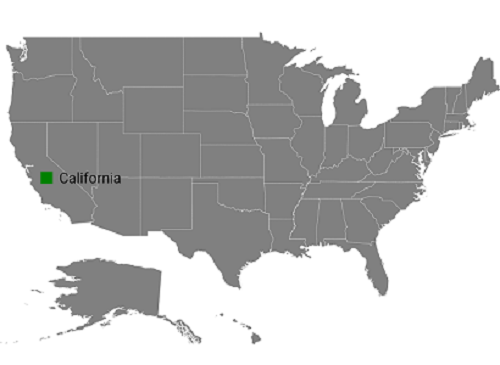
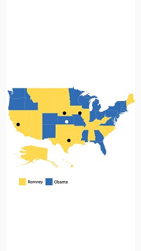
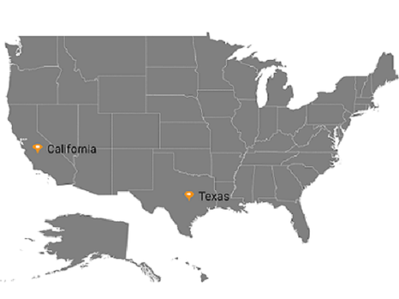
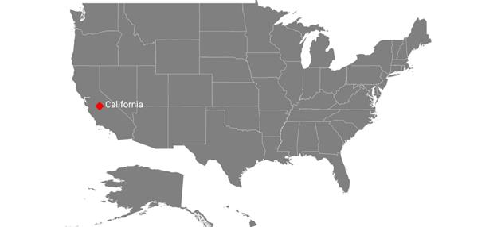
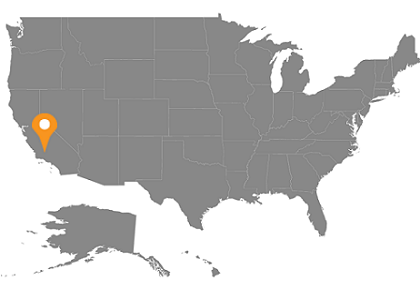
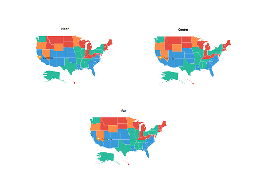
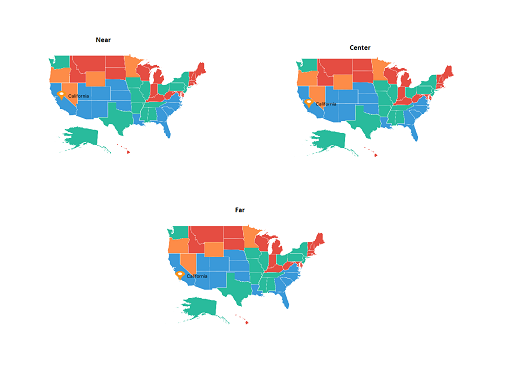
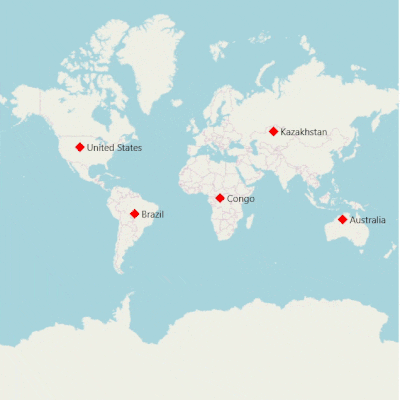
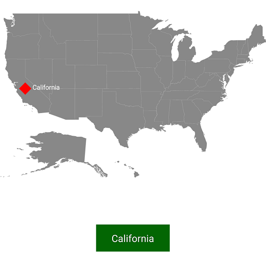

# Markers support in SfMaps control

Markers provide some messages on the map.

Markers are set to map by using the following two ways:

* Adding marker objects to map.
* Defining custom marker.

## Adding marker

Any number of markers can be added to the shape file layers using the [`Markers`](https://help.syncfusion.com/cr/xamarin-android/Com.Syncfusion.Maps.MapLayer.html#Com_Syncfusion_Maps_MapLayer_Markers) property. Each marker object contains the following list of properties:

[`Label`](https://help.syncfusion.com/cr/xamarin-android/Com.Syncfusion.Maps.MapMarker.html#Com_Syncfusion_Maps_MapMarker_Label): Text that is used to display information.

[`Latitude`](https://help.syncfusion.com/cr/xamarin-android/Com.Syncfusion.Maps.MapMarker.html#Com_Syncfusion_Maps_MapMarker_Latitude): Latitude point that specifies the y-axis position of the marker.

[`Longitude`](https://help.syncfusion.com/cr/xamarin-android/Com.Syncfusion.Maps.MapMarker.html#Com_Syncfusion_Maps_MapMarker_Longitude): Longitude point that specifies the x-axis position of the marker.





  SfMaps maps = new SfMaps(this);
  maps.SetBackgroundColor(Color.White);

  ShapeFileLayer layer = new ShapeFileLayer();
  layer.Uri = "usa_state.shp";

  maps.Layers.Add(layer);

  MapMarker marker = new MapMarker();
  marker.Label = "California";
  marker.Latitude = 37;
  marker.Longitude = -120;
  layer.Markers.Add(marker);
  SetContentView(maps);





## Marker customization

A map marker can be customized using the [`MarkerSetting`](https://help.syncfusion.com/cr/xamarin-android/Com.Syncfusion.Maps.MapLayer.html#Com_Syncfusion_Maps_MapLayer_MarkerSetting) property in shape file layer.

### Customizing marker icons

The size and color of marker icons can be customized using the [`IconSize`](https://help.syncfusion.com/cr/xamarin-android/Com.Syncfusion.Maps.MarkerSetting.html#Com_Syncfusion_Maps_MarkerSetting_IconSize) and [`MarkerIconColor`](https://help.syncfusion.com/cr/xamarin-android/Com.Syncfusion.Maps.MarkerSetting.html#Com_Syncfusion_Maps_MarkerSetting_MarkerIconColor) properties.

### Icon types

The shape of a marker icon can be customized using the [`MarkerIcon`](https://help.syncfusion.com/cr/xamarin-android/Com.Syncfusion.Maps.MarkerSetting.html#Com_Syncfusion_Maps_MarkerSetting_MarkerIcon) property. The maps control supports the following types of marker icons:

* Circle
* Diamond
* Image
* Rectangle
* Square





            SfMaps maps = new SfMaps(this);
         
            ShapeFileLayer layer = new ShapeFileLayer();

            layer.Uri = "usa_state.shp";

            MapMarker mapMarker = new MapMarker();

            mapMarker.Label = "California";

            mapMarker.Latitude = 37;

            mapMarker.Longitude = -120;

            layer.Markers.Add(mapMarker);

            MarkerSetting markerSetting = new MarkerSetting();

            markerSetting.MarkerIcon = MarkerIcon.Square;

            markerSetting.MarkerIconColor = Color.DarkGreen;

            markerSetting.LabelColor = Color.Black;

            layer.MarkerSetting = markerSetting;

            maps.Layers.Add(layer);

            SetContentView(maps);





### Setting contrast color

Based on the background color of the shapes, contrast color will be applied to marker icon.





SfMaps maps = new SfMaps(this);
            maps.SetBackgroundColor(Color.White);

            ShapeFileLayer layer = new ShapeFileLayer();
            layer.Uri = "usa_state.shp";
            layer.DataSource = viewModel.Data;
            layer.ShapeIdTableField = "STATE_NAME";
            layer.ShapeIdPath = "State";
            maps.Layers.Add(layer);
            LegendSetting legendSetting = new LegendSetting();
            legendSetting.ShowLegend = true;
            legendSetting.LegendPosition = new Point(30, 70);
            legendSetting.IconHeight = 20;
            legendSetting.IconWidth = 20;
            layer.LegendSetting = legendSetting;

            MapMarker marker = new MapMarker();

            marker.Latitude = 37;

            marker.Longitude = -120;

            layer.Markers.Add(marker);

            MapMarker marker1 = new MapMarker();

            marker1.Latitude = 31;

            marker1.Longitude = -97;

            layer.Markers.Add(marker1);
            MapMarker marker2 = new MapMarker();

            marker2.Latitude = 41;

            marker2.Longitude = -92;

            layer.Markers.Add(marker2);

            MapMarker marker3 = new MapMarker();

            marker3.Latitude = 38;

            marker3.Longitude = -98;

            layer.Markers.Add(marker3);
            MapMarker marker4 = new MapMarker();

            marker4.Latitude = 41;

            marker4.Longitude = -99;

            layer.Markers.Add(marker4);

            EqualColorMapping colorMapping = new EqualColorMapping();
            colorMapping.Color = Color.ParseColor("#FFD84F");
            colorMapping.Value = "Romney";

            EqualColorMapping colorMapping1 = new EqualColorMapping();
            colorMapping1.Color = Color.ParseColor("#316DB5");
            colorMapping1.Value = "Obama";

            ShapeSetting shapeSetting = new ShapeSetting();
            shapeSetting.ShapeValuePath = "Candidate";
            shapeSetting.ShapeColorValuePath = "Candidate";
            shapeSetting.ColorMapping.Add(colorMapping);
            shapeSetting.ColorMapping.Add(colorMapping1);
            layer.ShapeSettings = shapeSetting;

            SetContentView(maps);





### Setting image marker icon

You can pin an image as marker icon by setting the icon type as `Image`. Set [`ImageSource`](https://help.syncfusion.com/cr/xamarin-android/Com.Syncfusion.Maps.MarkerSetting.html#Com_Syncfusion_Maps_MarkerSetting_ImageSource) to get the image from local path.





            SfMaps maps = new SfMaps(this);
         
            ShapeFileLayer layer = new ShapeFileLayer();

            layer.Uri = "usa_state.shp";

            MapMarker marker = new MapMarker();

            marker.Label = "Texas";

            marker.Latitude = 31.267153;

            marker.Longitude = -97.7430608;

            layer.Markers.Add(marker);

            MapMarker marker1 = new MapMarker();

            marker1.Label = "California";

            marker1.Latitude = 37;

            marker1.Longitude = -120;

            layer.Markers.Add(marker1);

            MarkerSetting markerSetting = new MarkerSetting();

            markerSetting.MarkerIcon = MarkerIcon.Image;

            markerSetting.ImageSource = "pin.png";

            markerSetting.LabelColor = Color.Black;

            layer.MarkerSetting = markerSetting;

            maps.Layers.Add(layer);

            SetContentView(maps);





 

### Label customization

A marker label’s color and font style can be customized using the [`LabelColor`](https://help.syncfusion.com/cr/xamarin-android/Com.Syncfusion.Maps.MarkerSetting.html#Com_Syncfusion_Maps_MarkerSetting_LabelColor)  and [`LabelFontStyle`](https://help.syncfusion.com/cr/xamarin-android/Com.Syncfusion.Maps.MarkerSetting.html#Com_Syncfusion_Maps_MarkerSetting_LabelFontStyle) properties.

The following code explains the marker customization.





  SfMaps maps = new SfMaps(this);

  maps.SetBackgroundColor(Color.White);

  ShapeFileLayer layer = new ShapeFileLayer();

  layer.Uri = "usa_state.shp";

  maps.Layers.Add(layer);

  MapMarker marker = new MapMarker();

  marker.Label = "California";

  marker.Latitude = 37;

  marker.Longitude = -120;

  layer.Markers.Add(marker);

  MarkerSetting markerSetting = new MarkerSetting();

  markerSetting.MarkerIconColor = Color.Red;

  markerSetting.IconSize = 25;

  markerSetting.MarkerIcon = MarkerIcon.Diamond;

  markerSetting.LabelColor = Color.White;

  markerSetting.LabelFontStyle = Typeface.Default;

  layer.MarkerSetting = markerSetting;

  SetContentView(maps);





## Custom marker

Maps provide support for defining the custom marker by inheriting the MapMarker class.





  SfMaps maps = new SfMaps(this);
  maps.SetBackgroundColor(Color.White); 

  ShapeFileLayer layer = new ShapeFileLayer();   
  layer.Uri = "usa_state.shp";

  CustomMarker marker = new CustomMarker(this);
  marker.Label = "California";
  marker.Latitude = 37;
  marker.Longitude = -120;    
  layer.Markers.Add(marker); 

  maps.Layers.Add(layer);
  SetContentView(maps);





Below snippet explains on how to define custom marker with image support. 





 public class CustomMarker : MapMarker
 {
    Android.Content.Context context;
    public CustomMarker(Android.Content.Context con)
    {
       context = con;
    }

    public override void DrawMarker(PointF p0, Canvas p1)
    {
        float density = context.Resources.DisplayMetrics.Density / 1.5f;
        Bitmap bitmap = BitmapFactory.DecodeResource(context.Resources, Resource.Drawable.pin);
        p1.DrawBitmap(bitmap, (float)p0.X - (12 * density), (float)p0.Y - (35 * density), new Paint());
    }
 }





## Marker Alignment

You can align the maps marker horizontally and vertically using the `HorizontalAlignment` and `VerticalAlignment` properties. 

### Setting horizontal alignment

The HorizontalAlignment property is used to position the marker icon in x-axis. The marker icon can be positioned using the following ways in x-axis:

* Near: Specifies the near position of the marker icon for the given latitude and longitude values in x-axis position. 
* Center: Specifies the center position of the marker icon for the given latitude and longitude values in x-axis position.
* Far: Specifies the far position of the marker icon for the given latitude and longitude values in x-axis position.





            SfMaps maps = new SfMaps(this);
            ShapeFileLayer layer = new ShapeFileLayer();
            layer.Uri = "usa_state.shp";
            layer.ShapeIdTableField = "STATE_NAME";
            layer.ShapeIdPath = "State";
            layer.MarkerSelected += Layer_MarkerSelected;
            MapMarker marker = new MapMarker();
            marker.Label = "California";
            marker.Latitude = 40;
            marker.Longitude = -120;
            MarkerSetting MarkerSettings = new MarkerSetting();
            MarkerSettings.ImageSource = "pin.png";
            MarkerSettings.HorizontalAlignment = MarkerAlignment.Center;
            MarkerSettings.IconSize = 25;
            layer.MarkerSetting = MarkerSettings;
            layer.Markers.Add(marker);
            maps.Layers.Add(layer);





### Setting vertical alignment

The VerticalAlignment property is used to position the marker icon in y-axis. The marker icon can be positioned using the following ways in y-axis:

* Near: Specifies the near position of the marker icon for the given latitude and longitude values in y-axis position.
* Center: Specifies the center position of the marker icon for the given latitude and longitude values in y-axis position.
* Far: Specifies the far position of the marker icon for the given latitude and longitude values in y-axis position.





            SfMaps maps = new SfMaps(this);
            ShapeFileLayer layer = new ShapeFileLayer();
            layer.Uri = "usa_state.shp";
            layer.ShapeIdTableField = "STATE_NAME";
            layer.ShapeIdPath = "State";
            layer.MarkerSelected += Layer_MarkerSelected;
            MapMarker marker = new MapMarker();
            marker.Label = "California";
            marker.Latitude = 40;
            marker.Longitude = -120;
            MarkerSetting MarkerSettings = new MarkerSetting();
            MarkerSettings.ImageSource = "pin.png";
            MarkerSettings.VerticalAlignment = MarkerAlignment.Center;
            MarkerSettings.IconSize = 25;
            layer.MarkerSetting = MarkerSettings;
            layer.Markers.Add(marker);
            maps.Layers.Add(layer);





N> The default marker icon position for VerticalAlignment and HorizontalAlignment is Center.

## Reset the old custom view marker

If you add any view for marker using `SelectedMarkerView` property from `MarkerSelected` event, then the corresponding view will be applied to the selected marker. Custom view will be added continuously for all the selected marker, but do not have option to reset the old one. Now, you can achieve this using the `ResetOldSelectedView` property. If the Boolean set as true, then it will be removed the old view of marker and load the initially rendered marker.





    public class MainActivity : AppCompatActivity
    {
        protected override void OnCreate(Bundle savedInstanceState)
        {
            base.OnCreate(savedInstanceState);
            Xamarin.Essentials.Platform.Init(this, savedInstanceState);
            SfMaps maps = new SfMaps(this);
            ImageryLayer layer = new ImageryLayer();
            layer.ResetOldSelectedView = true;
            layer.MarkerSelected += Layer_MarkerSelected;
            MapMarker marker = new MapMarker();
            marker.Label = "United States";
            marker.Latitude = 40;
            marker.Longitude = -101;
            layer.Markers.Add(marker);
            MapMarker marker1 = new MapMarker();
            marker1.Label = "Brazil";
            marker1.Latitude = -15.7833;
            marker1.Longitude = -52;
            layer.Markers.Add(marker1);
            MapMarker marker2 = new MapMarker();
            marker2.Label = "Congo";
            marker2.Latitude = -1.6;
            marker2.Longitude = 24.4;
            layer.Markers.Add(marker2); 
            MapMarker marker3 = new MapMarker();
            marker3.Label = "Kazakhstan";
            marker3.Latitude = 49.9;
            marker3.Longitude = 72.23;
            layer.Markers.Add(marker3);
            MapMarker marker4 = new MapMarker();
            marker4.Label = "Australia";
            marker4.Latitude = -20.54;
            marker4.Longitude = 134.10;
            layer.Markers.Add(marker4);
            maps.Layers.Add(layer);
            SetContentView(maps);
      }

        private void Layer_MarkerSelected(object sender, MarkerSelectedEventArgs e)
        {
            ImageView img = new ImageView(this);
            img.SetImageResource(Resource.Drawable.pin);
            e.SelectedMarkerView = img;
        }
  }
  




## Events

[`MarkerSelected`](https://help.syncfusion.com/cr/xamarin-android/Com.Syncfusion.Maps.MapLayer.html) event is triggered when the marker is selected.
Argument contains the [`MapMarker`](https://help.syncfusion.com/cr/xamarin-android/Com.Syncfusion.Maps.MapMarker.html) which gives the information about the marker.





 layer.MarkerSelected += Layer_MarkerSelected;

 private void Layer_MarkerSelected(object sender, ShapeFileLayer.MarkerSelectedEventArgs e)
 {
     MapMarker marker = (MapMarker)e.P0;
     if (marker != null)
     {
         if (toast != null)
         {
             toast.Cancel();
         }
         toast = Toast.MakeText(this, marker.Label, ToastLength.Short);
         toast.View.SetBackgroundColor(Color.DarkGreen);
         toast.Show();
    }
 }





