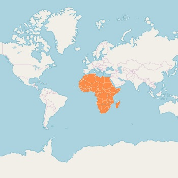

# Sublayer

Sublayer in the maps control allows to load multiple shape files in a single container and enables maps to display more information.

## Adding sublayers in ShapeFileLayer

You can add multiple shape files in the [`ShapeFileLayer`](https://help.syncfusion.com/cr/xamarin-android/Com.Syncfusion.Maps.ShapeFileLayer.html) using the [`SubShapeFileLayer`](https://help.syncfusion.com/cr/xamarin-android/Com.Syncfusion.Maps.SubShapeFileLayer.html) property.





            SfMaps map = new SfMaps();

            ShapeFileLayer layer = new ShapeFileLayer();

            layer.Uri = "usa_state.shp";

            ShapeSetting shapeSetting = new ShapeSetting();

            shapeSetting.ShapeStroke = Color.FromHex("#D0D0D0");

            shapeSetting.ShapeStrokeThickness = 2;

            shapeSetting.ShapeFill = Color.FromHex("#E5E5E5");

            layer.ShapeSettings = shapeSetting;

            ShapeFileLayer subShapeLayer = new ShapeFileLayer();

            subShapeLayer.Uri = "Texas.shp";

            ShapeSetting shapeSetting1 = new ShapeSetting();

            shapeSetting1.ShapeFill = Color.FromHex("#B1D8F5");

            shapeSetting1.ShapeStrokeThickness = 1;

            shapeSetting1.ShapeStroke = Color.FromHex("#8DCCF4");

            subShapeLayer.ShapeSettings = shapeSetting1;

            MapMarker mapMarker = new MapMarker();

            mapMarker.Label = "TX";

            mapMarker.Latitude = "30.267153";

            mapMarker.Longitude = "-97.7430608";

            subShapeLayer.Markers.Add(mapMarker);

            layer.Sublayers.Add(subShapeLayer);

            ShapeFileLayer subShapeLayer1 = new ShapeFileLayer();

            subShapeLayer1.Uri = "California.shp";

            ShapeSetting shapeSetting2 = new ShapeSetting();

            shapeSetting2.ShapeFill = Color.FromHex("#B1D8F5");

            shapeSetting2.ShapeStrokeThickness = 1;

            shapeSetting2.ShapeStroke = Color.FromHex("#8DCCF4");

            subShapeLayer1.ShapeSettings = shapeSetting2;

            MapMarker mapMarker1 = new MapMarker();

            mapMarker1.Label = "CA";

            mapMarker1.Latitude = "37.3382082";

            mapMarker1.Longitude = "-121.8863286";

            subShapeLayer1.Markers.Add(mapMarker1);

            layer.Sublayers.Add(subShapeLayer1);

            map.Layers.Add(layer);

            this.Content = map;





## Adding sublayers in ImageryLayer

You can add multiple shape files in the `ImageryLayer` using the [`SubShapeFileLayers`](https://help.syncfusion.com/cr/xamarin-android/Com.Syncfusion.Maps.SubShapeFileLayer.html) property.





            SfMaps map = new SfMaps(this);

            ImageryLayer imageryLayer = new ImageryLayer();

            SubShapeFileLayer subShapeLayer = new SubShapeFileLayer();
            subShapeLayer.Uri = "africa.shp";

            ShapeSetting shapeSetting = new ShapeSetting();
            shapeSetting.ShapeFill = Color.Orange;
            shapeSetting.ShapeStrokeThickess = 1;
            subShapeLayer.ShapeSettings = shapeSetting;

            imageryLayer.SubShapeFileLayers.Add(subShapeLayer);

            map.Layers.Add(imageryLayer);

            SetContentView(map);





### Customizing sublayer

Sublayer is a type of shapefile layer. You can add all the elements such as markers, bubbles, color mapping, and legends to sublayer. Please refer to the following links to add the sublayer properties.

* [`Adding Markers`](https://help.syncfusion.com/xamarin-android/sfmaps/markers#adding-marker).
* [`Color Mapping`](https://help.syncfusion.com/xamarin-android/sfmaps/color-mapping).
* [`Adding Legend`](https://help.syncfusion.com/xamarin-android/sfmaps/legend).
* [`Adding Bubbles`](https://help.syncfusion.com/xamarin-android/sfmaps/bubble-marker#adding-bubbles).
* [`Adding Data Labels`](https://help.syncfusion.com/xamarin-android/sfmaps/data-labels#adding-data-labels).
