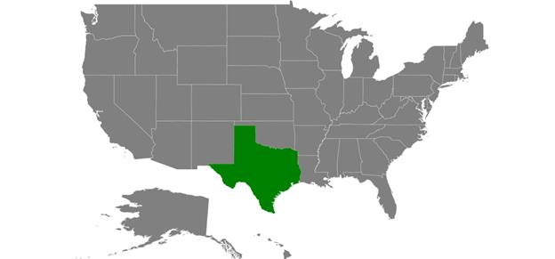
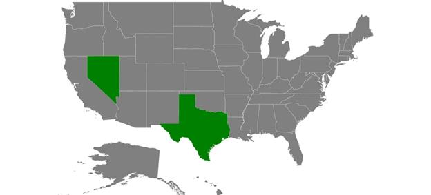
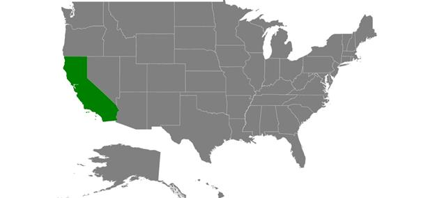

# User interaction

Options such as zooming, panning, and selection enable the effective interaction on map elements.

## Selection

Each shape in a map can be selected or deselected when interacted with shapes. Map shapes can be selected using the following two ways:

* Single Selection
* Multi Selection

The selected map shapes are differentiated by their fill. The [`SelectedShapeColor`](https://help.syncfusion.com/cr/xamarin-android/Com.Syncfusion.Maps.ShapeSetting.html#Com_Syncfusion_Maps_ShapeSetting_SelectedShapeColor) of [`ShapeSettings`](https://help.syncfusion.com/cr/xamarin-android/Com.Syncfusion.Maps.ShapeFileLayer.html#Com_Syncfusion_Maps_ShapeFileLayer_ShapeSettings) property gets or sets the selected shape color. 

### Single selection

Single selection allows you to select only one shape at a time. You can select the shape by tapping it. By default, the single selection is enabled when the [`EnableSelection`](https://help.syncfusion.com/cr/xamarin-android/Com.Syncfusion.Maps.ShapeFileLayer.html#Com_Syncfusion_Maps_ShapeFileLayer_EnableSelection) is set to true. You can also enable the single selection by  setting the [`SelectionMode`](https://help.syncfusion.com/cr/xamarin-android/Com.Syncfusion.Maps.ShapeFileLayer.html#Com_Syncfusion_Maps_ShapeFileLayer_SelectionMode) property of ShapeFileLayer to “Single”. When selecting or tapping the rest of the area, the selected shape will be deselected.





  SfMaps maps = new SfMaps(this);
  maps.SetBackgroundColor(Color.White);      

  ShapeFileLayer layer = new ShapeFileLayer();
  layer.Uri = "usa_state.shp";
  layer.EnableSelection = true;
  layer.SelectionMode = SelectionMode.Single;

  ShapeSetting shapeSetting = new ShapeSetting();
  shapeSetting.SelectedShapeColor = Color.DarkGreen; 
  layer.ShapeSettings = shapeSetting;

  maps.Layers.Add(layer);   
  SetContentView(maps);





### Multi selection

Multi selection allows you to select the multiple shapes at a time. You can select many shapes by tapping them. To enable this feature, set the [`SelectionMode`](https://help.syncfusion.com/cr/xamarin-android/Com.Syncfusion.Maps.ShapeFileLayer.html#Com_Syncfusion_Maps_ShapeFileLayer_SelectionMode) property to “Multiple” along with the [`EnableSelection`](https://help.syncfusion.com/cr/xamarin-android/Com.Syncfusion.Maps.ShapeFileLayer.html#Com_Syncfusion_Maps_ShapeFileLayer_EnableSelection) property. 

I> Shapes cannot be selected when the [`EnableSelection`](https://help.syncfusion.com/cr/xamarin-android/Com.Syncfusion.Maps.ShapeFileLayer.html#Com_Syncfusion_Maps_ShapeFileLayer_EnableSelection) property is set to false.





  SfMaps maps = new SfMaps(this);
  maps.SetBackgroundColor(Color.White);

  ShapeFileLayer layer = new ShapeFileLayer();
  layer.Uri = "usa_state.shp";
  layer.EnableSelection = true;
  layer.SelectionMode = SelectionMode.Multiple;

  ShapeSetting shapeSetting = new ShapeSetting();
  shapeSetting.SelectedShapeColor = Color.DarkGreen; 
  layer.ShapeSettings = shapeSetting;

  maps.Layers.Add(layer);
  SetContentView(maps);





### Selected items

The SelectedItems property allows you to select the shapes without tapping or touching them.

To select a shape and deselect it from the same collection without tapping or touching, just add the shape that is to be selected to the selected items collection dynamically.

## Zooming

The zooming feature enables you to zoom in and zoom out the map to show the in-depth information. The following properties are related to the zooming feature of maps control:

[`EnableZooming`](https://help.syncfusion.com/cr/xamarin-android/Com.Syncfusion.Maps.SfMaps.html#Com_Syncfusion_Maps_SfMaps_EnableZooming) property is used to control whether to perform zooming or not.

[`MinZoom`](https://help.syncfusion.com/cr/xamarin-android/Com.Syncfusion.Maps.SfMaps.html#Com_Syncfusion_Maps_SfMaps_MinZoom) property sets the minimum level of zooming.

[`MaxZoom`](https://help.syncfusion.com/cr/xamarin-android/Com.Syncfusion.Maps.SfMaps.html#Com_Syncfusion_Maps_SfMaps_MaxZoom) property sets the maximum level of zooming.





  SfMaps maps = new SfMaps(this);
  maps.SetBackgroundColor(Color.White);

  maps.EnableZooming = true;
  maps.MinZoom = 1;
  maps.MaxZoom = 10;
  SetContentView(maps);





## Panning

Panning feature allows moving the visible area of the map when it is zoomed in. To enable panning, you have to set [`EnablePanning`](https://help.syncfusion.com/cr/xamarin-android/Com.Syncfusion.Maps.SfMaps.html#Com_Syncfusion_Maps_SfMaps_EnablePanning) property to true.





  SfMaps maps = new SfMaps(this);
  maps.SetBackgroundColor(Color.White);

  maps.EnablePanning = true;
  maps.EnableZooming = true;
  maps.MinZoom = 1;
  maps.MaxZoom = 10;
  SetContentView(maps);




