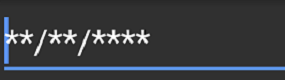

# Basic Features

## Setting Value

The SfMaskedEdit control displays the value that can be set using the `Value` property:



SfMaskedEdit maskedEdit = new SfMaskedEdit(this);
maskedEdit.Mask = "00/00/0000";
maskedEdit.Value =@"14/11/2014";



## Setting Prompt Character

Displays prompt character for the absence of your input in Mask and its default value is '_'. You can set the custom prompt character using `PromptChar` property.



SfMaskedEdit maskedEdit = new SfMaskedEdit(this);
maskedEdit.Mask = "00/00/0000";
maskedEdit.PromptChar = '*';



## Setting Hint

The hint will prompt you with instructions or important information when it is not on focus and any valid characters are not entered. The `Hint` property of `SfMaskedEdit` is used to set the hint text for the control.

The following properties are used to customize its appearance:

* `SetHintTextColor`: Sets text color for the hint.
* `HintTypeface`: Sets font family and sets font attributes(bold/italic/none) for the hint.
* `HintTextSize`: Sets font size for the hint.



SfMaskedEdit maskedEdit = new SfMaskedEdit(this);
maskedEdit.Mask = "00/00/0000";
maskedEdit.Hint = "Type here";
maskedEdit.SetHintTextColor(Color.LightGray);
maskedEdit.HintTypeface = Typeface.Create("Arial", TypefaceStyle.Bold);
maskedEdit.HintTextSize = 20;



You can find the complete basic features sample from this [link](http://files2.syncfusion.com/Xamarin.Android/Samples/MaskedEdit_BasicFeatures.zip).
