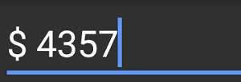

# Using Mask Characters as Literals

To use mask character as a literal, precede the mask character with a backslash (\\). For example, to display the dollar sign ($), then set the mask as follows:



SfMaskedEdit maskedEdit = new SfMaskedEdit(this);
maskedEdit.MaskType = MaskType.Text;
maskedEdit.Mask = @"\$ 0000";



This will produce a mask that displays a dollar sign ($) followed by the prompt characters for entering numbers.

This demo can be downloaded from this [link](http://files2.syncfusion.com/Xamarin.Android/Samples/MaskedEdit_UsingMaskCharactersAsLiterals.zip).
