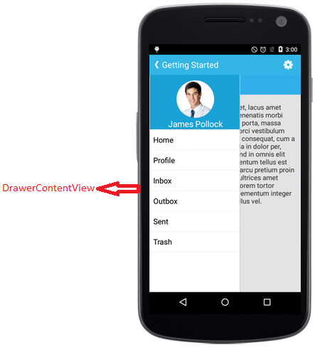
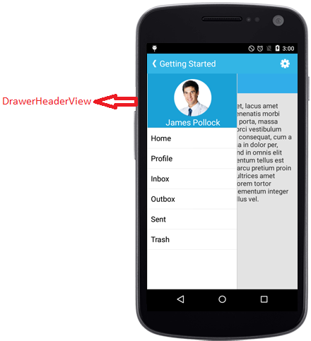
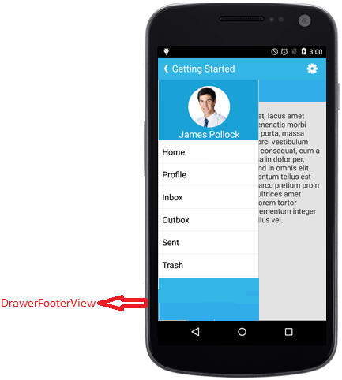

# Sliding Panel Contents
	
The sliding panel contents are divided into three parts and they are as follows
	
* [Drawer Content](#drawer-main-content)
* [Header Content](#drawer-header-content) 
* [Footer Content](#drawer-footer-content)
		
The header and footer contents are optional and Drawer content is the mandatory one which is due to the maximum space allocated for Drawer content view.
		
## Drawer Main Content

The sliding main content of the SfNavigationDrawer which is a part of DrawerPanel can be set using `DrawerContentView` property with desired views.





namespace navigationDrawerSample
{
    [Activity(Label = "NavigationDrawerSample", MainLauncher = true, Icon = "@drawable/icon")]
    public class MainActivity : Activity
    {
        Button DrawerButton;
        ListView viewItem;
        TextView profileContentLabel;
        ArrayAdapter<string> arrayAdapter;
        protected override void OnCreate(Bundle bundle)
        {
            base.OnCreate(bundle);

            SfNavigationDrawer navigationDrawer;
            navigationDrawer = new SfNavigationDrawer(this);

            List<string> positionlist = new List<string>();
            positionlist.Add("Home");
            positionlist.Add("Profile");
            positionlist.Add("Inbox");
            positionlist.Add("Outbox");
            positionlist.Add("Sent Items");
            positionlist.Add("Trash");
            arrayAdapter = new ArrayAdapter<string>(this, Android.Resource.Layout.SimpleListItem1, positionlist);
            viewItem = new ListView(this);
            viewItem.Adapter = arrayAdapter;
            viewItem.SetBackgroundColor(Android.Graphics.Color.ParseColor("#1aa1d6"));
            viewItem.LayoutParameters = new ViewGroup.LayoutParams(ViewGroup.LayoutParams.MatchParent, ViewGroup.LayoutParams.MatchParent);

            LinearLayout HomeLayout = new LinearLayout(this);

            profileContentLabel = new TextView(this);
            profileContentLabel.TextSize = 20;
            profileContentLabel.Text = "Home";
            profileContentLabel.SetTextColor(Android.Graphics.Color.Black);
            profileContentLabel.SetBackgroundColor(Android.Graphics.Color.LightBlue);
            profileContentLabel.Gravity = GravityFlags.Center;
            profileContentLabel.LayoutParameters = new ViewGroup.LayoutParams(770, 100);

            HomeLayout.AddView(profileContentLabel);

            LinearLayout contentLayout = new LinearLayout(this);
            contentLayout.Orientation = Orientation.Vertical;

            LinearLayout buttonLayout = new LinearLayout(this);
            buttonLayout.SetBackgroundColor(Android.Graphics.Color.Gray);
            buttonLayout.SetGravity(GravityFlags.Center);

            buttonLayout.LayoutParameters = new LinearLayout.LayoutParams(1000, 1000);

            DrawerButton = new Button(this);
            DrawerButton.Text = "Drawer";
            DrawerButton.LayoutParameters = new LinearLayout.LayoutParams(ViewGroup.LayoutParams.WrapContent, ViewGroup.LayoutParams.WrapContent);
            DrawerButton.Gravity = GravityFlags.Center;

            buttonLayout.AddView(DrawerButton);
            DrawerButton.Click += (sender, e) =>
            {
                navigationDrawer.ToggleDrawer();
            };
            contentLayout.SetBackgroundColor(Android.Graphics.Color.SkyBlue);
            contentLayout.AddView(HomeLayout);
            contentLayout.AddView(buttonLayout);

            FrameLayout frameLayout = new FrameLayout(this);
            frameLayout.LayoutParameters = new ViewGroup.LayoutParams(ViewGroup.LayoutParams.MatchParent, ViewGroup.LayoutParams.MatchParent);
            frameLayout.AddView(viewItem);
            navigationDrawer.DrawerContentView = frameLayout;

            navigationDrawer.ContentView = contentLayout;

            SetContentView(navigationDrawer);
        }
    }
}





## Drawer Header Content

Gets or sets the header of the DrawerView panel in the SfNavigationDrawer control using `DrawerHeaderView` property.




namespace navigationDrawerSample
{
	[Activity(Label = "navigationDrawerSample", MainLauncher = true, Icon = "@mipmap/icon")]
	public class MainActivity : Activity
	{
           SfNavigationDrawer navigationDrawer;
           protected override void OnCreate(Bundle bundle)
        {
            base.OnCreate(bundle);
            
            navigationDrawer = new SfNavigationDrawer(this);

            ImageView userImg = new ImageView(this);
            userImg.SetImageResource(Resource.Drawable.Icon);
            userImg.SetBackgroundColor(Android.Graphics.Color.ParseColor("#1aa1d6"));
            TextView userName = new TextView(this);
            userName.Text = "James Pollock";
            userName.TextSize = 20;
            userName.SetBackgroundColor(Android.Graphics.Color.Transparent);
            userName.SetTextColor(Android.Graphics.Color.White);
            LinearLayout headerLayout = new LinearLayout(this);
            headerLayout.Orientation = Orientation.Vertical;
            headerLayout.SetBackgroundColor(Android.Graphics.Color.ParseColor("#1aa1d6"));
            headerLayout.SetPadding(0, 20, 0, 0);
            headerLayout.AddView(userImg);
            headerLayout.AddView(userName);
            navigationDrawer.DrawerHeaderView = headerLayout;
            SetContentView(navigationDrawer);
    }
}
}
 




## Drawer Footer Content

Gets or sets the footer for the DrawerView panel in the SfNavigationDrawer control using `DrawerFooterView` property.




namespace navigationDrawerSample
{
	[Activity(Label = "navigationDrawerSample", MainLauncher = true, Icon = "@mipmap/icon")]
	public class MainActivity : Activity
	{
            SfNavigationDrawer navigationDrawer;
            protected override void OnCreate(Bundle bundle)
        {
            base.OnCreate(bundle);
            navigationDrawer = new SfNavigationDrawer(this);
            TextView userName = new TextView(this);
            userName.Text = "James Pollock";
            userName.Gravity = GravityFlags.Center;
            userName.TextSize = 20;
            userName.SetBackgroundColor(Android.Graphics.Color.Transparent);
            userName.SetTextColor(Android.Graphics.Color.White);
            LinearLayout footerLayout = new LinearLayout(this);
            footerLayout.Orientation = Orientation.Vertical;
            footerLayout.SetBackgroundColor(Android.Graphics.Color.ParseColor("#1aa1d6"));
            footerLayout.SetPadding(0, 20, 0, 0);
            footerLayout.AddView(userName);
            navigationDrawer.DrawerFooterView = footerLayout;
            SetContentView(navigationDrawer);
    }
}
}
       





## Drawer Size

Gets or sets the height and width of the DrawerView panel in the SfNavigationDrawer control using `DrawerHeight` and `DrawerWidth` properties.





navigationDrawer.DrawerHeight = (float)(300);
navigationDrawer.DrawerWidth = (float)(200);





## Multiple drawers

The Navigation Drawer allows users to open the drawer on multiple sides with different toggle methods. The DrawerSettings class and its properties need to be used where users need to provide multiple drawers. The multiple drawers can be implemented using the following drawer settings:
* Default drawer settings
* Secondary drawer settings

N> The header and footer content are optional, but the drawer content is mandatory to allocate space for the drawer.
		
## Default drawer settings

Implement the default drawer using the default drawer settings class. The following code sample demonstrates how to set the properties of default drawer settings inside the DrawerSettings class.





DrawerSettings defaultDrawerSettings = new DrawerSettings();
defaultDrawerSettings.DrawerHeight = 150;
defaultDrawerSettings.Position = Position.Left;
defaultDrawerSettings.Transition = Transition.SlideOnTop;
defaultDrawerSettings.ContentBackgroundColor = Color.Red;
defaultDrawerSettings.DrawerWidth = 150;
navigationDrawer.DrawerHeaderHeight = 150;
navigationDrawer.DrawerFooterHeight = 150;
navigationDrawer.DefaultDrawerSettings = defaultDrawerSettings;
  




N> The Navigation Drawer works with the value given for the properties inside the DrawerSettings class when using the default drawer settings.

### Header view of the default drawer

The header content can be provided to the default drawer using the `DrawerHeaderView` property inside the DrawerSettings class of DefaultDrawerSettings. The following code sample demonstrates how to set header content to the default drawer.





DrawerSettings defaultDrawerSettings = new DrawerSettings();
TextView userName = new TextView(this);
userName.Text = "James Pollock";
userName.TextSize = 20;
userName.SetBackgroundColor(Android.Graphics.Color.Transparent);
userName.SetTextColor(Android.Graphics.Color.White);
LinearLayout headerLayout = new LinearLayout(this);
headerLayout.Orientation = Orientation.Vertical;
headerLayout.SetPadding(0, 20, 0, 0);
headerLayout.AddView(userName);
defaultDrawerSettings.DrawerHeaderView = headerLayout;



      

### Content view of the default drawer

The drawer content can be provided to the default drawer using the `DrawerContentView` property inside the DrawerSettings class. The following code sample demonstrates how to set drawer content to the default drawer.





SfNavigationDrawer navigationDrawer = new SfNavigationDrawer(this);
DrawerSettings defaultDrawerSettings = new DrawerSettings();
defaultDrawerSettings.DrawerHeight = 150;
defaultDrawerSettings.Position = Position.Left;
List<string> positionlist = new List<string>();
positionlist.Add("Home");
positionlist.Add("Profile");
positionlist.Add("Inbox");
positionlist.Add("Outbox");
arrayAdapter = new ArrayAdapter<string>(this, Android.Resource.Layout.SimpleListItem1, positionlist);
viewItem = new ListView(this);
viewItem.Adapter = arrayAdapter;
viewItem.SetBackgroundColor(Android.Graphics.Color.ParseColor("#1aa1d6"));
FrameLayout frameLayout = new FrameLayout(this);
frameLayout.LayoutParameters = new ViewGroup.LayoutParams(ViewGroup.LayoutParams.MatchParent, ViewGroup.LayoutParams.MatchParent);
frameLayout.AddView(viewItem);
defaultDrawerSettings.DrawerContentView = frameLayout;
navigationDrawer.DefaultDrawerSettings = defaultDrawerSettings;
SetContentView(navigationDrawer);
  


   

### Footer view of the default drawer

The footer content can be provided to the default drawer using the `DrawerFooterView` property inside the DrawerSettings class of DefaultDrawerSettings. The following code sample demonstrates how to set footer content to the default drawer.





DrawerSettings defaultDrawerSettings = new DrawerSettings();
TextView userName = new TextView(this);
userName.Text = "James Pollock";
userName.TextSize = 20;
userName.SetBackgroundColor(Android.Graphics.Color.Transparent);
userName.SetTextColor(Android.Graphics.Color.White);
LinearLayout footerLayout = new LinearLayout(this);
footerLayout.Orientation = Orientation.Vertical;
footerLayout.SetPadding(0, 20, 0, 0);
footerLayout.AddView(userName);
defaultDrawerSettings.DrawerFooterView = footerLayout;



   

## Secondary drawer settings   

Implement the secondary drawer using the secondary drawer settings class. Its properties and functionalities are same as the default drawer. The secondary drawer can be set to different positions similar to the default drawer. The following code sample demonstrates how to set the properties of secondary drawer settings inside the DrawerSettings class.





DrawerSettings secondaryDrawerSettings = new DrawerSettings();
secondaryDrawerSettings.DrawerHeight = 150;
secondaryDrawerSettings.Position = Position.Left;
secondaryDrawerSettings.Transition = Transition.SlideOnTop;
secondaryDrawerSettings.ContentBackgroundColor = Color.Red;
secondaryDrawerSettings.DrawerWidth = 150;
navigationDrawer.DrawerHeaderHeight = 150;
navigationDrawer.DrawerFooterHeight = 150;
navigationDrawer.SecondaryDrawerSettings = secondaryDrawerSettings;

  




N> When the default drawer and the secondary drawer are set to the same position, the default drawer will open on swiping.

### Header view of the secondary drawer

The header content can be provided to the secondary drawer using the `DrawerHeaderView` property inside the DrawerSettings class of SecondaryDrawerSettings. The following code sample demonstrates how to set the header content to the secondary drawer.





DrawerSettings secondaryDrawerSettings = new DrawerSettings();
TextView userName = new TextView(this);
userName.Text = "James Pollock";
userName.TextSize = 20;
userName.SetBackgroundColor(Android.Graphics.Color.Transparent);
userName.SetTextColor(Android.Graphics.Color.White);
LinearLayout headerLayout = new LinearLayout(this);
headerLayout.Orientation = Orientation.Vertical;
headerLayout.SetPadding(0, 20, 0, 0);
headerLayout.AddView(userName);
secondaryDrawerSettings.DrawerHeaderView = headerLayout;



      

### Content view of the secondary drawer

The drawer content can be provided to the secondary drawer using the `DrawerContentView` property inside the DrawerSettings class of SecondaryDrawerSettings. The following code sample demonstrates how to set the drawer content to the secondary drawer.





SfNavigationDrawer navigationDrawer = new SfNavigationDrawer(this);
DrawerSettings secondaryDrawerSettings = new DrawerSettings();
secondaryDrawerSettings.DrawerHeight = 150;
secondaryDrawerSettings.Position = Position.Left;
List<string> positionlist = new List<string>();
positionlist.Add("Home");
positionlist.Add("Profile");
positionlist.Add("Inbox");
positionlist.Add("Outbox");
arrayAdapter = new ArrayAdapter<string>(this, Android.Resource.Layout.SimpleListItem1, positionlist);
viewItem = new ListView(this);
viewItem.Adapter = arrayAdapter;
viewItem.SetBackgroundColor(Android.Graphics.Color.ParseColor("#1aa1d6"));
FrameLayout frameLayout = new FrameLayout(this);
frameLayout.LayoutParameters = new ViewGroup.LayoutParams(ViewGroup.LayoutParams.MatchParent, ViewGroup.LayoutParams.MatchParent);
frameLayout.AddView(viewItem);
secondaryDrawerSettings.DrawerContentView = frameLayout;
navigationDrawer.SecondaryDrawerSettings = secondaryDrawerSettings;
SetContentView(navigationDrawer);



   

### Footer view of secondary drawer

The footer content can be provided to the secondary drawer using the `DrawerFooterView` property inside the DrawerSettings class of SecondaryDrawerSettings. The following code sample demonstrates how to set footer content to the secondary drawer.





DrawerSettings secondaryDrawerSettings = new DrawerSettings();
TextView userName = new TextView(this);
userName.Text = "James Pollock";
userName.TextSize = 20;
userName.SetBackgroundColor(Android.Graphics.Color.Transparent);
userName.SetTextColor(Android.Graphics.Color.White);
LinearLayout footerLayout = new LinearLayout(this);
footerLayout.Orientation = Orientation.Vertical;
footerLayout.SetPadding(0, 20, 0, 0);
footerLayout.AddView(userName);
secondaryDrawerSettings.DrawerFooterView = footerLayout;



   

## Toggling method

Users can toggle the secondary drawer using the `ToggleSecondaryDrawer` method. 

 

navigationDrawer.ToggleSecondaryDrawer();



### Opening the drawer programmatically

The `IsOpen` property in the DrawerSettings of SecondaryDrawerSettings is used to open or close the drawer programmatically.

N> Users can open only one drawer at a time.
