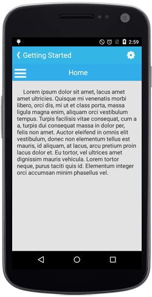

# Setting Main Content

The SfNavigationDrawer is mainly divided into two parts, such as [Main Content](#main-content) and  [Drawer Panel Content](/xamarin-android/SfNavigationDrawer/Drawer-Content "Sliding Panel Content")

## Main Content

The main view of the SfNavigationDrawer can be set using `ContentView` property with desired views.





namespace navigationDrawerSample
{
	[Activity(Label = "navigationDrawerSample", MainLauncher = true, Icon = "@mipmap/icon")]
	public class MainActivity : Activity
	{
           SfNavigationDrawer navigationDrawer;
           protected override void OnCreate(Bundle bundle)
        {
            base.OnCreate(bundle);
            
            navigationDrawer = new SfNavigationDrawer(this);
            FrameLayout ContentFrame=new FrameLayout(this); 
            ContentFrame.SetBackgroundColor(Android.Graphics.Color.White);
            ImageView userImg = new ImageView(this);
            userImg.SetImageResource(Resource.Drawable.Icon);
            userImg.SetBackgroundColor(Android.Graphics.Color.ParseColor("#1aa1d6"));
            ContentFrame.AddView(userImg);
            navigationDrawer.ContentView=ContentFrame;
			SetContentView(navigationDrawer);
		}
	}
}
	



	

