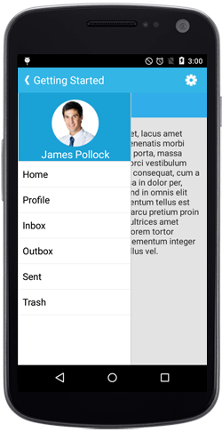

# Getting Started

This section provides overview for working with Essential NavigationDrawer for Xamarin.Android. You can walk through the entire process of creating an NavigationDrawer.

## Referencing Essential Studio Components in Your Solution

After installing Essential Studio for Xamarin, you can find all the required assemblies in the installation folders,

{Syncfusion Installed location}\Essential Studio\12.4.0.24\lib

Add the following assembly references to the Android project,

android\Syncfusion.SfNavigationDrawer.Andriod.dll

and 

Xamarin.Android.Support.v4 library (from Nuget Packages)

## Add SfNavigationDrawer

* Adding reference to NavigationDrawer.





using Com.Syncfusion.NavigationDrawer; 





* Create an instance of SfNavigationDrawer.




 
SfNavigationDrawer navigationDrawer = new SfNavigationDrawer(this);
SetContentView(navigationDrawer);
	




## Add Drawer Content

The sliding main content of the SfNavigationDrawer which is a part of DrawerPanel can be set using `DrawerContentView` property with desired views.





namespace NavigationDrawerSample
{
    [Activity(Label = "NavigationDrawerSample", MainLauncher = true, Icon = "@drawable/icon")]
    public class MainActivity : Activity
    {
        ListView viewItem;
        ArrayAdapter<string> arrayAdapter;
        protected override void OnCreate(Bundle bundle)
        {
            base.OnCreate(bundle);

            SfNavigationDrawer navigationDrawer;
            
            navigationDrawer = new SfNavigationDrawer(this);
            List<string> positionlist = new List<string>();
            positionlist.Add("Home");
            positionlist.Add("Profile");
            positionlist.Add("Inbox");
            positionlist.Add("Outbox");
            positionlist.Add("Sent Items");
            positionlist.Add("Trash");
            arrayAdapter = new ArrayAdapter<string>(this, Android.Resource.Layout.SimpleListItem1, positionlist);
            viewItem = new ListView(this);
            viewItem.Adapter = arrayAdapter;
            viewItem.SetBackgroundColor(Android.Graphics.Color.ParseColor("#1aa1d6"));
            viewItem.LayoutParameters = new ViewGroup.LayoutParams(ViewGroup.LayoutParams.MatchParent, ViewGroup.LayoutParams.MatchParent);FrameLayout frameLayout = new FrameLayout(this);
            frameLayout.LayoutParameters = new ViewGroup.LayoutParams(ViewGroup.LayoutParams.MatchParent, ViewGroup.LayoutParams.MatchParent);
            frameLayout.AddView(viewItem);
            navigationDrawer.DrawerContentView = frameLayout;
			SetContentView(navigationDrawer);
		}
	}
}





## Add Drawer Header Content

SfNavigationDrawer provides option to display certain information like user id or names in the header part instead of providing everything in the drawer content view. 

This can be done using `DrawerHeaderView` property in SfNavigationDrawer.





	namespace navigationDrawerSample
{
	[Activity(Label = "navigationDrawerSample", MainLauncher = true, Icon = "@mipmap/icon")]
	public class MainActivity : Activity
	{
           SfNavigationDrawer navigationDrawer;
           protected override void OnCreate(Bundle bundle)
        {
            base.OnCreate(bundle);
            
            navigationDrawer = new SfNavigationDrawer(this);

            ImageView userImg = new ImageView(this);
            userImg.SetImageResource(Resource.Drawable.Icon);
            userImg.SetBackgroundColor(Android.Graphics.Color.ParseColor("#1aa1d6"));
            TextView userName = new TextView(this);
            userName.Text = "James Pollock";
            userName.TextSize = 20;
            userName.SetBackgroundColor(Android.Graphics.Color.Transparent);
            userName.SetTextColor(Android.Graphics.Color.White);
            LinearLayout headerLayout = new LinearLayout(this);
            headerLayout.Orientation = Orientation.Vertical;
            headerLayout.SetBackgroundColor(Android.Graphics.Color.ParseColor("#1aa1d6"));
            headerLayout.SetPadding(0, 20, 0, 0);
            headerLayout.AddView(userImg);
            headerLayout.AddView(userName);
            navigationDrawer.DrawerHeaderView = headerLayout;
            SetContentView(navigationDrawer);
    }
}
}
 
 




## Add Main Content

The main view of the SfNavigationDrawer can be set using `ContentView` property with desired views.




	namespace navigationDrawerSample
{
	[Activity(Label = "navigationDrawerSample", MainLauncher = true, Icon = "@mipmap/icon")]
	public class MainActivity : Activity
	{
           SfNavigationDrawer navigationDrawer;
           protected override void OnCreate(Bundle bundle)
        {
            base.OnCreate(bundle);
            
            navigationDrawer = new SfNavigationDrawer(this);
            FrameLayout ContentFrame=new FrameLayout(this); 
            ContentFrame.SetBackgroundColor(Android.Graphics.Color.White);
            ImageView userImg = new ImageView(this);
            userImg.SetImageResource(Resource.Drawable.Icon);
            userImg.SetBackgroundColor(Android.Graphics.Color.ParseColor("#1aa1d6"));
            ContentFrame.AddView(userImg);
            navigationDrawer.ContentView=ContentFrame;
			SetContentView(navigationDrawer);
		}
	}
}





## Set Drawing Edge for Drawer Panel

SfNavigationDrawer provides support to change the sliding position of the DrawerView panel. This can be set using `Position` property. The position can be any one of the following four options.

* Left

* Right

* Top

* Bottom

N> The default option is Left.





Position sliderposition = Position.Left;	
navigationDrawer.Position=sliderposition;





## Change Drawer Opening Animation

The `Transition` property specifies the sliding animations for the DrawerView panel. The `Transition` property has the following three options,

* SlideOnTop
* Push
* Reveal

N> The default transition is SlideOnTop.



 

    Transition sliderTransition = Transition.SlideOnTop;
	navigationDrawer.Transition = sliderTransition;




