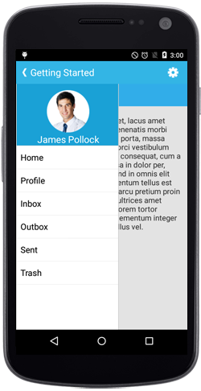
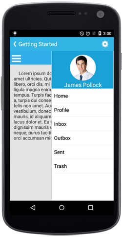
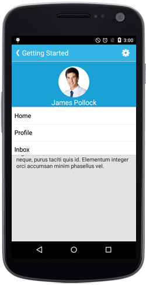
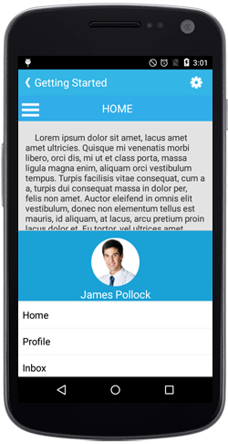

# Configuring The Drawer In Different Sides

The `Position` property specifies the sliding position of the DrawerView panel. The `Position` property has the following four options,

* Left

* Right

* Top

* Bottom

N> The default option is Left.

## Left

Sets the SfNavigationDrawer sliding position to the left.





	Position sliderposition = Position.Left;	
	navigationDrawer.Position=sliderposition;





## Right

Sets the SfNavigationDrawer sliding position to the right.





	Position sliderposition = Position.Right;	
	navigationDrawer.Position=sliderposition;





	
## Top

Sets the SfNavigationDrawer sliding position to the top.





	Position sliderposition = Position.Top;	
   	navigationDrawer.Position=sliderposition;





## Bottom

Sets the SfNavigationDrawer sliding position to the bottom.



	Position sliderposition = Position.Bottom;	
	navigationDrawer.Position=sliderposition;



