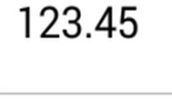

# Decimal Digits in NumericTextBox control

## Set Maximum Number of Decimal Digits

The maximum number of digits to be displayed after the decimal point can be specified by using the [`MaximumNumberDecimalDigits`](https://help.syncfusion.com/cr/xamarin-android/Com.Syncfusion.Numerictextbox.SfNumericTextBox.html#Com_Syncfusion_Numerictextbox_SfNumericTextBox_MaximumNumberDecimalDigits) property. 

N> The `MaximumNumberDecimalDigits` property can be provided with positive value only.





	numericTextBox.MaximumNumberDecimalDigits=2;
  




## Remove Default Decimal Digits in Xamarin Numeric Entry

Based on the [`MaximumNumberDecimalDigits`](https://help.syncfusion.com/cr/xamarin-android/Com.Syncfusion.Numerictextbox.SfNumericTextBox.html#Com_Syncfusion_Numerictextbox_SfNumericTextBox_MaximumNumberDecimalDigits) property, the default number of decimal digits is displayed. By disabling the `AllowDefaultDecimalDigits` Boolean property, those default digits can be removed from the numeric entry view.




            
    numericTextBox.AllowDefaultDecimalDigits = false;
  




